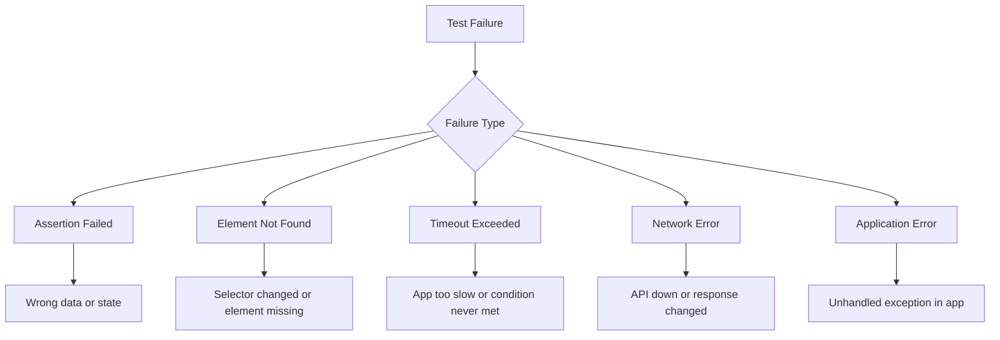
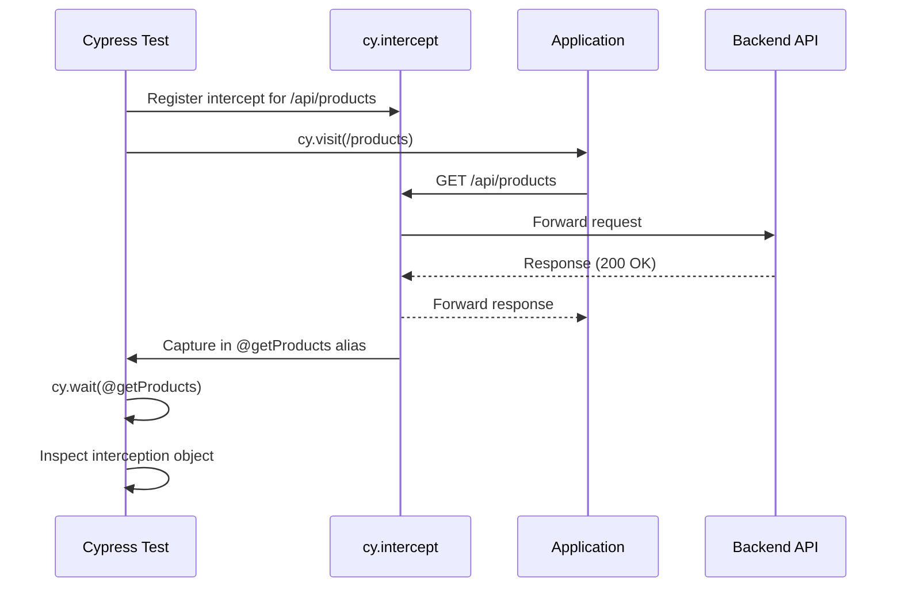

# How to Debug Cypress Test Failures

Author: [nawazdhandala](https://www.github.com/nawazdhandala)

Tags: Cypress, Testing, Debugging, JavaScript, E2E Testing

Description: Learn systematic approaches to debug Cypress test failures using screenshots, videos, time travel debugging, and network inspection.

---

Test failures are inevitable. What matters is how quickly you can identify the root cause and fix it. Cypress provides excellent debugging tools, but knowing when and how to use them makes all the difference.

## Understanding the Failure

Before diving into debugging tools, understand the types of failures you might encounter:



## Using the Cypress Test Runner

The interactive Test Runner is your primary debugging tool during development. Run tests in headed mode to watch them execute.

```bash
# Open Cypress in interactive mode
npx cypress open

# Or run a specific spec in headed mode
npx cypress run --spec "cypress/e2e/login.cy.js" --headed --no-exit
```

The `--no-exit` flag keeps the browser open after the test finishes, letting you inspect the final state.

### Time Travel Debugging

Click on any command in the Command Log to see the application state at that moment. This is called time travel debugging.

1. Run your test in the Test Runner
2. After the test completes (pass or fail), click on commands in the left panel
3. The right panel shows the DOM snapshot at that exact moment
4. Hover over commands to see before/after states

This helps you see exactly what the application looked like when a command ran or failed.

## Reading Error Messages

Cypress error messages are detailed. Read them carefully before reaching for other tools.

```
CypressError: Timed out retrying after 4000ms: Expected to find element:
'[data-cy="submit-button"]', but never found it.

Because this error occurred during a `cy.click` command, we recommend
checking your selector and verifying the element exists.
```

This tells you:

- The selector used: `[data-cy="submit-button"]`
- The command that failed: `cy.click`
- How long it waited: 4000ms
- A suggestion: verify the element exists

## Screenshots on Failure

Cypress automatically captures screenshots when tests fail. These are saved to `cypress/screenshots` by default.

```javascript
// cypress.config.js
module.exports = defineConfig({
  e2e: {
    screenshotOnRunFailure: true,
    screenshotsFolder: 'cypress/screenshots',

    // Take full-page screenshots instead of viewport only
    screenshotOnRunFailure: true,
  },
});
```

You can also capture screenshots manually at any point in your test.

```javascript
it('should display the dashboard', () => {
  cy.visit('/dashboard');

  // Capture current state for debugging
  cy.screenshot('dashboard-loaded');

  cy.get('[data-cy="chart"]').should('be.visible');

  // Capture after interaction
  cy.get('[data-cy="filter-dropdown"]').click();
  cy.screenshot('filter-open');
});
```

## Video Recording

Enable video recording to capture the entire test execution. This is essential for debugging failures in CI.

```javascript
// cypress.config.js
module.exports = defineConfig({
  e2e: {
    video: true,
    videoCompression: 32,  // Lower = better quality, larger file
    videosFolder: 'cypress/videos',
  },
});
```

Videos show exactly what happened, including timing issues that screenshots miss.

## Debugging with cy.pause() and cy.debug()

Insert breakpoints in your tests to pause execution.

### cy.pause()

Stops the test and lets you interact with the application manually.

```javascript
it('should complete checkout', () => {
  cy.visit('/cart');
  cy.get('[data-cy="checkout-button"]').click();

  // Pause here to inspect the page manually
  cy.pause();

  cy.get('[data-cy="payment-form"]').should('be.visible');
  cy.get('[data-cy="card-number"]').type('4242424242424242');
});
```

When paused, you can:

- Inspect elements in DevTools
- Check network requests
- Manually interact with the page
- Click "Resume" in the Command Log to continue

### cy.debug()

Logs the current subject to the console and triggers a debugger breakpoint.

```javascript
it('should display user data', () => {
  cy.get('[data-cy="user-profile"]')
    .debug()  // Opens debugger, logs the element
    .find('[data-cy="username"]')
    .should('contain', 'John');
});
```

Open the browser DevTools console to see the output. Make sure DevTools is open before the `debug()` command runs.

## Inspecting Network Requests

Network issues cause many test failures. Use `cy.intercept()` to inspect and debug API calls.

```javascript
describe('Product Page', () => {
  it('should load products from API', () => {
    // Set up intercept before visiting the page
    cy.intercept('GET', '/api/products*').as('getProducts');

    cy.visit('/products');

    // Wait for the request and inspect it
    cy.wait('@getProducts').then((interception) => {
      // Log request details
      cy.log('Request URL:', interception.request.url);
      cy.log('Response Status:', interception.response.statusCode);
      cy.log('Response Body:', JSON.stringify(interception.response.body));

      // Add assertions on the response
      expect(interception.response.statusCode).to.equal(200);
      expect(interception.response.body.products).to.have.length.greaterThan(0);
    });
  });
});
```



## Console Logging

Use `cy.log()` for Cypress-aware logging that appears in the Command Log. Use `console.log()` for browser DevTools.

```javascript
it('should calculate discount', () => {
  cy.get('[data-cy="price"]').invoke('text').then((priceText) => {
    // Log to Cypress Command Log
    cy.log(`Original price: ${priceText}`);

    // Log to browser console (visible in DevTools)
    console.log('Price element text:', priceText);

    const price = parseFloat(priceText.replace('$', ''));
    cy.log(`Parsed price: ${price}`);
  });

  cy.get('[data-cy="apply-discount"]').click();

  cy.get('[data-cy="discounted-price"]').invoke('text').then((discountedText) => {
    cy.log(`Discounted price: ${discountedText}`);
  });
});
```

## Debugging Flaky Tests

Flaky tests pass sometimes and fail sometimes. They often indicate timing issues.

### Common Causes

1. **Race conditions** - Test runs faster than the application
2. **Animations** - Elements moving during interaction
3. **Network timing** - API responses varying in speed
4. **Third-party scripts** - External resources loading unpredictably

### Debugging Strategies

```javascript
// Bad: Prone to flakiness
cy.get('[data-cy="save-button"]').click();
cy.get('[data-cy="success-message"]').should('be.visible');

// Better: Wait for the action to complete
cy.get('[data-cy="save-button"]').click();
cy.intercept('POST', '/api/save').as('saveRequest');
cy.wait('@saveRequest');
cy.get('[data-cy="success-message"]').should('be.visible');

// Even better: Assert on specific conditions
cy.get('[data-cy="save-button"]').click();
cy.get('[data-cy="success-message"]', { timeout: 10000 })
  .should('be.visible')
  .and('contain', 'Saved successfully');
```

### Disable Animations

Animations can interfere with tests. Disable them in your application during testing.

```javascript
// In your application code, check for Cypress
if (window.Cypress) {
  // Disable animations
  document.body.classList.add('cypress-testing');
}
```

```css
/* In your CSS */
.cypress-testing * {
  animation-duration: 0s !important;
  transition-duration: 0s !important;
}
```

## Using cy.task() for Server-Side Debugging

Sometimes you need to inspect server state or logs. Use `cy.task()` to run Node.js code.

```javascript
// cypress.config.js
module.exports = defineConfig({
  e2e: {
    setupNodeEvents(on, config) {
      on('task', {
        // Read server logs
        readLog(logFile) {
          const fs = require('fs');
          return fs.readFileSync(logFile, 'utf8');
        },

        // Query database directly
        queryDatabase(query) {
          const db = require('./db-connection');
          return db.query(query);
        },

        // Log to terminal (not browser)
        log(message) {
          console.log(message);
          return null;
        }
      });
    },
  },
});
```

```javascript
// In your test
it('should create a user in the database', () => {
  cy.visit('/signup');
  cy.get('[data-cy="email"]').type('newuser@example.com');
  cy.get('[data-cy="password"]').type('password123');
  cy.get('[data-cy="submit"]').click();

  // Verify directly in database
  cy.task('queryDatabase',
    "SELECT * FROM users WHERE email = 'newuser@example.com'"
  ).then((result) => {
    expect(result.rows).to.have.length(1);
    expect(result.rows[0].email).to.equal('newuser@example.com');
  });
});
```

## Debugging CI Failures

When tests pass locally but fail in CI, focus on environmental differences.

### Download Artifacts

Configure CI to save screenshots and videos as artifacts.

```yaml
# GitHub Actions example
- name: Upload screenshots on failure
  uses: actions/upload-artifact@v4
  if: failure()
  with:
    name: cypress-screenshots
    path: cypress/screenshots

- name: Upload videos
  uses: actions/upload-artifact@v4
  if: always()
  with:
    name: cypress-videos
    path: cypress/videos
```

### Check Environment Differences

```javascript
// Log environment info at the start of tests
before(() => {
  cy.log(`Viewport: ${Cypress.config('viewportWidth')}x${Cypress.config('viewportHeight')}`);
  cy.log(`Base URL: ${Cypress.config('baseUrl')}`);
  cy.log(`Browser: ${Cypress.browser.name} ${Cypress.browser.version}`);
});
```

### Replicate CI Locally

Use Docker to match the CI environment.

```bash
# Run Cypress in the same Docker image as CI
docker run -it -v $PWD:/e2e -w /e2e cypress/included:latest \
  --spec "cypress/e2e/failing-test.cy.js"
```

## Systematic Debugging Checklist

When a test fails, work through this checklist:

1. **Read the error message** - What exactly failed?
2. **Check the screenshot** - What did the page look like?
3. **Watch the video** - What happened leading up to the failure?
4. **Time travel** - Use the Test Runner to inspect each step
5. **Check network requests** - Did APIs return expected data?
6. **Add logging** - Insert `cy.log()` statements to trace execution
7. **Isolate the test** - Run it alone with `.only`
8. **Check for flakiness** - Run multiple times
9. **Compare environments** - Does it pass locally but fail in CI?

```javascript
// Isolate a failing test
it.only('this test is failing', () => {
  // Only this test will run
});
```

---

Effective debugging comes from knowing your tools and applying them systematically. Start with the simplest approach - reading the error message - and escalate to more involved techniques only when needed. The investment in debugging skills pays off every time a test fails.
