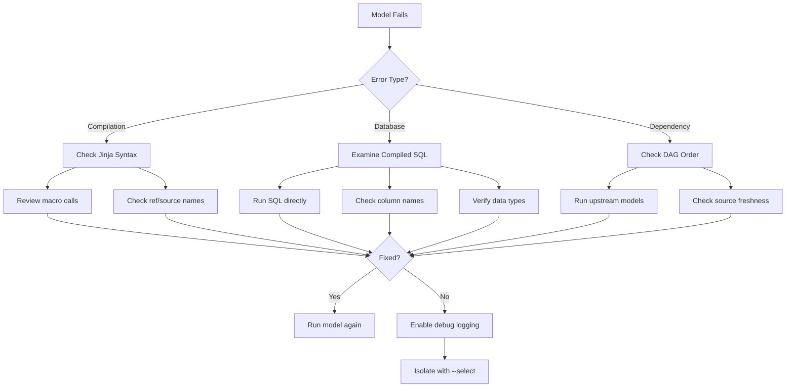
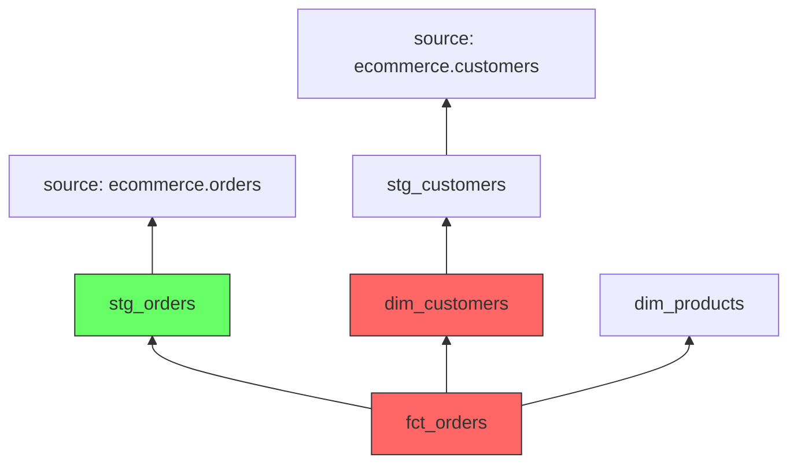

# How to Debug dbt Model Failures

Author: [nawazdhandala](https://www.github.com/nawazdhandala)

Tags: dbt, Data Engineering, Debugging, SQL, Data Warehouse, Troubleshooting

Description: A practical guide to diagnosing and fixing dbt model failures using logs, compiled SQL, and systematic debugging techniques.

---

When a dbt model fails, the error message often points you in the wrong direction. The actual problem might be a missing column, a type mismatch, or a dependency that ran out of order. This guide covers systematic approaches to debugging dbt failures, from reading logs to isolating problems in complex pipelines.

## Understanding dbt Error Output

When a model fails, dbt provides several pieces of information. Learning to read them quickly saves hours of debugging.

```bash
# Example failure output
Running with dbt=1.7.0
Found 42 models, 18 tests, 3 snapshots, 6 seeds, 8 sources

Concurrency: 4 threads (target='dev')

1 of 42 START sql table model analytics.fct_orders ................... [RUN]
1 of 42 ERROR creating sql table model analytics.fct_orders ........... [ERROR in 2.31s]

Completed with 1 error:

Database Error in model fct_orders (models/marts/fct_orders.sql)
  Compilation error: column "order_status" does not exist
  compiled code at target/compiled/my_project/models/marts/fct_orders.sql
```

Key information to extract:

1. **Model name and path**: `fct_orders (models/marts/fct_orders.sql)`
2. **Error type**: `Database Error` vs `Compilation Error`
3. **Specific message**: `column "order_status" does not exist`
4. **Compiled SQL location**: `target/compiled/...`

## The Debugging Workflow

Follow this systematic approach when a model fails.



## Reading Compiled SQL

The compiled SQL shows exactly what dbt sends to your warehouse. This is your primary debugging tool.

```bash
# After a failed run, check the compiled SQL
cat target/compiled/my_project/models/marts/fct_orders.sql
```

Compare the compiled output to your original model to spot issues.

```sql
-- Original model (models/marts/fct_orders.sql)
select
    order_id,
    {{ dbt_utils.star(from=ref('stg_orders'), except=['_loaded_at']) }},
    order_status  -- This column might not exist
from {{ ref('stg_orders') }}

-- Compiled SQL (target/compiled/.../fct_orders.sql)
select
    order_id,
    customer_id,
    order_date,
    total_amount,
    order_status  -- Column not in stg_orders!
from analytics_dev.stg_orders
```

## Common Error Types and Fixes

### Column Does Not Exist

The most frequent error. Usually caused by typos or upstream schema changes.

```sql
-- Error: column "order_status" does not exist

-- Debug: Check what columns actually exist
-- Run this directly in your warehouse
select column_name
from information_schema.columns
where table_name = 'stg_orders'
  and table_schema = 'analytics_dev';

-- Fix: Use the correct column name
select
    order_id,
    status_code as order_status  -- Correct column name
from {{ ref('stg_orders') }}
```

### Type Mismatch Errors

Data type conflicts during joins or unions.

```sql
-- Error: operator does not exist: varchar = integer

-- Debug: Check column types on both sides
select
    pg_typeof(customer_id) as type
from {{ ref('stg_orders') }}
limit 1;

select
    pg_typeof(customer_id) as type
from {{ ref('dim_customers') }}
limit 1;

-- Fix: Cast to matching types
select
    o.order_id,
    c.customer_name
from {{ ref('stg_orders') }} o
join {{ ref('dim_customers') }} c
    on o.customer_id::varchar = c.customer_id  -- Explicit cast
```

### Ambiguous Column Reference

Happens when joining tables with same column names.

```sql
-- Error: column reference "created_at" is ambiguous

-- Fix: Always qualify column names in joins
select
    o.order_id,
    o.created_at as order_created_at,  -- Qualified
    c.created_at as customer_created_at  -- Qualified
from {{ ref('stg_orders') }} o
join {{ ref('stg_customers') }} c
    on o.customer_id = c.customer_id
```

### Division by Zero

Aggregations that produce zero in the denominator.

```sql
-- Error: division by zero

-- Fix: Use NULLIF to handle zero denominators
select
    category,
    sum(revenue) / nullif(sum(orders), 0) as avg_order_value,
    -- Or provide a default
    coalesce(
        sum(revenue) / nullif(sum(orders), 0),
        0
    ) as avg_order_value_safe
from {{ ref('fct_sales') }}
group by category
```

## Using Debug Mode

Enable verbose logging to see exactly what dbt is doing.

```bash
# Run with debug flag
dbt run --select fct_orders --debug

# Debug output includes:
# - Full SQL being executed
# - Connection details
# - Timing for each step
# - Variable values
```

Parse the debug output for clues:

```
[debug] Executing SQL:
  create table "analytics_dev"."fct_orders" as (
    select ...
  )

[debug] Database adapter response:
  ERROR: column "order_status" does not exist
  LINE 5:     order_status
              ^
  HINT: Perhaps you meant to reference the column "stg_orders.status"
```

## Isolating Failures with Select

When debugging, run only the failing model and its dependencies.

```bash
# Run just the failing model
dbt run --select fct_orders

# Run the model and its direct parents
dbt run --select +fct_orders

# Run only immediate parents (1 level up)
dbt run --select 1+fct_orders

# Run the model and check what would be selected
dbt ls --select +fct_orders
```

## Debugging Dependency Issues

Models might fail because upstream dependencies have problems.

```bash
# View the DAG for a specific model
dbt ls --select +fct_orders --output path

# Check if upstream models exist
dbt ls --select +fct_orders --resource-type model

# Run upstream models first, then the target
dbt run --select +fct_orders
```



If `dim_customers` fails, `fct_orders` will also fail. Fix upstream first.

## Debugging Incremental Models

Incremental models have unique failure modes related to state management.

```sql
-- models/fct_events.sql
{{
    config(
        materialized='incremental',
        unique_key='event_id'
    )
}}

select
    event_id,
    event_type,
    event_timestamp,
    user_id
from {{ ref('stg_events') }}


    -- Only get new events
    where event_timestamp > (
        select max(event_timestamp) from {{ this }}
    )

```

Common incremental issues:

```bash
# Issue: Schema changed, incremental fails
# Fix: Full refresh to rebuild
dbt run --select fct_events --full-refresh

# Issue: Duplicate keys causing merge conflicts
# Debug: Check for duplicates in source
dbt run-operation check_duplicates --args '{"model": "stg_events", "key": "event_id"}'
```

Create a debug macro to check for duplicates:

```sql
-- macros/debug_helpers.sql



    select
        {{ key }},
        count(*) as cnt
    from {{ ref(model) }}
    group by {{ key }}
    having count(*) > 1
    limit 10





    
        {{ log("Found duplicates:", info=True) }}
        
            {{ log("  " ~ key ~ ": " ~ row[0] ~ " (count: " ~ row[1] ~ ")", info=True) }}
        
    
        {{ log("No duplicates found for " ~ key ~ " in " ~ model, info=True) }}
    



```

## Debugging Test Failures

When tests fail, you need to understand what data violated the expectation.

```bash
# Run tests with store_failures to see failing rows
dbt test --select fct_orders --store-failures

# Check the failure table
# Usually stored in your target schema with suffix _dbt_test__audit
```

```sql
-- Query the test failure table to see bad data
select *
from analytics_dev_dbt_test__audit.not_null_fct_orders_customer_id
limit 100;

-- Common pattern: Find source of null values
select
    o.*,
    c.customer_id as dim_customer_id
from {{ ref('stg_orders') }} o
left join {{ ref('dim_customers') }} c
    on o.customer_id = c.customer_id
where c.customer_id is null;
```

## Debugging Jinja Compilation

Jinja errors prevent dbt from even generating SQL.

```bash
# Error example
Compilation Error in model fct_orders
  'dict object' has no attribute 'column_name'
```

Debug Jinja by adding log statements:

```sql
-- models/fct_orders.sql


-- Debug: Print column info during compilation

    {{ log("Column: " ~ col.name ~ " Type: " ~ col.dtype, info=True) }}


select
    
        {{ col.name }},
    
from {{ ref('stg_orders') }}
```

Run with `--debug` to see log output:

```bash
dbt compile --select fct_orders --debug
```

## Using dbt Artifacts for Debugging

dbt generates artifacts that help with debugging.

```bash
# View run results
cat target/run_results.json | jq '.results[] | select(.status == "error")'

# View the manifest for model metadata
cat target/manifest.json | jq '.nodes["model.my_project.fct_orders"]'
```

Parse artifacts programmatically:

```python
# scripts/check_failures.py
import json

with open('target/run_results.json') as f:
    results = json.load(f)

for result in results['results']:
    if result['status'] == 'error':
        print(f"Failed: {result['unique_id']}")
        print(f"Message: {result['message']}")
        print(f"Compiled SQL: target/compiled/{result['unique_id'].replace('.', '/')}.sql")
        print("---")
```

## Environment-Specific Failures

Models might work in dev but fail in prod due to environment differences.

```yaml
# dbt_project.yml
vars:
  # Different schemas per environment
  source_schema: "{{ env_var('DBT_SOURCE_SCHEMA', 'raw_dev') }}"

models:
  my_project:
    +schema: "{{ 'prod' if target.name == 'prod' else 'dev' }}"
```

Debug environment issues:

```bash
# Check which target you're using
dbt debug

# Run against specific target
dbt run --select fct_orders --target prod

# Compare schemas between environments
dbt run-operation compare_schemas --args '{"dev_schema": "analytics_dev", "prod_schema": "analytics_prod"}'
```

## Practical Debug Checklist

When a model fails, work through this checklist:

```markdown
1. [ ] Read the full error message
2. [ ] Check compiled SQL in target/compiled/
3. [ ] Verify upstream models ran successfully
4. [ ] Run the compiled SQL directly in your warehouse
5. [ ] Check for schema changes in source tables
6. [ ] Verify column names and data types match
7. [ ] For incremental models, try --full-refresh
8. [ ] Check source freshness if using external data
9. [ ] Review recent changes to the model or its dependencies
10. [ ] Enable --debug for verbose logging
```

## Setting Up Alerting for Failures

Integrate dbt failures with your monitoring system.

```bash
# CI/CD script with failure handling
dbt run --target prod

if [ $? -ne 0 ]; then
    # Send alert to monitoring system
    curl -X POST https://api.oneuptime.com/webhook/dbt-failure \
        -H "Content-Type: application/json" \
        -d @target/run_results.json
fi
```

---

Debugging dbt models becomes faster with a systematic approach. Start with the error message, examine the compiled SQL, verify upstream dependencies, and use debug mode when needed. Most failures come down to schema mismatches, missing columns, or dependency issues that the compiled SQL quickly reveals. Build the habit of checking `target/compiled/` first, and you will solve most problems in minutes rather than hours.
