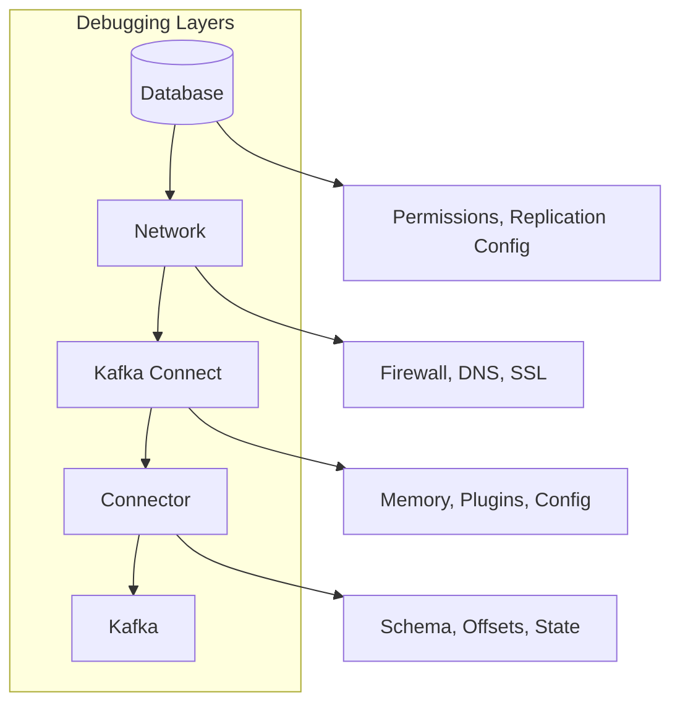

# How to Debug Debezium Connector Issues

Author: [nawazdhandala](https://www.github.com/nawazdhandala)

Tags: Debezium, Debugging, Troubleshooting, Kafka Connect, Change Data Capture, PostgreSQL, MySQL

Description: Learn systematic approaches to debug Debezium connector issues including connection failures, replication problems, and data inconsistencies.

---

> Debezium connectors fail for many reasons: network issues, permission problems, database configuration errors, or resource exhaustion. Systematic debugging helps you identify root causes quickly and restore data flow.

When CDC pipelines break, every minute counts. Know how to debug efficiently.

---

## Overview

Debugging Debezium issues requires checking multiple layers: the database, network, Kafka Connect, and the connector itself.



---

## Initial Triage

### Check Connector Status

Start with the connector status API:

```bash
# Get connector status
curl -s http://localhost:8083/connectors/inventory-connector/status | jq .
```

Example output showing a failed task:

```json
{
  "name": "inventory-connector",
  "connector": {
    "state": "RUNNING",
    "worker_id": "connect:8083"
  },
  "tasks": [
    {
      "id": 0,
      "state": "FAILED",
      "worker_id": "connect:8083",
      "trace": "org.apache.kafka.connect.errors.ConnectException:
        Failed to authenticate to database...
        Caused by: org.postgresql.util.PSQLException:
        FATAL: password authentication failed for user \"debezium\""
    }
  ],
  "type": "source"
}
```

### Quick Health Checks

Run these checks to identify the problem area:

```bash
#!/bin/bash
# debug-debezium.sh

CONNECT_URL="${CONNECT_URL:-http://localhost:8083}"
CONNECTOR_NAME="${1:-inventory-connector}"

echo "=== Kafka Connect Health ==="
curl -sf "${CONNECT_URL}/" && echo "OK" || echo "FAILED"

echo ""
echo "=== Connector Plugins ==="
curl -sf "${CONNECT_URL}/connector-plugins" | jq '.[].class'

echo ""
echo "=== Connector Status ==="
curl -sf "${CONNECT_URL}/connectors/${CONNECTOR_NAME}/status" | jq .

echo ""
echo "=== Connector Config ==="
curl -sf "${CONNECT_URL}/connectors/${CONNECTOR_NAME}/config" | jq .

echo ""
echo "=== Recent Logs ==="
docker logs kafka-connect 2>&1 | tail -50
```

---

## Connection Issues

### Database Connection Failures

Common connection errors and solutions:

```bash
# Error: Connection refused
# Check database is running and accessible
psql -h localhost -U debezium -d inventory -c "SELECT 1"

# Error: SSL required
# Add SSL parameters to connector config
ssl.mode=require
ssl.root.cert=/path/to/ca.crt

# Error: Authentication failed
# Verify credentials and user permissions
psql -h localhost -U debezium -d inventory
```

PostgreSQL permissions check:

```sql
-- Check user permissions
SELECT
    r.rolname,
    r.rolsuper,
    r.rolreplication,
    r.rolcanlogin
FROM pg_roles r
WHERE r.rolname = 'debezium';

-- Check database permissions
SELECT
    datname,
    has_database_privilege('debezium', datname, 'CONNECT') as can_connect
FROM pg_database
WHERE datname = 'inventory';

-- Check table permissions
SELECT
    schemaname,
    tablename,
    has_table_privilege('debezium', schemaname || '.' || tablename, 'SELECT') as can_select
FROM pg_tables
WHERE schemaname = 'public';
```

### Network Connectivity

Test network connectivity between components:

```bash
# From Kafka Connect container, test database connectivity
docker exec kafka-connect nc -zv postgres 5432

# Test Kafka connectivity
docker exec kafka-connect nc -zv kafka 9092

# Test Schema Registry connectivity
docker exec kafka-connect nc -zv schema-registry 8081

# DNS resolution
docker exec kafka-connect nslookup postgres
```

---

## Replication Issues

### PostgreSQL Replication

Check PostgreSQL replication configuration:

```sql
-- Check WAL level (must be 'logical')
SHOW wal_level;

-- Check replication slots
SELECT
    slot_name,
    plugin,
    slot_type,
    active,
    restart_lsn,
    confirmed_flush_lsn
FROM pg_replication_slots;

-- Check replication slot lag
SELECT
    slot_name,
    pg_size_pretty(pg_wal_lsn_diff(pg_current_wal_lsn(), restart_lsn)) AS lag
FROM pg_replication_slots;

-- Check publications (for pgoutput plugin)
SELECT * FROM pg_publication;
SELECT * FROM pg_publication_tables;
```

Fix common PostgreSQL issues:

```sql
-- Enable logical replication
ALTER SYSTEM SET wal_level = 'logical';
-- Restart PostgreSQL required

-- Create replication slot manually (if needed)
SELECT pg_create_logical_replication_slot('debezium', 'pgoutput');

-- Create publication for all tables
CREATE PUBLICATION dbz_publication FOR ALL TABLES;

-- Grant replication permission
ALTER USER debezium REPLICATION;
GRANT SELECT ON ALL TABLES IN SCHEMA public TO debezium;
```

### MySQL Replication

Check MySQL binary log configuration:

```sql
-- Check binlog format (must be 'ROW')
SHOW VARIABLES LIKE 'binlog_format';

-- Check server ID
SHOW VARIABLES LIKE 'server_id';

-- Check binlog position
SHOW MASTER STATUS;

-- Check GTID mode
SHOW VARIABLES LIKE 'gtid_mode';

-- View current binlog events
SHOW BINLOG EVENTS LIMIT 10;
```

Fix MySQL configuration:

```sql
-- my.cnf settings required for Debezium
[mysqld]
server-id=1
log-bin=mysql-bin
binlog_format=ROW
binlog_row_image=FULL
expire_logs_days=3
gtid_mode=ON
enforce_gtid_consistency=ON

-- Grant permissions
GRANT SELECT, RELOAD, SHOW DATABASES, REPLICATION SLAVE, REPLICATION CLIENT
ON *.* TO 'debezium'@'%';
```

---

## Offset and State Issues

### Inspect Connector Offsets

Check stored offsets to understand connector position:

```bash
# List offset topics
kafka-topics --bootstrap-server kafka:9092 --list | grep offset

# Read connector offsets
kafka-console-consumer \
  --bootstrap-server kafka:9092 \
  --topic connect-offsets \
  --from-beginning \
  --property print.key=true | grep inventory-connector
```

### Reset Connector Offsets

When offsets are corrupted or you need to re-process data:

```bash
#!/bin/bash
# reset-offsets.sh

CONNECTOR_NAME="inventory-connector"
CONNECT_URL="http://localhost:8083"

# Step 1: Delete the connector
curl -X DELETE "${CONNECT_URL}/connectors/${CONNECTOR_NAME}"

# Step 2: Clear offsets from Kafka
kafka-console-producer \
  --bootstrap-server kafka:9092 \
  --topic connect-offsets \
  --property "parse.key=true" \
  --property "key.separator=|" << EOF
["inventory-connector",{"server":"dbserver1"}]|null
EOF

# Step 3: Recreate connector
curl -X POST -H "Content-Type: application/json" \
  --data @connector-config.json \
  "${CONNECT_URL}/connectors"
```

### Schema History Issues

Debug schema history problems:

```bash
# Read schema history topic
kafka-console-consumer \
  --bootstrap-server kafka:9092 \
  --topic schema-changes.inventory \
  --from-beginning | head -20

# Check for parsing errors in logs
docker logs kafka-connect 2>&1 | grep -i "schema\|ddl\|parse"
```

---

## Memory and Performance

### JVM Memory Issues

Identify memory problems:

```bash
# Check Kafka Connect memory usage
docker stats kafka-connect --no-stream

# Get JVM heap info (if JMX enabled)
jcmd $(pgrep -f ConnectDistributed) GC.heap_info

# Enable GC logging
export KAFKA_OPTS="-Xms1g -Xmx2g -XX:+UseG1GC -XX:+PrintGCDetails"
```

Common memory configuration:

```yaml
# docker-compose.yml
services:
  kafka-connect:
    environment:
      KAFKA_HEAP_OPTS: "-Xms1g -Xmx2g"
      KAFKA_OPTS: "-XX:+UseG1GC -XX:MaxGCPauseMillis=200"
```

### Task Performance

Monitor task throughput:

```bash
# Check consumer lag for connector
kafka-consumer-groups \
  --bootstrap-server kafka:9092 \
  --group connect-inventory-connector \
  --describe

# Watch real-time lag
watch -n 5 'kafka-consumer-groups \
  --bootstrap-server kafka:9092 \
  --group connect-inventory-connector \
  --describe'
```

---

## Log Analysis

### Enable Debug Logging

Configure detailed logging for troubleshooting:

```properties
# log4j.properties
log4j.rootLogger=INFO, stdout

# Enable debug for Debezium
log4j.logger.io.debezium=DEBUG

# Enable trace for specific components
log4j.logger.io.debezium.connector.postgresql=TRACE
log4j.logger.io.debezium.relational=DEBUG

# Enable Kafka Connect debug
log4j.logger.org.apache.kafka.connect=DEBUG
```

Dynamically change log level:

```bash
# Change log level at runtime via REST API
curl -X PUT -H "Content-Type: application/json" \
  --data '{"level": "DEBUG"}' \
  "http://localhost:8083/admin/loggers/io.debezium"
```

### Log Patterns to Search

Common error patterns and their meanings:

```bash
# Connection errors
grep -E "Connection refused|Connection reset|timeout" connect.log

# Authentication failures
grep -E "authentication failed|Access denied|permission denied" connect.log

# Replication issues
grep -E "replication slot|binlog|WAL" connect.log

# Schema errors
grep -E "schema|DDL|ALTER TABLE" connect.log

# Offset issues
grep -E "offset|position|LSN|GTID" connect.log

# Out of memory
grep -E "OutOfMemory|heap|GC overhead" connect.log
```

### Structured Log Analysis

Parse JSON logs for analysis:

```python
# analyze_logs.py
import json
import sys
from collections import Counter

def analyze_logs(log_file: str):
    errors = Counter()
    warnings = Counter()

    with open(log_file) as f:
        for line in f:
            try:
                entry = json.loads(line)
                level = entry.get('level', 'INFO')
                message = entry.get('message', '')

                if level == 'ERROR':
                    # Extract error type
                    error_type = message.split(':')[0] if ':' in message else message[:50]
                    errors[error_type] += 1
                elif level == 'WARN':
                    warning_type = message.split(':')[0] if ':' in message else message[:50]
                    warnings[warning_type] += 1

            except json.JSONDecodeError:
                continue

    print("Top Errors:")
    for error, count in errors.most_common(10):
        print(f"  {count}: {error}")

    print("\nTop Warnings:")
    for warning, count in warnings.most_common(10):
        print(f"  {count}: {warning}")

if __name__ == "__main__":
    analyze_logs(sys.argv[1])
```

---

## Common Issues and Solutions

### Issue: Connector Fails to Start

```
Error: Connector configuration is invalid and contains the following errors
```

Debug steps:

```bash
# Validate configuration before deploying
curl -X PUT -H "Content-Type: application/json" \
  --data @connector-config.json \
  "http://localhost:8083/connector-plugins/io.debezium.connector.postgresql.PostgresConnector/config/validate"
```

### Issue: Snapshot Never Completes

```
Error: Snapshot has been running for extended period
```

Debug steps:

```sql
-- Check for long-running queries blocking snapshot
SELECT pid, query, state, wait_event_type, wait_event
FROM pg_stat_activity
WHERE state != 'idle'
ORDER BY query_start;

-- Check table sizes
SELECT
    schemaname,
    tablename,
    pg_size_pretty(pg_total_relation_size(schemaname || '.' || tablename)) as size
FROM pg_tables
WHERE schemaname = 'public'
ORDER BY pg_total_relation_size(schemaname || '.' || tablename) DESC;
```

Adjust snapshot configuration:

```properties
# Increase snapshot timeouts
snapshot.fetch.size=10240
snapshot.lock.timeout.ms=10000

# Use incremental snapshots for large tables
signal.data.collection=inventory.debezium_signal
incremental.snapshot.chunk.size=1024
```

### Issue: High Replication Lag

```
Warning: MilliSecondsBehindSource is growing
```

Debug steps:

```bash
# Check Kafka topic lag
kafka-consumer-groups --bootstrap-server kafka:9092 \
  --describe --group connect-inventory-connector

# Check task count vs partition count
kafka-topics --bootstrap-server kafka:9092 \
  --describe --topic inventory.public.products
```

Solutions:

```properties
# Increase parallelism
tasks.max=4

# Increase batch size
max.batch.size=4096
max.queue.size=16384

# Reduce poll interval
poll.interval.ms=100
```

### Issue: Missing Events

```
Error: Expected event not found in Kafka topic
```

Debug steps:

```bash
# Check if events are being filtered
grep -i "filter\|skip\|drop" connect.log

# Check transformation configuration
curl -s http://localhost:8083/connectors/inventory-connector/config | jq '.transforms'

# Verify table is included
curl -s http://localhost:8083/connectors/inventory-connector/config | jq '.["table.include.list"]'
```

---

## Debug Utilities

### Connector Debug Script

Comprehensive debug script:

```bash
#!/bin/bash
# full-debug.sh

CONNECT_URL="${CONNECT_URL:-http://localhost:8083}"
CONNECTOR_NAME="${1:-inventory-connector}"
OUTPUT_DIR="/tmp/debezium-debug-$(date +%Y%m%d-%H%M%S)"

mkdir -p "${OUTPUT_DIR}"

echo "Collecting debug information to ${OUTPUT_DIR}"

# Kafka Connect info
curl -sf "${CONNECT_URL}/" > "${OUTPUT_DIR}/connect-info.json"
curl -sf "${CONNECT_URL}/connector-plugins" > "${OUTPUT_DIR}/plugins.json"

# Connector details
curl -sf "${CONNECT_URL}/connectors/${CONNECTOR_NAME}/status" > "${OUTPUT_DIR}/status.json"
curl -sf "${CONNECT_URL}/connectors/${CONNECTOR_NAME}/config" > "${OUTPUT_DIR}/config.json"

# Logs
docker logs kafka-connect > "${OUTPUT_DIR}/connect.log" 2>&1

# Kafka topics
kafka-topics --bootstrap-server kafka:9092 --list > "${OUTPUT_DIR}/topics.txt"

# Consumer groups
kafka-consumer-groups --bootstrap-server kafka:9092 --list > "${OUTPUT_DIR}/consumer-groups.txt"

# Create summary
echo "Debug Summary" > "${OUTPUT_DIR}/summary.txt"
echo "=============" >> "${OUTPUT_DIR}/summary.txt"
echo "" >> "${OUTPUT_DIR}/summary.txt"
echo "Connector Status:" >> "${OUTPUT_DIR}/summary.txt"
cat "${OUTPUT_DIR}/status.json" | jq '.connector.state, .tasks[].state' >> "${OUTPUT_DIR}/summary.txt"

echo ""
echo "Debug files collected in ${OUTPUT_DIR}"
echo "Connector state: $(cat ${OUTPUT_DIR}/status.json | jq -r '.connector.state')"
```

### Database Connection Test

Test database connectivity with detailed output:

```python
# test_db_connection.py
import psycopg2
import sys

def test_connection(host, port, database, user, password):
    """Test PostgreSQL connection with detailed diagnostics"""

    tests = []

    # Test 1: Basic connection
    try:
        conn = psycopg2.connect(
            host=host,
            port=port,
            database=database,
            user=user,
            password=password,
            connect_timeout=10
        )
        tests.append(("Basic connection", "PASS"))
    except Exception as e:
        tests.append(("Basic connection", f"FAIL: {e}"))
        return tests

    cursor = conn.cursor()

    # Test 2: Check wal_level
    try:
        cursor.execute("SHOW wal_level")
        wal_level = cursor.fetchone()[0]
        status = "PASS" if wal_level == 'logical' else f"FAIL: wal_level is {wal_level}"
        tests.append(("WAL level = logical", status))
    except Exception as e:
        tests.append(("WAL level check", f"FAIL: {e}"))

    # Test 3: Check replication permission
    try:
        cursor.execute("""
            SELECT rolreplication FROM pg_roles WHERE rolname = %s
        """, (user,))
        has_replication = cursor.fetchone()[0]
        status = "PASS" if has_replication else "FAIL: User lacks REPLICATION permission"
        tests.append(("Replication permission", status))
    except Exception as e:
        tests.append(("Replication permission check", f"FAIL: {e}"))

    # Test 4: Check table access
    try:
        cursor.execute("""
            SELECT COUNT(*) FROM information_schema.tables
            WHERE table_schema = 'public'
        """)
        table_count = cursor.fetchone()[0]
        tests.append(("Table access", f"PASS: {table_count} tables accessible"))
    except Exception as e:
        tests.append(("Table access", f"FAIL: {e}"))

    conn.close()
    return tests

if __name__ == "__main__":
    results = test_connection(
        host=sys.argv[1],
        port=int(sys.argv[2]),
        database=sys.argv[3],
        user=sys.argv[4],
        password=sys.argv[5]
    )

    print("\nConnection Test Results:")
    print("=" * 50)
    for test_name, status in results:
        print(f"{test_name}: {status}")
```

---

## Best Practices

1. **Enable monitoring** - set up metrics and alerting before issues occur
2. **Keep logs** - retain logs for at least 7 days for investigation
3. **Document configuration** - track all connector configuration changes
4. **Test in staging** - reproduce issues in non-production environments
5. **Use debug mode sparingly** - debug logging impacts performance
6. **Automate health checks** - regular automated testing catches issues early

---

## Conclusion

Debugging Debezium connectors requires a systematic approach across multiple layers. Key strategies:

- **Check status first** - the REST API reveals most issues immediately
- **Verify connectivity** - network and authentication problems are common
- **Inspect offsets** - corrupted offsets cause confusing behavior
- **Analyze logs** - debug logging reveals detailed failure information
- **Test incrementally** - isolate the failing component

---

*Running Debezium in production? [OneUptime](https://oneuptime.com) provides monitoring and alerting to catch connector issues before they impact your data pipelines.*
