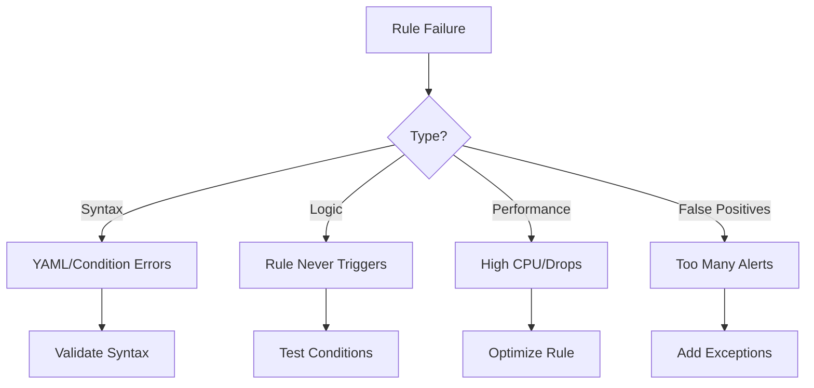
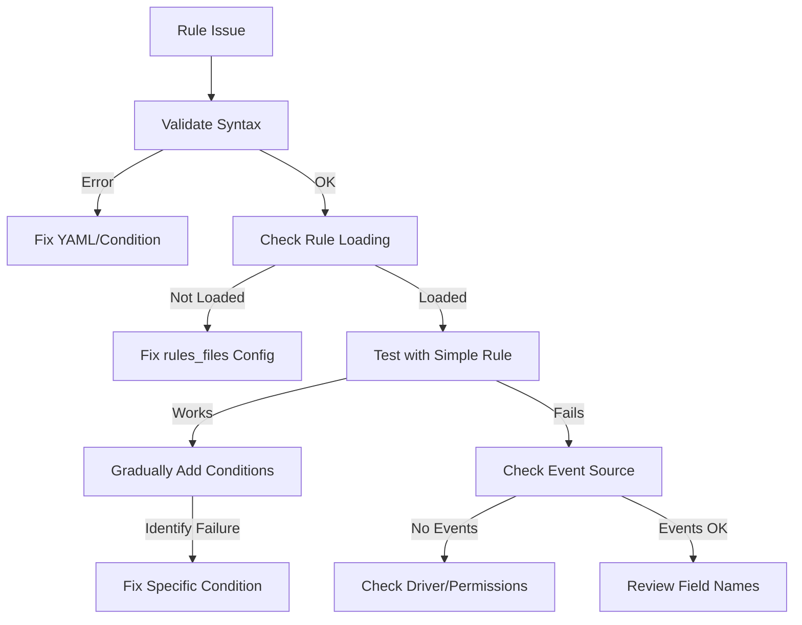

# How to Debug Falco Rule Failures

Author: [nawazdhandala](https://www.github.com/nawazdhandala)

Tags: Falco, Debugging, Security, Troubleshooting, DevOps

Description: Learn systematic approaches to troubleshoot Falco rule failures, from syntax errors to performance issues.

---

Falco rules occasionally fail to work as expected. Rules might not trigger when they should, trigger too often with false positives, or cause performance problems. This guide covers systematic approaches to debug and fix these issues.

## Common Rule Failure Categories



## Validating Rule Syntax

Before deploying rules, validate them locally:

```bash
# Validate rule file syntax
falco --validate /path/to/rules.yaml

# Validate with verbose output
falco -V /path/to/rules.yaml

# Validate custom rules against default rules
falco --validate /etc/falco/falco_rules.yaml -r /path/to/custom_rules.yaml
```

Common syntax errors:

```yaml
# ERROR: Missing quotes around string with special characters
- rule: Bad Rule
  condition: proc.name = my-process  # Wrong - needs quotes

# CORRECT: Properly quoted
- rule: Good Rule
  condition: proc.name = "my-process"

# ERROR: Incorrect field reference
- rule: Bad Field
  condition: container.image.name contains "nginx"  # Wrong field name

# CORRECT: Use proper field name
- rule: Good Field
  condition: container.image.repository contains "nginx"
```

## Listing Available Fields

Find the correct field names for your conditions:

```bash
# List all available fields
falco --list=fields

# List fields for a specific source
falco --list=fields --list-source-fields=syscall

# Search for specific fields
falco --list=fields | grep container
```

Key field categories:

```bash
# Process fields
proc.name          # Process name (e.g., "nginx")
proc.cmdline       # Full command line
proc.pname         # Parent process name
proc.exepath       # Executable path

# Container fields
container.id       # Container ID
container.name     # Container name
container.image.repository  # Image name without tag
container.privileged        # Boolean - privileged container

# File descriptor fields
fd.name            # File/socket name
fd.typechar        # Type: f=file, n=network, etc.
fd.directory       # Directory portion of path

# User fields
user.name          # Username
user.uid           # User ID
```

## Testing Rules with Dry Run

Test if your rule would trigger without deploying:

```bash
# Run Falco with trace file for testing
falco -r /path/to/rules.yaml \
  --dry-run \
  -e /path/to/trace.scap
```

Generate test events manually:

```bash
# Test "Terminal shell in container" rule
kubectl run test-shell --rm -it --image=alpine -- /bin/sh -c "echo test"

# Test "Write below etc" rule
kubectl run test-write --rm -it --image=alpine -- /bin/sh -c "touch /etc/test"

# Test "Outbound connection" rule
kubectl run test-network --rm -it --image=alpine -- wget -q google.com
```

## Debugging Rules That Never Trigger

When a rule should fire but does not:

### Step 1: Verify the Event Source

```bash
# Check if Falco is receiving events
kubectl logs -n falco -l app.kubernetes.io/name=falco | head -100

# Look for kernel event statistics
kubectl logs -n falco -l app.kubernetes.io/name=falco | grep -i "events"
```

### Step 2: Check Rule Loading

```yaml
# Ensure rules are in the right location
falco:
  rules_files:
    - /etc/falco/falco_rules.yaml
    - /etc/falco/falco_rules.local.yaml
    - /etc/falco/rules.d  # Custom rules directory
```

Verify rules loaded:

```bash
# Check Falco startup logs for rule loading
kubectl logs -n falco -l app.kubernetes.io/name=falco | grep -i "rule"

# Look for specific rule
kubectl logs -n falco -l app.kubernetes.io/name=falco | grep "Terminal shell"
```

### Step 3: Simplify and Test

Break complex conditions into simpler parts:

```yaml
# Original complex rule that does not trigger
- rule: Complex Rule
  condition: >
    spawned_process and
    container and
    proc.name in (sh, bash) and
    proc.pname != "crond" and
    not user.name = "admin"
  output: "Complex event"
  priority: WARNING

# Simplified version for testing
- rule: Simple Test Rule
  condition: spawned_process and container
  output: "Any process in container: proc=%proc.name"
  priority: DEBUG
```

### Step 4: Use Trace Output

Enable detailed tracing:

```yaml
# falco.yaml
log_level: debug
stdout_output:
  enabled: true

# Enable rule tracing for specific rules
rules_debug:
  enabled: true
```

## Debugging False Positives

When rules trigger too often:

### Identify the Pattern

```bash
# Count alerts by rule
kubectl logs -n falco -l app.kubernetes.io/name=falco --since=1h | \
  jq -r '.rule' | sort | uniq -c | sort -rn

# Find common attributes in alerts
kubectl logs -n falco -l app.kubernetes.io/name=falco --since=1h | \
  jq 'select(.rule == "Terminal shell in container")' | \
  jq -r '.output_fields.container_name' | sort | uniq -c
```

### Add Targeted Exceptions

```yaml
# Original rule
- rule: Terminal shell in container
  condition: >
    spawned_process and container and shell_procs and proc.tty != 0
  output: "Shell in container"
  priority: WARNING

# Add exception for known good behavior
- rule: Terminal shell in container
  append: true
  condition: and not (container.image.repository = "mycompany/admin-tools")

# More specific exception
- rule: Terminal shell in container
  append: true
  condition: >
    and not (
      container.image.repository = "mycompany/admin-tools" or
      (container.name startswith "debug-" and user.name = "admin")
    )
```

### Use Exception Lists

```yaml
# Define reusable lists
- list: allowed_shell_containers
  items: [admin-tools, debug-container, init-container]

- list: allowed_shell_images
  items: [mycompany/admin-tools, mycompany/debug]

# Use in rule exception
- rule: Terminal shell in container
  append: true
  condition: >
    and not (
      container.name in (allowed_shell_containers) or
      container.image.repository in (allowed_shell_images)
    )
```

## Debugging Performance Issues

### Identifying Expensive Rules

```bash
# Check for dropped events
kubectl logs -n falco -l app.kubernetes.io/name=falco | grep -i "drop"

# Monitor CPU usage
kubectl top pods -n falco

# Check Falco metrics
curl http://falco-service:8765/metrics | grep falco_cpu
```

### Profiling Rule Performance

```yaml
# Enable rule performance metrics
metrics:
  enabled: true
  output_rule: true
  rules_counters_enabled: true
```

Check rule timing:

```bash
# View rule match counts and timing
curl http://falco-service:8765/metrics | grep falco_rules
```

### Optimizing Expensive Rules

```yaml
# SLOW: Broad condition checked for every event
- rule: Slow Rule
  condition: >
    evt.type in (open, openat) and
    fd.name contains "secret"
  output: "Secret file access"
  priority: WARNING

# FASTER: Add early filtering
- rule: Fast Rule
  condition: >
    open_read and
    container and
    fd.name contains "secret"
  output: "Secret file access"
  priority: WARNING
```

Key optimization strategies:

```yaml
# Use macros for common conditions
- macro: container
  condition: container.id != host

- macro: open_read
  condition: evt.type in (open, openat) and evt.is_open_read=true

# Filter by event type first (most selective)
- rule: Optimized Rule
  condition: >
    evt.type = execve and      # Event type filter first
    container and              # Then container filter
    proc.name in (sh, bash)    # Then specific conditions
```

## Rule Debugging Workflow



## Common Debugging Commands

```bash
# View Falco configuration
kubectl get configmap -n falco falco -o yaml

# Check Falco pod status
kubectl describe pod -n falco -l app.kubernetes.io/name=falco

# Stream Falco logs
kubectl logs -n falco -l app.kubernetes.io/name=falco -f

# Check driver status
kubectl exec -n falco -it $(kubectl get pod -n falco -l app.kubernetes.io/name=falco -o jsonpath='{.items[0].metadata.name}') -- falco-driver-loader status

# Validate rules inside container
kubectl exec -n falco -it $(kubectl get pod -n falco -l app.kubernetes.io/name=falco -o jsonpath='{.items[0].metadata.name}') -- falco --validate /etc/falco/falco_rules.yaml
```

## Best Practices

1. **Validate Before Deploy** - Always run syntax validation before applying rule changes
2. **Test Incrementally** - Add conditions one at a time to identify failures
3. **Use Debug Priority** - Create DEBUG rules to verify event flow
4. **Monitor Performance** - Watch for dropped events and CPU spikes
5. **Document Exceptions** - Keep notes on why exceptions were added
6. **Review Regularly** - Audit rules monthly for false positives and missed detections

---

Debugging Falco rules requires a systematic approach: validate syntax, verify event sources, test conditions incrementally, and optimize for performance. By following these practices, you can build reliable detection rules that catch real threats without overwhelming your team with false positives.

**Related Reading:**

- [How to Implement Falco for Container Security](https://oneuptime.com/blog/post/2026-01-28-falco-container-security/view)
- [How to Monitor Falco Alerts](https://oneuptime.com/blog/post/2026-01-28-monitor-falco-alerts/view)
- [How to Use Falco Plugins](https://oneuptime.com/blog/post/2026-01-28-falco-plugins/view)
