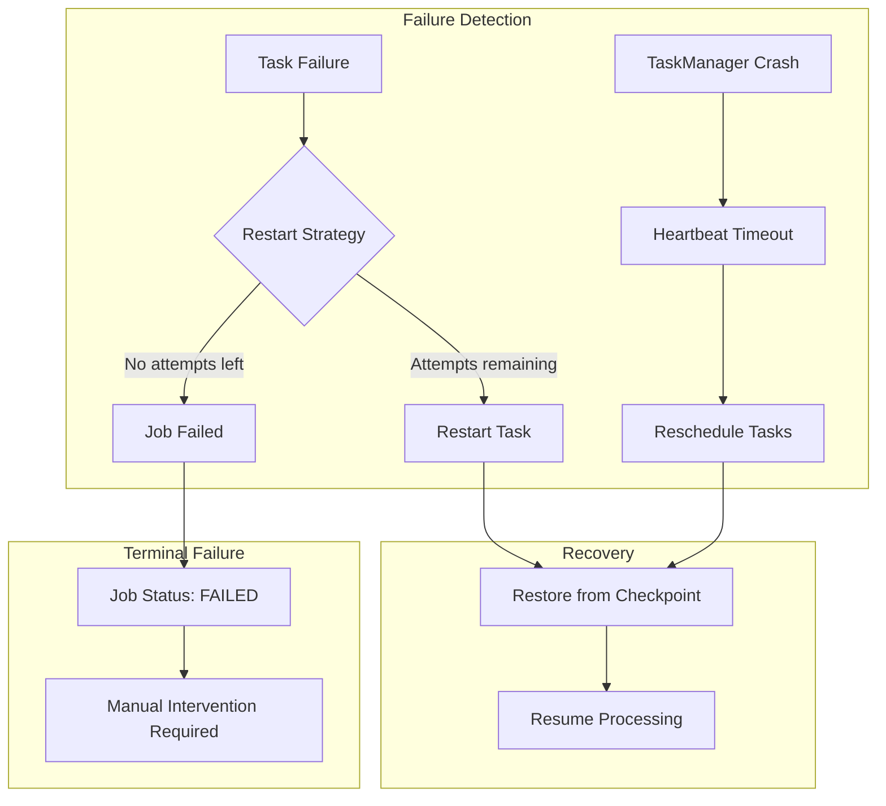
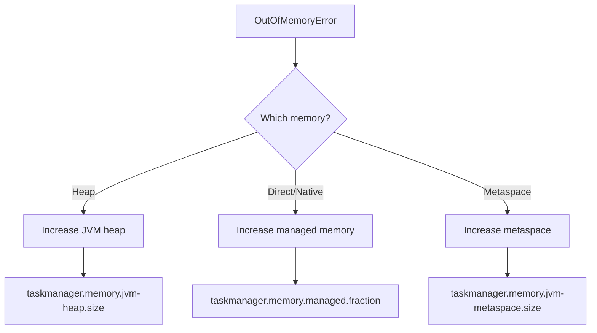
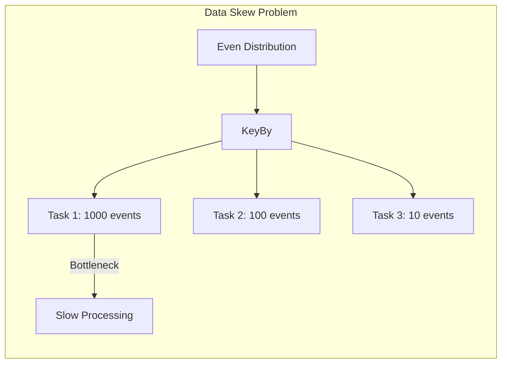

# How to Debug Flink Job Failures

Author: [nawazdhandala](https://www.github.com/nawazdhandala)

Tags: Apache Flink, Debugging, Stream Processing, Troubleshooting, Monitoring, Real-Time

Description: A comprehensive guide to debugging Apache Flink job failures, covering common error patterns, log analysis, metrics interpretation, and systematic troubleshooting approaches.

---

> When a Flink job fails in production, every minute of downtime matters. This guide provides a systematic approach to debugging Flink failures, from reading stack traces to identifying root causes in distributed streaming applications.

Flink jobs can fail for many reasons: data issues, resource exhaustion, configuration problems, or bugs in user code. Understanding how to quickly diagnose and fix these failures is essential for maintaining reliable stream processing pipelines.

---

## Understanding Flink's Failure Model

Before diving into debugging, understand how Flink handles failures:



---

## Step 1: Check the Flink Web UI

The Flink Web UI is your first stop for debugging. Access it at `http://jobmanager:8081`.

### Key Sections to Check

```
Dashboard
├── Running Jobs
│   └── Click on failed job
│       ├── Exceptions tab - Stack traces
│       ├── Checkpoints - Last successful checkpoint
│       └── TaskManagers - Resource usage
├── Task Managers
│   └── Logs for each TM
└── Job Manager
    └── Logs and configuration
```

### Reading the Exceptions Tab

The Exceptions tab shows the root cause. Look for:
- The original exception (not wrapped ones)
- Which task failed
- Timestamp of failure

---

## Step 2: Analyze Job Manager Logs

JobManager logs contain orchestration information. Key patterns to search for:

```bash
# Connect to JobManager container/pod
kubectl logs -f deployment/flink-jobmanager

# Search for error patterns
grep -E "(ERROR|WARN|Exception|Failed)" jobmanager.log | tail -100

# Find checkpoint failures
grep -i "checkpoint" jobmanager.log | grep -i "fail"

# Find task failures
grep "switched from RUNNING to FAILED" jobmanager.log
```

### Common JobManager Error Patterns

```java
// Pattern 1: Checkpoint timeout
// Cause: State too large or slow storage
ERROR org.apache.flink.runtime.checkpoint.CheckpointCoordinator -
    Checkpoint 42 of job abc123 expired before completing

// Pattern 2: Task deployment failure
// Cause: Resource issues or class loading problems
ERROR org.apache.flink.runtime.executiongraph.ExecutionGraph -
    Could not deploy task MyOperator to TaskManager

// Pattern 3: Job submission failure
// Cause: Configuration or dependency issues
ERROR org.apache.flink.runtime.dispatcher.Dispatcher -
    Failed to submit job abc123
```

---

## Step 3: Analyze TaskManager Logs

TaskManager logs contain the actual execution errors:

```bash
# Get logs from specific TaskManager
kubectl logs flink-taskmanager-0

# Search for exceptions in user code
grep -A 20 "java.lang.Exception" taskmanager.log

# Find out-of-memory errors
grep -i "outofmemory\|heap\|GC" taskmanager.log

# Find serialization issues
grep -i "serializ\|deserializ\|kryo" taskmanager.log
```

### Interpreting Stack Traces

```java
// Example: Serialization exception
// Root cause: Non-serializable field in user function
org.apache.flink.api.common.InvalidProgramException:
    The implementation of the MapFunction is not serializable
    at org.apache.flink.api.java.ClosureCleaner.ensureSerializable
    ...
Caused by: java.io.NotSerializableException:
    com.example.NonSerializableService
    at java.io.ObjectOutputStream.writeObject0

// Solution: Make the field transient and initialize in open()
public class MyMapFunction extends RichMapFunction<String, String> {
    // Mark as transient - won't be serialized
    private transient NonSerializableService service;

    @Override
    public void open(Configuration parameters) {
        // Initialize in open() - called after deserialization
        this.service = new NonSerializableService();
    }

    @Override
    public String map(String value) {
        return service.process(value);
    }
}
```

---

## Step 4: Check Metrics

Metrics provide insights into why failures occurred:

```java
// Key metrics to monitor

// Task failures and restarts
flink_jobmanager_job_numRestarts  // Total restarts
flink_jobmanager_job_uptime       // Time since last restart

// Checkpoint health
flink_jobmanager_job_lastCheckpointDuration
flink_jobmanager_job_lastCheckpointSize
flink_jobmanager_job_numberOfFailedCheckpoints

// Backpressure indicator
flink_taskmanager_job_task_busyTimeMsPerSecond
flink_taskmanager_job_task_backPressuredTimeMsPerSecond

// Memory usage
flink_taskmanager_Status_JVM_Memory_Heap_Used
flink_taskmanager_Status_JVM_Memory_NonHeap_Used
```

### Setting Up Metric Queries

```yaml
# Prometheus queries for debugging

# High restart rate indicates persistent issues
rate(flink_jobmanager_job_numRestarts[5m]) > 0.1

# Checkpoint failures indicate state/storage issues
increase(flink_jobmanager_job_numberOfFailedCheckpoints[10m]) > 0

# Memory pressure
flink_taskmanager_Status_JVM_Memory_Heap_Used /
flink_taskmanager_Status_JVM_Memory_Heap_Max > 0.9
```

---

## Common Failure Patterns and Solutions

### Pattern 1: OutOfMemoryError

```java
// Symptom in logs
java.lang.OutOfMemoryError: Java heap space
    at org.apache.flink.runtime.memory.MemoryManager.allocatePages

// Or for managed memory
java.lang.OutOfMemoryError: Direct buffer memory
```



**Solutions:**

```yaml
# flink-conf.yaml adjustments

# Increase total TaskManager memory
taskmanager.memory.process.size: 4096m

# Adjust heap vs managed memory ratio
# Heap for Java objects in user code
taskmanager.memory.jvm-heap.size: 1024m

# Managed memory for state backends and sorting
taskmanager.memory.managed.fraction: 0.4

# Network buffers for shuffling data
taskmanager.memory.network.fraction: 0.1
taskmanager.memory.network.min: 64mb
taskmanager.memory.network.max: 1gb
```

### Pattern 2: Checkpoint Failures

```java
// Symptom
WARN  CheckpointCoordinator - Checkpoint 42 expired before completing
ERROR CheckpointCoordinator - Checkpoint 43 failed: Checkpoint was declined

// Common causes:
// 1. State too large
// 2. Slow checkpoint storage
// 3. Barrier alignment timeout
// 4. Task failure during checkpoint
```

**Debug Steps:**

```bash
# Check checkpoint size trend
curl http://jobmanager:8081/jobs/{job-id}/checkpoints | jq '.history'

# Look for increasing checkpoint duration
# Look for checkpoints being declined by specific subtasks
```

**Solutions:**

```java
// Solution 1: Use incremental checkpoints for large state
EmbeddedRocksDBStateBackend backend = new EmbeddedRocksDBStateBackend(true);
env.setStateBackend(backend);

// Solution 2: Increase checkpoint timeout
env.getCheckpointConfig().setCheckpointTimeout(600000); // 10 minutes

// Solution 3: Enable unaligned checkpoints for backpressure scenarios
env.getCheckpointConfig().enableUnalignedCheckpoints();

// Solution 4: Reduce state by using TTL
StateTtlConfig ttlConfig = StateTtlConfig
    .newBuilder(Time.hours(24))
    .setUpdateType(StateTtlConfig.UpdateType.OnCreateAndWrite)
    .setStateVisibility(StateTtlConfig.StateVisibility.NeverReturnExpired)
    .cleanupFullSnapshot()
    .build();

ValueStateDescriptor<String> stateDescriptor =
    new ValueStateDescriptor<>("myState", String.class);
stateDescriptor.enableTimeToLive(ttlConfig);
```

### Pattern 3: Serialization Errors

```java
// Symptom
org.apache.flink.api.common.InvalidProgramException:
    Object ... is not serializable

com.esotericsoftware.kryo.KryoException:
    Unable to find class: com.example.MyClass
```

**Solutions:**

```java
// Solution 1: Make classes serializable
public class MyEvent implements Serializable {
    private static final long serialVersionUID = 1L;
    // fields...
}

// Solution 2: Use POJO rules (public class, no-arg constructor, getters/setters)
public class MyPojo {
    private String field;
    public MyPojo() {} // Required
    public String getField() { return field; }
    public void setField(String field) { this.field = field; }
}

// Solution 3: Register types with Kryo for better performance
env.getConfig().registerKryoType(MyCustomClass.class);

// Solution 4: Use Flink's type system directly
env.getConfig().registerTypeWithKryoSerializer(
    MyClass.class, MyCustomSerializer.class);
```

### Pattern 4: Data Skew and Backpressure

```java
// Symptom: Some tasks are slow, others idle
// Check for backpressure in Web UI
// Task status shows BACKPRESSURED
```



**Debug:**

```java
// Add monitoring to identify hot keys
public class HotKeyDetector extends RichMapFunction<Event, Event> {
    private transient Counter hotKeyCounter;
    private transient Map<String, Long> keyFrequency;

    @Override
    public void open(Configuration parameters) {
        hotKeyCounter = getRuntimeContext()
            .getMetricGroup()
            .counter("hotKeys");
        keyFrequency = new HashMap<>();
    }

    @Override
    public Event map(Event event) {
        // Track key frequency
        keyFrequency.merge(event.getKey(), 1L, Long::sum);

        // Log hot keys periodically
        if (keyFrequency.get(event.getKey()) % 10000 == 0) {
            LOG.warn("Hot key detected: {} with count {}",
                event.getKey(), keyFrequency.get(event.getKey()));
            hotKeyCounter.inc();
        }

        return event;
    }
}
```

**Solutions:**

```java
// Solution 1: Add salt to spread hot keys
public class SaltedKeyBy extends KeySelector<Event, String> {
    private final int numSalts;

    public SaltedKeyBy(int numSalts) {
        this.numSalts = numSalts;
    }

    @Override
    public String getKey(Event event) {
        // Add random salt to distribute load
        int salt = ThreadLocalRandom.current().nextInt(numSalts);
        return event.getKey() + "_" + salt;
    }
}

// Solution 2: Pre-aggregate before keyBy
DataStream<Event> aggregated = stream
    .map(new LocalAggregator())  // Pre-aggregate in map
    .keyBy(Event::getKey)
    .reduce(new GlobalReducer());

// Solution 3: Use rebalance() for even distribution
DataStream<Event> balanced = stream
    .rebalance()  // Round-robin distribution
    .map(new ProcessingFunction());
```

### Pattern 5: Kafka Consumer Lag

```java
// Symptom: Consumer group lag increasing
// Job can't keep up with incoming data

// Check via Kafka tools
kafka-consumer-groups.sh --bootstrap-server kafka:9092 \
    --group flink-consumer --describe
```

**Solutions:**

```java
// Solution 1: Increase parallelism
env.setParallelism(16);  // Match Kafka partitions

// Solution 2: Optimize processing
stream
    .filter(event -> event.isValid())  // Filter early
    .map(event -> transform(event))     // Lightweight transforms first
    .keyBy(Event::getKey)
    .window(TumblingEventTimeWindows.of(Time.minutes(1)))
    .aggregate(new EfficientAggregator());  // Use aggregate over reduce

// Solution 3: Async I/O for external lookups
AsyncDataStream.unorderedWait(
    stream,
    new AsyncDatabaseLookup(),
    30, TimeUnit.SECONDS,  // Timeout
    100  // Capacity - concurrent requests
);
```

---

## Building a Debug Checklist

Use this systematic approach:

```java
/**
 * Flink Job Failure Debug Checklist
 *
 * 1. IDENTIFY THE FAILURE
 *    [ ] Check Web UI Exceptions tab
 *    [ ] Note timestamp and failed task
 *    [ ] Check if job is restarting or fully failed
 *
 * 2. GATHER LOGS
 *    [ ] JobManager logs around failure time
 *    [ ] TaskManager logs for failed task
 *    [ ] Search for root exception (not wrapped)
 *
 * 3. CHECK RESOURCES
 *    [ ] Memory usage (heap, managed, network)
 *    [ ] CPU utilization
 *    [ ] Disk space (for checkpoints, logs)
 *    [ ] Network connectivity
 *
 * 4. CHECK CHECKPOINTS
 *    [ ] Last successful checkpoint
 *    [ ] Checkpoint duration trend
 *    [ ] Checkpoint size trend
 *
 * 5. CHECK DATA
 *    [ ] Recent data changes (new fields, format)
 *    [ ] Data volume spikes
 *    [ ] Malformed records
 *
 * 6. CHECK DEPENDENCIES
 *    [ ] Kafka brokers healthy
 *    [ ] Database connections available
 *    [ ] External services responding
 *
 * 7. REVIEW RECENT CHANGES
 *    [ ] Code deployments
 *    [ ] Configuration changes
 *    [ ] Infrastructure changes
 */
```

---

## Enabling Debug Logging

Temporarily increase logging for detailed debugging:

```yaml
# log4j.properties or log4j2.yaml

# Enable debug for specific packages
logger.checkpoint.name = org.apache.flink.runtime.checkpoint
logger.checkpoint.level = DEBUG

logger.taskmanager.name = org.apache.flink.runtime.taskmanager
logger.taskmanager.level = DEBUG

# Enable debug for user code
logger.usercode.name = com.mycompany.flink
logger.usercode.level = DEBUG

# Warning: Debug logging generates massive amounts of data
# Enable only temporarily and for specific components
```

---

## Using Savepoints for Debugging

Create a savepoint before making changes:

```bash
# Create savepoint before debugging
flink savepoint <job-id> s3://bucket/savepoints/debug-$(date +%Y%m%d)

# Stop job without savepoint (if job is stuck)
flink cancel <job-id>

# Restart from savepoint with debug configuration
flink run -s s3://bucket/savepoints/debug-20260128 \
    -Dlog4j.configuration=debug-log4j.properties \
    my-job.jar
```

---

## Implementing Health Checks

Add health monitoring to your jobs:

```java
public class HealthCheckingSource extends RichSourceFunction<Event> {
    private transient Counter healthyRecords;
    private transient Counter malformedRecords;
    private transient Gauge<Long> lastProcessedTimestamp;
    private volatile long lastTimestamp = 0;

    @Override
    public void open(Configuration parameters) {
        MetricGroup metrics = getRuntimeContext().getMetricGroup();

        healthyRecords = metrics.counter("healthyRecords");
        malformedRecords = metrics.counter("malformedRecords");
        lastProcessedTimestamp = metrics.gauge("lastProcessedTimestamp",
            () -> lastTimestamp);
    }

    @Override
    public void run(SourceContext<Event> ctx) throws Exception {
        while (running) {
            try {
                Event event = readNextEvent();

                if (isValid(event)) {
                    healthyRecords.inc();
                    lastTimestamp = System.currentTimeMillis();
                    ctx.collect(event);
                } else {
                    malformedRecords.inc();
                    LOG.warn("Malformed event: {}", event);
                }
            } catch (Exception e) {
                LOG.error("Error reading event", e);
                // Don't fail the source for transient errors
                Thread.sleep(1000);
            }
        }
    }
}
```

---

## Conclusion

Debugging Flink jobs requires a systematic approach:

1. Start with the Web UI to identify the failure type and location
2. Analyze logs from both JobManager and TaskManagers
3. Check metrics for resource issues and performance degradation
4. Match error patterns to known solutions
5. Use savepoints to safely test fixes

The key is building observability into your jobs from the start with proper metrics, logging, and health checks. This investment pays off significantly when issues arise in production.

---

*Want comprehensive monitoring for your Flink jobs? [OneUptime](https://oneuptime.com) provides integrated observability for stream processing, including log aggregation, metrics visualization, and intelligent alerting. Start your free trial today.*

**Related Reading:**
- [How to Implement Flink Exactly-Once Processing](https://oneuptime.com/blog/post/2026-01-28-flink-exactly-once-processing/view)
- [How to Scale Flink Deployments](https://oneuptime.com/blog/post/2026-01-28-scale-flink-deployments/view)
