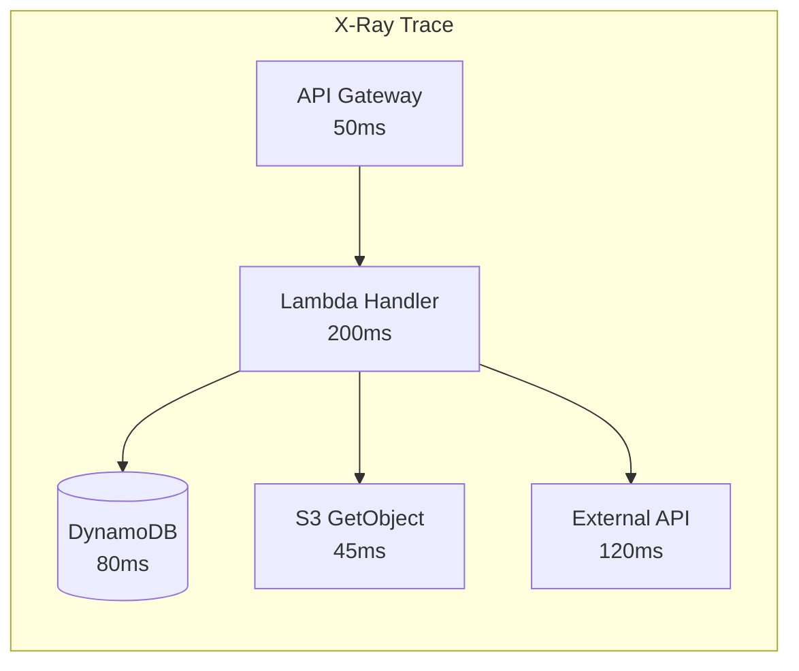
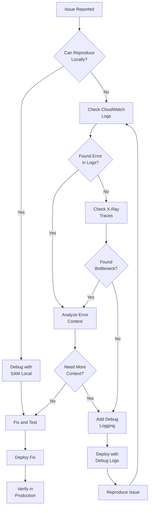

# How to Debug Lambda Functions

Author: [nawazdhandala](https://www.github.com/nawazdhandala)

Tags: AWS, Lambda, Serverless, Debugging, CloudWatch, X-Ray, Observability

Description: Learn practical techniques for debugging AWS Lambda functions, including CloudWatch Logs, X-Ray tracing, local testing, and live debugging strategies.

---

Debugging serverless functions presents unique challenges. You cannot SSH into the execution environment, attach a traditional debugger, or inspect runtime state directly. Instead, you rely on logs, traces, and local emulation to understand what your functions are doing. This guide covers practical debugging techniques for Lambda functions, from basic logging to distributed tracing.

## Structured Logging

The foundation of Lambda debugging is good logging. CloudWatch Logs captures everything written to stdout and stderr, but unstructured logs are difficult to search and analyze.

### Basic Logging Setup (Node.js)

```javascript
// logger.js - Structured logging for Lambda
const LOG_LEVEL = process.env.LOG_LEVEL || 'INFO';

const levels = {
  DEBUG: 0,
  INFO: 1,
  WARN: 2,
  ERROR: 3
};

function shouldLog(level) {
  return levels[level] >= levels[LOG_LEVEL];
}

function formatLog(level, message, context = {}) {
  return JSON.stringify({
    timestamp: new Date().toISOString(),
    level,
    message,
    ...context,
    // Lambda context
    requestId: global.lambdaRequestId,
    functionName: process.env.AWS_LAMBDA_FUNCTION_NAME,
    functionVersion: process.env.AWS_LAMBDA_FUNCTION_VERSION,
    memoryLimit: process.env.AWS_LAMBDA_FUNCTION_MEMORY_SIZE
  });
}

const logger = {
  debug: (message, context) => {
    if (shouldLog('DEBUG')) console.log(formatLog('DEBUG', message, context));
  },
  info: (message, context) => {
    if (shouldLog('INFO')) console.log(formatLog('INFO', message, context));
  },
  warn: (message, context) => {
    if (shouldLog('WARN')) console.warn(formatLog('WARN', message, context));
  },
  error: (message, context) => {
    if (shouldLog('ERROR')) console.error(formatLog('ERROR', message, context));
  }
};

module.exports = logger;
```

### Using the Logger

```javascript
// index.js
const logger = require('./logger');

exports.handler = async (event, context) => {
  // Store request ID globally for logging
  global.lambdaRequestId = context.awsRequestId;

  logger.info('Handler invoked', {
    eventSource: event.source,
    recordCount: event.Records?.length
  });

  try {
    const result = await processEvent(event);

    logger.info('Processing complete', {
      processedCount: result.count,
      duration: result.duration
    });

    return { statusCode: 200, body: JSON.stringify(result) };
  } catch (error) {
    logger.error('Processing failed', {
      error: error.message,
      stack: error.stack,
      event: JSON.stringify(event).substring(0, 1000)  // Truncate large events
    });

    throw error;
  }
};
```

### Python Structured Logging

```python
# logger.py
import json
import logging
import os
from datetime import datetime

class LambdaJsonFormatter(logging.Formatter):
    def __init__(self):
        super().__init__()
        self.function_name = os.environ.get('AWS_LAMBDA_FUNCTION_NAME', 'unknown')
        self.function_version = os.environ.get('AWS_LAMBDA_FUNCTION_VERSION', 'unknown')

    def format(self, record):
        log_record = {
            'timestamp': datetime.utcnow().isoformat(),
            'level': record.levelname,
            'message': record.getMessage(),
            'functionName': self.function_name,
            'functionVersion': self.function_version,
            'logger': record.name,
        }

        # Add exception info if present
        if record.exc_info:
            log_record['exception'] = self.formatException(record.exc_info)

        # Add extra fields
        if hasattr(record, 'extra'):
            log_record.update(record.extra)

        return json.dumps(log_record)

def get_logger(name):
    logger = logging.getLogger(name)
    logger.setLevel(os.environ.get('LOG_LEVEL', 'INFO'))

    handler = logging.StreamHandler()
    handler.setFormatter(LambdaJsonFormatter())
    logger.handlers = [handler]

    return logger
```

## CloudWatch Logs Insights

Use CloudWatch Logs Insights to query and analyze Lambda logs.

### Common Debug Queries

```sql
-- Find errors in the last hour
fields @timestamp, @message
| filter @message like /ERROR/
| sort @timestamp desc
| limit 100

-- Find slow invocations (>5 seconds)
fields @timestamp, @requestId, @duration
| filter @type = "REPORT" and @duration > 5000
| sort @duration desc
| limit 50

-- Analyze cold starts
fields @timestamp, @requestId, @duration, @billedDuration
| filter @type = "REPORT"
| parse @message "Init Duration: * ms" as initDuration
| filter ispresent(initDuration)
| stats avg(initDuration) as avgColdStart,
        max(initDuration) as maxColdStart,
        count() as coldStartCount
  by bin(1h)

-- Find memory issues
fields @timestamp, @requestId, @maxMemoryUsed, @memorySize
| filter @type = "REPORT"
| filter @maxMemoryUsed / @memorySize > 0.9
| sort @timestamp desc

-- Search for specific error
fields @timestamp, @message
| filter @message like /ConnectionError/
| parse @message '"requestId":"*"' as requestId
| sort @timestamp desc
```

### Terraform for Log Insights

```hcl
resource "aws_cloudwatch_query_definition" "lambda_errors" {
  name = "lambda-errors"

  query_string = <<EOF
fields @timestamp, @message, @requestId
| filter @message like /ERROR/ or @message like /Exception/
| sort @timestamp desc
| limit 100
EOF

  log_group_names = [
    "/aws/lambda/${aws_lambda_function.api.function_name}"
  ]
}

resource "aws_cloudwatch_query_definition" "lambda_performance" {
  name = "lambda-performance"

  query_string = <<EOF
fields @timestamp, @requestId, @duration, @billedDuration, @maxMemoryUsed
| filter @type = "REPORT"
| stats avg(@duration) as avgDuration,
        max(@duration) as maxDuration,
        avg(@maxMemoryUsed) as avgMemory
  by bin(5m)
EOF

  log_group_names = [
    "/aws/lambda/${aws_lambda_function.api.function_name}"
  ]
}
```

## AWS X-Ray Tracing

X-Ray provides distributed tracing to visualize request flow and identify bottlenecks.



### Enable X-Ray Tracing

```hcl
resource "aws_lambda_function" "api" {
  function_name = "api-handler"
  # ... other config

  tracing_config {
    mode = "Active"  # or "PassThrough"
  }
}

# IAM policy for X-Ray
resource "aws_iam_role_policy_attachment" "xray" {
  role       = aws_iam_role.lambda.name
  policy_arn = "arn:aws:iam::aws:policy/AWSXRayDaemonWriteAccess"
}
```

### Instrument Your Code (Node.js)

```javascript
// tracing.js
const AWSXRay = require('aws-xray-sdk-core');

// Capture all AWS SDK calls
const AWS = AWSXRay.captureAWS(require('aws-sdk'));

// Capture HTTP/HTTPS calls
AWSXRay.captureHTTPsGlobal(require('http'));
AWSXRay.captureHTTPsGlobal(require('https'));

// Custom subsegment for business logic
function traceOperation(name, operation) {
  return new Promise((resolve, reject) => {
    const segment = AWSXRay.getSegment();
    const subsegment = segment.addNewSubsegment(name);

    Promise.resolve(operation())
      .then(result => {
        subsegment.close();
        resolve(result);
      })
      .catch(error => {
        subsegment.addError(error);
        subsegment.close();
        reject(error);
      });
  });
}

module.exports = { AWS, traceOperation };
```

### Using Traced Operations

```javascript
// index.js
const { AWS, traceOperation } = require('./tracing');
const dynamodb = new AWS.DynamoDB.DocumentClient();

exports.handler = async (event, context) => {
  // DynamoDB calls are automatically traced
  const user = await dynamodb.get({
    TableName: 'users',
    Key: { id: event.userId }
  }).promise();

  // Add custom trace for business logic
  const enrichedUser = await traceOperation('enrichUserData', async () => {
    // Complex processing that we want to trace
    const preferences = await fetchPreferences(user);
    const recommendations = await generateRecommendations(user, preferences);
    return { ...user, preferences, recommendations };
  });

  return enrichedUser;
};
```

### Python X-Ray Instrumentation

```python
# handler.py
from aws_xray_sdk.core import xray_recorder
from aws_xray_sdk.core import patch_all

# Patch all supported libraries
patch_all()

@xray_recorder.capture('process_order')
def process_order(order_data):
    # Add annotation for filtering in X-Ray console
    xray_recorder.put_annotation('order_id', order_data['id'])
    xray_recorder.put_annotation('customer_type', order_data['customer_type'])

    # Add metadata for debugging
    xray_recorder.put_metadata('order_items', order_data['items'])

    # Business logic
    result = validate_and_process(order_data)
    return result

def handler(event, context):
    # Main segment is created automatically
    segment = xray_recorder.current_segment()
    segment.put_annotation('handler', 'order_processor')

    try:
        result = process_order(event)
        return {'statusCode': 200, 'body': json.dumps(result)}
    except Exception as e:
        segment.add_exception(e)
        raise
```

## Local Testing and Debugging

### SAM Local

AWS SAM CLI provides local Lambda emulation.

```bash
# Install SAM CLI
brew install aws-sam-cli

# Invoke function locally
sam local invoke MyFunction -e event.json

# Start local API Gateway
sam local start-api

# Debug with breakpoints (Node.js)
sam local invoke MyFunction -e event.json -d 5858

# Attach VS Code debugger to port 5858
```

### VS Code Launch Configuration

```json
{
  "version": "0.2.0",
  "configurations": [
    {
      "name": "Attach to SAM CLI",
      "type": "node",
      "request": "attach",
      "address": "localhost",
      "port": 5858,
      "localRoot": "${workspaceRoot}",
      "remoteRoot": "/var/task",
      "protocol": "inspector"
    },
    {
      "name": "Debug Lambda Locally",
      "type": "node",
      "request": "launch",
      "program": "${workspaceFolder}/test/local-runner.js",
      "env": {
        "AWS_REGION": "us-east-1",
        "TABLE_NAME": "test-table"
      }
    }
  ]
}
```

### Local Test Runner

```javascript
// test/local-runner.js
require('dotenv').config({ path: '.env.local' });

const { handler } = require('../src/index');

// Mock Lambda context
const context = {
  awsRequestId: 'local-test-123',
  functionName: 'test-function',
  functionVersion: '$LATEST',
  memoryLimitInMB: 256,
  getRemainingTimeInMillis: () => 30000
};

// Test event
const event = require('./events/api-gateway-event.json');

async function run() {
  try {
    console.log('Starting local test...');
    const result = await handler(event, context);
    console.log('Result:', JSON.stringify(result, null, 2));
  } catch (error) {
    console.error('Error:', error);
  }
}

run();
```

### Test Events

```json
// test/events/api-gateway-event.json
{
  "httpMethod": "POST",
  "path": "/orders",
  "headers": {
    "Content-Type": "application/json",
    "Authorization": "Bearer test-token"
  },
  "body": "{\"productId\": \"123\", \"quantity\": 2}",
  "requestContext": {
    "requestId": "test-request-id",
    "authorizer": {
      "claims": {
        "sub": "user-123"
      }
    }
  }
}
```

## Error Tracking and Alerting

### Structured Error Handling

```javascript
// errors.js
class ApplicationError extends Error {
  constructor(message, code, statusCode = 500, metadata = {}) {
    super(message);
    this.name = this.constructor.name;
    this.code = code;
    this.statusCode = statusCode;
    this.metadata = metadata;
    Error.captureStackTrace(this, this.constructor);
  }

  toJSON() {
    return {
      error: this.name,
      code: this.code,
      message: this.message,
      metadata: this.metadata
    };
  }
}

class ValidationError extends ApplicationError {
  constructor(message, fields = {}) {
    super(message, 'VALIDATION_ERROR', 400, { fields });
  }
}

class NotFoundError extends ApplicationError {
  constructor(resource, id) {
    super(`${resource} not found: ${id}`, 'NOT_FOUND', 404, { resource, id });
  }
}

class ExternalServiceError extends ApplicationError {
  constructor(service, originalError) {
    super(`External service error: ${service}`, 'EXTERNAL_ERROR', 502, {
      service,
      originalMessage: originalError.message
    });
  }
}

module.exports = { ApplicationError, ValidationError, NotFoundError, ExternalServiceError };
```

### Error Handling Middleware

```javascript
// middleware/error-handler.js
const logger = require('../logger');

function errorHandler(handler) {
  return async (event, context) => {
    try {
      return await handler(event, context);
    } catch (error) {
      // Log full error details
      logger.error('Handler error', {
        error: error.message,
        code: error.code,
        stack: error.stack,
        event: JSON.stringify(event).substring(0, 500)
      });

      // Return appropriate response
      const statusCode = error.statusCode || 500;
      const body = error.toJSON ? error.toJSON() : {
        error: 'InternalError',
        message: 'An unexpected error occurred'
      };

      return {
        statusCode,
        headers: { 'Content-Type': 'application/json' },
        body: JSON.stringify(body)
      };
    }
  };
}

module.exports = errorHandler;
```

### CloudWatch Alarms for Errors

```hcl
# Alarm for function errors
resource "aws_cloudwatch_metric_alarm" "lambda_errors" {
  alarm_name          = "${aws_lambda_function.api.function_name}-errors"
  comparison_operator = "GreaterThanThreshold"
  evaluation_periods  = 1
  metric_name         = "Errors"
  namespace           = "AWS/Lambda"
  period              = 60
  statistic           = "Sum"
  threshold           = 5

  dimensions = {
    FunctionName = aws_lambda_function.api.function_name
  }

  alarm_description = "Lambda function errors exceeded threshold"
  alarm_actions     = [aws_sns_topic.alerts.arn]
}

# Alarm for throttling
resource "aws_cloudwatch_metric_alarm" "lambda_throttles" {
  alarm_name          = "${aws_lambda_function.api.function_name}-throttles"
  comparison_operator = "GreaterThanThreshold"
  evaluation_periods  = 1
  metric_name         = "Throttles"
  namespace           = "AWS/Lambda"
  period              = 60
  statistic           = "Sum"
  threshold           = 0

  dimensions = {
    FunctionName = aws_lambda_function.api.function_name
  }

  alarm_description = "Lambda function is being throttled"
  alarm_actions     = [aws_sns_topic.alerts.arn]
}
```

## Debugging Memory Issues

### Memory Monitoring

```javascript
// memory-monitor.js
const v8 = require('v8');

function getMemoryStats() {
  const heapStats = v8.getHeapStatistics();
  const memoryUsage = process.memoryUsage();

  return {
    heapUsed: Math.round(memoryUsage.heapUsed / 1024 / 1024),
    heapTotal: Math.round(memoryUsage.heapTotal / 1024 / 1024),
    external: Math.round(memoryUsage.external / 1024 / 1024),
    rss: Math.round(memoryUsage.rss / 1024 / 1024),
    v8HeapSizeLimit: Math.round(heapStats.heap_size_limit / 1024 / 1024)
  };
}

// Log memory at start and end of invocation
function withMemoryLogging(handler) {
  return async (event, context) => {
    const startMemory = getMemoryStats();
    console.log('Memory at start:', JSON.stringify(startMemory));

    const result = await handler(event, context);

    const endMemory = getMemoryStats();
    console.log('Memory at end:', JSON.stringify(endMemory));
    console.log('Memory delta:', {
      heapUsed: endMemory.heapUsed - startMemory.heapUsed,
      rss: endMemory.rss - startMemory.rss
    });

    return result;
  };
}

module.exports = { getMemoryStats, withMemoryLogging };
```

### Detecting Memory Leaks

```javascript
// Track objects across invocations
let invocationCount = 0;
let previousHeapUsed = 0;

exports.handler = async (event, context) => {
  invocationCount++;

  const memoryUsage = process.memoryUsage();
  const heapUsed = memoryUsage.heapUsed;

  // Check for consistent memory growth
  if (invocationCount > 1) {
    const heapDelta = heapUsed - previousHeapUsed;
    if (heapDelta > 5 * 1024 * 1024) {  // 5MB growth
      console.warn('Potential memory leak detected', {
        invocationCount,
        heapDelta: Math.round(heapDelta / 1024 / 1024),
        totalHeap: Math.round(heapUsed / 1024 / 1024)
      });
    }
  }

  previousHeapUsed = heapUsed;

  // Your handler logic
  const result = await processEvent(event);

  return result;
};
```

## Debug Workflow



## Best Practices

### 1. Include Request Context in All Logs

```javascript
// Always include request ID for correlation
logger.info('Processing started', {
  requestId: context.awsRequestId,
  userId: event.userId,
  action: event.action
});
```

### 2. Log Input/Output at Boundaries

```javascript
exports.handler = async (event, context) => {
  // Log input (sanitized)
  logger.debug('Input received', {
    eventKeys: Object.keys(event),
    bodyLength: event.body?.length
  });

  const result = await process(event);

  // Log output
  logger.debug('Output generated', {
    statusCode: result.statusCode,
    bodyLength: result.body?.length
  });

  return result;
};
```

### 3. Use Environment-Based Log Levels

```hcl
resource "aws_lambda_function" "api" {
  # ...

  environment {
    variables = {
      LOG_LEVEL = var.environment == "production" ? "INFO" : "DEBUG"
    }
  }
}
```

### 4. Set Up Log Retention

```hcl
resource "aws_cloudwatch_log_group" "lambda" {
  name              = "/aws/lambda/${aws_lambda_function.api.function_name}"
  retention_in_days = var.environment == "production" ? 30 : 7
}
```

---

Debugging Lambda functions requires a shift in mindset from traditional application debugging. Instead of breakpoints and interactive debugging, you rely on comprehensive logging, distributed tracing, and local emulation. The key is to instrument your code thoroughly during development so that when issues arise in production, you have the observability needed to diagnose and fix problems quickly. Combine structured logging with X-Ray tracing, set up proper alerting, and test locally before deploying to catch issues early.
