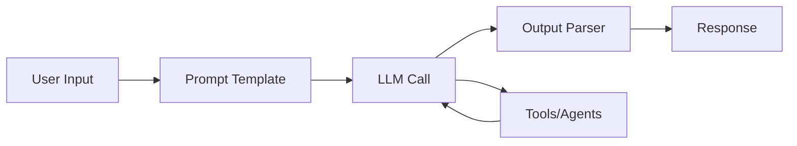
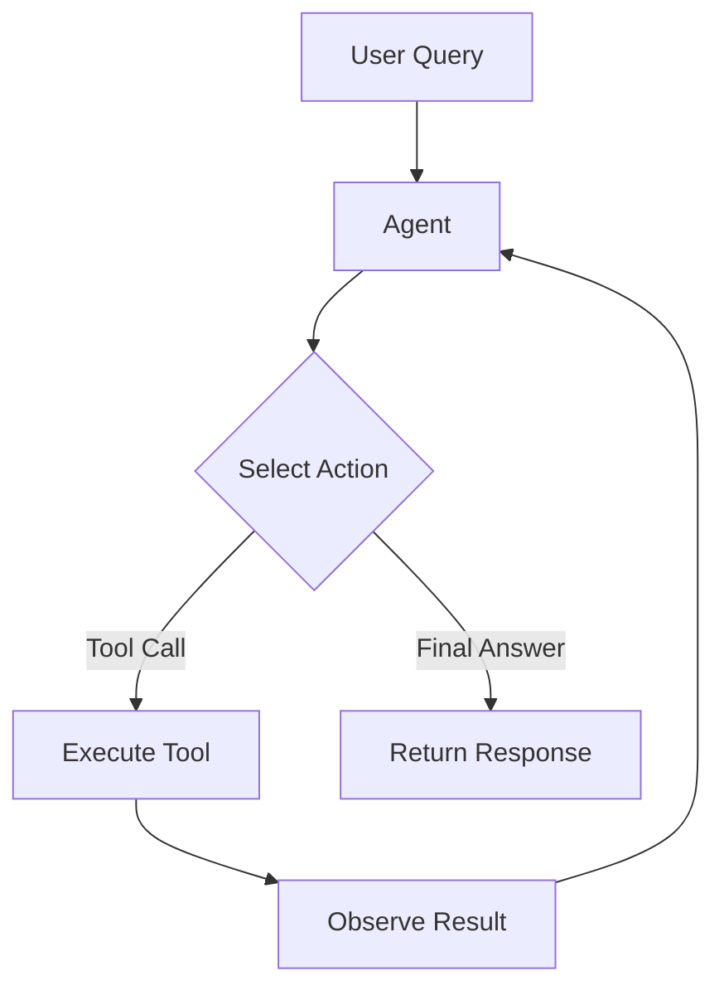
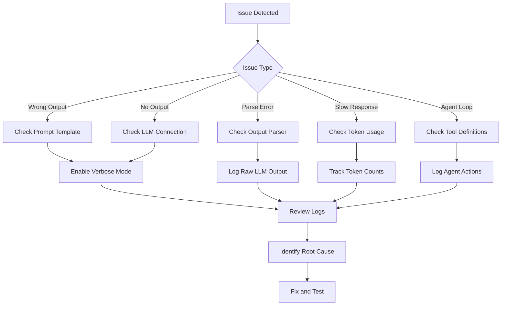

# How to Debug LangChain Applications

Author: [nawazdhandala](https://www.github.com/nawazdhandala)

Tags: LangChain, Debugging, LLM, Python, Observability, AI

Description: A practical guide to debugging LangChain applications using tracing, callbacks, and observability tools.

---

LangChain simplifies building applications with large language models, but debugging these applications presents unique challenges. Token usage, prompt formatting, chain execution order, and API failures can all cause unexpected behavior. This guide covers practical techniques for finding and fixing issues in LangChain applications.

## Understanding the LangChain Execution Model

Before diving into debugging, you need to understand how LangChain executes your code. LangChain uses a chain-based architecture where components connect sequentially.



Each step in the chain can fail or produce unexpected results. Debugging requires visibility into every step.

## Enabling Verbose Mode

The simplest debugging approach is enabling verbose mode, which logs every operation.

```python
# Enable verbose mode globally
import langchain
langchain.verbose = True

# Or enable it per chain
from langchain.chains import LLMChain

chain = LLMChain(
    llm=llm,
    prompt=prompt,
    verbose=True  # Logs prompts, responses, and timing
)
```

Verbose mode outputs the full prompt sent to the LLM and the raw response. This helps identify prompt formatting issues.

## Using LangChain Callbacks for Custom Tracing

Callbacks provide fine-grained control over what gets logged. They hook into every step of chain execution.

```python
from langchain.callbacks.base import BaseCallbackHandler
from datetime import datetime
import json

class DebugCallbackHandler(BaseCallbackHandler):
    """Custom callback handler for debugging LangChain operations."""

    def __init__(self):
        self.logs = []
        self.start_times = {}

    def on_chain_start(self, serialized, inputs, **kwargs):
        """Called when a chain starts running."""
        chain_id = kwargs.get('run_id', 'unknown')
        self.start_times[chain_id] = datetime.now()

        self.logs.append({
            'event': 'chain_start',
            'chain': serialized.get('name', 'unknown'),
            'inputs': inputs,
            'timestamp': datetime.now().isoformat()
        })
        print(f"[CHAIN START] {serialized.get('name')}")
        print(f"  Inputs: {json.dumps(inputs, indent=2)}")

    def on_chain_end(self, outputs, **kwargs):
        """Called when a chain finishes."""
        chain_id = kwargs.get('run_id', 'unknown')
        duration = None
        if chain_id in self.start_times:
            duration = (datetime.now() - self.start_times[chain_id]).total_seconds()

        self.logs.append({
            'event': 'chain_end',
            'outputs': outputs,
            'duration_seconds': duration,
            'timestamp': datetime.now().isoformat()
        })
        print(f"[CHAIN END] Duration: {duration:.2f}s")
        print(f"  Outputs: {json.dumps(outputs, indent=2)}")

    def on_llm_start(self, serialized, prompts, **kwargs):
        """Called when an LLM call starts."""
        self.logs.append({
            'event': 'llm_start',
            'model': serialized.get('name', 'unknown'),
            'prompts': prompts,
            'timestamp': datetime.now().isoformat()
        })
        print(f"[LLM START] Model: {serialized.get('name')}")
        for i, prompt in enumerate(prompts):
            print(f"  Prompt {i}: {prompt[:200]}...")

    def on_llm_end(self, response, **kwargs):
        """Called when an LLM call completes."""
        self.logs.append({
            'event': 'llm_end',
            'response': str(response),
            'timestamp': datetime.now().isoformat()
        })
        print(f"[LLM END] Response received")

    def on_llm_error(self, error, **kwargs):
        """Called when an LLM call fails."""
        self.logs.append({
            'event': 'llm_error',
            'error': str(error),
            'timestamp': datetime.now().isoformat()
        })
        print(f"[LLM ERROR] {error}")

    def on_tool_start(self, serialized, input_str, **kwargs):
        """Called when a tool starts executing."""
        print(f"[TOOL START] {serialized.get('name')}")
        print(f"  Input: {input_str}")

    def on_tool_end(self, output, **kwargs):
        """Called when a tool finishes."""
        print(f"[TOOL END] Output: {output[:200]}...")

    def on_tool_error(self, error, **kwargs):
        """Called when a tool fails."""
        print(f"[TOOL ERROR] {error}")

# Usage
debug_handler = DebugCallbackHandler()

response = chain.invoke(
    {"question": "What is the capital of France?"},
    config={"callbacks": [debug_handler]}
)

# Access logs after execution
print(json.dumps(debug_handler.logs, indent=2))
```

## Tracing Token Usage

Token usage directly impacts costs and can cause failures when limits are exceeded.

```python
from langchain.callbacks import get_openai_callback
from langchain_openai import ChatOpenAI

llm = ChatOpenAI(model="gpt-4")

# Track token usage for a block of code
with get_openai_callback() as cb:
    response = chain.invoke({"question": "Explain quantum computing"})

    print(f"Total Tokens: {cb.total_tokens}")
    print(f"Prompt Tokens: {cb.prompt_tokens}")
    print(f"Completion Tokens: {cb.completion_tokens}")
    print(f"Total Cost (USD): ${cb.total_cost:.4f}")
```

For long-running applications, aggregate token usage over time:

```python
class TokenTracker:
    """Track token usage across multiple LLM calls."""

    def __init__(self):
        self.total_tokens = 0
        self.total_cost = 0.0
        self.calls = []

    def track_call(self, callback_result, metadata=None):
        """Record a single LLM call's token usage."""
        self.total_tokens += callback_result.total_tokens
        self.total_cost += callback_result.total_cost
        self.calls.append({
            'tokens': callback_result.total_tokens,
            'cost': callback_result.total_cost,
            'metadata': metadata
        })

    def get_summary(self):
        """Get usage summary."""
        return {
            'total_tokens': self.total_tokens,
            'total_cost': self.total_cost,
            'call_count': len(self.calls),
            'avg_tokens_per_call': self.total_tokens / len(self.calls) if self.calls else 0
        }

# Usage
tracker = TokenTracker()

with get_openai_callback() as cb:
    response = chain.invoke({"question": "What is AI?"})
    tracker.track_call(cb, metadata={'question_type': 'definition'})

print(tracker.get_summary())
```

## Debugging Agent Execution

Agents introduce additional complexity with tool selection and multi-step reasoning. The agent loop can be difficult to follow without proper logging.



Debug agent execution with a specialized callback:

```python
from langchain.agents import AgentExecutor, create_openai_functions_agent
from langchain_openai import ChatOpenAI
from langchain import hub

class AgentDebugCallback(BaseCallbackHandler):
    """Debug callback specifically for agent execution."""

    def __init__(self):
        self.iteration = 0
        self.tool_calls = []

    def on_agent_action(self, action, **kwargs):
        """Called when agent decides on an action."""
        self.iteration += 1
        print(f"\n--- Iteration {self.iteration} ---")
        print(f"Action: {action.tool}")
        print(f"Input: {action.tool_input}")

        self.tool_calls.append({
            'iteration': self.iteration,
            'tool': action.tool,
            'input': action.tool_input
        })

    def on_agent_finish(self, finish, **kwargs):
        """Called when agent completes."""
        print(f"\n--- Agent Finished ---")
        print(f"Final Output: {finish.return_values}")
        print(f"Total Iterations: {self.iteration}")
        print(f"Tools Used: {[tc['tool'] for tc in self.tool_calls]}")

# Create agent with debug callback
debug_callback = AgentDebugCallback()

agent_executor = AgentExecutor(
    agent=agent,
    tools=tools,
    verbose=True,
    max_iterations=10,  # Prevent infinite loops
    early_stopping_method="generate"
)

result = agent_executor.invoke(
    {"input": "What's the weather in New York and convert 100 USD to EUR?"},
    config={"callbacks": [debug_callback]}
)
```

## Debugging Retrieval Chains

RAG (Retrieval-Augmented Generation) applications have another failure point: the retriever. Poor retrieval leads to irrelevant context and bad responses.

```python
from langchain.callbacks.base import BaseCallbackHandler

class RetrieverDebugCallback(BaseCallbackHandler):
    """Debug callback for retrieval operations."""

    def on_retriever_start(self, serialized, query, **kwargs):
        """Called when retrieval starts."""
        print(f"[RETRIEVER] Query: {query}")

    def on_retriever_end(self, documents, **kwargs):
        """Called when retrieval completes."""
        print(f"[RETRIEVER] Found {len(documents)} documents")
        for i, doc in enumerate(documents):
            print(f"  Doc {i+1}:")
            print(f"    Content: {doc.page_content[:100]}...")
            print(f"    Metadata: {doc.metadata}")
            if hasattr(doc, 'score'):
                print(f"    Score: {doc.score}")

# Debug retrieval independently
def debug_retrieval(retriever, query):
    """Test retrieval without running the full chain."""
    docs = retriever.invoke(query)

    print(f"Query: {query}")
    print(f"Retrieved {len(docs)} documents:\n")

    for i, doc in enumerate(docs):
        print(f"--- Document {i+1} ---")
        print(f"Content: {doc.page_content}")
        print(f"Metadata: {doc.metadata}")
        print()

    return docs

# Test retrieval before running the chain
debug_retrieval(retriever, "How do I reset my password?")
```

## Using LangSmith for Production Debugging

LangSmith provides a hosted tracing solution for production applications.

```python
import os

# Configure LangSmith
os.environ["LANGCHAIN_TRACING_V2"] = "true"
os.environ["LANGCHAIN_API_KEY"] = "your-api-key"
os.environ["LANGCHAIN_PROJECT"] = "my-langchain-app"

# All LangChain operations are now automatically traced
from langchain_openai import ChatOpenAI
from langchain.chains import LLMChain

llm = ChatOpenAI(model="gpt-4")
chain = LLMChain(llm=llm, prompt=prompt)

# This call is traced in LangSmith
response = chain.invoke({"question": "What is machine learning?"})
```

LangSmith captures the full execution tree, including:
- Input/output at each step
- Latency for each operation
- Token usage and costs
- Error traces with stack traces

## Debugging Common Issues

### Issue 1: Output Parser Failures

Output parsers expect specific formats. When the LLM returns unexpected output, parsing fails.

```python
from langchain.output_parsers import PydanticOutputParser
from pydantic import BaseModel, Field

class MovieReview(BaseModel):
    title: str = Field(description="Movie title")
    rating: int = Field(description="Rating from 1-10")
    summary: str = Field(description="Brief summary")

parser = PydanticOutputParser(pydantic_object=MovieReview)

# Debug by catching parsing errors
def safe_parse(parser, text):
    """Attempt to parse with detailed error handling."""
    try:
        return parser.parse(text)
    except Exception as e:
        print(f"Parse Error: {e}")
        print(f"Raw Output:\n{text}")
        print(f"Expected Format:\n{parser.get_format_instructions()}")
        raise

# Add retry logic with format reinforcement
from langchain.output_parsers import RetryWithErrorOutputParser

retry_parser = RetryWithErrorOutputParser.from_llm(
    parser=parser,
    llm=llm
)
```

### Issue 2: Context Window Exceeded

Long documents or conversation histories can exceed the model's context window.

```python
from langchain.text_splitter import RecursiveCharacterTextSplitter
import tiktoken

def count_tokens(text, model="gpt-4"):
    """Count tokens in text."""
    encoding = tiktoken.encoding_for_model(model)
    return len(encoding.encode(text))

def debug_context_length(prompt, max_tokens=8000):
    """Check if prompt exceeds context limits."""
    token_count = count_tokens(prompt)
    print(f"Token count: {token_count}")
    print(f"Max tokens: {max_tokens}")
    print(f"Available for response: {max_tokens - token_count}")

    if token_count > max_tokens:
        print("WARNING: Context window exceeded!")
        return False
    return True

# Automatically truncate history if needed
def truncate_history(messages, max_tokens=6000):
    """Truncate message history to fit context window."""
    total_tokens = sum(count_tokens(m.content) for m in messages)

    while total_tokens > max_tokens and len(messages) > 1:
        # Remove oldest messages (keep system message)
        removed = messages.pop(1)
        total_tokens -= count_tokens(removed.content)
        print(f"Removed message to fit context: {removed.content[:50]}...")

    return messages
```

### Issue 3: Rate Limiting

API rate limits cause failures under load.

```python
from langchain_openai import ChatOpenAI
from tenacity import retry, stop_after_attempt, wait_exponential

# Configure retry behavior
llm = ChatOpenAI(
    model="gpt-4",
    max_retries=3,
    request_timeout=60
)

# Custom retry wrapper with logging
@retry(
    stop=stop_after_attempt(5),
    wait=wait_exponential(multiplier=1, min=4, max=60)
)
def call_with_retry(chain, inputs):
    """Call chain with exponential backoff retry."""
    try:
        return chain.invoke(inputs)
    except Exception as e:
        print(f"Call failed: {e}. Retrying...")
        raise
```

## Building a Debug Dashboard

For complex applications, build a simple dashboard to monitor execution:

```python
import json
from datetime import datetime
from collections import defaultdict

class LangChainDebugDashboard:
    """Simple debugging dashboard for LangChain applications."""

    def __init__(self):
        self.calls = []
        self.errors = []
        self.token_usage = defaultdict(int)
        self.latencies = []

    def log_call(self, chain_name, inputs, outputs, duration, tokens=None):
        """Log a chain call."""
        self.calls.append({
            'chain': chain_name,
            'inputs': inputs,
            'outputs': outputs,
            'duration': duration,
            'timestamp': datetime.now().isoformat()
        })
        self.latencies.append(duration)

        if tokens:
            self.token_usage['total'] += tokens

    def log_error(self, chain_name, error, inputs):
        """Log an error."""
        self.errors.append({
            'chain': chain_name,
            'error': str(error),
            'inputs': inputs,
            'timestamp': datetime.now().isoformat()
        })

    def get_stats(self):
        """Get dashboard statistics."""
        return {
            'total_calls': len(self.calls),
            'total_errors': len(self.errors),
            'error_rate': len(self.errors) / max(len(self.calls), 1),
            'avg_latency': sum(self.latencies) / max(len(self.latencies), 1),
            'total_tokens': self.token_usage['total'],
            'recent_errors': self.errors[-5:]
        }

    def print_report(self):
        """Print a formatted report."""
        stats = self.get_stats()
        print("\n=== LangChain Debug Report ===")
        print(f"Total Calls: {stats['total_calls']}")
        print(f"Total Errors: {stats['total_errors']}")
        print(f"Error Rate: {stats['error_rate']:.2%}")
        print(f"Avg Latency: {stats['avg_latency']:.2f}s")
        print(f"Total Tokens: {stats['total_tokens']}")

        if stats['recent_errors']:
            print("\nRecent Errors:")
            for err in stats['recent_errors']:
                print(f"  - {err['chain']}: {err['error'][:100]}")

# Usage with callback
dashboard = LangChainDebugDashboard()

class DashboardCallback(BaseCallbackHandler):
    def __init__(self, dashboard):
        self.dashboard = dashboard
        self.start_time = None
        self.chain_name = None
        self.inputs = None

    def on_chain_start(self, serialized, inputs, **kwargs):
        self.start_time = datetime.now()
        self.chain_name = serialized.get('name', 'unknown')
        self.inputs = inputs

    def on_chain_end(self, outputs, **kwargs):
        duration = (datetime.now() - self.start_time).total_seconds()
        self.dashboard.log_call(self.chain_name, self.inputs, outputs, duration)

    def on_chain_error(self, error, **kwargs):
        self.dashboard.log_error(self.chain_name, error, self.inputs)
```

## Debugging Flow Summary



---

Debugging LangChain applications requires visibility into every step of the execution chain. Start with verbose mode for quick debugging, implement custom callbacks for specific insights, and use LangSmith for production monitoring. The key is capturing enough context to understand what the LLM received and how it responded at each step.
