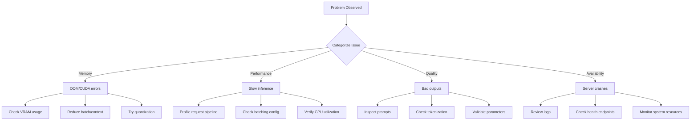
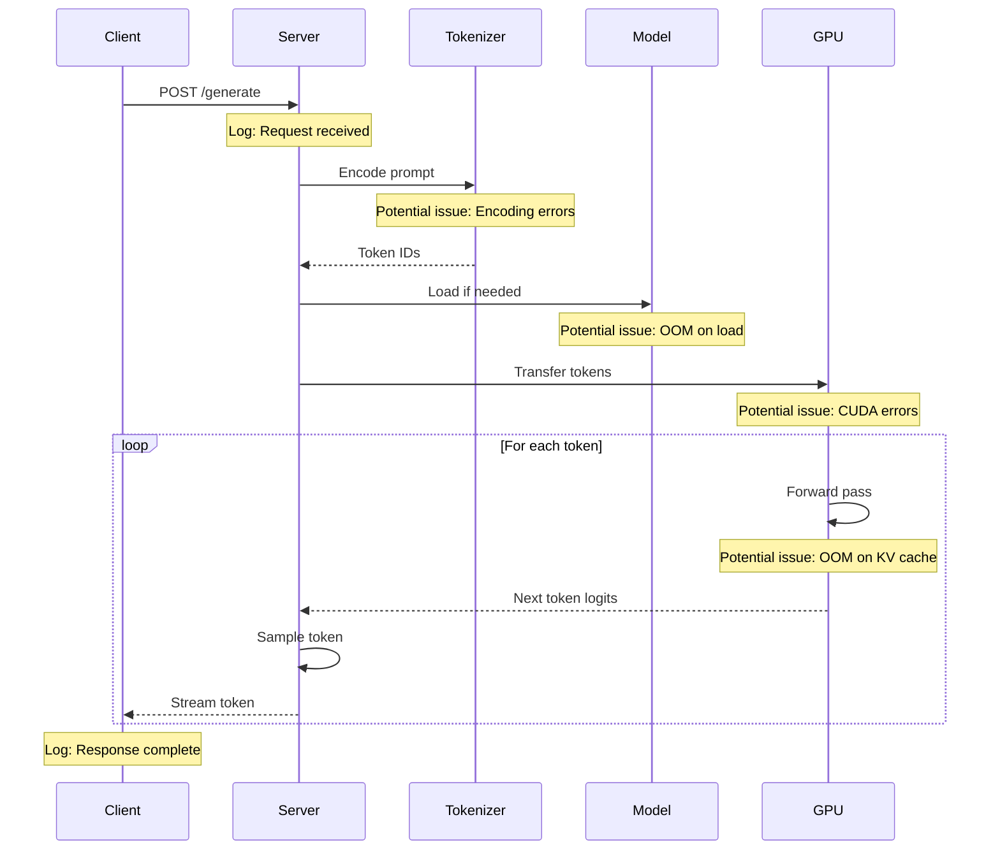

# How to Debug LLM Inference Issues

Author: [nawazdhandala](https://www.github.com/nawazdhandala)

Tags: LLM, Debugging, AI/ML, Inference, Troubleshooting, vLLM, Ollama

Description: A systematic approach to diagnosing and fixing common LLM inference problems including memory errors, slow generation, and unexpected outputs.

---

LLM inference can fail in subtle ways. The model loads but generates garbage. Memory runs out mid-request. Latency spikes unpredictably. This guide provides a systematic debugging workflow covering the most common issues across Ollama, vLLM, and other inference engines.

## The Debugging Mindset for LLM Inference

LLM debugging differs from traditional software debugging. The model itself is a black box, so you focus on inputs, outputs, and the infrastructure in between.



## Memory Issues: CUDA Out of Memory

The most common error. Your GPU runs out of VRAM trying to load the model or process a request.

```bash
# Check current GPU memory usage
nvidia-smi

# Monitor GPU memory in real-time
watch -n 1 nvidia-smi

# For Ollama: see loaded models and memory
ollama ps
```

Solutions by severity:

```bash
# Level 1: Unload unused models (Ollama)
ollama stop llama3.2:70b

# Level 2: Use a smaller quantization
ollama pull llama3.2:3b-q4_0   # 4-bit quantization
# Instead of
ollama pull llama3.2:3b        # Default quantization

# Level 3: Reduce context window
# In Modelfile:
PARAMETER num_ctx 2048  # Instead of 4096 or 8192

# Level 4: For vLLM, limit GPU memory
python -m vllm.entrypoints.openai.api_server \
    --model meta-llama/Llama-3.2-3B-Instruct \
    --gpu-memory-utilization 0.7 \
    --max-model-len 2048
```

Calculate memory requirements:

```python
def estimate_vram_gb(params_billions: float, precision: str = "fp16") -> float:
    """
    Estimate VRAM needed for a model.

    Rule of thumb:
    - FP32: params * 4 bytes
    - FP16/BF16: params * 2 bytes
    - INT8: params * 1 byte
    - INT4: params * 0.5 bytes

    Add 20-30% overhead for KV cache and activations.
    """
    bytes_per_param = {
        "fp32": 4,
        "fp16": 2,
        "bf16": 2,
        "int8": 1,
        "int4": 0.5
    }

    base_memory = params_billions * bytes_per_param[precision]
    with_overhead = base_memory * 1.25  # 25% overhead

    return round(with_overhead, 1)

# Examples:
print(f"7B model FP16: {estimate_vram_gb(7, 'fp16')} GB")   # ~17.5 GB
print(f"7B model INT4: {estimate_vram_gb(7, 'int4')} GB")   # ~4.4 GB
print(f"70B model INT4: {estimate_vram_gb(70, 'int4')} GB") # ~43.75 GB
```

## Slow Inference Diagnosis

When generation is slower than expected, identify the bottleneck:

```bash
# Check if GPU is actually being used
nvidia-smi dmon -s u  # GPU utilization over time

# For Ollama, enable verbose logging
OLLAMA_DEBUG=1 ollama run llama3.2:3b "test prompt"

# For vLLM, check metrics
curl http://localhost:8000/metrics | grep throughput
```

Common causes and fixes:

```python
import time
import requests

def benchmark_inference(base_url: str, model: str, prompt: str, n_runs: int = 5):
    """Benchmark inference latency breakdown."""

    results = []

    for i in range(n_runs):
        # Time to first token (TTFT)
        start = time.time()
        response = requests.post(
            f"{base_url}/api/generate",
            json={
                "model": model,
                "prompt": prompt,
                "stream": True
            },
            stream=True,
            timeout=120
        )

        ttft = None
        tokens = 0

        for line in response.iter_lines():
            if line:
                if ttft is None:
                    ttft = time.time() - start
                tokens += 1

        total_time = time.time() - start
        generation_time = total_time - ttft

        results.append({
            "ttft": ttft,
            "total": total_time,
            "tokens": tokens,
            "tokens_per_sec": tokens / generation_time if generation_time > 0 else 0
        })

    # Report averages
    avg_ttft = sum(r["ttft"] for r in results) / len(results)
    avg_tps = sum(r["tokens_per_sec"] for r in results) / len(results)

    print(f"Average TTFT: {avg_ttft:.3f}s")
    print(f"Average tokens/sec: {avg_tps:.1f}")

    # Diagnosis
    if avg_ttft > 5:
        print("DIAGNOSIS: High TTFT - likely model loading or prompt processing issue")
    if avg_tps < 10:
        print("DIAGNOSIS: Low throughput - check GPU utilization and quantization")

    return results

# Usage
benchmark_inference(
    "http://localhost:11434",
    "llama3.2:3b",
    "Explain the concept of observability in three sentences."
)
```

## Output Quality Issues

When the model produces unexpected outputs, debug the full request:

```python
import json

def debug_request(base_url: str, model: str, messages: list, **kwargs):
    """Debug a chat completion request by logging everything."""

    payload = {
        "model": model,
        "messages": messages,
        "stream": False,
        **kwargs
    }

    print("=== REQUEST ===")
    print(json.dumps(payload, indent=2))

    response = requests.post(
        f"{base_url}/v1/chat/completions",
        json=payload
    )

    print("\n=== RESPONSE STATUS ===")
    print(f"Status: {response.status_code}")

    print("\n=== RESPONSE BODY ===")
    try:
        data = response.json()
        print(json.dumps(data, indent=2))

        # Check for common issues
        if "error" in data:
            print(f"\nERROR DETECTED: {data['error']}")

        if "choices" in data and data["choices"]:
            content = data["choices"][0].get("message", {}).get("content", "")

            if not content:
                print("\nWARNING: Empty response content")

            if content.startswith(messages[-1]["content"][:50]):
                print("\nWARNING: Model may be echoing the prompt")

            # Check for repetition
            words = content.split()
            if len(words) > 10:
                unique_ratio = len(set(words)) / len(words)
                if unique_ratio < 0.3:
                    print(f"\nWARNING: High repetition detected (unique ratio: {unique_ratio:.2f})")

    except json.JSONDecodeError:
        print(response.text)

    return response

# Debug a problematic request
debug_request(
    "http://localhost:8000",
    "llama3.2:3b",
    [
        {"role": "system", "content": "You are a helpful assistant."},
        {"role": "user", "content": "What is Kubernetes?"}
    ],
    temperature=0.7,
    max_tokens=500
)
```

### Prompt Template Issues

Different models expect different prompt formats:

```python
# Check what template Ollama is using
# ollama show llama3.2:3b --modelfile

# Common template formats:

# Llama 2/3 format
LLAMA_TEMPLATE = """<|begin_of_text|><|start_header_id|>system<|end_header_id|>

{system}<|eot_id|><|start_header_id|>user<|end_header_id|>

{prompt}<|eot_id|><|start_header_id|>assistant<|end_header_id|>

"""

# Mistral format
MISTRAL_TEMPLATE = """[INST] {system}

{prompt} [/INST]"""

# ChatML format (used by many models)
CHATML_TEMPLATE = """<|im_start|>system
{system}<|im_end|>
<|im_start|>user
{prompt}<|im_end|>
<|im_start|>assistant
"""

def test_raw_prompt(base_url: str, model: str, formatted_prompt: str):
    """Send a raw prompt to test template issues."""
    response = requests.post(
        f"{base_url}/api/generate",
        json={
            "model": model,
            "prompt": formatted_prompt,
            "raw": True,  # Bypass Ollama's template
            "stream": False
        }
    )
    return response.json()
```

## Server Crashes and Restarts

When the inference server crashes, gather diagnostic information:

```bash
# Check container/process status
docker ps -a | grep ollama
systemctl status ollama

# View recent logs
docker logs --tail 500 ollama 2>&1 | grep -i error
journalctl -u ollama --since "1 hour ago"

# Check for OOM killer
dmesg | grep -i "oom\|killed"
journalctl -k | grep -i "oom\|killed"

# System resource state at crash time
sar -r  # Memory history
sar -u  # CPU history
```

Implement a watchdog for automatic recovery:

```python
import subprocess
import time
import requests
import logging

logging.basicConfig(level=logging.INFO)
logger = logging.getLogger("ollama-watchdog")

def check_ollama_health(url: str = "http://localhost:11434") -> bool:
    """Check if Ollama is responding."""
    try:
        response = requests.get(f"{url}/api/tags", timeout=5)
        return response.status_code == 200
    except requests.RequestException:
        return False

def restart_ollama():
    """Restart Ollama service."""
    logger.warning("Restarting Ollama...")
    subprocess.run(["docker", "restart", "ollama"], check=True)
    time.sleep(30)  # Wait for startup

def watchdog_loop(check_interval: int = 60):
    """Continuously monitor and restart if needed."""
    consecutive_failures = 0
    max_failures = 3

    while True:
        if check_ollama_health():
            consecutive_failures = 0
            logger.debug("Health check passed")
        else:
            consecutive_failures += 1
            logger.warning(f"Health check failed ({consecutive_failures}/{max_failures})")

            if consecutive_failures >= max_failures:
                restart_ollama()
                consecutive_failures = 0

        time.sleep(check_interval)

if __name__ == "__main__":
    watchdog_loop()
```

## Tokenization Problems

Tokenization issues cause subtle bugs. Verify token counts match expectations:

```python
import requests

def inspect_tokenization(base_url: str, model: str, text: str):
    """Check how text is tokenized."""

    # For Ollama, use the generate endpoint with num_predict=0
    response = requests.post(
        f"{base_url}/api/generate",
        json={
            "model": model,
            "prompt": text,
            "num_predict": 0,  # Don't generate, just process prompt
            "stream": False
        }
    )

    data = response.json()

    print(f"Text: {text[:100]}...")
    print(f"Prompt eval count: {data.get('prompt_eval_count', 'N/A')}")

    # Rough token estimate (actual varies by tokenizer)
    word_count = len(text.split())
    char_count = len(text)
    estimated_tokens = max(word_count, char_count // 4)

    print(f"Estimated tokens: {estimated_tokens}")

    actual = data.get('prompt_eval_count', 0)
    if actual > estimated_tokens * 1.5:
        print("WARNING: Token count higher than expected - check for encoding issues")

    return data

# Test with different inputs
inspect_tokenization(
    "http://localhost:11434",
    "llama3.2:3b",
    "Normal English text for testing tokenization."
)

inspect_tokenization(
    "http://localhost:11434",
    "llama3.2:3b",
    "Special chars: \u2014 \u2018 \u2019 \u201c \u201d"  # Em dash, smart quotes
)
```

## Request Pipeline Tracing



Add instrumentation to trace the full pipeline:

```python
import time
import functools
import logging

logging.basicConfig(level=logging.DEBUG)
logger = logging.getLogger("llm-trace")

def trace_timing(func):
    """Decorator to trace function execution time."""
    @functools.wraps(func)
    def wrapper(*args, **kwargs):
        start = time.time()
        logger.debug(f"ENTER {func.__name__}")
        try:
            result = func(*args, **kwargs)
            elapsed = time.time() - start
            logger.debug(f"EXIT {func.__name__} ({elapsed:.3f}s)")
            return result
        except Exception as e:
            elapsed = time.time() - start
            logger.error(f"ERROR {func.__name__} ({elapsed:.3f}s): {e}")
            raise
    return wrapper

@trace_timing
def call_llm(prompt: str, model: str = "llama3.2:3b"):
    """Traced LLM call."""
    response = requests.post(
        "http://localhost:11434/api/generate",
        json={"model": model, "prompt": prompt, "stream": False},
        timeout=120
    )
    response.raise_for_status()
    return response.json()

# Usage produces detailed timing logs
result = call_llm("What is observability?")
```

## Common Error Messages and Solutions

| Error | Cause | Solution |
|-------|-------|----------|
| `CUDA out of memory` | Insufficient VRAM | Use quantization, reduce context, or smaller model |
| `Connection refused` | Server not running | Start the inference server |
| `Model not found` | Model not pulled | Run `ollama pull <model>` |
| `context length exceeded` | Input too long | Truncate input or increase `num_ctx` |
| `timeout` | Inference too slow | Reduce `max_tokens`, use faster model |
| `invalid utf-8` | Encoding issues | Check input encoding, sanitize text |
| `CUDA error: device-side assert` | Model/input incompatibility | Check model requirements, update drivers |

## Building a Debug Dashboard

```python
from flask import Flask, jsonify
import psutil
import subprocess

app = Flask(__name__)

@app.route("/debug/system")
def system_status():
    """System resource status."""
    return jsonify({
        "cpu_percent": psutil.cpu_percent(interval=1),
        "memory": {
            "total_gb": psutil.virtual_memory().total / 1e9,
            "available_gb": psutil.virtual_memory().available / 1e9,
            "percent_used": psutil.virtual_memory().percent
        },
        "disk": {
            "total_gb": psutil.disk_usage('/').total / 1e9,
            "free_gb": psutil.disk_usage('/').free / 1e9
        }
    })

@app.route("/debug/gpu")
def gpu_status():
    """GPU status via nvidia-smi."""
    try:
        result = subprocess.run(
            ["nvidia-smi", "--query-gpu=utilization.gpu,memory.used,memory.total,temperature.gpu",
             "--format=csv,noheader,nounits"],
            capture_output=True,
            text=True
        )
        lines = result.stdout.strip().split('\n')
        gpus = []
        for i, line in enumerate(lines):
            util, mem_used, mem_total, temp = line.split(', ')
            gpus.append({
                "id": i,
                "utilization_percent": int(util),
                "memory_used_mb": int(mem_used),
                "memory_total_mb": int(mem_total),
                "temperature_c": int(temp)
            })
        return jsonify({"gpus": gpus})
    except Exception as e:
        return jsonify({"error": str(e)}), 500

@app.route("/debug/ollama")
def ollama_status():
    """Ollama-specific status."""
    try:
        # Get loaded models
        ps_result = subprocess.run(
            ["ollama", "ps"],
            capture_output=True,
            text=True
        )

        # Get available models
        list_result = subprocess.run(
            ["ollama", "list"],
            capture_output=True,
            text=True
        )

        return jsonify({
            "loaded_models": ps_result.stdout,
            "available_models": list_result.stdout
        })
    except Exception as e:
        return jsonify({"error": str(e)}), 500

if __name__ == "__main__":
    app.run(port=5000, debug=True)
```

---

Debugging LLM inference requires a systematic approach: categorize the problem, gather metrics, isolate the cause, and apply targeted fixes. Memory issues need quantization or smaller models. Performance problems require profiling the full pipeline. Quality issues demand prompt inspection and parameter tuning. Build monitoring and health checks into your deployment from the start, and most issues become straightforward to diagnose and resolve.
