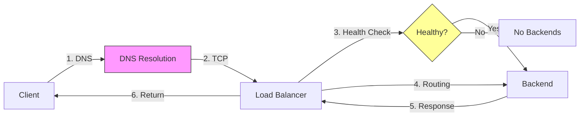
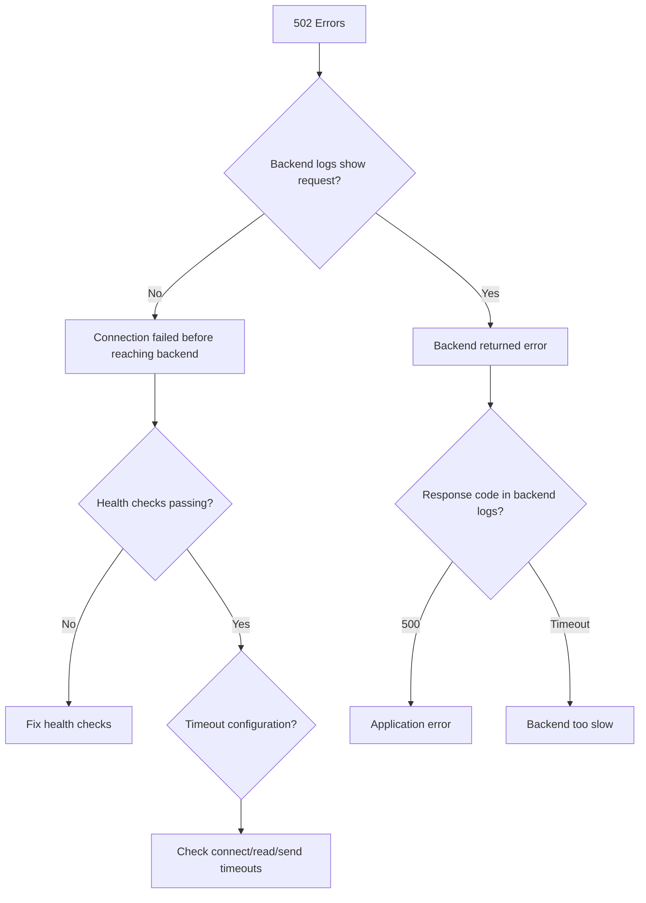
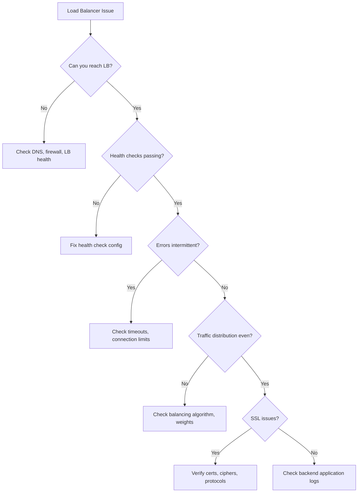

# How to Debug Load Balancer Issues

Author: [nawazdhandala](https://www.github.com/nawazdhandala)

Tags: Load Balancing, Debugging, Networking, Troubleshooting, DevOps, Observability

Description: A systematic guide to diagnosing and fixing common load balancer problems, from health check failures to connection timeouts and uneven traffic distribution.

---

Load balancers sit in the critical path of every request. When they misbehave, users see errors, latency spikes, or complete outages. The challenge is that load balancer issues often masquerade as application problems. Your backend looks healthy, your code is correct, but requests still fail. This guide provides a systematic approach to debugging load balancer issues, with real commands and configurations you can use today.

## The Debugging Mindset

Before diving into specific issues, establish a mental model of where problems can occur:



Problems can occur at each step:
1. **DNS:** Wrong IP, stale cache, missing records
2. **TCP Connection:** Firewall rules, security groups, port not listening
3. **Health Checks:** Misconfigured checks, backend unhealthy
4. **Routing:** Wrong backend selection, sticky session issues
5. **Backend Response:** Timeouts, errors, malformed responses
6. **Return Path:** Connection reset, client timeout

## Issue 1: All Backends Marked Unhealthy

Symptoms: 502 Bad Gateway, 503 Service Unavailable, or all traffic going to one server.

### Step 1: Check Health Check Configuration

```bash
# NGINX - Check upstream status
curl -s http://localhost/nginx_status

# HAProxy - Check stats page
curl -s http://localhost:8404/stats | grep -E "^app_servers"

# AWS ALB - Check target health
aws elbv2 describe-target-health \
  --target-group-arn arn:aws:elasticloadbalancing:us-east-1:123456789:targetgroup/my-targets/abc123
```

### Step 2: Test Health Check Endpoint Manually

```bash
# From the load balancer itself (or a host in the same network)
curl -v http://10.0.1.10:8080/health

# Expected output for healthy backend
# HTTP/1.1 200 OK
# Content-Type: application/json
# {"status": "healthy", "db": "connected", "cache": "connected"}
```

### Step 3: Common Health Check Fixes

```nginx
# NGINX - Increase timeout for slow health checks
upstream backend {
    server 10.0.1.10:8080;
    server 10.0.1.11:8080;

    # Health check parameters
    check interval=3000 rise=2 fall=3 timeout=2000 type=http;
    check_http_send "GET /health HTTP/1.1\r\nHost: localhost\r\nConnection: close\r\n\r\n";
    check_http_expect_alive http_2xx http_3xx;
}
```

```haproxy
# HAProxy - Configure proper health checks
backend app_servers
    option httpchk GET /health HTTP/1.1\r\nHost:\ localhost
    http-check expect status 200

    # Increase check interval and timeout
    default-server inter 3s fall 3 rise 2

    server app1 10.0.1.10:8080 check
    server app2 10.0.1.11:8080 check
```

### Step 4: Verify Network Connectivity

```bash
# Check if port is open from LB to backend
nc -zv 10.0.1.10 8080

# Check for firewall rules blocking health checks
iptables -L -n | grep 8080

# AWS - Check security group allows health check traffic
aws ec2 describe-security-groups --group-ids sg-xxx --query 'SecurityGroups[*].IpPermissions'
```

## Issue 2: Intermittent 502 Errors

Symptoms: Random 502 errors, often under load. Backend logs show no corresponding requests.

### Diagnosis Flow



### Check Timeout Configuration

```nginx
# NGINX - Timeout settings
location / {
    proxy_pass http://backend;

    # Connection timeout to backend
    proxy_connect_timeout 5s;

    # Time to wait for response headers
    proxy_read_timeout 60s;

    # Time to send request to backend
    proxy_send_timeout 60s;

    # Buffer settings
    proxy_buffer_size 4k;
    proxy_buffers 8 16k;
    proxy_busy_buffers_size 24k;
}
```

### Identify Backend Closing Connections

```bash
# Check for connection resets
tcpdump -i eth0 'tcp[tcpflags] & (tcp-rst) != 0' and host 10.0.1.10

# Monitor NGINX error logs for upstream issues
tail -f /var/log/nginx/error.log | grep -E "(upstream|502|connection)"

# Example error indicating premature connection close:
# upstream prematurely closed connection while reading response header
```

### Fix Keepalive Mismatches

```nginx
# NGINX - Enable keepalive to backends
upstream backend {
    server 10.0.1.10:8080;
    server 10.0.1.11:8080;

    # Maintain persistent connections
    keepalive 32;
    keepalive_requests 1000;
    keepalive_timeout 60s;
}

location / {
    proxy_pass http://backend;

    # Required for keepalive
    proxy_http_version 1.1;
    proxy_set_header Connection "";
}
```

## Issue 3: Uneven Traffic Distribution

Symptoms: One backend gets 80% of traffic, others are nearly idle.

### Check Current Distribution

```bash
# HAProxy - Check session counts per backend
echo "show stat" | socat stdio /var/run/haproxy.sock | cut -d',' -f1,2,8,34

# NGINX Plus - Check upstream statistics
curl -s http://localhost/api/6/http/upstreams/backend | jq '.peers[] | {server, requests, weight}'

# Count requests per backend IP in access logs
awk '{print $NF}' /var/log/nginx/access.log | sort | uniq -c | sort -rn
```

### Common Causes and Fixes

**Cause 1: Sticky Sessions Misconfigured**

```nginx
# Problem: All traffic sticks to first healthy backend
upstream backend {
    ip_hash;  # Every client always goes to same backend
    server 10.0.1.10:8080;
    server 10.0.1.11:8080;
}

# Fix: Use consistent hashing with fallback
upstream backend {
    hash $cookie_sessionid consistent;
    server 10.0.1.10:8080;
    server 10.0.1.11:8080;
}
```

**Cause 2: Weight Misconfiguration**

```haproxy
# Check weights are correct
backend app_servers
    balance roundrobin
    server app1 10.0.1.10:8080 weight 100 check
    server app2 10.0.1.11:8080 weight 100 check  # Make sure weights match
    server app3 10.0.1.12:8080 weight 100 check
```

**Cause 3: Slow Start Not Configured**

```haproxy
# New backends should ramp up gradually
backend app_servers
    balance leastconn
    server app1 10.0.1.10:8080 check slowstart 30s
    server app2 10.0.1.11:8080 check slowstart 30s
```

## Issue 4: Connection Timeouts

Symptoms: Clients report timeouts, but backend servers show normal response times.

### Diagnose Where Timeout Occurs

```bash
# Measure time to first byte from client perspective
curl -w "@curl-format.txt" -o /dev/null -s https://api.example.com/health

# curl-format.txt content:
#     time_namelookup:  %{time_namelookup}s\n
#        time_connect:  %{time_connect}s\n
#     time_appconnect:  %{time_appconnect}s\n
#    time_pretransfer:  %{time_pretransfer}s\n
#       time_redirect:  %{time_redirect}s\n
#  time_starttransfer:  %{time_starttransfer}s\n
#                     ----------\n
#          time_total:  %{time_total}s\n
```

### Check Connection Limits

```bash
# NGINX - Check worker connections
grep worker_connections /etc/nginx/nginx.conf
# Should be: worker_connections 65535;

# Check current connection count
ss -s | grep -i tcp

# Check for connection tracking table overflow (Linux)
dmesg | grep "nf_conntrack: table full"

# Increase conntrack limits if needed
sysctl -w net.netfilter.nf_conntrack_max=524288
```

### Tune Kernel Network Parameters

```bash
# /etc/sysctl.conf - Network tuning for high-traffic load balancers

# Increase socket buffers
net.core.rmem_max = 134217728
net.core.wmem_max = 134217728

# Increase backlog for incoming connections
net.core.somaxconn = 65535
net.core.netdev_max_backlog = 65535

# TCP keepalive settings
net.ipv4.tcp_keepalive_time = 600
net.ipv4.tcp_keepalive_intvl = 60
net.ipv4.tcp_keepalive_probes = 3

# Increase local port range
net.ipv4.ip_local_port_range = 1024 65535

# Faster TIME_WAIT recycling
net.ipv4.tcp_tw_reuse = 1

# Apply changes
sysctl -p
```

## Issue 5: SSL/TLS Handshake Failures

Symptoms: Connection reset during handshake, certificate errors, or "SSL_ERROR" in logs.

### Debug SSL Handshake

```bash
# Test SSL connection with verbose output
openssl s_client -connect api.example.com:443 -servername api.example.com -state -debug

# Check certificate chain
openssl s_client -connect api.example.com:443 -showcerts 2>/dev/null | openssl x509 -noout -dates -subject -issuer

# Test specific TLS versions
openssl s_client -connect api.example.com:443 -tls1_2
openssl s_client -connect api.example.com:443 -tls1_3

# Check supported ciphers
nmap --script ssl-enum-ciphers -p 443 api.example.com
```

### Common SSL Fixes

```nginx
# Ensure certificate chain is complete
ssl_certificate /etc/nginx/ssl/fullchain.pem;  # Include intermediates
ssl_certificate_key /etc/nginx/ssl/privkey.pem;

# Verify chain is valid
# cat intermediate.crt >> server.crt
```

## Issue 6: WebSocket Connection Failures

Symptoms: WebSocket connections drop, or fail to establish through the load balancer.

### Configure WebSocket Support

```nginx
# NGINX - WebSocket proxy configuration
location /ws/ {
    proxy_pass http://websocket_backend;

    # Required for WebSocket upgrade
    proxy_http_version 1.1;
    proxy_set_header Upgrade $http_upgrade;
    proxy_set_header Connection "upgrade";

    # Longer timeouts for WebSocket
    proxy_read_timeout 3600s;
    proxy_send_timeout 3600s;

    # Disable buffering for real-time
    proxy_buffering off;
}
```

```haproxy
# HAProxy - WebSocket support
frontend https_front
    bind *:443 ssl crt /etc/haproxy/certs/

    # Detect WebSocket upgrade
    acl is_websocket hdr(Upgrade) -i WebSocket

    use_backend websocket_servers if is_websocket
    default_backend http_servers

backend websocket_servers
    balance source  # Sticky for WebSocket
    timeout tunnel 3600s
    server ws1 10.0.1.10:8080 check
```

## Debugging Checklist



## Essential Debugging Commands

```bash
# Quick health check of all components
echo "=== DNS ===" && dig +short api.example.com
echo "=== TCP ===" && nc -zv api.example.com 443
echo "=== SSL ===" && echo | openssl s_client -connect api.example.com:443 2>/dev/null | grep -E "(subject|issuer|dates)"
echo "=== HTTP ===" && curl -sI https://api.example.com/health | head -5

# Watch real-time error rates
tail -f /var/log/nginx/access.log | awk '$9 >= 500 {print}'

# Monitor connection states
watch -n 1 'ss -s'

# Check load balancer memory and CPU
top -b -n 1 | head -20
```

## Setting Up Observability

To debug issues faster, instrument your load balancer:

```nginx
# NGINX - Enhanced logging
log_format detailed '$remote_addr - $remote_user [$time_local] '
                    '"$request" $status $body_bytes_sent '
                    '"$http_referer" "$http_user_agent" '
                    'rt=$request_time uct="$upstream_connect_time" '
                    'uht="$upstream_header_time" urt="$upstream_response_time" '
                    'us="$upstream_status" ua="$upstream_addr"';

access_log /var/log/nginx/access.log detailed;
```

Export metrics to your observability platform:
- Request rate by status code
- Upstream response time percentiles
- Connection pool utilization
- Health check success/failure rates
- SSL handshake time

---

Load balancer debugging requires systematic investigation across multiple layers. Start by confirming basic connectivity, then check health check configuration, verify timeout settings, and examine traffic distribution. Most issues fall into predictable categories: health checks too strict, timeouts too short, connection limits too low, or SSL misconfiguration. Build observability into your load balancer from day one. When the next incident happens, you will have the metrics and logs needed to identify the root cause in minutes instead of hours.
