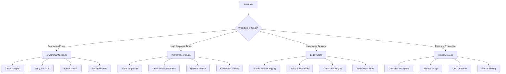
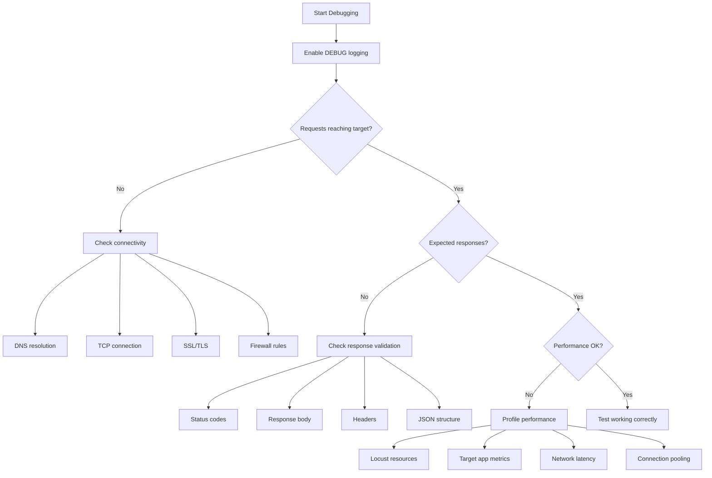

# How to Debug Locust Test Issues

Author: [nawazdhandala](https://www.github.com/nawazdhandala)

Tags: Locust, Debugging, Load Testing, Troubleshooting, Performance Testing, Python

Description: A comprehensive guide to debugging common Locust test issues including connection errors, slow performance, and unexpected failures.

---

Load tests fail for many reasons: network issues, misconfigured endpoints, resource exhaustion, or bugs in your test code. When things go wrong, systematic debugging helps you identify whether the problem lies in your test setup, the target system, or the infrastructure between them.

This guide covers debugging techniques for the most common Locust issues, from basic connection problems to complex performance anomalies.

---

## Debugging Workflow



---

## Enabling Debug Logging

Start with verbose logging to understand what Locust is doing:

```bash
# Set log level via command line
locust --loglevel=DEBUG --host=https://api.example.com

# Or via environment variable
LOCUST_LOGLEVEL=DEBUG locust --host=https://api.example.com
```

Enable detailed logging in your locustfile:

```python
# locustfile.py - Comprehensive debug logging
from locust import HttpUser, task, between, events
import logging
import sys

# Configure detailed logging
logging.basicConfig(
    level=logging.DEBUG,
    format='%(asctime)s - %(name)s - %(levelname)s - %(message)s',
    handlers=[
        logging.StreamHandler(sys.stdout),
        logging.FileHandler('locust_debug.log')
    ]
)

logger = logging.getLogger(__name__)

# Log all requests
@events.request.add_listener
def log_request(request_type, name, response_time, response_length,
                response, context, exception, start_time, url, **kwargs):
    if exception:
        logger.error(f"FAILED: {request_type} {url} - {exception}")
    else:
        logger.debug(f"SUCCESS: {request_type} {url} - {response_time:.0f}ms - {response.status_code}")

# Log user lifecycle
@events.spawning_complete.add_listener
def on_spawning_complete(user_count, **kwargs):
    logger.info(f"Spawning complete: {user_count} users active")

class DebugUser(HttpUser):
    wait_time = between(1, 2)

    def on_start(self):
        """Called when a user starts."""
        logger.info(f"User started: {id(self)}")

    def on_stop(self):
        """Called when a user stops."""
        logger.info(f"User stopped: {id(self)}")

    @task
    def debug_request(self):
        logger.debug(f"User {id(self)} making request")
        with self.client.get("/api/data", catch_response=True) as response:
            logger.debug(f"Response status: {response.status_code}")
            logger.debug(f"Response headers: {dict(response.headers)}")

            if response.status_code != 200:
                logger.error(f"Unexpected status: {response.status_code}")
                logger.error(f"Response body: {response.text[:500]}")
                response.failure(f"Got status {response.status_code}")
```

---

## Connection Issues

### Problem: Connection Refused

```python
# locustfile.py - Debug connection issues
from locust import HttpUser, task, between
import socket
import requests

class ConnectionDebugUser(HttpUser):
    wait_time = between(1, 2)

    def on_start(self):
        """Verify connectivity before starting tests."""
        # Parse host
        from urllib.parse import urlparse
        parsed = urlparse(self.host)
        hostname = parsed.hostname
        port = parsed.port or (443 if parsed.scheme == 'https' else 80)

        # DNS resolution check
        try:
            ip = socket.gethostbyname(hostname)
            print(f"DNS resolved: {hostname} -> {ip}")
        except socket.gaierror as e:
            print(f"DNS resolution failed: {e}")
            raise

        # TCP connection check
        try:
            sock = socket.socket(socket.AF_INET, socket.SOCK_STREAM)
            sock.settimeout(5)
            result = sock.connect_ex((ip, port))
            if result == 0:
                print(f"TCP connection successful: {ip}:{port}")
            else:
                print(f"TCP connection failed: {ip}:{port} - error code {result}")
            sock.close()
        except Exception as e:
            print(f"TCP connection error: {e}")

        # HTTP health check
        try:
            response = requests.get(f"{self.host}/health", timeout=10)
            print(f"Health check: {response.status_code}")
        except Exception as e:
            print(f"Health check failed: {e}")

    @task
    def make_request(self):
        self.client.get("/api/data")
```

### Problem: SSL/TLS Errors

```python
# locustfile.py - Debug SSL issues
from locust import HttpUser, task, between
import ssl
import socket

class SSLDebugUser(HttpUser):
    wait_time = between(1, 2)

    def on_start(self):
        """Check SSL certificate details."""
        from urllib.parse import urlparse
        parsed = urlparse(self.host)

        if parsed.scheme == 'https':
            hostname = parsed.hostname
            port = parsed.port or 443

            context = ssl.create_default_context()
            try:
                with socket.create_connection((hostname, port), timeout=10) as sock:
                    with context.wrap_socket(sock, server_hostname=hostname) as ssock:
                        cert = ssock.getpeercert()
                        print(f"SSL Certificate:")
                        print(f"  Subject: {cert.get('subject')}")
                        print(f"  Issuer: {cert.get('issuer')}")
                        print(f"  Not After: {cert.get('notAfter')}")
                        print(f"  Version: {ssock.version()}")
            except ssl.SSLError as e:
                print(f"SSL Error: {e}")
            except Exception as e:
                print(f"Connection Error: {e}")

    @task
    def make_request(self):
        # Disable SSL verification for testing (not for production)
        # self.client.verify = False
        self.client.get("/api/data")
```

---

## Response Validation Issues

### Problem: Unexpected Response Content

```python
# locustfile.py - Validate response content
from locust import HttpUser, task, between
import json

class ValidationUser(HttpUser):
    wait_time = between(1, 2)

    @task
    def validate_json_response(self):
        with self.client.get("/api/users", catch_response=True) as response:
            try:
                # Check status code
                if response.status_code != 200:
                    response.failure(f"Expected 200, got {response.status_code}")
                    print(f"Error response: {response.text[:200]}")
                    return

                # Parse JSON
                data = response.json()

                # Validate structure
                if not isinstance(data, list):
                    response.failure(f"Expected list, got {type(data)}")
                    print(f"Unexpected data: {data}")
                    return

                # Validate content
                if len(data) == 0:
                    response.failure("Empty response")
                    return

                # Check required fields
                for item in data[:5]:  # Check first 5 items
                    if 'id' not in item or 'name' not in item:
                        response.failure(f"Missing required fields in: {item}")
                        return

                response.success()

            except json.JSONDecodeError as e:
                response.failure(f"Invalid JSON: {e}")
                print(f"Response body: {response.text[:200]}")
            except Exception as e:
                response.failure(f"Validation error: {e}")

    @task
    def validate_with_schema(self):
        """Validate response against JSON schema."""
        from jsonschema import validate, ValidationError

        schema = {
            "type": "object",
            "required": ["id", "name", "email"],
            "properties": {
                "id": {"type": "integer"},
                "name": {"type": "string"},
                "email": {"type": "string", "format": "email"}
            }
        }

        with self.client.get("/api/user/1", catch_response=True) as response:
            if response.status_code == 200:
                try:
                    data = response.json()
                    validate(instance=data, schema=schema)
                    response.success()
                except ValidationError as e:
                    response.failure(f"Schema validation failed: {e.message}")
                    print(f"Invalid data: {data}")
                except Exception as e:
                    response.failure(str(e))
            else:
                response.failure(f"Status {response.status_code}")
```

---

## Performance Debugging

### Problem: Slow Response Times

```python
# locustfile.py - Profile request timing
from locust import HttpUser, task, between, events
import time
from collections import defaultdict

# Track timing breakdown
timing_data = defaultdict(list)

class TimingDebugUser(HttpUser):
    wait_time = between(1, 2)

    @task
    def timed_request(self):
        # Measure DNS resolution (first request only, cached after)
        import socket
        from urllib.parse import urlparse

        parsed = urlparse(self.host)
        hostname = parsed.hostname

        dns_start = time.perf_counter()
        try:
            socket.gethostbyname(hostname)
        except:
            pass
        dns_time = (time.perf_counter() - dns_start) * 1000

        # Measure full request
        request_start = time.perf_counter()
        response = self.client.get("/api/data")
        total_time = (time.perf_counter() - request_start) * 1000

        # Get timing from response if available
        if hasattr(response, 'elapsed'):
            server_time = response.elapsed.total_seconds() * 1000
        else:
            server_time = 0

        timing_data['dns'].append(dns_time)
        timing_data['total'].append(total_time)
        timing_data['server'].append(server_time)

@events.test_stop.add_listener
def print_timing_breakdown(environment, **kwargs):
    print("\n=== Timing Breakdown ===")
    for metric, values in timing_data.items():
        if values:
            avg = sum(values) / len(values)
            print(f"{metric}: avg={avg:.2f}ms, min={min(values):.2f}ms, max={max(values):.2f}ms")
```

### Problem: Locust Using Too Much CPU

```python
# locustfile.py - Monitor Locust resource usage
from locust import HttpUser, task, between, events
import psutil
import threading
import time

class ResourceMonitor:
    def __init__(self, interval=5):
        self.interval = interval
        self.running = False
        self.thread = None
        self.process = psutil.Process()

    def start(self):
        self.running = True
        self.thread = threading.Thread(target=self._monitor, daemon=True)
        self.thread.start()

    def stop(self):
        self.running = False

    def _monitor(self):
        while self.running:
            cpu = self.process.cpu_percent()
            mem = self.process.memory_info().rss / 1024 / 1024  # MB

            if cpu > 80:
                print(f"WARNING: High CPU usage: {cpu}%")
            if mem > 1000:
                print(f"WARNING: High memory usage: {mem:.0f}MB")

            # Log periodically
            print(f"Resources: CPU={cpu}%, Memory={mem:.0f}MB")
            time.sleep(self.interval)

monitor = ResourceMonitor()

@events.test_start.add_listener
def start_monitor(environment, **kwargs):
    monitor.start()

@events.test_stop.add_listener
def stop_monitor(environment, **kwargs):
    monitor.stop()

class ApiUser(HttpUser):
    wait_time = between(1, 2)

    @task
    def api_request(self):
        self.client.get("/api/data")
```

---

## Common Error Patterns

### Error: Too Many Open Files

```bash
# Check current limits
ulimit -n

# Increase limit temporarily
ulimit -n 65535

# Or permanently in /etc/security/limits.conf
# *    soft    nofile    65535
# *    hard    nofile    65535
```

Monitor file descriptors in Python:

```python
# locustfile.py - Monitor file descriptors
import os
from locust import HttpUser, task, between, events

def count_open_fds():
    """Count open file descriptors (Linux/Mac)."""
    try:
        return len(os.listdir(f'/proc/{os.getpid()}/fd'))
    except:
        # Fallback for Mac
        import subprocess
        result = subprocess.run(['lsof', '-p', str(os.getpid())],
                              capture_output=True, text=True)
        return len(result.stdout.strip().split('\n')) - 1

@events.spawning_complete.add_listener
def check_fds(user_count, **kwargs):
    fd_count = count_open_fds()
    print(f"Open file descriptors: {fd_count}")
    if fd_count > 1000:
        print("WARNING: High number of file descriptors")

class ApiUser(HttpUser):
    wait_time = between(1, 2)

    @task
    def api_request(self):
        self.client.get("/api/data")
```

### Error: Connection Pool Exhausted

```python
# locustfile.py - Configure connection pool
from locust import HttpUser, task, between
import urllib3

class PoolConfigUser(HttpUser):
    wait_time = between(1, 2)

    # Increase connection pool size
    pool_manager = urllib3.PoolManager(
        num_pools=100,
        maxsize=100,
        block=False
    )

    def on_start(self):
        # Configure session adapter
        from requests.adapters import HTTPAdapter

        adapter = HTTPAdapter(
            pool_connections=100,
            pool_maxsize=100,
            max_retries=3
        )

        self.client.mount('http://', adapter)
        self.client.mount('https://', adapter)

    @task
    def api_request(self):
        self.client.get("/api/data")
```

---

## Debugging Distributed Mode

```python
# locustfile.py - Debug distributed mode
from locust import HttpUser, task, between, events
import os

@events.init.add_listener
def on_init(environment, **kwargs):
    role = "MASTER" if environment.parsed_options.master else "WORKER"
    print(f"Locust started in {role} mode")
    print(f"Host: {environment.host}")
    print(f"PID: {os.getpid()}")

@events.worker_connect.add_listener
def on_worker_connect(client_id, message, **kwargs):
    print(f"Worker connected: {client_id}")

@events.worker_disconnect.add_listener
def on_worker_disconnect(client_id, **kwargs):
    print(f"Worker disconnected: {client_id}")

@events.report_to_master.add_listener
def on_report(client_id, data, **kwargs):
    print(f"Worker {client_id} reported: {data.get('user_count', 0)} users")

class ApiUser(HttpUser):
    wait_time = between(1, 2)

    @task
    def api_request(self):
        self.client.get("/api/data")
```

Check master-worker communication:

```bash
# On master, verify workers are connected
curl http://localhost:8089/stats/requests

# Check network connectivity between master and workers
nc -zv master-host 5557

# Monitor master logs
locust --master --loglevel=DEBUG 2>&1 | tee master.log
```

---

## Debugging Checklist



---

Systematic debugging transforms frustrating test failures into learning opportunities. Start with verbose logging to understand the request/response flow, then narrow down to specific areas based on error patterns. Most Locust issues fall into connection problems (check network/SSL), validation failures (check your assertions), or resource exhaustion (check file descriptors and memory). Keep a debug configuration handy that you can enable when issues arise, and always verify basic connectivity before diving into complex debugging scenarios.

---

OneUptime provides deep application insights that complement Locust debugging. When your load tests uncover performance issues, OneUptime's distributed tracing helps identify the exact service or database query causing the bottleneck.
