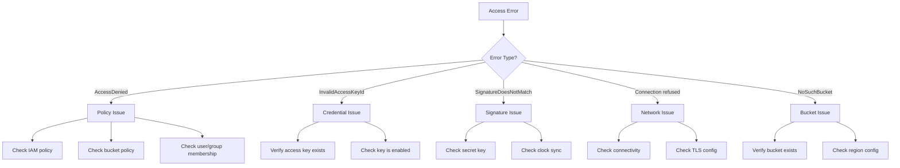
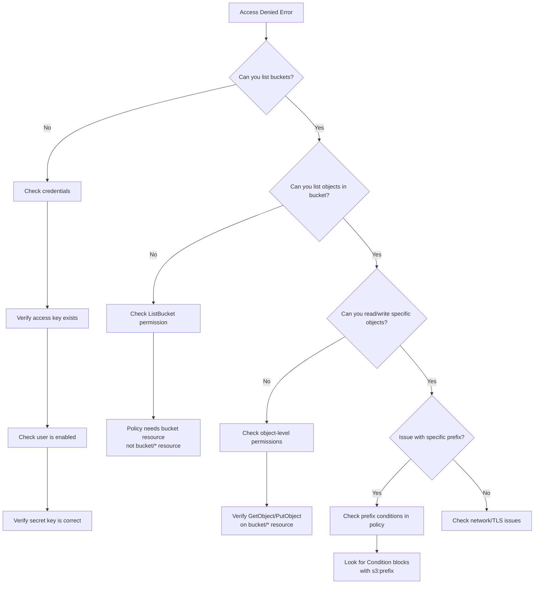

# How to Debug MinIO Access Issues

Author: [nawazdhandala](https://www.github.com/nawazdhandala)

Tags: MinIO, Object Storage, Debugging, Troubleshooting, IAM, DevOps

Description: A systematic guide to diagnosing and resolving MinIO access denied errors, policy misconfigurations, and connectivity issues.

---

Access denied errors in MinIO are frustrating because the error messages rarely tell you why access was denied. Was it the wrong credentials? A missing policy? Network issues? This guide walks through a systematic approach to diagnosing MinIO access problems.

## Common Access Error Types



## Step 1: Verify Credentials

### Check Access Key Exists

```bash
# List all users
mc admin user list myminio

# Check specific user info
mc admin user info myminio myuser

# List service accounts for a user
mc admin user svcacct list myminio myuser
```

### Verify Service Account Status

```bash
# Get service account info
mc admin user svcacct info myminio ACCESS_KEY_HERE

# Check if service account is enabled
mc admin user svcacct info myminio ACCESS_KEY_HERE --json | jq '.accountStatus'
```

### Test Credentials Directly

```bash
# Create a test alias with the problematic credentials
mc alias set testcreds http://minio.example.com:9000 ACCESS_KEY SECRET_KEY

# Try a simple operation
mc ls testcreds

# If it fails, check the error message carefully
mc ls testcreds --debug 2>&1 | head -50
```

## Step 2: Debug Policy Issues

### View Effective Policies

```bash
# Get policies attached to a user
mc admin policy entities myminio --user myuser

# Get policies attached to a group
mc admin policy entities myminio --group mygroup

# View policy content
mc admin policy info myminio policy-name
```

### Validate Policy Syntax

Common policy mistakes:

```json
{
  "Version": "2012-10-17",
  "Statement": [
    {
      "Effect": "Allow",
      "Action": [
        "s3:GetObject"
      ],
      "Resource": [
        "arn:aws:s3:::mybucket/*"
      ]
    }
  ]
}
```

Missing `ListBucket` permission is a frequent cause of access issues:

```json
{
  "Version": "2012-10-17",
  "Statement": [
    {
      "Effect": "Allow",
      "Action": [
        "s3:ListBucket"
      ],
      "Resource": [
        "arn:aws:s3:::mybucket"
      ]
    },
    {
      "Effect": "Allow",
      "Action": [
        "s3:GetObject",
        "s3:PutObject"
      ],
      "Resource": [
        "arn:aws:s3:::mybucket/*"
      ]
    }
  ]
}
```

### Policy Debugging Script

```bash
#!/bin/bash
# debug-minio-policy.sh - Check why a user cannot access a resource

MINIO_ALIAS="myminio"
USERNAME=$1
BUCKET=$2
OBJECT=$3

echo "=== Debugging access for user: $USERNAME ==="
echo "=== Target: s3://$BUCKET/$OBJECT ==="
echo

echo "1. User Info:"
mc admin user info $MINIO_ALIAS $USERNAME 2>&1

echo
echo "2. User Groups:"
mc admin group list $MINIO_ALIAS | while read group; do
  if mc admin group info $MINIO_ALIAS "$group" 2>/dev/null | grep -q "$USERNAME"; then
    echo "  - $group"
  fi
done

echo
echo "3. Attached Policies:"
mc admin policy entities $MINIO_ALIAS --user $USERNAME 2>&1

echo
echo "4. Policy Contents:"
for policy in $(mc admin policy entities $MINIO_ALIAS --user $USERNAME --json 2>/dev/null | jq -r '.result.userMappings[0].policies[]' 2>/dev/null); do
  echo "=== Policy: $policy ==="
  mc admin policy info $MINIO_ALIAS $policy 2>&1
  echo
done

echo
echo "5. Bucket Policy (if any):"
mc anonymous get-json $MINIO_ALIAS/$BUCKET 2>&1 || echo "No bucket policy set"

echo
echo "6. Testing Operations:"
echo "   ListBucket:"
mc ls $MINIO_ALIAS/$BUCKET 2>&1 | head -5

echo "   GetObject:"
mc stat $MINIO_ALIAS/$BUCKET/$OBJECT 2>&1
```

## Step 3: Check Bucket Policies

Bucket policies can override user policies:

```bash
# View bucket policy
mc anonymous get-json myminio/mybucket

# Check if bucket blocks public access
mc anonymous get myminio/mybucket
```

### Reset Bucket Policy

```bash
# Remove bucket policy
mc anonymous set none myminio/mybucket

# Set a specific bucket policy
cat > bucket-policy.json << 'EOF'
{
  "Version": "2012-10-17",
  "Statement": [
    {
      "Effect": "Allow",
      "Principal": {"AWS": ["arn:aws:iam:::user/myuser"]},
      "Action": ["s3:GetObject"],
      "Resource": ["arn:aws:s3:::mybucket/*"]
    }
  ]
}
EOF

mc anonymous set-json bucket-policy.json myminio/mybucket
```

## Step 4: Enable Debug Logging

### Client-Side Debug

```bash
# Enable debug mode in mc
mc ls myminio/mybucket --debug

# For SDKs, enable request logging
# Python example:
export MINIO_DEBUG=1
```

### Server-Side Audit Logging

Enable MinIO audit logs to see exactly what is being denied:

```bash
# Configure audit logging to console (for testing)
mc admin config set myminio audit_webhook \
  endpoint="" \
  enable="on"

# Or log to a file
mc admin config set myminio logger_webhook:audit \
  endpoint="http://localhost:8080/audit" \
  enable="on"

mc admin service restart myminio
```

### Parse Audit Logs

```bash
# Find access denied events
grep "AccessDenied" /var/log/minio/audit.log | jq '.'

# Filter by user
grep "AccessDenied" /var/log/minio/audit.log | \
  jq 'select(.requestClaims.accessKey == "PROBLEMATIC_KEY")'
```

Sample audit log entry for debugging:

```json
{
  "version": "1",
  "time": "2026-01-28T10:30:00Z",
  "api": {
    "name": "GetObject",
    "bucket": "mybucket",
    "object": "data/file.txt",
    "status": "AccessDenied",
    "statusCode": 403
  },
  "requestClaims": {
    "accessKey": "myaccesskey",
    "parent": "myuser"
  },
  "tags": {
    "policyEval": "DENY",
    "policyReason": "No matching statement"
  }
}
```

## Step 5: Network and TLS Issues

### Test Connectivity

```bash
# Basic connectivity
curl -v http://minio.example.com:9000/minio/health/live

# TLS connectivity
curl -v https://minio.example.com:9000/minio/health/live

# Check if port is open
nc -zv minio.example.com 9000
```

### Certificate Issues

```bash
# View certificate details
openssl s_client -connect minio.example.com:9000 -servername minio.example.com

# Test with specific CA bundle
curl --cacert /path/to/ca.crt https://minio.example.com:9000/minio/health/live
```

### Clock Synchronization

Signature verification fails if clocks are out of sync:

```bash
# Check time difference
date
curl -s http://minio.example.com:9000 -I | grep Date

# Fix NTP sync
sudo systemctl restart chronyd
# or
sudo ntpdate pool.ntp.org
```

## Step 6: SDK-Specific Debugging

### Python (minio-py)

```python
import logging
from minio import Minio

# Enable HTTP request/response logging
logging.basicConfig(level=logging.DEBUG)
logging.getLogger('urllib3').setLevel(logging.DEBUG)

client = Minio(
    "minio.example.com:9000",
    access_key="ACCESS_KEY",
    secret_key="SECRET_KEY",
    secure=True
)

# Test with explicit error handling
try:
    objects = client.list_objects("mybucket", prefix="data/")
    for obj in objects:
        print(obj.object_name)
except Exception as e:
    print(f"Error type: {type(e).__name__}")
    print(f"Error message: {e}")
    # For S3Error, print additional details
    if hasattr(e, 'code'):
        print(f"Error code: {e.code}")
    if hasattr(e, 'message'):
        print(f"S3 message: {e.message}")
```

### JavaScript (minio-js)

```javascript
const Minio = require('minio');

const minioClient = new Minio.Client({
  endPoint: 'minio.example.com',
  port: 9000,
  useSSL: true,
  accessKey: 'ACCESS_KEY',
  secretKey: 'SECRET_KEY'
});

// Enable request tracing
minioClient.traceOn(process.stdout);

async function debugAccess() {
  try {
    const stream = minioClient.listObjects('mybucket', 'data/', true);
    stream.on('data', obj => console.log(obj));
    stream.on('error', err => {
      console.error('Stream error:', err.code, err.message);
    });
  } catch (err) {
    console.error('Error:', err.code, err.message);
  }
}

debugAccess();
```

### Go (minio-go)

```go
package main

import (
    "context"
    "log"
    "os"

    "github.com/minio/minio-go/v7"
    "github.com/minio/minio-go/v7/pkg/credentials"
)

func main() {
    // Enable debug logging
    log.SetFlags(log.LstdFlags | log.Lshortfile)

    client, err := minio.New("minio.example.com:9000", &minio.Options{
        Creds:  credentials.NewStaticV4("ACCESS_KEY", "SECRET_KEY", ""),
        Secure: true,
    })
    if err != nil {
        log.Fatalf("Failed to create client: %v", err)
    }

    // Enable HTTP tracing
    client.TraceOn(os.Stderr)

    ctx := context.Background()

    // Test bucket access
    exists, err := client.BucketExists(ctx, "mybucket")
    if err != nil {
        log.Printf("BucketExists error: %v", err)
        // Check for specific error types
        if minio.ToErrorResponse(err).Code == "AccessDenied" {
            log.Println("Access denied - check IAM policy")
        }
    }
    log.Printf("Bucket exists: %v", exists)
}
```

## Step 7: Common Issues and Solutions

### Issue: "Access Denied" on ListBucket

**Symptom**: Can upload files but cannot list them.

**Cause**: Missing `s3:ListBucket` permission on the bucket resource.

**Fix**:
```json
{
  "Effect": "Allow",
  "Action": ["s3:ListBucket"],
  "Resource": ["arn:aws:s3:::mybucket"]
}
```

### Issue: "Access Denied" on Specific Prefix

**Symptom**: Can access `bucket/folder-a/` but not `bucket/folder-b/`.

**Cause**: Policy restricts to specific prefix.

**Debug**:
```bash
# Check policy for prefix restrictions
mc admin policy info myminio my-policy | grep -A5 -B5 "prefix"
```

### Issue: Service Account Cannot Access Parent's Buckets

**Symptom**: User works fine, but service account gets access denied.

**Cause**: Service account has more restrictive policy.

**Debug**:
```bash
# Check service account policy
mc admin user svcacct info myminio SVC_ACCESS_KEY

# Service accounts can have policies more restrictive than parent
# but cannot have broader access
```

### Issue: Intermittent Access Denied

**Symptom**: Same request sometimes works, sometimes fails.

**Causes**:
1. Multiple MinIO nodes with inconsistent IAM data
2. Policy changes propagating
3. Rate limiting

**Debug**:
```bash
# Check cluster health
mc admin info myminio

# Force IAM sync
mc admin service restart myminio

# Check for rate limits
mc admin user ratelimit info myminio myuser
```

### Issue: CORS Errors from Browser

**Symptom**: Works from CLI but fails from browser with CORS error.

**Fix**:
```bash
# Set CORS configuration
cat > cors.json << 'EOF'
{
  "CORSRules": [
    {
      "AllowedHeaders": ["*"],
      "AllowedMethods": ["GET", "PUT", "POST", "DELETE"],
      "AllowedOrigins": ["https://myapp.example.com"],
      "ExposeHeaders": ["ETag"]
    }
  ]
}
EOF

mc cors set myminio/mybucket cors.json
```

## Debugging Decision Tree



## Quick Diagnostic Commands

```bash
# One-liner to test full access
mc ls myminio && \
mc mb myminio/test-$$ && \
echo "test" | mc pipe myminio/test-$$/test.txt && \
mc cat myminio/test-$$/test.txt && \
mc rb --force myminio/test-$$ && \
echo "Full access confirmed"

# Check MinIO server logs for errors
mc admin logs myminio --last 100 | grep -i error

# Verify cluster health
mc admin info myminio

# Check IAM configuration
mc admin config get myminio identity_openid
mc admin config get myminio identity_ldap
```

---

Debugging MinIO access issues comes down to methodically checking credentials, policies, and network configuration. Start with the simplest test (can you list buckets?) and work down from there. Enable audit logging early in your debugging process since it shows exactly what MinIO evaluated and why it denied access. Most issues trace back to policy misconfigurations, specifically missing ListBucket permissions or incorrect resource ARNs.
