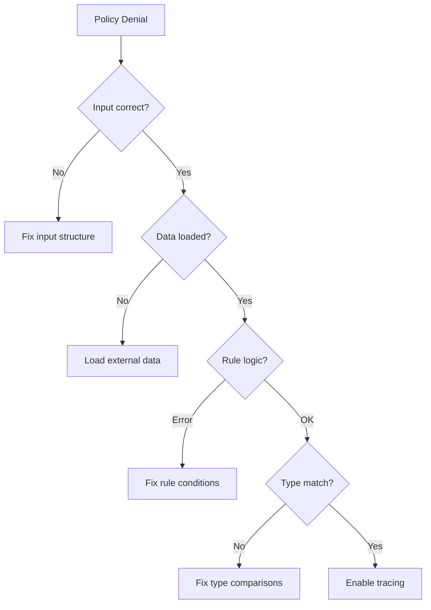
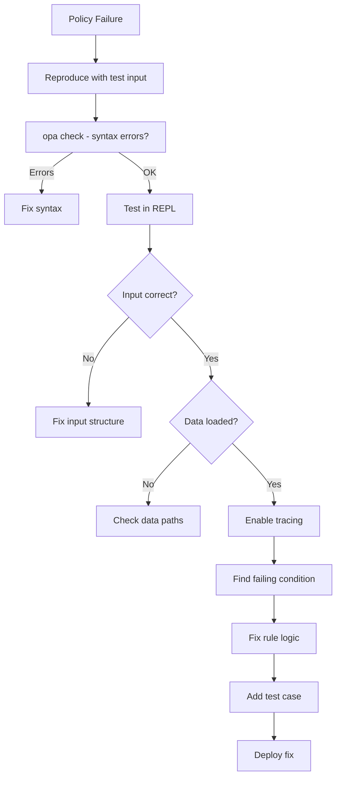

# How to Debug OPA Policy Failures

Author: [nawazdhandala](https://www.github.com/nawazdhandala)

Tags: OPA, Debugging, Troubleshooting, Rego, Policy-as-Code, DevOps

Description: A practical guide to debugging OPA policy failures using tracing, print statements, the REPL, and systematic troubleshooting techniques.

---

OPA policies fail silently by design - a rule that does not match simply does not contribute to the result. This makes debugging challenging. This guide covers systematic approaches to finding why policies are not behaving as expected.

## Common Failure Modes

Before diving into tools, understand the typical reasons policies fail:

1. **Input mismatch**: The input structure does not match what the policy expects
2. **Data not loaded**: External data is missing or has different structure
3. **Rule logic errors**: Conditions that can never be true
4. **Type mismatches**: Comparing strings to numbers, arrays to objects
5. **Undefined references**: Accessing fields that do not exist



## Using Print Statements

The simplest debugging technique. Add `print()` calls to see intermediate values.

### Basic Print Debugging

```rego
# debug_policy.rego
package authz

import rego.v1

default allow := false

allow if {
    # Print the entire input to see what we're receiving
    print("Input received:", input)

    # Print user info
    print("User ID:", input.user.id)
    print("User roles:", input.user.roles)

    # Print what we're looking for
    print("Looking for action:", input.action)
    print("On resource:", input.resource)

    # Check each condition
    role := input.user.roles[_]
    print("Checking role:", role)

    permission := data.permissions[role][_]
    print("Found permission:", permission)

    permission.action == input.action
    permission.resource == input.resource

    print("Match found!")
}
```

Run with print output enabled:

```bash
# Enable print statements in server mode
opa run --server --set=decision_logs.console=true

# Or run a single evaluation with prints
echo '{"user": {"roles": ["viewer"]}, "action": "read", "resource": "docs"}' | \
  opa eval -b ./policy -I -f pretty 'data.authz.allow'
```

### Conditional Printing

Print only when certain conditions are met:

```rego
package authz

import rego.v1

default allow := false

allow if {
    some role in input.user.roles

    # Only print when checking admin role
    role == "admin"
    print("Admin role detected for user:", input.user.id)

    true  # Admin gets full access
}

allow if {
    some role in input.user.roles

    # Print denials for debugging
    not data.permissions[role]
    print("WARNING: Unknown role:", role)

    false  # This rule never allows
}
```

## Using OPA's Trace Feature

Tracing shows exactly how OPA evaluates your policy.

### Enable Tracing via API

```bash
curl -X POST http://localhost:8181/v1/data/authz/allow \
  -H "Content-Type: application/json" \
  -d '{
    "input": {
      "user": {"id": "user1", "roles": ["viewer"]},
      "action": "delete",
      "resource": "documents"
    }
  }' \
  --url-query 'explain=full'
```

### Trace Output Example

```
Enter data.authz.allow = _
| Eval data.authz.allow = _
| Index data.authz.allow (matched 1 rule)
| Enter data.authz.allow
| | Eval input.user.roles[_] = role
| | Eval role = "viewer"
| | Eval data.permissions["viewer"][_] = permission
| | Eval permission = {"action": "read", "resource": "documents"}
| | Eval permission.action == input.action
| | Eval "read" == "delete"
| | Fail "read" == "delete"
| | Redo data.permissions["viewer"][_] = permission
| | Eval permission = {"action": "read", "resource": "users"}
| | Fail permission.action == input.action
| Fail data.authz.allow
Exit data.authz.allow = undefined
```

This shows the viewer role has read permissions, but the request was for delete - hence the failure.

### Programmatic Tracing

```javascript
// Node.js example
const axios = require('axios');

async function debugPolicy(input) {
    const response = await axios.post(
        'http://localhost:8181/v1/data/authz/allow',
        { input },
        {
            params: { explain: 'full' },
            headers: { 'Content-Type': 'application/json' }
        }
    );

    console.log('Result:', response.data.result);
    console.log('Explanation:', JSON.stringify(response.data.explanation, null, 2));
}
```

## The OPA REPL

Interactive debugging is powerful for exploring policy behavior.

### Start the REPL

```bash
# Load policies and data
opa run ./policies ./data

# Or connect to a running server
opa run --server &
opa run -s http://localhost:8181
```

### REPL Debugging Session

```
OPA 0.60.0 (commit abcdef)

Run 'help' to see a list of commands.

> # Load your test input
> input := {"user": {"id": "u1", "roles": ["viewer"]}, "action": "delete", "resource": "docs"}

> # Check what data is available
> data.permissions
{
  "admin": [{"action": "read", "resource": "docs"}, {"action": "delete", "resource": "docs"}],
  "viewer": [{"action": "read", "resource": "docs"}]
}

> # Test the allow rule
> data.authz.allow
undefined

> # Check partial evaluations
> data.authz.allow with input.action as "read"
true

> # Inspect intermediate values
> [role | role := input.user.roles[_]]
["viewer"]

> # Check what permissions exist for the user's roles
> [p | role := input.user.roles[_]; p := data.permissions[role][_]]
[{"action": "read", "resource": "docs"}]

> # Now we see the issue - viewer has no delete permission
```

## Systematic Debugging Checklist

### Step 1: Verify Input Structure

```rego
# debug_input.rego
package debug

import rego.v1

# Show input structure
input_keys := object.keys(input)
user_keys := object.keys(input.user) if input.user
has_roles := is_array(input.user.roles) if input.user.roles
role_count := count(input.user.roles) if input.user.roles
```

Test:

```bash
echo '{"user": {"roles": ["admin"]}}' | \
  opa eval -b . -I 'data.debug'
```

### Step 2: Verify Data is Loaded

```rego
# debug_data.rego
package debug

import rego.v1

# Check data structure
permissions_loaded := count(data.permissions) > 0
permission_keys := object.keys(data.permissions)
sample_permission := data.permissions[object.keys(data.permissions)[0]][0]
```

### Step 3: Test Individual Conditions

Break complex rules into testable parts:

```rego
# original rule
allow if {
    role := input.user.roles[_]
    permission := data.permissions[role][_]
    permission.action == input.action
    permission.resource == input.resource
}

# debug version - test each condition
debug_step1 := [role | role := input.user.roles[_]]
debug_step2 := [p | role := input.user.roles[_]; p := data.permissions[role]]
debug_step3 := [p | role := input.user.roles[_]; p := data.permissions[role][_]]
debug_step4 := [p |
    role := input.user.roles[_]
    p := data.permissions[role][_]
    p.action == input.action
]
debug_step5 := [p |
    role := input.user.roles[_]
    p := data.permissions[role][_]
    p.action == input.action
    p.resource == input.resource
]
```

## Common Debugging Scenarios

### Scenario 1: Rule Never Matches

**Symptom**: `allow` is always `undefined`

**Debug approach**:

```rego
# Add a catch-all to see if rules are being evaluated
allow if {
    print("Evaluating allow rule")
    # ... conditions
    print("All conditions passed")
}

# If "Evaluating allow rule" never prints, check that:
# 1. Package name matches query path
# 2. File is being loaded
# 3. No syntax errors (run opa check)
```

### Scenario 2: Wrong Data Path

**Symptom**: Data lookups return `undefined`

```rego
# Wrong
permission := data.role_permissions[role]

# Debug - check actual path
debug_data_paths if {
    print("data keys:", object.keys(data))
    print("Looking for role:", role)
    print("data.role_permissions:", data.role_permissions)
    print("data.permissions:", data.permissions)  # Maybe it's here?
}
```

### Scenario 3: Type Mismatch

**Symptom**: Comparison always fails

```rego
# The input might have port as string "80"
# But you're comparing to number 80

allow if {
    input.port == 80  # Fails if input.port is "80"
}

# Debug with type checking
debug_types if {
    print("port value:", input.port)
    print("port type:", type_name(input.port))
}

# Fix with type conversion
allow if {
    to_number(input.port) == 80
}
```

### Scenario 4: Array vs Set Confusion

**Symptom**: Membership checks fail unexpectedly

```rego
# This checks if "admin" is a KEY in roles (treating it as object)
"admin" == input.user.roles[_]  # Iteration

# For membership in arrays, use 'in'
"admin" in input.user.roles

# Debug
debug_roles if {
    print("roles:", input.user.roles)
    print("roles type:", type_name(input.user.roles))
    print("is array:", is_array(input.user.roles))
    print("admin in roles:", "admin" in input.user.roles)
}
```

## Testing Policies

Write tests to catch issues early:

```rego
# policy_test.rego
package authz_test

import rego.v1

import data.authz

# Test basic allow
test_admin_can_delete if {
    authz.allow with input as {
        "user": {"id": "admin1", "roles": ["admin"]},
        "action": "delete",
        "resource": "documents"
    }
    with data.permissions as {
        "admin": [{"action": "delete", "resource": "documents"}]
    }
}

# Test deny case
test_viewer_cannot_delete if {
    not authz.allow with input as {
        "user": {"id": "viewer1", "roles": ["viewer"]},
        "action": "delete",
        "resource": "documents"
    }
    with data.permissions as {
        "viewer": [{"action": "read", "resource": "documents"}]
    }
}

# Test edge cases
test_empty_roles_denied if {
    not authz.allow with input as {
        "user": {"id": "nobody", "roles": []},
        "action": "read",
        "resource": "documents"
    }
}

test_missing_user_denied if {
    not authz.allow with input as {
        "action": "read",
        "resource": "documents"
    }
}
```

Run tests:

```bash
opa test ./policies -v
```

## VS Code Debugging

Use the OPA VS Code extension for interactive debugging:

1. Install "Open Policy Agent" extension
2. Create `.vscode/settings.json`:

```json
{
  "opa.roots": ["${workspaceFolder}/policies"],
  "opa.bundleMode": true
}
```

3. Use "OPA: Evaluate Selection" to test snippets
4. Hover over variables to see values

## Debugging Decision Logs

When debugging production issues, analyze decision logs:

```bash
# Find denied requests for a specific user
jq 'select(.result == false and .input.user.id == "user123")' decisions.log

# Find all requests for a specific resource
jq 'select(.input.resource == "sensitive-data")' decisions.log

# Get timing information for slow evaluations
jq 'select(.metrics.timer_rego_query_eval_ns > 1000000)' decisions.log
```

## Debug Workflow



---

Debugging OPA requires methodical investigation. Start with print statements for quick insights, use tracing for complex logic, and leverage the REPL for interactive exploration. Most importantly, write tests for every bug you fix so it never comes back.
