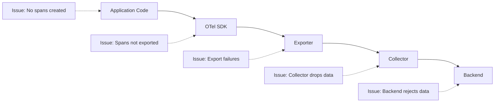
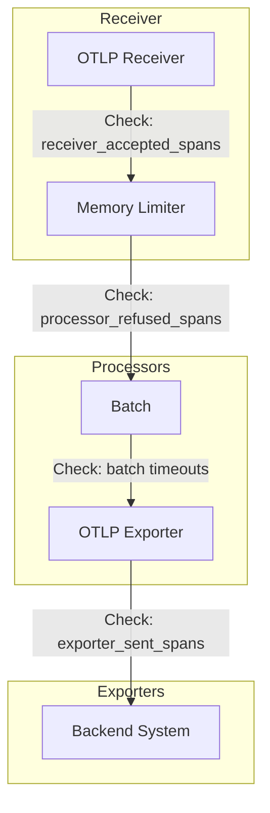
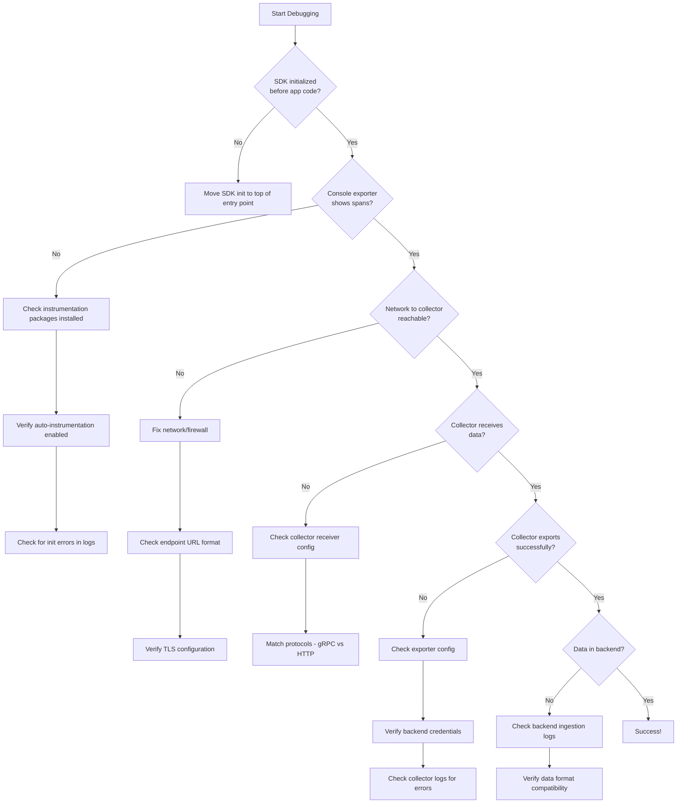

# How to Debug OpenTelemetry Instrumentation Issues

Author: [nawazdhandala](https://www.github.com/nawazdhandala)

Tags: OpenTelemetry, Debugging, Troubleshooting, Instrumentation, Observability, Tracing, Collector

Description: A comprehensive troubleshooting guide for diagnosing and fixing common OpenTelemetry instrumentation issues, from missing spans to configuration problems.

---

You've instrumented your application with OpenTelemetry, but something isn't working. Maybe spans are missing, traces are broken, or nothing shows up in your backend at all. Debugging instrumentation issues can be frustrating without a systematic approach.

This guide covers the most common problems and provides concrete steps to diagnose and fix them.

## The Debugging Mindset

Before diving into specific issues, understand the telemetry data flow:



Problems can occur at any stage. Start by identifying where the breakdown happens.

## Issue 1: No Telemetry Data at All

This is the most common starting point. Nothing shows up in your backend.

### Step 1: Verify SDK Initialization

The SDK must be initialized before any instrumented code runs.

```javascript
// WRONG: Instrumentation imported after app code
const express = require('express');
const app = express();
app.listen(3000);

// Oops, this runs too late
require('./tracing');
```

```javascript
// CORRECT: Instrumentation must be first
// tracing.js - import this at the very top of your entry point
const { NodeSDK } = require('@opentelemetry/sdk-node');
const { getNodeAutoInstrumentations } = require('@opentelemetry/auto-instrumentations-node');
const { OTLPTraceExporter } = require('@opentelemetry/exporter-trace-otlp-http');
const { diag, DiagConsoleLogger, DiagLogLevel } = require('@opentelemetry/api');

// Enable diagnostic logging to see what's happening
diag.setLogger(new DiagConsoleLogger(), DiagLogLevel.DEBUG);

const sdk = new NodeSDK({
  traceExporter: new OTLPTraceExporter({
    url: process.env.OTEL_EXPORTER_OTLP_ENDPOINT || 'http://localhost:4318/v1/traces'
  }),
  instrumentations: [getNodeAutoInstrumentations()]
});

sdk.start();

// Now your app code
const express = require('express');
// ...
```

For Python, use auto-instrumentation at startup:

```bash
# Run with auto-instrumentation
opentelemetry-instrument --service_name my-service python app.py

# Or initialize manually at the top of your entry point
```

```python
# app.py - SDK init must be at the very top
from opentelemetry import trace
from opentelemetry.sdk.trace import TracerProvider
from opentelemetry.sdk.trace.export import BatchSpanProcessor, ConsoleSpanExporter
from opentelemetry.exporter.otlp.proto.http.trace_exporter import OTLPSpanExporter

# Enable debug logging
import logging
logging.basicConfig(level=logging.DEBUG)

# Initialize before importing Flask/FastAPI/etc
provider = TracerProvider()
provider.add_span_processor(BatchSpanProcessor(OTLPSpanExporter()))
provider.add_span_processor(BatchSpanProcessor(ConsoleSpanExporter()))  # Debug output
trace.set_tracer_provider(provider)

# NOW import your framework
from flask import Flask
app = Flask(__name__)
```

### Step 2: Add Console Exporter for Debugging

Always add a console exporter during debugging:

```javascript
// Node.js: Add console exporter
const { ConsoleSpanExporter } = require('@opentelemetry/sdk-trace-base');

const sdk = new NodeSDK({
  traceExporter: new OTLPTraceExporter(),
  spanProcessors: [
    new SimpleSpanProcessor(new ConsoleSpanExporter())  // Prints to stdout
  ],
  instrumentations: [getNodeAutoInstrumentations()]
});
```

```go
// Go: Add stdout exporter
import (
    "go.opentelemetry.io/otel/exporters/stdout/stdouttrace"
    "go.opentelemetry.io/otel/sdk/trace"
)

stdoutExporter, _ := stdouttrace.New(stdouttrace.WithPrettyPrint())
tp := trace.NewTracerProvider(
    trace.WithBatcher(otlpExporter),
    trace.WithSyncer(stdoutExporter),  // Immediate output for debugging
)
```

If spans appear in the console but not your backend, the issue is in the export path.

### Step 3: Check Environment Variables

OpenTelemetry uses environment variables extensively. Common issues:

```bash
# Check these are set correctly
echo $OTEL_EXPORTER_OTLP_ENDPOINT    # Should be http://host:port
echo $OTEL_SERVICE_NAME               # Must be set for most backends
echo $OTEL_TRACES_EXPORTER            # Default is 'otlp'

# Common mistakes:
# - Missing http:// or https:// prefix
# - Wrong port (4317 for gRPC, 4318 for HTTP)
# - Trailing slash causing issues
```

```bash
# Correct examples:
export OTEL_EXPORTER_OTLP_ENDPOINT="http://localhost:4318"
export OTEL_SERVICE_NAME="my-service"
export OTEL_TRACES_EXPORTER="otlp"

# For debugging, enable verbose logging
export OTEL_LOG_LEVEL="debug"
```

## Issue 2: Missing or Broken Spans

Some spans appear but others are missing, or spans aren't connected properly.

### Diagnose Context Propagation

Context propagation is the mechanism that connects spans across services and async boundaries.

```javascript
// Check if context is being propagated
const { trace, context } = require('@opentelemetry/api');

function debugContext() {
  const currentSpan = trace.getSpan(context.active());
  if (currentSpan) {
    const spanContext = currentSpan.spanContext();
    console.log('Active span:', {
      traceId: spanContext.traceId,
      spanId: spanContext.spanId,
      traceFlags: spanContext.traceFlags
    });
  } else {
    console.log('WARNING: No active span in context');
  }
}

// Call this in your request handlers to verify context exists
app.get('/api/test', (req, res) => {
  debugContext();  // Should show active span from HTTP instrumentation
  // ...
});
```

### Fix Async Context Loss

Async operations can lose context if not handled properly:

```javascript
// WRONG: Context lost in callback
app.get('/api/users', (req, res) => {
  // Span exists here
  setTimeout(() => {
    // Context may be lost here!
    db.query('SELECT * FROM users');
  }, 100);
});

// CORRECT: Preserve context explicitly
const { context } = require('@opentelemetry/api');

app.get('/api/users', (req, res) => {
  const currentContext = context.active();

  setTimeout(() => {
    context.with(currentContext, () => {
      // Context preserved
      db.query('SELECT * FROM users');
    });
  }, 100);
});

// BETTER: Use context.bind for callbacks
app.get('/api/users', (req, res) => {
  setTimeout(
    context.bind(context.active(), () => {
      db.query('SELECT * FROM users');
    }),
    100
  );
});
```

### Fix Missing Spans in Promises

```javascript
// If using older Node.js versions, ensure async hooks work correctly
const { AsyncHooksContextManager } = require('@opentelemetry/context-async-hooks');
const { context } = require('@opentelemetry/api');

// Set up async context manager
const contextManager = new AsyncHooksContextManager();
contextManager.enable();
context.setGlobalContextManager(contextManager);
```

### Python: Fix Async Context Issues

```python
# For async Python (asyncio), context propagation should work automatically
# But verify it's set up correctly

import asyncio
from opentelemetry import trace, context
from opentelemetry.context import attach, detach

async def debug_async_context():
    span = trace.get_current_span()
    if span.is_recording():
        ctx = span.get_span_context()
        print(f"Async context OK: trace_id={ctx.trace_id:032x}")
    else:
        print("WARNING: No active span in async context")

# If context is lost, manually propagate it
async def process_with_context(ctx):
    token = attach(ctx)
    try:
        # Your async code here
        await do_work()
    finally:
        detach(token)

# Call with explicit context
current_ctx = context.get_current()
asyncio.create_task(process_with_context(current_ctx))
```

## Issue 3: Export Failures

Spans are created but never reach your backend.

### Enable Export Debugging

```javascript
// Node.js: Debug OTLP exporter
const { diag, DiagConsoleLogger, DiagLogLevel } = require('@opentelemetry/api');

// Set to DEBUG to see export attempts
diag.setLogger(new DiagConsoleLogger(), DiagLogLevel.DEBUG);

// You'll see output like:
// @opentelemetry/otlp-exporter-base: Exporting 5 span(s)
// @opentelemetry/otlp-exporter-base: Export success
// or
// @opentelemetry/otlp-exporter-base: Export failed: connect ECONNREFUSED
```

### Test Network Connectivity

```bash
# Test if the collector/backend is reachable
curl -v http://localhost:4318/v1/traces \
  -H "Content-Type: application/json" \
  -d '{"resourceSpans":[]}'

# Expected: 200 OK or 400 Bad Request (endpoint exists)
# Problem: Connection refused, timeout, or 404
```

### Common Export Configuration Errors

```javascript
// WRONG: Missing protocol in endpoint
const exporter = new OTLPTraceExporter({
  url: 'localhost:4318/v1/traces'  // Missing http://
});

// WRONG: Using gRPC port with HTTP exporter
const exporter = new OTLPTraceExporter({
  url: 'http://localhost:4317/v1/traces'  // 4317 is gRPC, use 4318 for HTTP
});

// WRONG: Missing path for HTTP exporter
const exporter = new OTLPTraceExporter({
  url: 'http://localhost:4318'  // Missing /v1/traces
});

// CORRECT
const exporter = new OTLPTraceExporter({
  url: 'http://localhost:4318/v1/traces'
});
```

### Handle TLS/Certificate Issues

```javascript
// For HTTPS endpoints with self-signed certs
const https = require('https');

const exporter = new OTLPTraceExporter({
  url: 'https://collector.internal:4318/v1/traces',
  httpAgentOptions: {
    rejectUnauthorized: false  // Only for testing!
  }
});

// For production, provide the CA certificate
const exporter = new OTLPTraceExporter({
  url: 'https://collector.internal:4318/v1/traces',
  httpAgentOptions: {
    ca: fs.readFileSync('/path/to/ca-cert.pem')
  }
});
```

## Issue 4: Collector Problems

The Collector receives data but doesn't forward it correctly.

### Enable Collector Debug Logging

```yaml
# collector-config.yaml
service:
  telemetry:
    logs:
      level: debug  # Enable verbose logging

  pipelines:
    traces:
      receivers: [otlp]
      processors: [batch]
      exporters: [otlphttp, logging]  # Add logging exporter

exporters:
  logging:
    verbosity: detailed  # See full span data
```

### Check Collector Metrics

```yaml
# Enable internal metrics
service:
  telemetry:
    metrics:
      level: detailed
      address: 0.0.0.0:8888
```

```bash
# Query collector metrics
curl http://localhost:8888/metrics | grep -E "(received|exported|dropped)"

# Key metrics to check:
# otelcol_receiver_accepted_spans - spans received
# otelcol_exporter_sent_spans - spans exported
# otelcol_processor_dropped_spans - spans dropped
# otelcol_exporter_send_failed_spans - export failures
```

### Debug Collector Pipeline Flow



### Common Collector Configuration Mistakes

```yaml
# WRONG: Processor not in pipeline
processors:
  batch:
    send_batch_size: 512

service:
  pipelines:
    traces:
      receivers: [otlp]
      processors: []  # batch processor not included!
      exporters: [otlphttp]

# WRONG: Exporter endpoint missing protocol
exporters:
  otlphttp:
    endpoint: oneuptime.com/otlp  # Missing https://

# WRONG: Wrong content type for JSON encoding
exporters:
  otlphttp:
    endpoint: "https://oneuptime.com/otlp"
    encoding: json
    # Missing required header for JSON

# CORRECT
exporters:
  otlphttp:
    endpoint: "https://oneuptime.com/otlp"
    encoding: json
    headers:
      "Content-Type": "application/json"
      "x-oneuptime-token": "${ONEUPTIME_TOKEN}"
```

## Issue 5: Sampling Problems

Traces appear intermittently or important spans are missing.

### Understand Your Sampling Configuration

```javascript
// Check what sampler is active
const { NodeSDK } = require('@opentelemetry/sdk-node');
const {
  ParentBasedSampler,
  TraceIdRatioBasedSampler,
  AlwaysOnSampler
} = require('@opentelemetry/sdk-trace-base');

// For debugging, use AlwaysOnSampler
const sdk = new NodeSDK({
  sampler: new AlwaysOnSampler(),  // 100% sampling for debugging
  // ...
});

// Production: Use ratio-based with parent-based wrapper
const sdk = new NodeSDK({
  sampler: new ParentBasedSampler({
    root: new TraceIdRatioBasedSampler(0.1)  // 10% of new traces
  }),
  // ...
});
```

### Debug Sampling Decisions

```javascript
// Create a custom sampler that logs decisions
const { Sampler, SamplingDecision } = require('@opentelemetry/sdk-trace-base');

class DebuggingSampler {
  constructor(innerSampler) {
    this.innerSampler = innerSampler;
  }

  shouldSample(context, traceId, spanName, spanKind, attributes, links) {
    const result = this.innerSampler.shouldSample(
      context, traceId, spanName, spanKind, attributes, links
    );

    console.log(`Sampling decision for ${spanName}:`, {
      traceId,
      decision: SamplingDecision[result.decision],
      attributes: result.attributes
    });

    return result;
  }

  toString() {
    return `DebuggingSampler(${this.innerSampler.toString()})`;
  }
}

// Use it
const sdk = new NodeSDK({
  sampler: new DebuggingSampler(new TraceIdRatioBasedSampler(0.1)),
  // ...
});
```

### Check Collector Sampling

If you're using tail-based sampling in the Collector:

```yaml
# Verify tail_sampling configuration
processors:
  tail_sampling:
    decision_wait: 10s
    num_traces: 100000
    policies:
      - name: always-sample-errors
        type: status_code
        status_code:
          status_codes: [ERROR]
      - name: probabilistic
        type: probabilistic
        probabilistic:
          sampling_percentage: 10

# Add debug output
exporters:
  logging:
    verbosity: detailed

service:
  pipelines:
    traces:
      processors: [tail_sampling]
      exporters: [otlphttp, logging]  # See what gets through
```

## Issue 6: Attribute and Resource Problems

Spans appear but are missing expected attributes or have wrong values.

### Debug Resource Attributes

```javascript
const { Resource } = require('@opentelemetry/resources');
const { SemanticResourceAttributes } = require('@opentelemetry/semantic-conventions');

// Verify resource is set correctly
const resource = new Resource({
  [SemanticResourceAttributes.SERVICE_NAME]: 'my-service',
  [SemanticResourceAttributes.SERVICE_VERSION]: '1.0.0',
  [SemanticResourceAttributes.DEPLOYMENT_ENVIRONMENT]: 'production'
});

console.log('Resource attributes:', resource.attributes);

const sdk = new NodeSDK({
  resource: resource,
  // ...
});
```

### Check Attribute Limits

```javascript
// OpenTelemetry has limits on attributes
const { SpanLimits } = require('@opentelemetry/sdk-trace-base');

// Default limits
console.log('Default span limits:', {
  attributeValueLengthLimit: 'unlimited',
  attributeCountLimit: 128,
  eventCountLimit: 128,
  linkCountLimit: 128
});

// Custom limits
const sdk = new NodeSDK({
  spanLimits: {
    attributeValueLengthLimit: 1000,
    attributeCountLimit: 64  // Reduce if you're adding too many
  },
  // ...
});
```

### Debug Missing Span Attributes

```javascript
// Manually verify attributes are being set
const tracer = trace.getTracer('debug');

const span = tracer.startSpan('test-span', {
  attributes: {
    'initial.attr': 'value'
  }
});

// Add more attributes
span.setAttribute('another.attr', 'value2');
span.setAttribute('numeric.attr', 42);

// Log current attributes (for debugging only)
// Note: This is internal API and may change
console.log('Span attributes:', span.attributes);

span.end();
```

## Debugging Checklist

When nothing seems to work, go through this checklist:



## Quick Diagnostic Commands

```bash
# Check if OTel environment variables are set
env | grep OTEL

# Test collector health
curl http://localhost:13133/  # health check extension

# Check collector metrics
curl -s http://localhost:8888/metrics | grep otelcol

# View collector logs in real-time
docker logs -f otel-collector 2>&1 | grep -E "(error|warn|span)"

# Test OTLP endpoint directly
curl -X POST http://localhost:4318/v1/traces \
  -H "Content-Type: application/json" \
  -d '{"resourceSpans":[]}' \
  -w "\nHTTP Status: %{http_code}\n"

# For gRPC, use grpcurl
grpcurl -plaintext localhost:4317 list
```

---

Debugging OpenTelemetry instrumentation requires patience and a systematic approach. Start from the application and work your way through the pipeline, using console exporters and debug logging at each stage. Most issues come down to initialization order, network configuration, or context propagation. Once you understand the data flow, diagnosing problems becomes straightforward.
