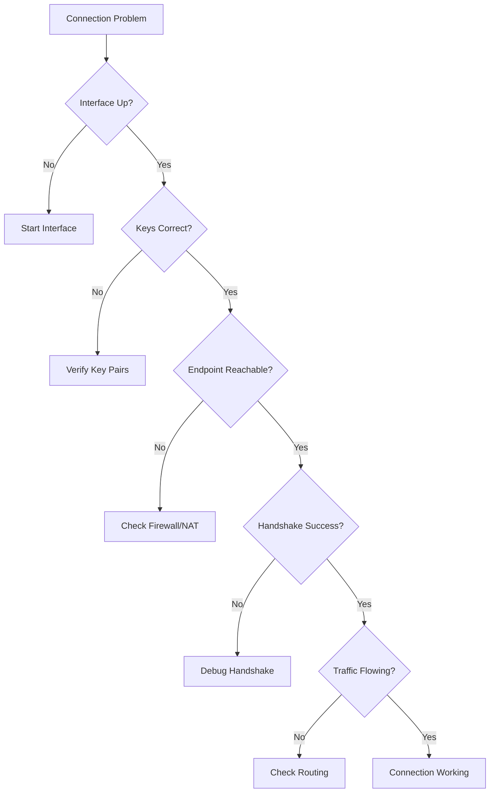
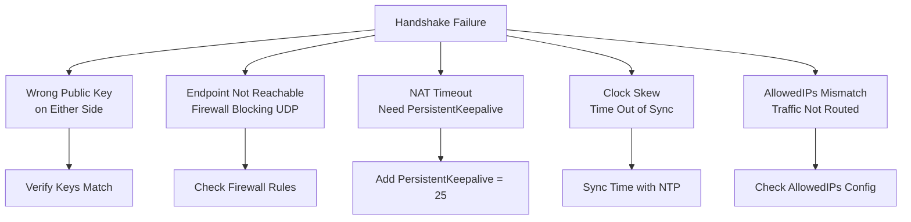

# How to Debug WireGuard Connection Issues

Author: [nawazdhandala](https://www.github.com/nawazdhandala)

Tags: WireGuard, VPN, Debugging, Troubleshooting, Networking, Security

Description: A systematic approach to diagnosing and fixing common WireGuard VPN connection problems including handshake failures, routing issues, and NAT traversal.

---

WireGuard is simple, but that does not mean things never break. When connections fail, you need a systematic approach to find the problem. This guide walks through common WireGuard issues and how to fix them, from basic connectivity problems to complex NAT traversal failures.

## Debugging Workflow

Follow this workflow when troubleshooting WireGuard connections.



## Step 1: Verify Interface Status

Start by checking if the WireGuard interface exists and is configured.

```bash
# Check if interface exists
ip link show wg0

# If not found, the interface is not up
# Expected output:
# 4: wg0: <POINTOPOINT,NOARP,UP,LOWER_UP> mtu 1420 qdisc noqueue state UNKNOWN

# Check interface IP address
ip addr show wg0

# Check WireGuard configuration
sudo wg show wg0

# If interface does not exist, bring it up
sudo wg-quick up wg0

# Check for configuration errors
sudo wg-quick up wg0 2>&1
```

### Common Interface Issues

```bash
# Error: RTNETLINK answers: Operation not permitted
# Solution: Run with sudo or check capabilities

# Error: Unable to access interface: Protocol not supported
# Solution: Load WireGuard kernel module
sudo modprobe wireguard
lsmod | grep wireguard

# Error: Configuration file does not exist
# Solution: Create /etc/wireguard/wg0.conf
ls -la /etc/wireguard/
```

## Step 2: Verify Key Configuration

Mismatched or incorrect keys are a common cause of connection failures.

```bash
# View your public key
sudo wg show wg0 public-key

# Compare with what the peer has configured
# Ask the remote admin to verify they have your correct public key

# Regenerate keys if compromised or lost
wg genkey | tee privatekey | wg pubkey > publickey

# Verify key format (should be 44 characters, base64)
cat privatekey | wc -c  # Should be 45 (44 + newline)
```

### Key Verification Script

```bash
#!/bin/bash
# verify-keys.sh - Check WireGuard key configuration

echo "=== Local Configuration ==="
echo "Public Key: $(sudo wg show wg0 public-key)"
echo ""

echo "=== Peer Configuration ==="
sudo wg show wg0 peers

echo ""
echo "=== Key Validation ==="

# Check if private key is valid
PRIVKEY=$(sudo cat /etc/wireguard/wg0.conf | grep PrivateKey | awk '{print $3}')
if [ ${#PRIVKEY} -eq 44 ]; then
    echo "Private key length: OK (44 chars)"
else
    echo "Private key length: ERROR (${#PRIVKEY} chars, expected 44)"
fi

# Derive public key from private key and compare
DERIVED_PUBKEY=$(echo "$PRIVKEY" | wg pubkey)
CONFIGURED_PUBKEY=$(sudo wg show wg0 public-key)

if [ "$DERIVED_PUBKEY" == "$CONFIGURED_PUBKEY" ]; then
    echo "Key pair: VALID"
else
    echo "Key pair: MISMATCH - private key does not match public key"
fi
```

## Step 3: Test Network Connectivity

Verify basic network connectivity to the remote endpoint.

```bash
# Get the endpoint address
sudo wg show wg0 endpoints

# Test UDP connectivity to endpoint
# Note: WireGuard does not respond to probes, but you can check if port is blocked

# Check if UDP packets can reach the endpoint
nc -vzu remote-vpn.example.com 51820

# Test with actual UDP packet
echo "test" | nc -u -w 2 remote-vpn.example.com 51820

# Trace the route
traceroute -U -p 51820 remote-vpn.example.com

# Check for packet loss
mtr -u -P 51820 remote-vpn.example.com
```

### Firewall Verification

```bash
# Check local firewall allows WireGuard traffic
# Using iptables
sudo iptables -L -n | grep 51820
sudo iptables -L INPUT -n --line-numbers

# Using ufw
sudo ufw status verbose | grep 51820

# Using firewalld
sudo firewall-cmd --list-all | grep 51820

# Test if firewall is blocking
# Temporarily disable (be careful on remote servers!)
sudo iptables -I INPUT -p udp --dport 51820 -j ACCEPT
sudo iptables -I OUTPUT -p udp --sport 51820 -j ACCEPT
```

## Step 4: Debug Handshake Issues

If the interface is up but peers show no handshake, there is a handshake problem.

```bash
# Check handshake status
sudo wg show wg0

# Look for "latest handshake: X seconds/minutes ago"
# If missing or very old, handshake is failing

# Enable kernel debugging for WireGuard
echo 'module wireguard +p' | sudo tee /sys/kernel/debug/dynamic_debug/control

# Watch kernel messages
sudo dmesg -w | grep wireguard

# Expected messages during successful handshake:
# wireguard: wg0: Receiving handshake initiation from peer X
# wireguard: wg0: Sending handshake response to peer X
# wireguard: wg0: Keypair X created for peer X
```

### Handshake Failure Causes



### Force Handshake Renegotiation

```bash
# Restart the interface to force new handshake
sudo wg-quick down wg0 && sudo wg-quick up wg0

# Or trigger handshake by sending traffic
ping -c 1 10.10.0.1  # Peer's VPN IP

# Update endpoint dynamically
sudo wg set wg0 peer PEER_PUBLIC_KEY endpoint new.endpoint.com:51820
```

## Step 5: Diagnose Routing Problems

If handshake works but traffic does not flow, check routing.

```bash
# View current routes
ip route show

# Check WireGuard-specific routes
ip route show dev wg0

# Verify AllowedIPs create correct routes
# Each peer's AllowedIPs should appear as routes through wg0

# Test routing to a specific destination
ip route get 10.10.0.2  # Should show "dev wg0"

# Check if IP forwarding is enabled (for gateway setups)
cat /proc/sys/net/ipv4/ip_forward
# Should be 1
```

### Routing Debug Commands

```bash
# Detailed routing table
ip route show table all

# Check if traffic is going through WireGuard
sudo tcpdump -i wg0 -n

# Check traffic on physical interface (should be encrypted UDP)
sudo tcpdump -i eth0 udp port 51820 -n

# Verify NAT/masquerade is working
sudo iptables -t nat -L POSTROUTING -n -v
```

### AllowedIPs Troubleshooting

```bash
# Common mistake: overlapping AllowedIPs
# Each IP can only be routed to ONE peer

# Incorrect - 0.0.0.0/0 on multiple peers
# Correct - specific subnets per peer

# View current AllowedIPs
sudo wg show wg0 allowed-ips

# Update AllowedIPs without restart
sudo wg set wg0 peer PEER_PUBLIC_KEY allowed-ips 10.10.0.2/32,192.168.1.0/24
```

## Step 6: NAT Traversal Issues

NAT can break WireGuard connections, especially when both peers are behind NAT.

```bash
# Scenario: Both peers behind NAT
# Solution: One peer needs a public endpoint, or use a relay

# Add PersistentKeepalive to maintain NAT mapping
# In client configuration:
[Peer]
PublicKey = SERVER_KEY
Endpoint = vpn.example.com:51820
AllowedIPs = 0.0.0.0/0
PersistentKeepalive = 25

# Check if keepalive is working
sudo wg show wg0
# Look for "persistent keepalive: every 25 seconds"
```

### NAT Type Detection

```bash
# Check your NAT type
# Install STUN client
sudo apt install stun-client

# Test NAT type
stun stun.l.google.com:19302

# Symmetric NAT is problematic for WireGuard
# Consider using a TURN relay or public server as intermediary
```

## Step 7: MTU and Fragmentation

Large packets may fail if MTU is not configured correctly.

```bash
# Check current MTU
ip link show wg0 | grep mtu

# Default WireGuard MTU is 1420 (1500 - 80 for WG overhead)

# Test MTU with ping
ping -M do -s 1392 10.10.0.1  # 1392 + 28 (ICMP header) = 1420

# If packets are dropped, reduce MTU
sudo ip link set wg0 mtu 1380

# Permanent MTU in config
[Interface]
PrivateKey = ...
Address = 10.10.0.2/24
MTU = 1380
```

### Path MTU Discovery

```bash
# Find optimal MTU
#!/bin/bash
TARGET=$1
for mtu in $(seq 1500 -10 1200); do
    if ping -M do -s $((mtu - 28)) -c 1 -W 1 $TARGET > /dev/null 2>&1; then
        echo "MTU $mtu works"
        break
    fi
done
```

## Step 8: DNS Resolution Issues

DNS problems can prevent name resolution through the VPN.

```bash
# Check DNS configuration
cat /etc/resolv.conf

# When using WireGuard DNS setting
[Interface]
DNS = 10.10.0.1  # VPN DNS server

# Verify DNS is set after connection
resolvectl status wg0

# Test DNS resolution
dig @10.10.0.1 internal.company.com

# If DNS not working, check if DNS traffic is routed through VPN
# AllowedIPs must include DNS server
AllowedIPs = 10.10.0.0/24  # Must include DNS server IP
```

## Comprehensive Debug Script

```bash
#!/bin/bash
# wg-debug.sh - Comprehensive WireGuard debugging

INTERFACE=${1:-wg0}

echo "======================================"
echo "WireGuard Debug Report - $(date)"
echo "Interface: $INTERFACE"
echo "======================================"

echo -e "\n=== System Info ==="
uname -a
cat /etc/os-release | head -2

echo -e "\n=== WireGuard Module ==="
lsmod | grep wireguard || echo "WireGuard module NOT loaded"

echo -e "\n=== Interface Status ==="
ip link show $INTERFACE 2>&1

echo -e "\n=== Interface Addresses ==="
ip addr show $INTERFACE 2>&1

echo -e "\n=== WireGuard Configuration ==="
sudo wg show $INTERFACE 2>&1

echo -e "\n=== Routing Table ==="
ip route show dev $INTERFACE 2>&1

echo -e "\n=== IP Forwarding ==="
echo "IPv4: $(cat /proc/sys/net/ipv4/ip_forward)"
echo "IPv6: $(cat /proc/sys/net/ipv6/conf/all/forwarding)"

echo -e "\n=== Firewall Rules (iptables) ==="
sudo iptables -L -n 2>&1 | head -30

echo -e "\n=== NAT Rules ==="
sudo iptables -t nat -L -n 2>&1

echo -e "\n=== DNS Configuration ==="
cat /etc/resolv.conf

echo -e "\n=== Recent Kernel Messages ==="
sudo dmesg | grep -i wireguard | tail -20

echo -e "\n=== Network Connectivity ==="
# Extract first peer endpoint
ENDPOINT=$(sudo wg show $INTERFACE endpoints 2>/dev/null | head -1 | awk '{print $2}' | cut -d: -f1)
if [ -n "$ENDPOINT" ]; then
    echo "Testing connectivity to endpoint: $ENDPOINT"
    ping -c 2 $ENDPOINT 2>&1
else
    echo "No endpoint configured"
fi

echo -e "\n=== Peer Status ==="
sudo wg show $INTERFACE | grep -A5 "^peer:"

echo -e "\n======================================"
echo "Debug complete. Check output above for issues."
echo "======================================"
```

## Quick Reference: Common Fixes

| Symptom | Likely Cause | Fix |
|---------|--------------|-----|
| No handshake | Wrong keys | Verify public keys match |
| No handshake | Firewall blocking | Open UDP 51820 |
| Intermittent connection | NAT timeout | Add PersistentKeepalive = 25 |
| Can ping tunnel IP, not LAN | Missing routes | Check AllowedIPs includes LAN |
| Large file transfers fail | MTU too high | Reduce MTU to 1380 |
| DNS not working | DNS not routed | Add DNS server to AllowedIPs |
| Connection drops after time | Key rotation | Check for key changes |

---

Debugging WireGuard requires working through the connection layer by layer - interface, keys, network, handshake, and routing. Use the debug script to gather all relevant information quickly. Most issues come down to key mismatches, firewall rules, or routing configuration. When in doubt, check the kernel messages with dmesg for WireGuard-specific errors that point directly to the problem.
