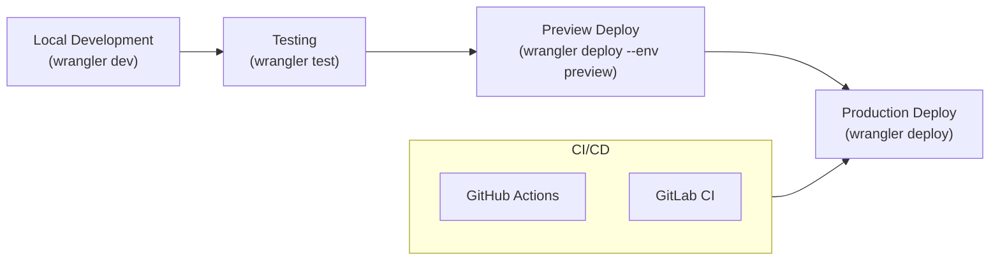

# How to Deploy Cloudflare Workers with Wrangler

Author: [nawazdhandala](https://www.github.com/nawazdhandala)

Tags: Cloudflare, Cloudflare Workers, Wrangler, Deployment, CI/CD, Serverless, DevOps

Description: Learn how to deploy Cloudflare Workers using Wrangler CLI, from local development to production CI/CD pipelines.

---

> Wrangler is the official CLI for Cloudflare Workers development and deployment. It handles everything from local development to production deploys, making it the essential tool for any Workers project.

Shipping code to the edge should be simple. Here is how to master Wrangler deployments.

---

## Overview



---

## Installation and Setup

### Install Wrangler

Install Wrangler globally or as a project dependency:

```bash
# Global installation
npm install -g wrangler

# Or as a dev dependency (recommended for CI/CD)
npm install --save-dev wrangler

# Verify installation
wrangler --version
```

### Authenticate with Cloudflare

Log in to your Cloudflare account:

```bash
# Interactive login (opens browser)
wrangler login

# Or use API token (for CI/CD)
export CLOUDFLARE_API_TOKEN="your-api-token"

# Verify authentication
wrangler whoami
```

---

## Project Configuration

### Initialize a New Project

Create a new Workers project:

```bash
# Create new project with TypeScript template
wrangler init my-worker --type=typescript

# Navigate to project
cd my-worker
```

### wrangler.toml Configuration

Configure your Worker in wrangler.toml:

```toml
# wrangler.toml
name = "my-worker"
main = "src/index.ts"
compatibility_date = "2024-01-01"

# Account ID (optional - can be inferred from auth)
account_id = "your-account-id"

# Workers Paid plan features
# workers_dev = true  # Enable workers.dev subdomain

# Custom domains
routes = [
  { pattern = "api.example.com/*", zone_name = "example.com" }
]

# Environment variables
[vars]
ENVIRONMENT = "production"
API_VERSION = "v1"

# Secrets (set via wrangler secret put)
# SECRET_KEY = "..." # Do not put secrets in wrangler.toml

# KV Namespace bindings
[[kv_namespaces]]
binding = "MY_KV"
id = "your-kv-namespace-id"

# D1 Database bindings
[[d1_databases]]
binding = "DB"
database_name = "my-database"
database_id = "your-d1-database-id"

# R2 Bucket bindings
[[r2_buckets]]
binding = "BUCKET"
bucket_name = "my-bucket"

# Durable Objects
[[durable_objects.bindings]]
name = "COUNTER"
class_name = "Counter"

[[migrations]]
tag = "v1"
new_classes = ["Counter"]
```

---

## Local Development

### Start Development Server

Run your Worker locally:

```bash
# Start local dev server
wrangler dev

# Start with specific port
wrangler dev --port 8787

# Start in local-only mode (no Cloudflare network)
wrangler dev --local

# Start with remote resources (KV, D1, etc.)
wrangler dev --remote

# Enable HTTPS locally
wrangler dev --local-protocol https
```

### Development with Live Reload

Wrangler automatically reloads on file changes:

```bash
# Watch mode is enabled by default
wrangler dev

# Test your worker
curl http://localhost:8787/api/test
```

### Local Environment Variables

Override variables for local development:

```toml
# wrangler.toml
[vars]
ENVIRONMENT = "production"

# Override for local dev
[dev.vars]
ENVIRONMENT = "development"
DEBUG = "true"
```

---

## Deployment Commands

### Deploy to Production

Deploy your Worker to Cloudflare:

```bash
# Deploy to production
wrangler deploy

# Deploy with dry run (shows what would be deployed)
wrangler deploy --dry-run

# Deploy and output the URL
wrangler deploy --outdir dist

# Deploy specific file
wrangler deploy src/index.ts
```

### View Deployment Details

Check deployment status:

```bash
# List all deployments
wrangler deployments list

# View specific deployment
wrangler deployments view <deployment-id>

# View current production deployment
wrangler deployments view
```

### Rollback Deployments

Roll back to a previous version:

```bash
# List available deployments
wrangler deployments list

# Rollback to specific deployment
wrangler rollback <deployment-id>

# Rollback to previous deployment
wrangler rollback
```

---

## Environment Management

### Configure Multiple Environments

Set up staging, preview, and production environments:

```toml
# wrangler.toml
name = "my-worker"
main = "src/index.ts"
compatibility_date = "2024-01-01"

# Production environment (default)
[vars]
ENVIRONMENT = "production"

routes = [
  { pattern = "api.example.com/*", zone_name = "example.com" }
]

[[kv_namespaces]]
binding = "MY_KV"
id = "production-kv-id"

# Staging environment
[env.staging]
name = "my-worker-staging"
vars = { ENVIRONMENT = "staging" }

routes = [
  { pattern = "staging-api.example.com/*", zone_name = "example.com" }
]

[[env.staging.kv_namespaces]]
binding = "MY_KV"
id = "staging-kv-id"

# Preview environment (for PR previews)
[env.preview]
name = "my-worker-preview"
vars = { ENVIRONMENT = "preview" }

# Use workers.dev subdomain for preview
workers_dev = true
```

### Deploy to Specific Environment

```bash
# Deploy to staging
wrangler deploy --env staging

# Deploy to preview
wrangler deploy --env preview

# Run dev server with staging config
wrangler dev --env staging
```

---

## Secrets Management

### Set Secrets

Securely store sensitive values:

```bash
# Set a secret interactively
wrangler secret put API_KEY

# Set secret from stdin
echo "secret-value" | wrangler secret put API_KEY

# Set secret for specific environment
wrangler secret put API_KEY --env staging

# List all secrets
wrangler secret list

# Delete a secret
wrangler secret delete API_KEY
```

### Use Secrets in Code

```typescript
// src/index.ts
export interface Env {
  API_KEY: string;  // Set via wrangler secret put
  DATABASE_URL: string;
}

export default {
  async fetch(request: Request, env: Env): Promise<Response> {
    // Access secrets from env
    const apiKey = env.API_KEY;

    // Use for authenticated requests
    const response = await fetch("https://api.example.com/data", {
      headers: {
        "Authorization": `Bearer ${apiKey}`
      }
    });

    return response;
  }
};
```

---

## CI/CD Integration

### GitHub Actions

Deploy Workers automatically on push:

```yaml
# .github/workflows/deploy.yml
name: Deploy Worker

on:
  push:
    branches:
      - main
  pull_request:
    branches:
      - main

jobs:
  deploy:
    runs-on: ubuntu-latest
    name: Deploy
    steps:
      - uses: actions/checkout@v4

      - name: Setup Node.js
        uses: actions/setup-node@v4
        with:
          node-version: '20'
          cache: 'npm'

      - name: Install dependencies
        run: npm ci

      - name: Run tests
        run: npm test

      - name: Deploy to Preview (PR)
        if: github.event_name == 'pull_request'
        uses: cloudflare/wrangler-action@v3
        with:
          apiToken: ${{ secrets.CLOUDFLARE_API_TOKEN }}
          command: deploy --env preview

      - name: Deploy to Production (main)
        if: github.ref == 'refs/heads/main'
        uses: cloudflare/wrangler-action@v3
        with:
          apiToken: ${{ secrets.CLOUDFLARE_API_TOKEN }}
          command: deploy
```

### GitLab CI

```yaml
# .gitlab-ci.yml
stages:
  - test
  - deploy

variables:
  NODE_VERSION: "20"

.node_setup:
  image: node:${NODE_VERSION}
  before_script:
    - npm ci
  cache:
    paths:
      - node_modules/

test:
  extends: .node_setup
  stage: test
  script:
    - npm test

deploy_preview:
  extends: .node_setup
  stage: deploy
  script:
    - npx wrangler deploy --env preview
  environment:
    name: preview
  rules:
    - if: $CI_PIPELINE_SOURCE == "merge_request_event"
  variables:
    CLOUDFLARE_API_TOKEN: $CLOUDFLARE_API_TOKEN

deploy_production:
  extends: .node_setup
  stage: deploy
  script:
    - npx wrangler deploy
  environment:
    name: production
  rules:
    - if: $CI_COMMIT_BRANCH == "main"
  variables:
    CLOUDFLARE_API_TOKEN: $CLOUDFLARE_API_TOKEN
```

### Environment-Specific Secrets in CI

```yaml
# .github/workflows/deploy.yml
- name: Deploy to Production
  uses: cloudflare/wrangler-action@v3
  with:
    apiToken: ${{ secrets.CLOUDFLARE_API_TOKEN }}
    command: deploy
    secrets: |
      API_KEY
      DATABASE_URL
  env:
    API_KEY: ${{ secrets.PROD_API_KEY }}
    DATABASE_URL: ${{ secrets.PROD_DATABASE_URL }}
```

---

## Resource Management

### KV Namespace Operations

Manage KV namespaces with Wrangler:

```bash
# Create KV namespace
wrangler kv:namespace create MY_KV

# Create preview namespace
wrangler kv:namespace create MY_KV --preview

# List namespaces
wrangler kv:namespace list

# Put a value
wrangler kv:key put --namespace-id <id> "key" "value"

# Get a value
wrangler kv:key get --namespace-id <id> "key"

# Delete a key
wrangler kv:key delete --namespace-id <id> "key"

# Bulk upload from JSON
wrangler kv:bulk put --namespace-id <id> data.json
```

### D1 Database Operations

Manage D1 databases:

```bash
# Create database
wrangler d1 create my-database

# List databases
wrangler d1 list

# Execute SQL
wrangler d1 execute my-database --command "SELECT * FROM users"

# Execute SQL from file
wrangler d1 execute my-database --file schema.sql

# Export database
wrangler d1 export my-database --output backup.sql
```

### R2 Bucket Operations

Manage R2 storage:

```bash
# Create bucket
wrangler r2 bucket create my-bucket

# List buckets
wrangler r2 bucket list

# Upload file
wrangler r2 object put my-bucket/path/file.txt --file ./local-file.txt

# Download file
wrangler r2 object get my-bucket/path/file.txt --file ./downloaded.txt

# Delete object
wrangler r2 object delete my-bucket/path/file.txt
```

---

## Build Configuration

### Custom Build Commands

Configure build process in wrangler.toml:

```toml
# wrangler.toml
name = "my-worker"
main = "dist/index.js"
compatibility_date = "2024-01-01"

[build]
command = "npm run build"
cwd = "."
watch_dir = "src"

[build.upload]
format = "modules"
main = "./dist/index.js"
```

### TypeScript Configuration

Set up TypeScript for Workers:

```json
// tsconfig.json
{
  "compilerOptions": {
    "target": "ES2021",
    "module": "ES2022",
    "moduleResolution": "node",
    "lib": ["ES2021"],
    "types": ["@cloudflare/workers-types"],
    "strict": true,
    "noEmit": true,
    "skipLibCheck": true,
    "esModuleInterop": true,
    "resolveJsonModule": true
  },
  "include": ["src/**/*"],
  "exclude": ["node_modules", "dist"]
}
```

### Bundle Configuration

Control bundling behavior:

```toml
# wrangler.toml
name = "my-worker"
main = "src/index.ts"

# Define external modules (not bundled)
[define]
global.process = "undefined"

# Node.js compatibility
node_compat = true

# Custom rules for assets
[[rules]]
type = "Text"
globs = ["**/*.txt"]
fallthrough = true

[[rules]]
type = "Data"
globs = ["**/*.bin"]
```

---

## Monitoring Deployments

### Tail Logs

Stream real-time logs:

```bash
# Tail production logs
wrangler tail

# Tail specific environment
wrangler tail --env staging

# Filter by status
wrangler tail --status error

# Filter by search term
wrangler tail --search "payment"

# Output as JSON
wrangler tail --format json

# Sample logs (for high-traffic workers)
wrangler tail --sampling-rate 0.1
```

### Deployment Metrics

View deployment analytics:

```bash
# View deployment info
wrangler deployments view

# View Worker details
wrangler versions list

# Check deployment health in dashboard
# https://dash.cloudflare.com > Workers > Your Worker > Analytics
```

---

## Advanced Deployment Patterns

### Gradual Rollouts

Deploy with traffic splitting:

```bash
# Create a new version without routing traffic
wrangler versions upload

# List versions
wrangler versions list

# Deploy with percentage rollout
wrangler versions deploy <version-id>:10% <current-version-id>:90%

# Increase rollout
wrangler versions deploy <version-id>:50% <current-version-id>:50%

# Complete rollout
wrangler versions deploy <version-id>:100%
```

### Multi-Worker Deployments

Deploy multiple Workers together:

```bash
#!/bin/bash
# deploy-all.sh

set -e

echo "Deploying API Worker..."
cd workers/api && wrangler deploy

echo "Deploying Auth Worker..."
cd ../auth && wrangler deploy

echo "Deploying Static Worker..."
cd ../static && wrangler deploy

echo "All workers deployed successfully!"
```

### Deployment Script with Validation

```typescript
// scripts/deploy.ts
import { execSync } from "child_process";

interface DeployConfig {
  environment: string;
  dryRun: boolean;
  skipTests: boolean;
}

async function deploy(config: DeployConfig): Promise<void> {
  const { environment, dryRun, skipTests } = config;

  console.log(`Deploying to ${environment}...`);

  // Run tests unless skipped
  if (!skipTests) {
    console.log("Running tests...");
    execSync("npm test", { stdio: "inherit" });
  }

  // Type check
  console.log("Type checking...");
  execSync("npx tsc --noEmit", { stdio: "inherit" });

  // Build
  console.log("Building...");
  execSync("npm run build", { stdio: "inherit" });

  // Deploy
  const deployCmd = dryRun
    ? `wrangler deploy --env ${environment} --dry-run`
    : `wrangler deploy --env ${environment}`;

  console.log(`Running: ${deployCmd}`);
  execSync(deployCmd, { stdio: "inherit" });

  console.log("Deployment complete!");
}

// Parse arguments
const args = process.argv.slice(2);
const config: DeployConfig = {
  environment: args.find(a => a.startsWith("--env="))?.split("=")[1] || "production",
  dryRun: args.includes("--dry-run"),
  skipTests: args.includes("--skip-tests")
};

deploy(config).catch(console.error);
```

---

## Troubleshooting

### Common Issues

**Authentication failures:**
```bash
# Re-authenticate
wrangler logout
wrangler login

# Or set API token explicitly
export CLOUDFLARE_API_TOKEN="your-token"
```

**Build errors:**
```bash
# Check wrangler version
wrangler --version

# Update wrangler
npm install -g wrangler@latest

# Clear cache
rm -rf .wrangler node_modules
npm install
```

**Deployment size limits:**
```bash
# Check bundle size
wrangler deploy --dry-run --outdir dist
ls -la dist/

# Analyze bundle
npx esbuild src/index.ts --bundle --analyze
```

---

## Best Practices

1. **Use environment-specific configs** - Separate staging and production
2. **Automate deployments** - Use CI/CD for consistent deploys
3. **Store secrets securely** - Never commit secrets to version control
4. **Test before deploying** - Run tests in CI pipeline
5. **Monitor after deploy** - Use wrangler tail to verify behavior
6. **Enable gradual rollouts** - Reduce blast radius of bugs

---

## Conclusion

Wrangler makes Cloudflare Workers deployment straightforward and repeatable. Key takeaways:

- **Local development** with wrangler dev provides fast iteration
- **Environment management** enables safe staging and production workflows
- **CI/CD integration** automates deployments on every push
- **Resource management** for KV, D1, and R2 is built into Wrangler

---

*Deploying Workers to production? [OneUptime](https://oneuptime.com) provides deployment tracking, uptime monitoring, and alerting for your serverless applications at the edge.*
