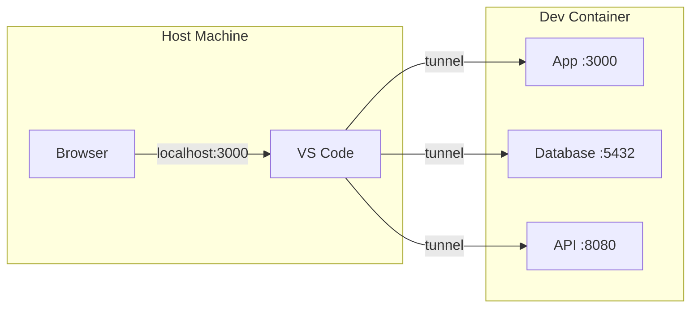
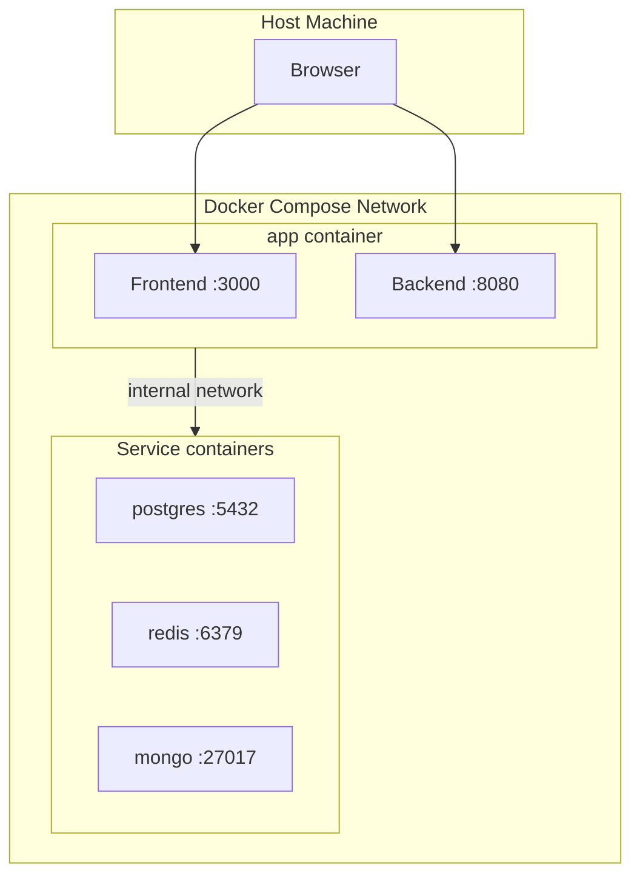
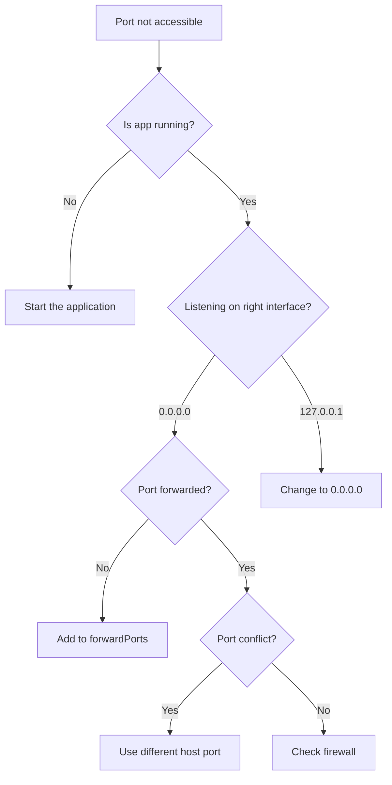

# How to Configure Dev Container Port Forwarding

Author: [nawazdhandala](https://www.github.com/nawazdhandala)

Tags: Dev Containers, Docker, VS Code, Networking, Port Forwarding, Development Environment

Description: Learn how to configure port forwarding in Dev Containers to access web servers, databases, and services running inside your containerized development environment.

---

Your application runs perfectly inside the Dev Container, but you cannot access it from your browser. The container has its own network namespace, isolated from your host machine. Port forwarding bridges this gap, making services inside the container accessible from outside.

## How Port Forwarding Works

When you forward a port, VS Code creates a tunnel between your host machine and the container. Traffic to `localhost:3000` on your machine gets routed to port 3000 inside the container.



## Static Port Forwarding

Define ports to forward automatically when the container starts.

### Basic Configuration

```json
{
  "name": "Web Application",
  "image": "mcr.microsoft.com/devcontainers/javascript-node:20",

  // Forward these ports automatically
  "forwardPorts": [3000, 5173, 8080],

  // Customize port behavior
  "portsAttributes": {
    "3000": {
      "label": "Frontend",
      "onAutoForward": "notify"
    },
    "5173": {
      "label": "Vite Dev Server",
      "onAutoForward": "openBrowser"
    },
    "8080": {
      "label": "Backend API",
      "onAutoForward": "silent"
    }
  }
}
```

### Port Attributes Explained

```json
{
  "portsAttributes": {
    "3000": {
      // Display name in the Ports panel
      "label": "Development Server",

      // What happens when port is detected
      // "notify" - show notification
      // "openBrowser" - open in default browser
      // "openBrowserOnce" - open browser only first time
      // "silent" - forward without notification
      // "ignore" - don't forward at all
      "onAutoForward": "notify",

      // Protocol hint for VS Code
      "protocol": "http",

      // Require authentication to access (Codespaces)
      "requireLocalPort": false,

      // Visibility in Codespaces
      // "private" - only you
      // "org" - organization members
      // "public" - anyone with URL
      "visibility": "private",

      // Elevate privileges for ports below 1024
      "elevateIfNeeded": true
    }
  }
}
```

## Dynamic Port Forwarding

VS Code automatically detects when applications start listening on ports and offers to forward them.

### Configuring Auto-Detection

```json
{
  "otherPortsAttributes": {
    // Default behavior for unlisted ports
    "onAutoForward": "notify"
  },

  "portsAttributes": {
    // Ignore noisy ports
    "9229": {
      "label": "Node Debugger",
      "onAutoForward": "ignore"
    },
    "35729": {
      "label": "LiveReload",
      "onAutoForward": "silent"
    }
  }
}
```

### Port Ranges

```json
{
  "forwardPorts": [3000, "8000-8010"],

  "portsAttributes": {
    "8000-8010": {
      "label": "Microservices",
      "onAutoForward": "silent"
    }
  }
}
```

## Port Mapping

Forward container ports to different host ports when you have conflicts.

### devcontainer.json Mapping

```json
{
  // Map container port 3000 to host port 3001
  "forwardPorts": ["3001:3000"],

  "portsAttributes": {
    "3001": {
      "label": "Frontend (mapped from 3000)"
    }
  }
}
```

### Docker Compose Port Mapping

```yaml
# docker-compose.yml
services:
  app:
    build: .
    ports:
      - "3001:3000"    # host:container
      - "8081:8080"

  db:
    image: postgres:15
    ports:
      - "5433:5432"    # Avoid conflict with host PostgreSQL
```

```json
{
  "dockerComposeFile": "docker-compose.yml",
  "service": "app",

  // Forward the mapped ports
  "forwardPorts": [3001, 8081, 5433],

  "portsAttributes": {
    "5433": {
      "label": "PostgreSQL (container)",
      "onAutoForward": "silent"
    }
  }
}
```

## Multi-Container Port Forwarding

When using Docker Compose with multiple services, each service can expose ports.



### docker-compose.yml

```yaml
version: '3.8'

services:
  app:
    build:
      context: .
      dockerfile: Dockerfile
    volumes:
      - ../..:/workspace:cached
    command: sleep infinity
    depends_on:
      - postgres
      - redis
      - mongo

  postgres:
    image: postgres:15
    environment:
      POSTGRES_PASSWORD: devpass
    # No ports exposed to host by default

  redis:
    image: redis:7-alpine

  mongo:
    image: mongo:6
    environment:
      MONGO_INITDB_ROOT_USERNAME: admin
      MONGO_INITDB_ROOT_PASSWORD: devpass
```

### devcontainer.json

```json
{
  "dockerComposeFile": "docker-compose.yml",
  "service": "app",
  "workspaceFolder": "/workspace",

  // Forward ports from all services
  "forwardPorts": [
    3000,      // Frontend in app container
    8080,      // Backend in app container
    "postgres:5432",   // PostgreSQL service
    "redis:6379",      // Redis service
    "mongo:27017"      // MongoDB service
  ],

  "portsAttributes": {
    "5432": {
      "label": "PostgreSQL",
      "onAutoForward": "silent"
    },
    "6379": {
      "label": "Redis",
      "onAutoForward": "silent"
    },
    "27017": {
      "label": "MongoDB",
      "onAutoForward": "silent"
    }
  }
}
```

## HTTPS and SSL Certificates

Forward HTTPS traffic and handle SSL certificates properly.

### Using mkcert for Local HTTPS

```json
{
  "features": {
    "ghcr.io/devcontainers/features/common-utils:2": {}
  },

  "postCreateCommand": ".devcontainer/setup-ssl.sh",

  "forwardPorts": [443, 3000],

  "portsAttributes": {
    "443": {
      "label": "HTTPS",
      "protocol": "https"
    }
  }
}
```

### setup-ssl.sh

```bash
#!/bin/bash

# Install mkcert
apt-get update && apt-get install -y libnss3-tools
curl -JLO "https://dl.filippo.io/mkcert/latest?for=linux/amd64"
chmod +x mkcert-v*-linux-amd64
mv mkcert-v*-linux-amd64 /usr/local/bin/mkcert

# Create certificates directory
mkdir -p /workspace/.devcontainer/certs

# Generate certificates
cd /workspace/.devcontainer/certs
mkcert -install
mkcert localhost 127.0.0.1 ::1

echo "SSL certificates generated in .devcontainer/certs/"
```

### Node.js HTTPS Server

```javascript
// server.js
const https = require('https');
const fs = require('fs');
const path = require('path');

const options = {
  key: fs.readFileSync(
    path.join(__dirname, '.devcontainer/certs/localhost+2-key.pem')
  ),
  cert: fs.readFileSync(
    path.join(__dirname, '.devcontainer/certs/localhost+2.pem')
  )
};

https.createServer(options, (req, res) => {
  res.writeHead(200);
  res.end('Hello HTTPS!');
}).listen(443);
```

## Debugging Port Issues

When ports are not accessible, work through this troubleshooting flow.



### Common Issue: Binding to localhost

Applications binding to `127.0.0.1` are not accessible via port forwarding. They must bind to `0.0.0.0`.

```javascript
// Wrong - only accessible inside container
app.listen(3000, '127.0.0.1');

// Correct - accessible via port forwarding
app.listen(3000, '0.0.0.0');

// Also correct - defaults to 0.0.0.0
app.listen(3000);
```

### Checking What's Listening

```bash
# Inside the container
netstat -tlnp | grep LISTEN

# Or with ss
ss -tlnp

# Check specific port
lsof -i :3000
```

### Port Conflict Resolution

```bash
# On host machine - find what's using a port
lsof -i :3000
# or
netstat -an | grep 3000

# Kill the process
kill -9 <PID>

# Or use a different host port in devcontainer.json
```

## Performance Optimization

Reduce latency in port forwarding for better development experience.

### Use appPort for Better Performance

```json
{
  // appPort maps directly to Docker, faster than VS Code forwarding
  "appPort": [3000, 8080],

  // Use forwardPorts for dynamic ports
  "forwardPorts": [9229]
}
```

### Docker Compose Network Mode

For maximum performance, use host network mode (Linux only).

```yaml
# docker-compose.yml
services:
  app:
    build: .
    network_mode: host  # Direct access, no forwarding needed
```

```json
{
  "dockerComposeFile": "docker-compose.yml",
  "service": "app",

  // No forwarding needed with host network
  "forwardPorts": []
}
```

## GitHub Codespaces Considerations

Port forwarding in Codespaces has additional options for sharing.

```json
{
  "forwardPorts": [3000, 8080],

  "portsAttributes": {
    "3000": {
      "label": "Web Preview",
      "visibility": "private"     // Only you can access
    },
    "8080": {
      "label": "API Preview",
      "visibility": "public"      // Anyone with URL can access
    }
  },

  "github": {
    "codespaces": {
      // Prebuild configuration
      "prebuildExternalBrowserCommands": ["npm run build"]
    }
  }
}
```

### Visibility Options

| Visibility | Access | Use Case |
|------------|--------|----------|
| private | Only you | Default development |
| org | Organization members | Team collaboration |
| public | Anyone with URL | Demos, sharing previews |

## Complete Example: Full-Stack Application

Here is a complete port forwarding setup for a typical full-stack application.

```json
{
  "name": "Full-Stack Development",
  "dockerComposeFile": "docker-compose.yml",
  "service": "app",
  "workspaceFolder": "/workspace",

  "forwardPorts": [
    3000,              // React frontend
    3001,              // Storybook
    4000,              // GraphQL API
    5432,              // PostgreSQL
    6379,              // Redis
    9229               // Node debugger
  ],

  "portsAttributes": {
    "3000": {
      "label": "Frontend",
      "onAutoForward": "openBrowserOnce",
      "protocol": "http"
    },
    "3001": {
      "label": "Storybook",
      "onAutoForward": "notify"
    },
    "4000": {
      "label": "GraphQL Playground",
      "onAutoForward": "notify",
      "protocol": "http"
    },
    "5432": {
      "label": "PostgreSQL",
      "onAutoForward": "silent"
    },
    "6379": {
      "label": "Redis",
      "onAutoForward": "ignore"
    },
    "9229": {
      "label": "Node Debugger",
      "onAutoForward": "silent"
    }
  },

  "otherPortsAttributes": {
    "onAutoForward": "notify"
  }
}
```

---

Port forwarding is the bridge between your containerized development environment and the tools you use daily, including browsers, database clients, and API testing tools. Configure your common ports statically for consistency, use attributes to control the experience, and remember that applications must bind to `0.0.0.0` to be accessible. With proper port forwarding configuration, working inside a container feels identical to working on your local machine.
