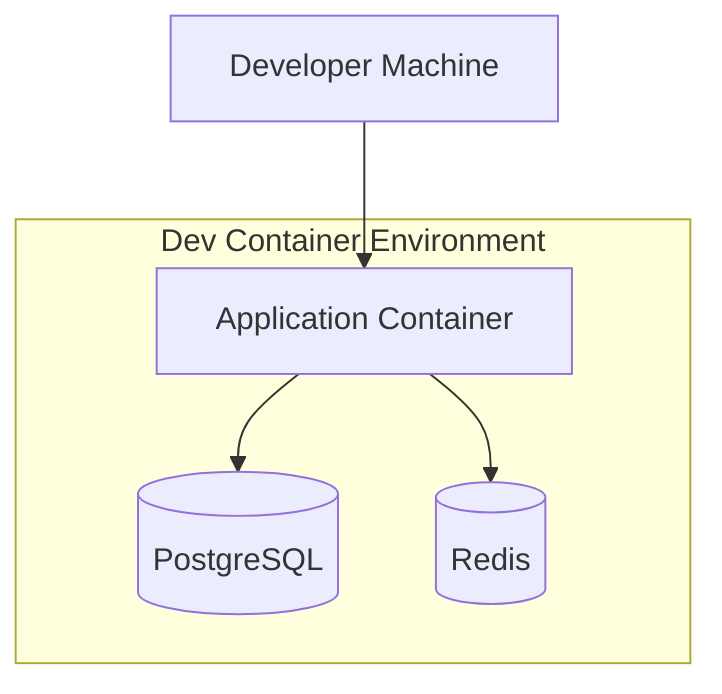

# How to Implement Dev Container Templates

Author: [nawazdhandala](https://www.github.com/nawazdhandala)

Tags: Dev Containers, Docker, VS Code, Development Environment, Templates, DevOps

Description: A practical guide to creating and implementing reusable Dev Container templates that standardize development environments across your team.

---

Dev Container templates solve a fundamental problem in software development: the "works on my machine" syndrome. Instead of documenting setup instructions that nobody follows, you package your entire development environment in a container that anyone can spin up in seconds.

## What Are Dev Container Templates?

Dev Container templates are pre-configured container definitions that include everything needed to develop a specific type of application. They contain the base image, tools, extensions, and settings required for a particular tech stack.


## Creating Your First Template

Start with a basic template structure. Every Dev Container needs at minimum a `devcontainer.json` file.

### Directory Structure

```
.devcontainer/
  devcontainer.json
  Dockerfile           # Optional - for custom images
  docker-compose.yml   # Optional - for multi-container setups
  scripts/
    post-create.sh     # Optional - setup scripts
```

### Basic devcontainer.json

```json
{
  // Template name and description
  "name": "Node.js Development",
  "image": "mcr.microsoft.com/devcontainers/javascript-node:18",

  // Features add pre-packaged tools
  "features": {
    "ghcr.io/devcontainers/features/git:1": {},
    "ghcr.io/devcontainers/features/github-cli:1": {}
  },

  // VS Code extensions to install automatically
  "customizations": {
    "vscode": {
      "extensions": [
        "dbaeumer.vscode-eslint",
        "esbenp.prettier-vscode",
        "bradlc.vscode-tailwindcss"
      ],
      "settings": {
        "editor.formatOnSave": true,
        "editor.defaultFormatter": "esbenp.prettier-vscode"
      }
    }
  },

  // Commands to run after container creation
  "postCreateCommand": "npm install",

  // Forward ports from container to host
  "forwardPorts": [3000, 5173],

  // Run as non-root user for security
  "remoteUser": "node"
}
```

## Building Custom Templates with Dockerfiles

When base images don't include everything you need, create a custom Dockerfile.

### Python Data Science Template

```dockerfile
# .devcontainer/Dockerfile
FROM mcr.microsoft.com/devcontainers/python:3.11

# Install system dependencies for data science libraries
RUN apt-get update && apt-get install -y \
    libpq-dev \
    libhdf5-dev \
    && rm -rf /var/lib/apt/lists/*

# Install Python packages globally for the container
RUN pip install --no-cache-dir \
    pandas \
    numpy \
    scikit-learn \
    jupyter \
    matplotlib \
    seaborn

# Configure Jupyter to run without token
RUN jupyter notebook --generate-config && \
    echo "c.NotebookApp.token = ''" >> /root/.jupyter/jupyter_notebook_config.py
```

```json
{
  "name": "Python Data Science",
  "build": {
    "dockerfile": "Dockerfile",
    "context": ".."
  },
  "features": {
    "ghcr.io/devcontainers/features/git:1": {}
  },
  "customizations": {
    "vscode": {
      "extensions": [
        "ms-python.python",
        "ms-toolsai.jupyter",
        "ms-python.vscode-pylance"
      ]
    }
  },
  "forwardPorts": [8888],
  "postCreateCommand": "pip install -r requirements.txt"
}
```

## Multi-Container Templates with Docker Compose

Real applications often need databases, caches, and other services. Use Docker Compose to orchestrate multiple containers.



### docker-compose.yml

```yaml
version: '3.8'

services:
  app:
    build:
      context: .
      dockerfile: Dockerfile
    volumes:
      - ../..:/workspace:cached
    command: sleep infinity
    networks:
      - dev-network
    depends_on:
      - db
      - redis

  db:
    image: postgres:15
    restart: unless-stopped
    volumes:
      - postgres-data:/var/lib/postgresql/data
    environment:
      POSTGRES_USER: devuser
      POSTGRES_PASSWORD: devpassword
      POSTGRES_DB: devdb
    networks:
      - dev-network

  redis:
    image: redis:7-alpine
    restart: unless-stopped
    networks:
      - dev-network

volumes:
  postgres-data:

networks:
  dev-network:
```

### devcontainer.json for Docker Compose

```json
{
  "name": "Full Stack Development",
  "dockerComposeFile": "docker-compose.yml",
  "service": "app",
  "workspaceFolder": "/workspace",

  "features": {
    "ghcr.io/devcontainers/features/node:1": {
      "version": "18"
    }
  },

  "customizations": {
    "vscode": {
      "extensions": [
        "ms-azuretools.vscode-docker",
        "mtxr.sqltools",
        "mtxr.sqltools-driver-pg"
      ],
      "settings": {
        "sqltools.connections": [
          {
            "name": "Dev Database",
            "driver": "PostgreSQL",
            "server": "db",
            "port": 5432,
            "database": "devdb",
            "username": "devuser",
            "password": "devpassword"
          }
        ]
      }
    }
  },

  "forwardPorts": [3000, 5432, 6379],

  "postCreateCommand": "npm install && npm run db:migrate"
}
```

## Using Dev Container Features

Features are reusable units of installation code. They save you from writing complex Dockerfile instructions.

### Common Features

```json
{
  "features": {
    // Git with configuration
    "ghcr.io/devcontainers/features/git:1": {
      "ppa": true,
      "version": "latest"
    },

    // Docker-in-Docker for container builds
    "ghcr.io/devcontainers/features/docker-in-docker:2": {
      "version": "latest",
      "moby": true
    },

    // AWS CLI
    "ghcr.io/devcontainers/features/aws-cli:1": {},

    // kubectl and Helm
    "ghcr.io/devcontainers/features/kubectl-helm-minikube:1": {
      "kubectl": "latest",
      "helm": "latest",
      "minikube": "none"
    },

    // Terraform
    "ghcr.io/devcontainers/features/terraform:1": {
      "version": "latest",
      "tflint": "latest"
    }
  }
}
```

## Creating Reusable Template Libraries

Organize templates in a central repository that teams can reference.

### Template Repository Structure

```
devcontainer-templates/
  src/
    nodejs/
      devcontainer-template.json
      .devcontainer/
        devcontainer.json
        Dockerfile
    python/
      devcontainer-template.json
      .devcontainer/
        devcontainer.json
    go/
      devcontainer-template.json
      .devcontainer/
        devcontainer.json
  README.md
```

### devcontainer-template.json

```json
{
  "id": "nodejs",
  "version": "1.0.0",
  "name": "Node.js Development",
  "description": "Standard Node.js development environment with testing tools",
  "documentationURL": "https://github.com/yourorg/devcontainer-templates",
  "options": {
    "nodeVersion": {
      "type": "string",
      "proposals": ["18", "20", "22"],
      "default": "20",
      "description": "Node.js version to use"
    },
    "installYarn": {
      "type": "boolean",
      "default": true,
      "description": "Install Yarn package manager"
    }
  }
}
```

### Using Options in Templates

```json
{
  "name": "Node.js ${templateOption:nodeVersion}",
  "image": "mcr.microsoft.com/devcontainers/javascript-node:${templateOption:nodeVersion}",
  "postCreateCommand": "${templateOption:installYarn} && npm install -g yarn || true"
}
```

## Lifecycle Scripts

Run scripts at different stages of the container lifecycle.


### Example Scripts

```json
{
  "name": "Full Lifecycle Example",

  // Runs once when container is created
  "onCreateCommand": ".devcontainer/scripts/on-create.sh",

  // Runs when content updates (git pull)
  "updateContentCommand": "npm install",

  // Runs after container creation completes
  "postCreateCommand": "npm run setup",

  // Runs each time container starts
  "postStartCommand": "npm run dev:services",

  // Runs each time VS Code attaches
  "postAttachCommand": "echo 'Welcome to the dev container!'"
}
```

### on-create.sh

```bash
#!/bin/bash
set -e

# Initialize git hooks
if [ -f .husky/install.mjs ]; then
  npm run prepare
fi

# Copy environment template if .env doesn't exist
if [ ! -f .env ]; then
  cp .env.example .env
  echo "Created .env from template"
fi

# Generate SSL certificates for local HTTPS
if [ ! -f .devcontainer/certs/localhost.pem ]; then
  mkdir -p .devcontainer/certs
  mkcert -install
  mkcert -cert-file .devcontainer/certs/localhost.pem \
         -key-file .devcontainer/certs/localhost-key.pem \
         localhost 127.0.0.1
fi
```

## Environment Variables and Secrets

Handle configuration without exposing secrets in your repository.

### Using Environment Variables

```json
{
  "containerEnv": {
    "NODE_ENV": "development",
    "DATABASE_URL": "postgresql://devuser:devpassword@db:5432/devdb"
  },

  // Pull from host environment
  "remoteEnv": {
    "GITHUB_TOKEN": "${localEnv:GITHUB_TOKEN}",
    "AWS_ACCESS_KEY_ID": "${localEnv:AWS_ACCESS_KEY_ID}",
    "AWS_SECRET_ACCESS_KEY": "${localEnv:AWS_SECRET_ACCESS_KEY}"
  }
}
```

### Secrets with .env Files

```json
{
  "runArgs": ["--env-file", ".devcontainer/.env.local"],
  "postCreateCommand": "cp .env.example .env.local"
}
```

## Validating Templates

Test your templates before sharing them.

### Manual Testing Checklist

```bash
# Build the container
devcontainer build --workspace-folder .

# Start and verify
devcontainer up --workspace-folder .

# Run commands inside
devcontainer exec --workspace-folder . npm test

# Check all extensions installed
code --list-extensions
```

### Automated Testing with GitHub Actions

```yaml
name: Test Dev Container

on:
  push:
    paths:
      - '.devcontainer/**'

jobs:
  test:
    runs-on: ubuntu-latest
    steps:
      - uses: actions/checkout@v4

      - name: Build Dev Container
        uses: devcontainers/ci@v0.3
        with:
          runCmd: |
            node --version
            npm --version
            npm test
```

---

Dev Container templates transform environment setup from a multi-hour ordeal into a single command. Start with a basic template for your most common project type, iterate based on team feedback, and gradually build a library of templates that cover all your development scenarios. Your team will spend less time debugging environment issues and more time writing code.
