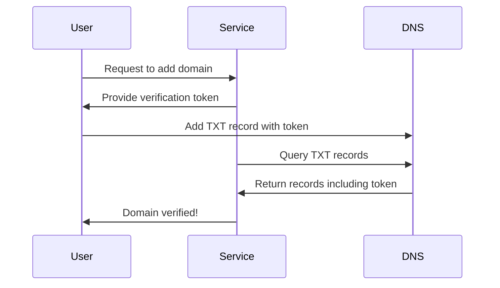
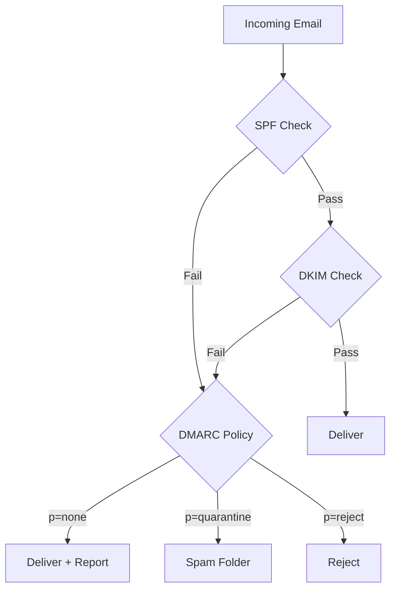
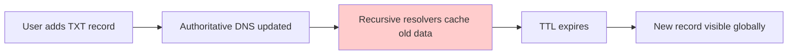

# How to Use DNS TXT Records for Verification

Author: [nawazdhandala](https://www.github.com/nawazdhandala)

Tags: DNS, Networking, Security, Verification, TXT Records, Domain Ownership, SPF, DKIM

Description: A comprehensive guide to using DNS TXT records for domain verification, email authentication, and proving ownership to third-party services.

---

DNS TXT records are the Swiss Army knife of domain verification. Originally designed to hold arbitrary text, they've become the standard way to prove domain ownership, authenticate email, and configure security policies. If you've ever added a domain to Google Workspace, verified ownership for an SSL certificate, or set up email deliverability - you've used TXT records.

This guide covers how TXT records work, common verification patterns, and how to implement your own verification system.

---

## Understanding TXT Records

A TXT record is simply a DNS record that holds text data. Unlike A records (which point to IP addresses) or MX records (which specify mail servers), TXT records have no predefined format - they're just strings.

```bash
# Query TXT records for a domain
dig TXT example.com +short

# Example output
"v=spf1 include:_spf.google.com ~all"
"google-site-verification=abc123..."
"MS=ms12345678"
```

The flexibility of TXT records makes them perfect for verification: a service gives you a unique string, you add it to your DNS, and the service verifies you control the domain by looking up that string.

---

## Common Verification Patterns

### Domain Ownership Verification

Services need to verify you control a domain before letting you use it. The typical flow:



Example verification records from common services:

```
# Google Workspace
google-site-verification=rXOxyZounnZasA8Z7oaD3c14JdjS9aKSWvsR1EbUSIQ

# Microsoft 365
MS=ms12345678

# Let's Encrypt (for DNS-01 challenge)
_acme-challenge.example.com.  TXT  "gfj9Xq...Rg85nM"

# Stripe
stripe-verification=abc123def456
```

---

## Email Authentication with TXT Records

TXT records are essential for email security. Three protocols work together to prevent spoofing:

### SPF (Sender Policy Framework)

SPF specifies which servers can send email for your domain:

```
# Basic SPF record
v=spf1 include:_spf.google.com include:sendgrid.net -all

# Breakdown:
# v=spf1           - SPF version 1
# include:...      - Allow these services to send
# -all             - Reject all other senders (hard fail)
# ~all             - Soft fail (mark as suspicious but deliver)
```

### DKIM (DomainKeys Identified Mail)

DKIM uses cryptographic signatures. The public key lives in a TXT record:

```
# DKIM record (selector: google)
google._domainkey.example.com.  TXT  "v=DKIM1; k=rsa; p=MIIBIjANBgkqhkiG9w0BAQEFAAOCAQ8AMIIBCgKCAQEA..."

# The sending server signs emails with the private key
# Recipients verify using the public key from DNS
```

### DMARC (Domain-based Message Authentication)

DMARC ties SPF and DKIM together and specifies what to do with failures:

```
# DMARC record
_dmarc.example.com.  TXT  "v=DMARC1; p=reject; rua=mailto:dmarc@example.com; pct=100"

# Breakdown:
# p=reject      - Policy: reject failing emails
# rua=mailto:   - Send aggregate reports here
# pct=100       - Apply to 100% of emails
```



---

## Building a Domain Verification System

Here's how to implement domain verification for your own service:

### Generate Verification Tokens

```javascript
// verification-service.js
const crypto = require('crypto');
const dns = require('dns').promises;

class DomainVerifier {
  constructor(prefix = 'myapp-verification') {
    this.prefix = prefix;
  }

  // Generate a unique verification token for a domain
  generateToken(domain, userId) {
    const data = `${domain}:${userId}:${Date.now()}`;
    const hash = crypto.createHash('sha256').update(data).digest('hex');
    return `${this.prefix}=${hash.substring(0, 32)}`;
  }

  // Check if a domain has the verification token
  async verify(domain, expectedToken) {
    try {
      const records = await dns.resolveTxt(domain);

      // records is an array of arrays (each TXT record can have multiple strings)
      const allRecords = records.flat();

      // Check if any TXT record matches our token
      const verified = allRecords.some(record =>
        record.includes(expectedToken)
      );

      return {
        verified,
        records: allRecords.filter(r => r.startsWith(this.prefix))
      };
    } catch (err) {
      if (err.code === 'ENOTFOUND' || err.code === 'ENODATA') {
        return { verified: false, error: 'No TXT records found' };
      }
      throw err;
    }
  }
}

// Usage
async function main() {
  const verifier = new DomainVerifier();

  // Generate token for user
  const token = verifier.generateToken('example.com', 'user123');
  console.log('Add this TXT record to your domain:');
  console.log(token);

  // Later, verify the domain
  const result = await verifier.verify('example.com', token);
  console.log('Verification result:', result);
}

main();
```

### Python Implementation

```python
# domain_verifier.py
import hashlib
import time
import dns.resolver
from typing import Optional, Dict, List

class DomainVerifier:
    def __init__(self, prefix: str = 'myapp-verification'):
        self.prefix = prefix
        self.resolver = dns.resolver.Resolver()
        # Set custom DNS servers if needed
        self.resolver.nameservers = ['8.8.8.8', '1.1.1.1']

    def generate_token(self, domain: str, user_id: str) -> str:
        """Generate a unique verification token."""
        data = f"{domain}:{user_id}:{int(time.time())}"
        hash_value = hashlib.sha256(data.encode()).hexdigest()
        return f"{self.prefix}={hash_value[:32]}"

    def verify(self, domain: str, expected_token: str) -> Dict:
        """
        Verify a domain has the expected TXT record.

        Returns:
            Dict with 'verified' boolean and 'records' list
        """
        try:
            answers = self.resolver.resolve(domain, 'TXT')

            # Extract all TXT record values
            records = []
            for rdata in answers:
                # TXT records may have multiple strings, join them
                txt_value = ''.join(
                    s.decode() if isinstance(s, bytes) else s
                    for s in rdata.strings
                )
                records.append(txt_value)

            # Check for our token
            verified = any(expected_token in record for record in records)

            return {
                'verified': verified,
                'records': [r for r in records if r.startswith(self.prefix)]
            }

        except dns.resolver.NXDOMAIN:
            return {'verified': False, 'error': 'Domain not found'}
        except dns.resolver.NoAnswer:
            return {'verified': False, 'error': 'No TXT records'}
        except Exception as e:
            return {'verified': False, 'error': str(e)}

    def verify_with_retry(
        self,
        domain: str,
        expected_token: str,
        max_attempts: int = 5,
        delay_seconds: int = 30
    ) -> Dict:
        """
        Verify with retries to account for DNS propagation.
        """
        import time as time_module

        for attempt in range(max_attempts):
            result = self.verify(domain, expected_token)

            if result.get('verified'):
                return result

            if attempt < max_attempts - 1:
                print(f"Attempt {attempt + 1} failed, retrying in {delay_seconds}s...")
                time_module.sleep(delay_seconds)

        return result


# Usage example
if __name__ == '__main__':
    verifier = DomainVerifier()

    # Generate verification token
    token = verifier.generate_token('example.com', 'user_123')
    print(f"Add this TXT record to your DNS:\n{token}\n")

    # Verify (with retries for DNS propagation)
    result = verifier.verify_with_retry('example.com', token)
    print(f"Verification result: {result}")
```

---

## Handling DNS Propagation

DNS changes don't take effect instantly. TTL (Time To Live) values and caching mean your verification might not work immediately.



Best practices for handling propagation:

```javascript
// verification-with-propagation.js
class RobustVerifier {
  constructor(options = {}) {
    this.maxAttempts = options.maxAttempts || 10;
    this.initialDelay = options.initialDelay || 10000; // 10 seconds
    this.maxDelay = options.maxDelay || 300000; // 5 minutes
  }

  async verifyWithBackoff(domain, token) {
    let delay = this.initialDelay;

    for (let attempt = 1; attempt <= this.maxAttempts; attempt++) {
      console.log(`Verification attempt ${attempt}/${this.maxAttempts}`);

      const result = await this.checkDNS(domain, token);

      if (result.verified) {
        return { verified: true, attempts: attempt };
      }

      if (attempt < this.maxAttempts) {
        console.log(`Waiting ${delay/1000}s for DNS propagation...`);
        await this.sleep(delay);

        // Exponential backoff with cap
        delay = Math.min(delay * 1.5, this.maxDelay);
      }
    }

    return {
      verified: false,
      error: 'Verification timed out - DNS may still be propagating'
    };
  }

  async checkDNS(domain, token) {
    // Query multiple DNS servers for faster detection
    const dnsServers = ['8.8.8.8', '1.1.1.1', '9.9.9.9'];

    for (const server of dnsServers) {
      try {
        const result = await this.queryServer(domain, server);
        if (result.includes(token)) {
          return { verified: true };
        }
      } catch (err) {
        // Continue to next server
      }
    }

    return { verified: false };
  }

  sleep(ms) {
    return new Promise(resolve => setTimeout(resolve, ms));
  }
}
```

---

## Security Considerations

### Prevent Token Enumeration

Don't use predictable tokens that could be guessed:

```javascript
// Bad - predictable
const token = `verify-${domain}`;

// Good - includes randomness and is signed
const token = crypto
  .createHmac('sha256', process.env.SECRET_KEY)
  .update(`${domain}:${userId}:${crypto.randomBytes(16).toString('hex')}`)
  .digest('hex');
```

### Set Token Expiration

Verification tokens shouldn't live forever:

```javascript
class SecureVerifier {
  generateToken(domain, userId, expiresInHours = 24) {
    const expiresAt = Date.now() + (expiresInHours * 60 * 60 * 1000);

    const payload = {
      domain,
      userId,
      expiresAt
    };

    // Create HMAC for integrity
    const signature = crypto
      .createHmac('sha256', process.env.SECRET_KEY)
      .update(JSON.stringify(payload))
      .digest('hex')
      .substring(0, 16);

    // Encode expiration in token for client-side display
    return `myapp-verify=${signature}-exp${expiresAt}`;
  }

  isTokenExpired(token) {
    const match = token.match(/exp(\d+)$/);
    if (!match) return true;
    return Date.now() > parseInt(match[1]);
  }
}
```

### Validate the Full Domain

Watch out for subdomain attacks:

```javascript
// User claims to own: example.com
// But adds TXT record to: attacker.example.com

async function verifyExactDomain(domain, token) {
  // Query the exact domain, not subdomains
  const records = await dns.resolveTxt(domain);

  // Also verify no CNAME redirects
  try {
    await dns.resolveCname(domain);
    // If CNAME exists, be cautious - the domain might point elsewhere
    console.warn('Domain has CNAME record, additional validation needed');
  } catch (err) {
    // No CNAME, good
  }

  return records.flat().includes(token);
}
```

---

## Debugging TXT Record Issues

Common problems and how to diagnose them:

```bash
# Check TXT records from multiple DNS servers
dig @8.8.8.8 TXT example.com +short
dig @1.1.1.1 TXT example.com +short

# Check authoritative nameservers directly
dig NS example.com +short
# Then query the authoritative server
dig @ns1.example.com TXT example.com +short

# Check TTL to understand caching
dig TXT example.com | grep -A1 "ANSWER SECTION"

# Verify record propagation globally
# Use online tools like whatsmydns.net or dnschecker.org
```

Common issues:

| Problem | Symptom | Solution |
|---------|---------|----------|
| Quotes in record | Record appears wrong | Remove extra quotes when adding |
| Record too long | Verification fails | Split into multiple strings (255 char limit per string) |
| Propagation delay | Works from some locations | Wait for TTL to expire globally |
| Wrong record type | Not found | Ensure you added TXT, not CNAME or other |

---

TXT records are deceptively simple but incredibly powerful. They form the foundation of domain verification across the internet, from proving ownership to third-party services to securing email delivery. When implementing your own verification system, remember to handle DNS propagation gracefully, use cryptographically secure tokens, and always verify the exact domain the user claims to own.
