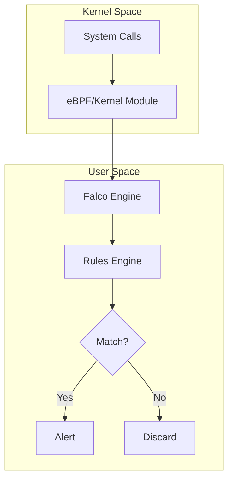
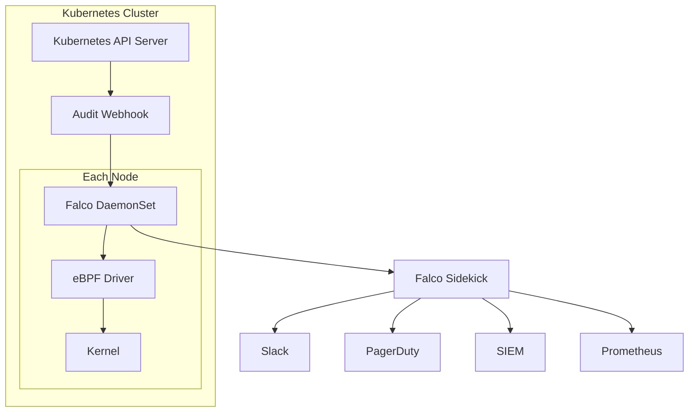

# How to Implement Falco for Container Security

Author: [nawazdhandala](https://www.github.com/nawazdhandala)

Tags: Falco, Container Security, Kubernetes, Runtime Security, DevSecOps

Description: A comprehensive guide to deploying and configuring Falco for runtime container security in Kubernetes environments.

---

Container security extends beyond image scanning and admission control. Runtime security monitors what containers actually do once they are running, detecting suspicious behavior like shell access, network connections, or file system modifications. Falco is the leading open-source tool for this job.

## What is Falco?

Falco is a cloud-native runtime security tool that uses system call monitoring to detect anomalous behavior in containers and hosts. Originally created by Sysdig and now a CNCF incubating project, Falco acts as a security camera for your Kubernetes clusters.



## Installing Falco on Kubernetes

The recommended installation method is using Helm:

```bash
# Add the Falcosecurity Helm repository
helm repo add falcosecurity https://falcosecurity.github.io/charts
helm repo update

# Install Falco with modern eBPF driver
helm install falco falcosecurity/falco \
  --namespace falco \
  --create-namespace \
  --set driver.kind=modern_ebpf \
  --set collectors.kubernetes.enabled=true \
  --set falcosidekick.enabled=true
```

For production environments, use a values file:

```yaml
# falco-values.yaml
driver:
  kind: modern_ebpf  # Use modern eBPF for better performance

falco:
  json_output: true
  json_include_output_property: true
  log_level: info

  # Enable Kubernetes metadata enrichment
  metadata_download:
    enabled: true
    max_mb: 100

collectors:
  kubernetes:
    enabled: true

# Enable Sidekick for alert routing
falcosidekick:
  enabled: true
  webui:
    enabled: true

# Resource limits
resources:
  requests:
    cpu: 100m
    memory: 512Mi
  limits:
    cpu: 1000m
    memory: 1024Mi
```

Deploy with the values file:

```bash
helm install falco falcosecurity/falco \
  --namespace falco \
  --create-namespace \
  -f falco-values.yaml
```

## Understanding Falco Rules

Falco rules define what behavior to detect. Each rule has a condition, output message, and priority:

```yaml
# Example rule structure
- rule: Terminal shell in container
  desc: Detect a shell being spawned in a container
  condition: >
    spawned_process and
    container and
    shell_procs and
    proc.tty != 0
  output: >
    Shell spawned in container
    (user=%user.name user_loginuid=%user.loginuid container_id=%container.id
    container_name=%container.name shell=%proc.name parent=%proc.pname
    cmdline=%proc.cmdline)
  priority: WARNING
  tags: [container, shell, mitre_execution]
```

## Essential Security Rules

Falco includes default rules, but you should customize them for your environment. Here are critical rules to enable:

```yaml
# custom-rules.yaml
customRules:
  custom-rules.yaml: |-
    # Detect container privilege escalation
    - rule: Privileged Container Started
      desc: Detect when a privileged container is started
      condition: >
        spawned_process and
        container and
        container.privileged=true
      output: >
        Privileged container started
        (user=%user.name container_id=%container.id
        container_name=%container.name image=%container.image.repository)
      priority: CRITICAL
      tags: [container, privilege]

    # Detect sensitive file access
    - rule: Read sensitive file in container
      desc: Detect reading of sensitive files like /etc/shadow
      condition: >
        open_read and
        container and
        sensitive_files
      output: >
        Sensitive file read in container
        (user=%user.name file=%fd.name container=%container.name)
      priority: WARNING
      tags: [filesystem, sensitive_data]

    # Detect outbound connections to suspicious ports
    - rule: Unexpected outbound connection
      desc: Detect connections to non-standard ports
      condition: >
        outbound and
        container and
        not (fd.sport in (80, 443, 53, 8080, 8443))
      output: >
        Unexpected outbound connection
        (command=%proc.cmdline connection=%fd.name container=%container.name)
      priority: NOTICE
      tags: [network]

    # Detect crypto mining
    - rule: Detect crypto miners using stratum protocol
      desc: Detect outbound connections using stratum mining protocol
      condition: >
        outbound and
        fd.l4proto=tcp and
        fd.sport in (3333, 4444, 8333, 9999)
      output: >
        Possible crypto mining detected
        (command=%proc.cmdline connection=%fd.name container=%container.name)
      priority: CRITICAL
      tags: [cryptomining, network]
```

## Configuring Rule Exceptions

Reduce false positives by adding exceptions for known good behavior:

```yaml
# exceptions.yaml
customRules:
  exceptions.yaml: |-
    # Allow specific containers to run shells
    - rule: Terminal shell in container
      append: true
      condition: and not (container.image.repository = "mycompany/debug-tools")

    # Allow backup containers to read sensitive files
    - rule: Read sensitive file in container
      append: true
      condition: and not (container.name startswith "backup-")
```

## Kubernetes-Specific Detection

Enable Kubernetes audit log monitoring for API-level detection:

```yaml
# Enable Kubernetes audit events
falco:
  rules_files:
    - /etc/falco/falco_rules.yaml
    - /etc/falco/falco_rules.local.yaml
    - /etc/falco/k8s_audit_rules.yaml

  # Configure audit log input
  plugins:
    - name: k8saudit
      library_path: libk8saudit.so
      init_config:
        maxEventBytes: 1048576
      open_params: "http://:9765/k8s-audit"
    - name: json
      library_path: libjson.so

  load_plugins: [k8saudit, json]
```

Example Kubernetes audit rule:

```yaml
# k8s-audit-rules.yaml
customRules:
  k8s-audit.yaml: |-
    # Detect secret access
    - rule: K8s Secret Get
      desc: Detect any get operation on secrets
      condition: >
        ka.verb=get and
        ka.target.resource=secrets
      output: >
        Secret accessed
        (user=%ka.user.name secret=%ka.target.name
        namespace=%ka.target.namespace)
      priority: NOTICE
      source: k8s_audit
      tags: [k8s, secrets]

    # Detect privilege escalation in RBAC
    - rule: ClusterRole with Wildcard Permissions
      desc: Detect ClusterRole with dangerous wildcard permissions
      condition: >
        ka.verb=create and
        ka.target.resource=clusterroles and
        ka.req.role.rules.resources intersects ("*")
      output: >
        ClusterRole with wildcard created (user=%ka.user.name role=%ka.target.name)
      priority: WARNING
      source: k8s_audit
```

## Architecture Overview

A complete Falco deployment architecture:



## Verifying Your Installation

Test that Falco is working by triggering a known rule:

```bash
# This should trigger "Terminal shell in container"
kubectl run test-shell --rm -it --image=alpine -- /bin/sh

# Check Falco logs for the alert
kubectl logs -n falco -l app.kubernetes.io/name=falco --tail=50 | grep "Terminal shell"
```

Expected output:

```json
{
  "output": "Shell spawned in container (user=root container_id=abc123 container_name=test-shell shell=sh parent=runc cmdline=sh)",
  "priority": "Warning",
  "rule": "Terminal shell in container",
  "time": "2026-01-28T10:30:00.000000000Z"
}
```

## Performance Tuning

Falco can impact system performance. Tune these settings for production:

```yaml
falco:
  # Increase buffer size to prevent drops
  syscall_buf_size_preset: 6  # 8MB per CPU

  # Reduce overhead by filtering early
  base_syscalls:
    custom_set: [open, openat, close, read, write, connect, accept, execve, clone, fork]
    repair: true

# Set appropriate resource limits
resources:
  requests:
    cpu: 200m
    memory: 512Mi
  limits:
    cpu: 1000m
    memory: 1024Mi
```

## Best Practices

1. **Start with Default Rules** - Falco includes well-tested default rules. Enable them first before adding custom rules
2. **Tune for Your Environment** - Add exceptions for legitimate behavior to reduce false positives
3. **Use eBPF Driver** - The modern eBPF driver offers better performance and stability than the kernel module
4. **Enable Kubernetes Metadata** - Enriching alerts with pod and namespace information makes investigation easier
5. **Monitor Falco Itself** - Use metrics to ensure Falco is not dropping events or consuming excessive resources
6. **Layer Your Defenses** - Combine runtime security with image scanning, network policies, and admission control

---

Falco provides visibility into container runtime behavior that other security tools miss. By monitoring system calls and Kubernetes audit logs, you can detect compromised containers, policy violations, and attack patterns in real time. Start with the default ruleset, tune for your environment, and integrate with your alerting pipeline for a complete container security solution.

**Related Reading:**

- [How to Use Falco Sidekick for Alerting](https://oneuptime.com/blog/post/2026-01-28-falco-sidekick-alerting/view)
- [How to Use Falco Plugins](https://oneuptime.com/blog/post/2026-01-28-falco-plugins/view)
- [How to Debug Falco Rule Failures](https://oneuptime.com/blog/post/2026-01-28-debug-falco-rule-failures/view)
