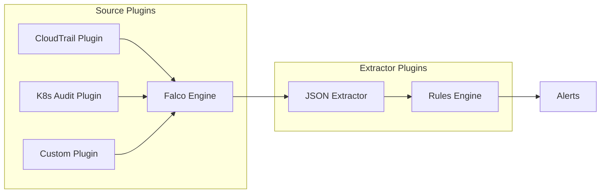
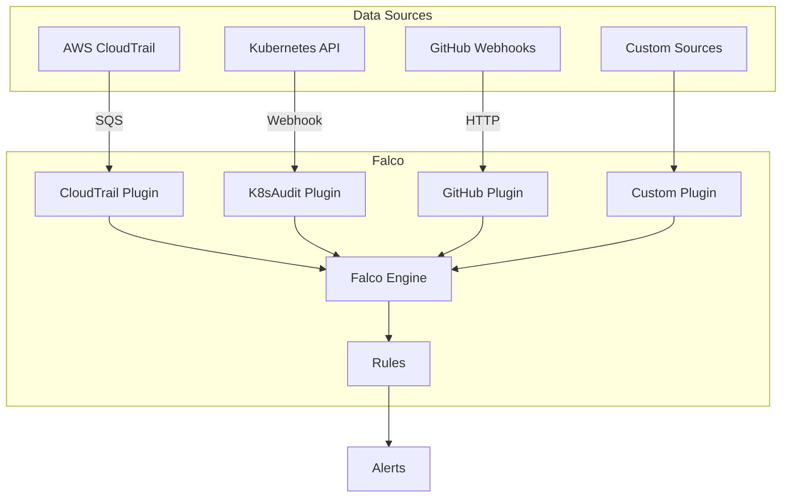

# How to Use Falco Plugins

Author: [nawazdhandala](https://www.github.com/nawazdhandala)

Tags: Falco, Plugins, Security, Cloud Security, Extensibility

Description: Learn how to extend Falco with plugins for AWS CloudTrail, Kubernetes audit logs, and custom data sources.

---

Falco's plugin system extends its detection capabilities beyond system calls. Plugins allow Falco to ingest and analyze events from cloud providers, Kubernetes audit logs, and custom data sources using the same powerful rules engine.

## Understanding the Plugin Architecture

Falco plugins come in two types:



- **Source Plugins** - Generate events from external sources like AWS CloudTrail or Kubernetes audit logs
- **Extractor Plugins** - Parse fields from event payloads, typically used with source plugins

## Available Official Plugins

Falco provides several official plugins:

| Plugin | Source | Description |
|--------|--------|-------------|
| k8saudit | Kubernetes | Kubernetes API audit events |
| cloudtrail | AWS | AWS CloudTrail events |
| github | GitHub | GitHub webhook events |
| okta | Okta | Okta system log events |
| json | N/A | JSON field extraction |

## Installing Plugins

Plugins are included in the Falco container image. Enable them through configuration:

```yaml
# falco.yaml
plugins:
  - name: cloudtrail
    library_path: libcloudtrail.so
    init_config:
      sqsDelete: true
      aws_region: us-east-1
    open_params: "sqs://my-cloudtrail-queue"

  - name: json
    library_path: libjson.so
    init_config: ""

load_plugins: [cloudtrail, json]
```

With Helm:

```yaml
# values.yaml
falco:
  plugins:
    - name: cloudtrail
      library_path: libcloudtrail.so
      init_config:
        sqsDelete: true
      open_params: "sqs://my-cloudtrail-queue"
    - name: json
      library_path: libjson.so

  load_plugins: [cloudtrail, json]

  rules_files:
    - /etc/falco/falco_rules.yaml
    - /etc/falco/aws_cloudtrail_rules.yaml
```

## AWS CloudTrail Plugin

The CloudTrail plugin monitors AWS API activity for security threats.

### Setting Up CloudTrail

First, configure CloudTrail to send events to an SQS queue:

```bash
# Create SQS queue for CloudTrail events
aws sqs create-queue --queue-name falco-cloudtrail-queue

# Create S3 bucket for CloudTrail logs
aws s3 mb s3://my-cloudtrail-bucket

# Enable CloudTrail with S3 and SQS
aws cloudtrail create-trail \
  --name security-trail \
  --s3-bucket-name my-cloudtrail-bucket \
  --include-global-service-events

aws cloudtrail start-logging --name security-trail
```

Configure S3 bucket notifications to SQS:

```json
{
  "QueueConfigurations": [
    {
      "QueueArn": "arn:aws:sqs:us-east-1:123456789012:falco-cloudtrail-queue",
      "Events": ["s3:ObjectCreated:*"],
      "Filter": {
        "Key": {
          "FilterRules": [
            {
              "Name": "prefix",
              "Value": "AWSLogs/"
            }
          ]
        }
      }
    }
  ]
}
```

### CloudTrail Plugin Configuration

```yaml
# falco-cloudtrail.yaml
plugins:
  - name: cloudtrail
    library_path: libcloudtrail.so
    init_config:
      sqsDelete: true
      useS3SNS: false
    open_params: "sqs://falco-cloudtrail-queue"

  - name: json
    library_path: libjson.so

load_plugins: [cloudtrail, json]
```

### CloudTrail Detection Rules

```yaml
# cloudtrail-rules.yaml
customRules:
  cloudtrail.yaml: |-
    # Detect root account usage
    - rule: AWS Root Account Used
      desc: Detect usage of AWS root account
      condition: >
        ct.user.identitytype = "Root" and
        not ct.errorcode exists
      output: >
        Root account used for AWS API call
        (user=%ct.user.identitytype action=%ct.name region=%ct.region)
      priority: CRITICAL
      source: aws_cloudtrail
      tags: [aws, root_account]

    # Detect security group changes
    - rule: AWS Security Group Modified
      desc: Detect changes to security groups
      condition: >
        ct.name in (AuthorizeSecurityGroupIngress,
                    AuthorizeSecurityGroupEgress,
                    RevokeSecurityGroupIngress,
                    RevokeSecurityGroupEgress)
      output: >
        Security group modified
        (user=%ct.user.name action=%ct.name group=%ct.request.groupId)
      priority: WARNING
      source: aws_cloudtrail
      tags: [aws, network, security_group]

    # Detect IAM policy changes
    - rule: AWS IAM Policy Changed
      desc: Detect IAM policy modifications
      condition: >
        ct.name in (CreatePolicy, DeletePolicy,
                    AttachUserPolicy, DetachUserPolicy,
                    AttachRolePolicy, DetachRolePolicy)
      output: >
        IAM policy changed (user=%ct.user.name action=%ct.name)
      priority: WARNING
      source: aws_cloudtrail
      tags: [aws, iam]

    # Detect console login without MFA
    - rule: AWS Console Login Without MFA
      desc: Detect console logins without multi-factor authentication
      condition: >
        ct.name = "ConsoleLogin" and
        ct.user.identitytype != "AssumedRole" and
        json.value[/additionalEventData/MFAUsed] = "No"
      output: >
        Console login without MFA (user=%ct.user.name sourceIP=%ct.srcip)
      priority: WARNING
      source: aws_cloudtrail
      tags: [aws, authentication]
```

## Kubernetes Audit Plugin

The k8saudit plugin processes Kubernetes API server audit logs.

### Configuring Kubernetes Audit Logging

Create an audit policy:

```yaml
# audit-policy.yaml
apiVersion: audit.k8s.io/v1
kind: Policy
rules:
  # Log all requests to secrets
  - level: RequestResponse
    resources:
      - group: ""
        resources: ["secrets"]

  # Log pod exec and attach
  - level: RequestResponse
    resources:
      - group: ""
        resources: ["pods/exec", "pods/attach"]

  # Log RBAC changes
  - level: RequestResponse
    resources:
      - group: "rbac.authorization.k8s.io"
        resources: ["clusterroles", "clusterrolebindings", "roles", "rolebindings"]

  # Log everything else at metadata level
  - level: Metadata
    omitStages:
      - RequestReceived
```

Configure the API server to send audit logs to Falco:

```yaml
# kube-apiserver configuration
--audit-policy-file=/etc/kubernetes/audit-policy.yaml
--audit-webhook-config-file=/etc/kubernetes/audit-webhook.yaml
--audit-webhook-batch-max-wait=5s
```

Webhook configuration:

```yaml
# audit-webhook.yaml
apiVersion: v1
kind: Config
clusters:
  - name: falco
    cluster:
      server: http://falco-k8saudit:9765/k8s-audit
contexts:
  - name: default
    context:
      cluster: falco
current-context: default
```

### K8saudit Plugin Configuration

```yaml
# falco-k8saudit.yaml
plugins:
  - name: k8saudit
    library_path: libk8saudit.so
    init_config:
      maxEventBytes: 1048576
    open_params: "http://:9765/k8s-audit"

  - name: json
    library_path: libjson.so

load_plugins: [k8saudit, json]
```

### Kubernetes Audit Rules

```yaml
# k8s-audit-rules.yaml
customRules:
  k8s-audit.yaml: |-
    # Detect pod exec
    - rule: Exec into Pod
      desc: Detect exec commands into pods
      condition: >
        ka.verb = "create" and
        ka.target.subresource = "exec"
      output: >
        Pod exec detected
        (user=%ka.user.name pod=%ka.target.name
        namespace=%ka.target.namespace command=%ka.req.exec.command)
      priority: NOTICE
      source: k8s_audit
      tags: [k8s, exec]

    # Detect service account token creation
    - rule: Service Account Token Created
      desc: Detect creation of service account tokens
      condition: >
        ka.verb = "create" and
        ka.target.resource = "serviceaccounts" and
        ka.target.subresource = "token"
      output: >
        Service account token created
        (user=%ka.user.name sa=%ka.target.name namespace=%ka.target.namespace)
      priority: NOTICE
      source: k8s_audit
      tags: [k8s, serviceaccount]

    # Detect anonymous API access
    - rule: Anonymous API Request
      desc: Detect requests from anonymous users
      condition: >
        ka.user.name = "system:anonymous"
      output: >
        Anonymous API request (verb=%ka.verb resource=%ka.target.resource)
      priority: WARNING
      source: k8s_audit
      tags: [k8s, anonymous]
```

## Building Custom Plugins

Create custom plugins using the Falco plugin SDK:

```go
// main.go - Simple custom plugin example
package main

import (
    "github.com/falcosecurity/plugin-sdk-go/pkg/sdk"
    "github.com/falcosecurity/plugin-sdk-go/pkg/sdk/plugins"
    "github.com/falcosecurity/plugin-sdk-go/pkg/sdk/plugins/source"
)

const (
    PluginID          = 999
    PluginName        = "custom-events"
    PluginDescription = "Custom event source plugin"
)

type CustomPlugin struct {
    plugins.BasePlugin
}

func (p *CustomPlugin) Info() *plugins.Info {
    return &plugins.Info{
        ID:          PluginID,
        Name:        PluginName,
        Description: PluginDescription,
        EventSource: "custom",
    }
}

func (p *CustomPlugin) Open(params string) (source.Instance, error) {
    // Initialize your event source here
    return &CustomInstance{}, nil
}

type CustomInstance struct {
    source.BaseInstance
}

func (i *CustomInstance) NextBatch(pState sdk.PluginState, evts sdk.EventWriters) (int, error) {
    // Generate or fetch events here
    // Return number of events written
    return 0, nil
}

func main() {
    plugins.SetFactory(func() plugins.Plugin {
        return &CustomPlugin{}
    })
}
```

Build the plugin:

```bash
go build -buildmode=c-shared -o libcustom.so main.go
```

## Plugin Architecture Diagram

Complete plugin deployment architecture:



## Best Practices

1. **Start with Official Plugins** - Use well-tested official plugins before building custom ones
2. **Configure Proper Permissions** - Plugins need appropriate AWS IAM roles or Kubernetes RBAC
3. **Monitor Plugin Health** - Watch for plugin errors in Falco logs
4. **Use Extractors Wisely** - The JSON extractor plugin works with most source plugins
5. **Test Rules Thoroughly** - Validate plugin rules with sample events before production
6. **Consider Performance** - High-volume sources like CloudTrail may need tuning

---

Falco plugins extend runtime security beyond container system calls to cover cloud infrastructure and Kubernetes API activity. By combining syscall monitoring with CloudTrail and audit log analysis, you can build a comprehensive security monitoring solution that detects threats across your entire cloud-native stack.

**Related Reading:**

- [How to Implement Falco for Container Security](https://oneuptime.com/blog/post/2026-01-28-falco-container-security/view)
- [How to Integrate Falco with SIEM](https://oneuptime.com/blog/post/2026-01-28-falco-siem-integration/view)
- [How to Debug Falco Rule Failures](https://oneuptime.com/blog/post/2026-01-28-debug-falco-rule-failures/view)
