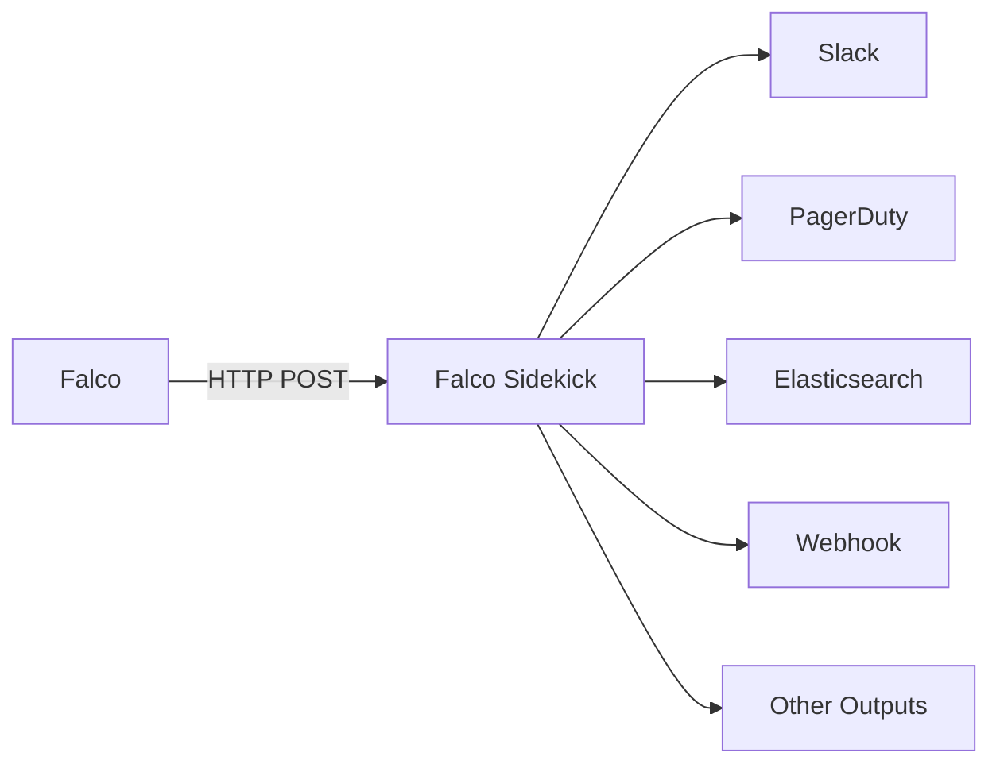
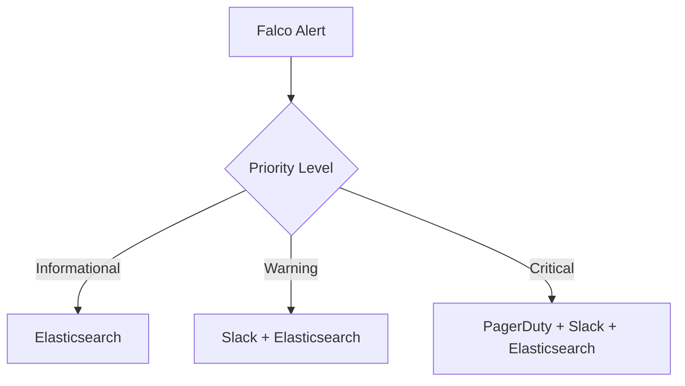

# How to Use Falco Sidekick for Alerting

Author: [nawazdhandala](https://www.github.com/nawazdhandala)

Tags: Falco, Security, Kubernetes, Alerting, DevOps

Description: Learn how to configure Falco Sidekick to route security alerts to Slack, PagerDuty, and other destinations for real-time incident response.

---

Falco is a powerful runtime security tool for Kubernetes, but raw Falco alerts are only useful if they reach the right people at the right time. Falco Sidekick solves this problem by acting as a centralized alert router that can forward Falco events to over 50 different outputs including Slack, PagerDuty, Elasticsearch, and more.

## What is Falco Sidekick?

Falco Sidekick is a companion application that receives events from Falco and forwards them to various outputs. It provides a simple HTTP endpoint that Falco can send alerts to, then handles the routing logic based on your configuration.



## Installing Falco Sidekick

The easiest way to deploy Falco Sidekick is using Helm alongside your Falco installation.

```bash
# Add the Falcosecurity Helm repository
helm repo add falcosecurity https://falcosecurity.github.io/charts
helm repo update

# Install Falco with Sidekick enabled
helm install falco falcosecurity/falco \
  --namespace falco \
  --create-namespace \
  --set falcosidekick.enabled=true \
  --set falcosidekick.webui.enabled=true
```

You can also install Sidekick separately if Falco is already running:

```bash
# Install Sidekick as a standalone deployment
helm install falco-sidekick falcosecurity/falco-sidekick \
  --namespace falco \
  --set config.slack.webhookurl="https://hooks.slack.com/services/XXX/YYY/ZZZ"
```

## Configuring Falco to Send Events to Sidekick

Update your Falco configuration to forward events to Sidekick's HTTP endpoint:

```yaml
# falco.yaml configuration
json_output: true
json_include_output_property: true

http_output:
  enabled: true
  url: "http://falco-sidekick:2801/"
  user_agent: "falcosecurity/falco"
```

## Setting Up Slack Notifications

Slack is one of the most common destinations for security alerts. Here is how to configure it:

```yaml
# sidekick-values.yaml
config:
  slack:
    webhookurl: "https://hooks.slack.com/services/T00000000/B00000000/XXXXXXXX"
    channel: "#security-alerts"
    username: "Falco"
    icon: "https://raw.githubusercontent.com/falcosecurity/falco/master/logo.png"
    # Filter alerts by priority
    minimumpriority: "warning"
    # Message format customization
    outputformat: "all"
```

Deploy with the custom configuration:

```bash
helm upgrade falco-sidekick falcosecurity/falco-sidekick \
  --namespace falco \
  -f sidekick-values.yaml
```

## Configuring PagerDuty for Critical Alerts

For critical security events, you want immediate notification through PagerDuty:

```yaml
# sidekick-values.yaml
config:
  pagerduty:
    routingkey: "your-pagerduty-integration-key"
    minimumpriority: "critical"
```

This ensures only critical alerts trigger PagerDuty incidents, preventing alert fatigue.

## Multi-Output Configuration Example

A production setup typically routes different priority alerts to different destinations:

```yaml
# sidekick-values.yaml
config:
  # Low priority alerts go to a logging system
  elasticsearch:
    hostport: "http://elasticsearch:9200"
    index: "falco-alerts"
    type: "_doc"
    minimumpriority: "informational"

  # Warning and above go to Slack
  slack:
    webhookurl: "https://hooks.slack.com/services/XXX/YYY/ZZZ"
    channel: "#security-alerts"
    minimumpriority: "warning"

  # Critical alerts trigger PagerDuty
  pagerduty:
    routingkey: "your-routing-key"
    minimumpriority: "critical"

  # Send all alerts to a custom webhook for processing
  webhook:
    address: "https://your-siem.example.com/api/falco"
    minimumpriority: ""
```



## Using Custom Fields and Templates

Sidekick allows you to add custom fields to enrich your alerts:

```yaml
config:
  customfields:
    environment: "production"
    cluster: "us-east-1"
    team: "platform-security"

  # Customize the message template
  slack:
    webhookurl: "https://hooks.slack.com/services/XXX/YYY/ZZZ"
    outputformat: "fields"
    messageformat: "Alert: *{{ .Output }}* on {{ .Hostname }}"
```

## Testing Your Configuration

Verify that Sidekick is receiving and forwarding alerts:

```bash
# Check Sidekick logs
kubectl logs -n falco -l app.kubernetes.io/name=falco-sidekick -f

# Send a test event using curl
kubectl run test-alert --rm -it --image=curlimages/curl -- \
  curl -X POST http://falco-sidekick:2801/test \
  -H "Content-Type: application/json" \
  -d '{"output":"Test alert from manual trigger","priority":"Warning","rule":"Test Rule"}'
```

## Monitoring Sidekick Health

Sidekick exposes Prometheus metrics for monitoring:

```yaml
# Enable Prometheus metrics
config:
  prometheus:
    enabled: true
```

Key metrics to monitor:

```bash
# Total events received
falco_sidekick_events_total

# Events by output destination
falco_sidekick_outputs_total{destination="slack",status="ok"}

# Output failures
falco_sidekick_outputs_total{destination="pagerduty",status="error"}
```

## Best Practices

1. **Set Appropriate Priority Filters** - Route informational alerts to logging systems and reserve pager alerts for critical events only
2. **Use Custom Fields** - Add environment, cluster, and team information to help responders quickly identify affected systems
3. **Enable the Web UI** - Falco Sidekick UI provides a visual interface for reviewing recent alerts
4. **Monitor Sidekick Itself** - Use Prometheus metrics to ensure alerts are being delivered successfully
5. **Test Regularly** - Periodically send test alerts to verify your notification pipeline is working

---

Falco Sidekick transforms Falco from a detection tool into a complete security alerting system. By routing alerts to the right channels based on priority and adding context through custom fields, you can build an effective incident response workflow that catches critical security events without overwhelming your team with noise.

**Related Reading:**

- [How to Monitor Falco Alerts](https://oneuptime.com/blog/post/2026-01-28-monitor-falco-alerts/view)
- [How to Implement Falco for Container Security](https://oneuptime.com/blog/post/2026-01-28-falco-container-security/view)
- [How to Integrate Falco with SIEM](https://oneuptime.com/blog/post/2026-01-28-falco-siem-integration/view)
