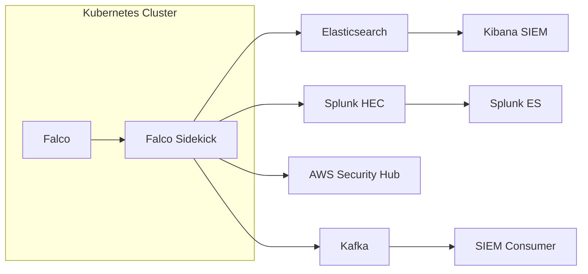
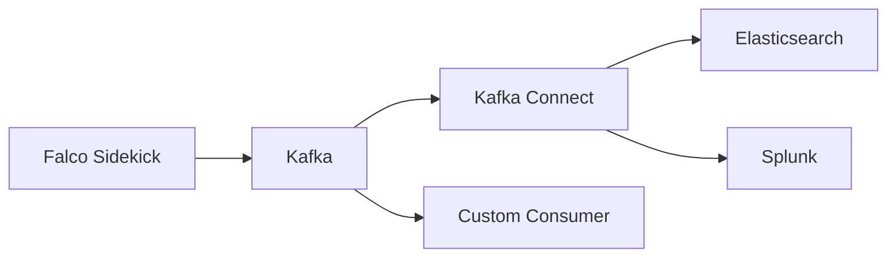

# How to Integrate Falco with SIEM

Author: [nawazdhandala](https://www.github.com/nawazdhandala)

Tags: Falco, SIEM, Security, Elasticsearch, Splunk, Integration

Description: Learn how to forward Falco security alerts to SIEM platforms like Splunk, Elasticsearch, and other security analytics tools.

---

Security Information and Event Management (SIEM) platforms provide centralized security monitoring, correlation, and incident response capabilities. Integrating Falco with your SIEM creates a unified view of security events across containers, Kubernetes, and traditional infrastructure.

## Integration Architecture



## Elasticsearch Integration

Elasticsearch with Kibana provides a popular open-source SIEM solution.

### Configure Sidekick for Elasticsearch

```yaml
# sidekick-values.yaml
config:
  elasticsearch:
    hostport: "https://elasticsearch.example.com:9200"
    index: "falco-alerts"
    type: "_doc"
    # Authentication options
    username: "elastic"
    password: "changeme"
    # Or use API key
    # apikey: "your-api-key"

    # TLS configuration
    mutualtls: false
    checkcert: true

    # Index settings
    suffix: "daily"  # Creates falco-alerts-YYYY.MM.DD

    # Send all priority levels
    minimumpriority: ""
```

### Elasticsearch Index Template

Create an index template for proper field mapping:

```json
{
  "index_patterns": ["falco-alerts-*"],
  "template": {
    "settings": {
      "number_of_shards": 1,
      "number_of_replicas": 1
    },
    "mappings": {
      "properties": {
        "time": {
          "type": "date"
        },
        "rule": {
          "type": "keyword"
        },
        "priority": {
          "type": "keyword"
        },
        "source": {
          "type": "keyword"
        },
        "output": {
          "type": "text",
          "fields": {
            "keyword": {
              "type": "keyword",
              "ignore_above": 256
            }
          }
        },
        "output_fields": {
          "type": "object",
          "properties": {
            "container.id": { "type": "keyword" },
            "container.name": { "type": "keyword" },
            "container.image.repository": { "type": "keyword" },
            "k8s.ns.name": { "type": "keyword" },
            "k8s.pod.name": { "type": "keyword" },
            "proc.name": { "type": "keyword" },
            "proc.cmdline": { "type": "text" },
            "user.name": { "type": "keyword" },
            "fd.name": { "type": "keyword" }
          }
        },
        "hostname": {
          "type": "keyword"
        },
        "tags": {
          "type": "keyword"
        }
      }
    }
  }
}
```

Apply the template:

```bash
curl -X PUT "https://elasticsearch:9200/_index_template/falco-alerts" \
  -H "Content-Type: application/json" \
  -u elastic:password \
  -d @falco-index-template.json
```

### Kibana Dashboard Setup

Create visualizations for Falco alerts:

```json
{
  "title": "Falco Security Dashboard",
  "panels": [
    {
      "title": "Alerts by Priority",
      "type": "pie",
      "query": {
        "aggs": {
          "priority": {
            "terms": { "field": "priority" }
          }
        }
      }
    },
    {
      "title": "Alerts Over Time",
      "type": "line",
      "query": {
        "aggs": {
          "time_buckets": {
            "date_histogram": {
              "field": "time",
              "fixed_interval": "5m"
            }
          }
        }
      }
    },
    {
      "title": "Top Triggered Rules",
      "type": "table",
      "query": {
        "aggs": {
          "rules": {
            "terms": { "field": "rule", "size": 10 }
          }
        }
      }
    }
  ]
}
```

## Splunk Integration

Splunk Enterprise Security is a leading commercial SIEM platform.

### Configure Splunk HTTP Event Collector

First, enable HEC in Splunk:

```bash
# In Splunk Web: Settings > Data Inputs > HTTP Event Collector
# Create new token with:
# - Source type: _json
# - Index: falco
```

### Configure Sidekick for Splunk

```yaml
# sidekick-values.yaml
config:
  splunk:
    hostport: "https://splunk-hec.example.com:8088"
    token: "your-hec-token"
    index: "falco"
    source: "falco"
    sourcetype: "_json"

    # TLS options
    checkcert: true

    # Send all alerts
    minimumpriority: ""
```

### Splunk Search Queries

Common SPL queries for Falco alerts:

```spl
# All Falco alerts in the last 24 hours
index=falco sourcetype=_json
| stats count by rule, priority
| sort -count

# Critical alerts only
index=falco sourcetype=_json priority="Critical"
| table _time, rule, output, output_fields.container.name

# Alerts by container image
index=falco sourcetype=_json
| spath output_fields.container.image.repository as image
| stats count by image
| sort -count

# Timeline of specific rule triggers
index=falco sourcetype=_json rule="Terminal shell in container"
| timechart span=1h count
```

### Splunk Alert Configuration

Create Splunk alerts for critical Falco events:

```spl
# Save as alert: Critical Falco Security Event
index=falco sourcetype=_json priority="Critical"
| head 1
| table _time, rule, output, hostname
```

Alert settings:
- Trigger: Number of Results > 0
- Time Range: Last 5 minutes
- Action: Send email, Create incident, etc.

## Kafka Integration for Scalability

For high-volume environments, use Kafka as an intermediary:



### Configure Sidekick for Kafka

```yaml
# sidekick-values.yaml
config:
  kafka:
    hostport: "kafka-bootstrap:9092"
    topic: "falco-alerts"
    partition: 0

    # Authentication
    sasl: "plain"
    username: "falco"
    password: "password"

    # TLS
    tls: true

    # Compression
    compression: "gzip"

    # Async mode for better performance
    async: true

    minimumpriority: ""
```

### Kafka Connect Sink for Elasticsearch

```json
{
  "name": "falco-elasticsearch-sink",
  "config": {
    "connector.class": "io.confluent.connect.elasticsearch.ElasticsearchSinkConnector",
    "topics": "falco-alerts",
    "connection.url": "http://elasticsearch:9200",
    "type.name": "_doc",
    "key.ignore": "true",
    "schema.ignore": "true",
    "transforms": "extractTimestamp",
    "transforms.extractTimestamp.type": "org.apache.kafka.connect.transforms.InsertField$Value",
    "transforms.extractTimestamp.timestamp.field": "indexed_at"
  }
}
```

## AWS Security Hub Integration

For AWS environments, forward alerts to Security Hub:

```yaml
# sidekick-values.yaml
config:
  awssecurityhub:
    region: "us-east-1"
    accountid: "123456789012"

    # Minimum priority to forward
    minimumpriority: "warning"
```

IAM policy required:

```json
{
  "Version": "2012-10-17",
  "Statement": [
    {
      "Effect": "Allow",
      "Action": [
        "securityhub:BatchImportFindings"
      ],
      "Resource": "*"
    }
  ]
}
```

## Custom Webhook Integration

For SIEMs not directly supported, use the webhook output:

```yaml
# sidekick-values.yaml
config:
  webhook:
    address: "https://your-siem.example.com/api/v1/events"
    method: "POST"

    # Custom headers
    customheaders:
      Authorization: "Bearer your-api-token"
      X-Source: "falco"

    # Minimum priority
    minimumpriority: ""
```

Transform the payload with a proxy if needed:

```python
# webhook-proxy.py - Transform Falco alerts for custom SIEM
from flask import Flask, request, jsonify
import requests

app = Flask(__name__)

SIEM_ENDPOINT = "https://custom-siem.example.com/api/events"
SIEM_API_KEY = "your-api-key"

@app.route('/falco-webhook', methods=['POST'])
def transform_and_forward():
    falco_alert = request.json

    # Transform to SIEM format
    siem_event = {
        "timestamp": falco_alert.get("time"),
        "event_type": "container_security",
        "severity": map_priority(falco_alert.get("priority")),
        "rule_name": falco_alert.get("rule"),
        "description": falco_alert.get("output"),
        "source_host": falco_alert.get("hostname"),
        "raw_data": falco_alert
    }

    # Forward to SIEM
    response = requests.post(
        SIEM_ENDPOINT,
        json=siem_event,
        headers={"Authorization": f"Bearer {SIEM_API_KEY}"}
    )

    return jsonify({"status": "forwarded"}), response.status_code

def map_priority(falco_priority):
    mapping = {
        "Emergency": 10,
        "Alert": 9,
        "Critical": 8,
        "Error": 7,
        "Warning": 5,
        "Notice": 3,
        "Informational": 1,
        "Debug": 0
    }
    return mapping.get(falco_priority, 5)

if __name__ == '__main__':
    app.run(host='0.0.0.0', port=8080)
```

## Data Enrichment

Add context to Falco alerts before sending to SIEM:

```yaml
# sidekick-values.yaml
config:
  # Add custom fields to all alerts
  customfields:
    environment: "production"
    cluster_name: "us-east-1-prod"
    team: "platform"
    data_classification: "internal"

  # Add dynamic fields based on alert properties
  templatedfields:
    severity_score: '{{ if eq .Priority "Critical" }}10{{ else if eq .Priority "Warning" }}5{{ else }}1{{ end }}'
```

## SIEM Correlation Rules

Example correlation rules to create in your SIEM:

### Multi-Stage Attack Detection

```spl
# Splunk correlation: Detect reconnaissance followed by exploitation
index=falco
| transaction container.name maxspan=10m
| search rule="Contact K8S API Server From Container" AND rule="Terminal shell in container"
| table _time, container.name, rule
```

### Lateral Movement Detection

```json
{
  "name": "Lateral Movement in Kubernetes",
  "description": "Detect pod-to-pod communication followed by shell access",
  "query": "priority:Critical AND (rule:\"Unexpected Network Connection\" OR rule:\"Terminal shell in container\")",
  "group_by": ["output_fields.k8s.pod.name"],
  "time_window": "5m",
  "threshold": 2
}
```

## Best Practices

1. **Use Structured Data** - Ensure Falco outputs JSON for easy SIEM parsing
2. **Normalize Field Names** - Map Falco fields to your SIEM's common schema
3. **Set Appropriate Retention** - Balance storage costs with investigation needs
4. **Create Alert Playbooks** - Document response procedures for each rule type
5. **Monitor Integration Health** - Alert on delivery failures to prevent blind spots
6. **Test Correlation Rules** - Validate SIEM rules detect multi-stage attacks

---

Integrating Falco with your SIEM platform provides centralized visibility into container security events alongside your other security data. Whether you use Elasticsearch, Splunk, or a custom solution, the combination of Falco's runtime detection with SIEM correlation capabilities creates a powerful defense against container-based threats.

**Related Reading:**

- [How to Use Falco Sidekick for Alerting](https://oneuptime.com/blog/post/2026-01-28-falco-sidekick-alerting/view)
- [How to Monitor Falco Alerts](https://oneuptime.com/blog/post/2026-01-28-monitor-falco-alerts/view)
- [How to Implement Falco for Container Security](https://oneuptime.com/blog/post/2026-01-28-falco-container-security/view)
