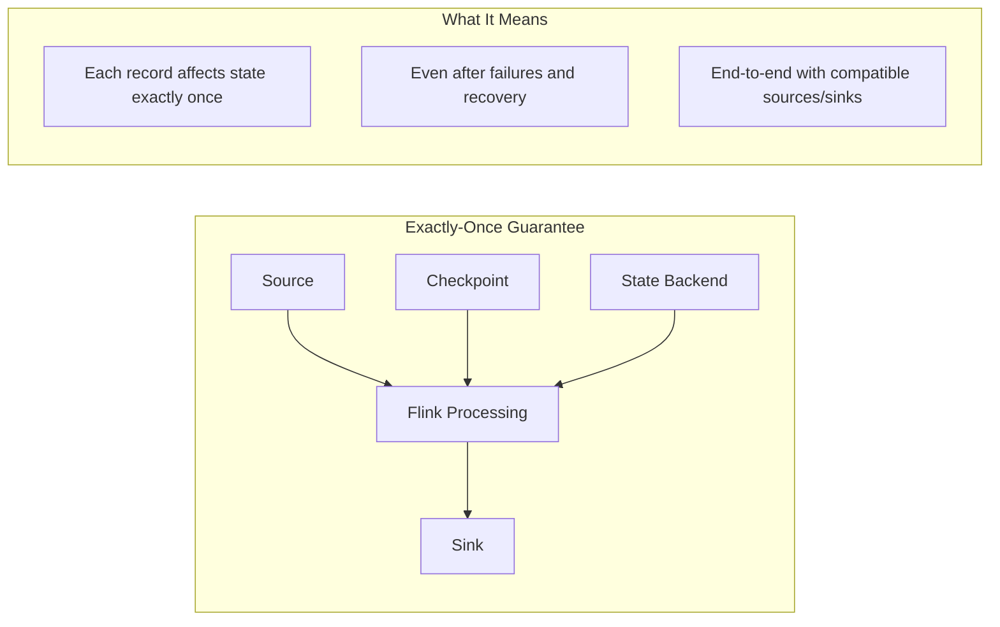
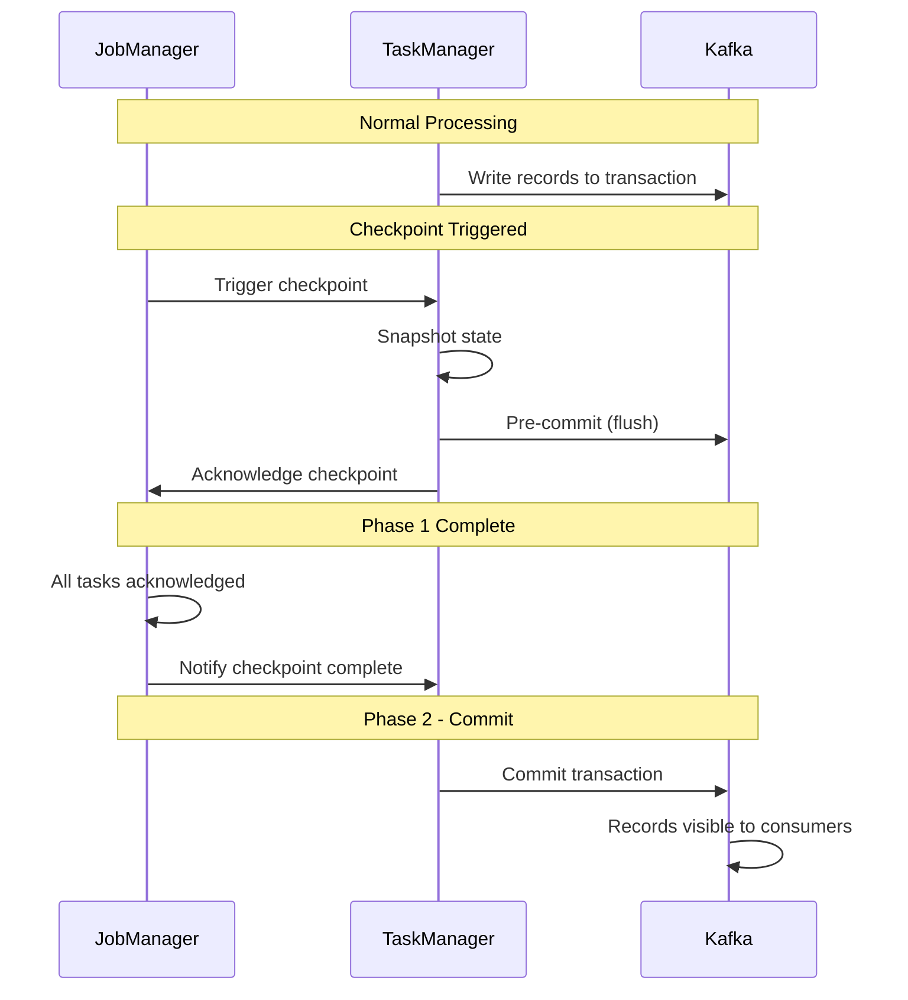
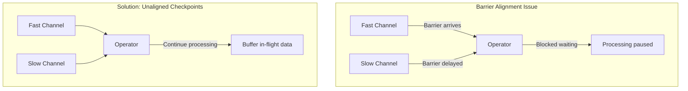

# How to Implement Flink Exactly-Once Processing

Author: [nawazdhandala](https://www.github.com/nawazdhandala)

Tags: Apache Flink, Stream Processing, Exactly-Once, Checkpointing, Kafka, Real-Time

Description: A practical guide to implementing exactly-once processing semantics in Apache Flink, covering checkpointing, two-phase commit, and Kafka integration.

---

> Exactly-once processing is the holy grail of stream processing. Apache Flink provides robust mechanisms to guarantee that each record is processed exactly once, even in the face of failures. This guide walks you through implementing these guarantees in production systems.

Data integrity matters. In financial transactions, event counting, or any stateful computation, processing a record twice or missing it entirely can have serious consequences. Flink's exactly-once semantics ensure that your results are always correct, regardless of machine failures or network issues.

---

## Understanding Exactly-Once Semantics

Before diving into implementation, let's clarify what exactly-once actually means in Flink:



Flink achieves exactly-once through a combination of:
- **Checkpointing**: Periodic snapshots of operator state
- **Barrier alignment**: Coordinating checkpoints across parallel operators
- **Two-phase commit**: Ensuring atomic writes to external systems

---

## Prerequisites

Before implementing exactly-once processing, ensure you have:
- Apache Flink 1.17 or higher
- Kafka cluster (for end-to-end exactly-once with Kafka)
- State backend configured (RocksDB recommended for production)
- Understanding of Flink's checkpoint mechanism

---

## Enabling Checkpointing

Checkpointing is the foundation of exactly-once processing. Here's how to configure it properly:

```java
import org.apache.flink.streaming.api.environment.StreamExecutionEnvironment;
import org.apache.flink.streaming.api.CheckpointingMode;
import org.apache.flink.streaming.api.environment.CheckpointConfig;

public class ExactlyOnceJob {
    public static void main(String[] args) throws Exception {
        StreamExecutionEnvironment env = StreamExecutionEnvironment.getExecutionEnvironment();

        // Enable checkpointing with 10-second intervals
        // This creates periodic snapshots of your application state
        env.enableCheckpointing(10000);

        // Set exactly-once mode - this is the default but explicit is better
        env.getCheckpointConfig().setCheckpointingMode(CheckpointingMode.EXACTLY_ONCE);

        // Minimum time between checkpoints - prevents checkpoint storms
        // If checkpoints take 8 seconds, next one starts 2 seconds after completion
        env.getCheckpointConfig().setMinPauseBetweenCheckpoints(500);

        // Checkpoint timeout - fail checkpoint if not complete within this time
        env.getCheckpointConfig().setCheckpointTimeout(60000);

        // Maximum concurrent checkpoints - usually keep at 1 for predictability
        env.getCheckpointConfig().setMaxConcurrentCheckpoints(1);

        // Enable externalized checkpoints - critical for recovery
        // RETAIN_ON_CANCELLATION keeps checkpoints even when job is cancelled
        env.getCheckpointConfig().setExternalizedCheckpointCleanup(
            CheckpointConfig.ExternalizedCheckpointCleanup.RETAIN_ON_CANCELLATION
        );

        // Tolerate checkpoint failures before job fails
        // Set to 0 in strict environments, higher for more tolerance
        env.getCheckpointConfig().setTolerableCheckpointFailureNumber(3);

        // Your job logic here
        env.execute("Exactly-Once Processing Job");
    }
}
```

---

## Configuring State Backend

The state backend determines how and where Flink stores checkpoint data. RocksDB is recommended for production:

```java
import org.apache.flink.contrib.streaming.state.EmbeddedRocksDBStateBackend;
import org.apache.flink.runtime.state.storage.FileSystemCheckpointStorage;

public class StateBackendConfiguration {
    public static void configureStateBackend(StreamExecutionEnvironment env) {
        // Use RocksDB for large state - stores data on disk with LSM trees
        // Incremental checkpoints only write changed data, reducing I/O
        EmbeddedRocksDBStateBackend rocksDBBackend = new EmbeddedRocksDBStateBackend(true);
        env.setStateBackend(rocksDBBackend);

        // Configure checkpoint storage location
        // Use a distributed filesystem (HDFS, S3) for production
        env.getCheckpointConfig().setCheckpointStorage(
            new FileSystemCheckpointStorage("hdfs://namenode:8020/flink/checkpoints")
        );

        // Alternative: S3 storage for cloud deployments
        // env.getCheckpointConfig().setCheckpointStorage(
        //     new FileSystemCheckpointStorage("s3://bucket/flink/checkpoints")
        // );
    }
}
```

---

## End-to-End Exactly-Once with Kafka

Achieving exactly-once from source to sink requires compatible connectors. Kafka supports this through the two-phase commit protocol.

### Kafka Source Configuration

```java
import org.apache.flink.connector.kafka.source.KafkaSource;
import org.apache.flink.connector.kafka.source.enumerator.initializer.OffsetsInitializer;
import org.apache.flink.api.common.serialization.SimpleStringSchema;

public class KafkaExactlyOnceSource {
    public static KafkaSource<String> createSource() {
        return KafkaSource.<String>builder()
            .setBootstrapServers("kafka:9092")
            .setTopics("input-topic")
            .setGroupId("flink-consumer-group")
            // Start from committed offsets, fall back to earliest
            .setStartingOffsets(OffsetsInitializer.committedOffsets(
                OffsetsInitializer.OffsetResetStrategy.EARLIEST
            ))
            .setValueOnlyDeserializer(new SimpleStringSchema())
            // Commit offsets to Kafka on checkpoints
            // This ensures source position is part of the checkpoint
            .setProperty("enable.auto.commit", "false")
            .build();
    }
}
```

### Kafka Sink with Two-Phase Commit

The Kafka sink uses two-phase commit to ensure exactly-once delivery:

```java
import org.apache.flink.connector.kafka.sink.KafkaSink;
import org.apache.flink.connector.kafka.sink.KafkaRecordSerializationSchema;
import org.apache.flink.connector.base.DeliveryGuarantee;
import org.apache.kafka.clients.producer.ProducerConfig;

public class KafkaExactlyOnceSink {
    public static KafkaSink<String> createSink() {
        return KafkaSink.<String>builder()
            .setBootstrapServers("kafka:9092")
            .setRecordSerializer(
                KafkaRecordSerializationSchema.builder()
                    .setTopic("output-topic")
                    .setValueSerializationSchema(new SimpleStringSchema())
                    .build()
            )
            // EXACTLY_ONCE enables two-phase commit protocol
            .setDeliveryGuarantee(DeliveryGuarantee.EXACTLY_ONCE)
            // Transaction prefix - must be unique per sink
            // Used to identify pending transactions after recovery
            .setTransactionalIdPrefix("flink-kafka-sink")
            // Kafka transaction timeout - must be less than broker's
            // transaction.max.timeout.ms (default 15 minutes)
            .setProperty(
                ProducerConfig.TRANSACTION_TIMEOUT_CONFIG,
                String.valueOf(15 * 60 * 1000)
            )
            .build();
    }
}
```

### Complete Job Example

```java
import org.apache.flink.streaming.api.environment.StreamExecutionEnvironment;
import org.apache.flink.api.common.eventtime.WatermarkStrategy;
import org.apache.flink.streaming.api.datastream.DataStream;

public class ExactlyOnceKafkaJob {
    public static void main(String[] args) throws Exception {
        StreamExecutionEnvironment env = StreamExecutionEnvironment.getExecutionEnvironment();

        // Configure checkpointing for exactly-once
        env.enableCheckpointing(10000);
        env.getCheckpointConfig().setCheckpointingMode(CheckpointingMode.EXACTLY_ONCE);
        env.getCheckpointConfig().setMinPauseBetweenCheckpoints(500);

        // Configure RocksDB state backend
        env.setStateBackend(new EmbeddedRocksDBStateBackend(true));
        env.getCheckpointConfig().setCheckpointStorage("s3://bucket/checkpoints");

        // Create Kafka source with exactly-once semantics
        KafkaSource<String> source = KafkaSource.<String>builder()
            .setBootstrapServers("kafka:9092")
            .setTopics("orders")
            .setGroupId("order-processor")
            .setStartingOffsets(OffsetsInitializer.earliest())
            .setValueOnlyDeserializer(new SimpleStringSchema())
            .build();

        // Read from source
        DataStream<String> orders = env.fromSource(
            source,
            WatermarkStrategy.noWatermarks(),
            "Kafka Orders Source"
        );

        // Process orders - parse, validate, enrich
        DataStream<String> processedOrders = orders
            .map(new OrderParser())
            .filter(new OrderValidator())
            .map(new OrderEnricher());

        // Create exactly-once Kafka sink
        KafkaSink<String> sink = KafkaSink.<String>builder()
            .setBootstrapServers("kafka:9092")
            .setRecordSerializer(
                KafkaRecordSerializationSchema.builder()
                    .setTopic("processed-orders")
                    .setValueSerializationSchema(new SimpleStringSchema())
                    .build()
            )
            .setDeliveryGuarantee(DeliveryGuarantee.EXACTLY_ONCE)
            .setTransactionalIdPrefix("order-processor")
            .build();

        // Write to sink
        processedOrders.sinkTo(sink);

        env.execute("Exactly-Once Order Processing");
    }
}
```

---

## Two-Phase Commit Protocol

Understanding how two-phase commit works helps debug issues:



---

## Implementing Custom Exactly-Once Sinks

For sinks that don't support two-phase commit natively, implement the `TwoPhaseCommitSinkFunction`:

```java
import org.apache.flink.streaming.api.functions.sink.TwoPhaseCommitSinkFunction;
import org.apache.flink.api.common.typeutils.base.StringSerializer;

public class ExactlyOnceDatabaseSink
    extends TwoPhaseCommitSinkFunction<String, DatabaseTransaction, Void> {

    private final String jdbcUrl;

    public ExactlyOnceDatabaseSink(String jdbcUrl) {
        super(
            new TransactionSerializer(),  // How to serialize transactions
            VoidSerializer.INSTANCE        // Context serializer
        );
        this.jdbcUrl = jdbcUrl;
    }

    @Override
    protected DatabaseTransaction beginTransaction() throws Exception {
        // Start a new database transaction
        // This is called when a new checkpoint interval begins
        Connection conn = DriverManager.getConnection(jdbcUrl);
        conn.setAutoCommit(false);
        return new DatabaseTransaction(conn);
    }

    @Override
    protected void invoke(DatabaseTransaction transaction, String value, Context context)
        throws Exception {
        // Write data within the transaction
        // This is called for each record
        PreparedStatement stmt = transaction.getConnection()
            .prepareStatement("INSERT INTO events (data) VALUES (?)");
        stmt.setString(1, value);
        stmt.executeUpdate();
    }

    @Override
    protected void preCommit(DatabaseTransaction transaction) throws Exception {
        // Called during checkpoint - prepare to commit
        // Flush any buffers, ensure all writes are durable
        transaction.getConnection().commit();
        // But don't close - might need to rollback if checkpoint fails
    }

    @Override
    protected void commit(DatabaseTransaction transaction) {
        // Called after checkpoint succeeds - finalize the commit
        // At this point, commit is already done in preCommit
        // Close resources
        try {
            transaction.getConnection().close();
        } catch (SQLException e) {
            LOG.warn("Error closing connection", e);
        }
    }

    @Override
    protected void abort(DatabaseTransaction transaction) {
        // Called if checkpoint fails - rollback
        try {
            transaction.getConnection().rollback();
            transaction.getConnection().close();
        } catch (SQLException e) {
            LOG.error("Error during abort", e);
        }
    }
}
```

---

## Handling Idempotent Operations

When exactly-once sinks aren't available, use idempotent writes as an alternative:

```java
import org.apache.flink.streaming.api.functions.sink.SinkFunction;

public class IdempotentDatabaseSink implements SinkFunction<OrderEvent> {
    private final String jdbcUrl;

    @Override
    public void invoke(OrderEvent event, Context context) throws Exception {
        try (Connection conn = DriverManager.getConnection(jdbcUrl)) {
            // Use UPSERT/MERGE for idempotency
            // If the same record is written twice, it produces the same result
            PreparedStatement stmt = conn.prepareStatement(
                "INSERT INTO orders (order_id, amount, status, updated_at) " +
                "VALUES (?, ?, ?, ?) " +
                "ON CONFLICT (order_id) DO UPDATE SET " +
                "amount = EXCLUDED.amount, " +
                "status = EXCLUDED.status, " +
                "updated_at = EXCLUDED.updated_at " +
                "WHERE orders.updated_at < EXCLUDED.updated_at"  // Prevent older updates
            );

            stmt.setString(1, event.getOrderId());
            stmt.setBigDecimal(2, event.getAmount());
            stmt.setString(3, event.getStatus());
            stmt.setTimestamp(4, new Timestamp(event.getTimestamp()));

            stmt.executeUpdate();
        }
    }
}
```

---

## Monitoring Checkpoints

Monitor checkpoint health to ensure exactly-once guarantees are maintained:

```java
import org.apache.flink.runtime.rest.messages.checkpoints.CheckpointStatistics;

// Key metrics to monitor via Flink's REST API or metrics system:
// - checkpoint_duration: Time to complete checkpoints
// - checkpoint_size: Size of checkpoint data
// - checkpoint_alignment_time: Time for barrier alignment
// - number_of_failed_checkpoints: Should be low

// Configure alerts for checkpoint issues
// Alert if checkpoint duration > 80% of checkpoint interval
// Alert if consecutive checkpoint failures > 3
```

Example Prometheus metrics to track:

```yaml
# Alert rules for checkpoint monitoring
groups:
  - name: flink_checkpoints
    rules:
      - alert: CheckpointDurationHigh
        expr: flink_jobmanager_job_lastCheckpointDuration > 8000
        for: 5m
        labels:
          severity: warning
        annotations:
          summary: "Checkpoint duration is high"

      - alert: CheckpointsFailing
        expr: increase(flink_jobmanager_job_numberOfFailedCheckpoints[10m]) > 3
        labels:
          severity: critical
        annotations:
          summary: "Multiple checkpoint failures detected"
```

---

## Common Pitfalls and Solutions

### Checkpoint Timeout Issues

```java
// Problem: Checkpoints timing out
// Solution: Tune checkpoint configuration

env.getCheckpointConfig().setCheckpointTimeout(300000);  // Increase timeout
env.getCheckpointConfig().setMinPauseBetweenCheckpoints(10000);  // More pause

// Also consider:
// - Reducing state size
// - Using incremental checkpoints
// - Scaling up parallelism to distribute state
```

### Kafka Transaction Timeout

```java
// Problem: Kafka transactions timing out
// Solution: Align timeouts properly

// Flink checkpoint interval: 10s
// Kafka transaction timeout must be > checkpoint interval
// But less than broker's transaction.max.timeout.ms

kafkaSinkBuilder
    .setProperty(ProducerConfig.TRANSACTION_TIMEOUT_CONFIG,
        String.valueOf(15 * 60 * 1000))  // 15 minutes
    .build();

// On Kafka broker, ensure:
// transaction.max.timeout.ms >= your transaction timeout
```

### Barrier Alignment Delays



Enable unaligned checkpoints for high-throughput jobs:

```java
// Unaligned checkpoints don't block on barrier alignment
// Trade-off: Larger checkpoint size due to buffered data
env.getCheckpointConfig().enableUnalignedCheckpoints();

// Set threshold for when to use unaligned (in bytes)
env.getCheckpointConfig().setAlignedCheckpointTimeout(
    Duration.ofSeconds(30)
);
```

---

## Best Practices

### 1. Size Your Checkpoints Appropriately

```java
// Keep checkpoint intervals reasonable
// Too frequent = high overhead
// Too infrequent = long recovery time

// Good starting point: 1-5 minutes for most jobs
env.enableCheckpointing(60000);  // 1 minute

// For low-latency requirements, shorter intervals with fast storage
env.enableCheckpointing(10000);  // 10 seconds
```

### 2. Use Incremental Checkpoints

```java
// Incremental checkpoints only store changes since last checkpoint
// Dramatically reduces checkpoint size for large state
EmbeddedRocksDBStateBackend backend = new EmbeddedRocksDBStateBackend(true);
```

### 3. Test Failure Recovery

```java
// Regularly test that jobs recover correctly
// Inject failures in staging environment
// Verify data consistency after recovery

// Example: Kill TaskManager and verify
// 1. Job restarts from checkpoint
// 2. No duplicate records in sink
// 3. No missing records in sink
```

---

## Conclusion

Exactly-once processing in Flink requires careful configuration of checkpointing, state backends, and compatible sources and sinks. The key components are:

- Enable checkpointing with appropriate intervals
- Use RocksDB with incremental checkpoints for large state
- Configure Kafka connectors with exactly-once delivery guarantees
- Monitor checkpoint health and tune accordingly

When exactly-once sinks aren't available, idempotent writes provide a practical alternative that achieves the same data consistency guarantees.

---

*Need to monitor your Flink jobs? [OneUptime](https://oneuptime.com) provides comprehensive observability for stream processing applications, including checkpoint monitoring, throughput metrics, and alerting. Start your free trial today.*

**Related Reading:**
- [How to Debug Flink Job Failures](https://oneuptime.com/blog/post/2026-01-28-debug-flink-job-failures/view)
- [How to Scale Flink Deployments](https://oneuptime.com/blog/post/2026-01-28-scale-flink-deployments/view)
