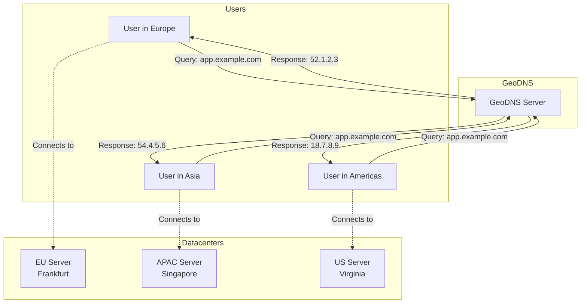
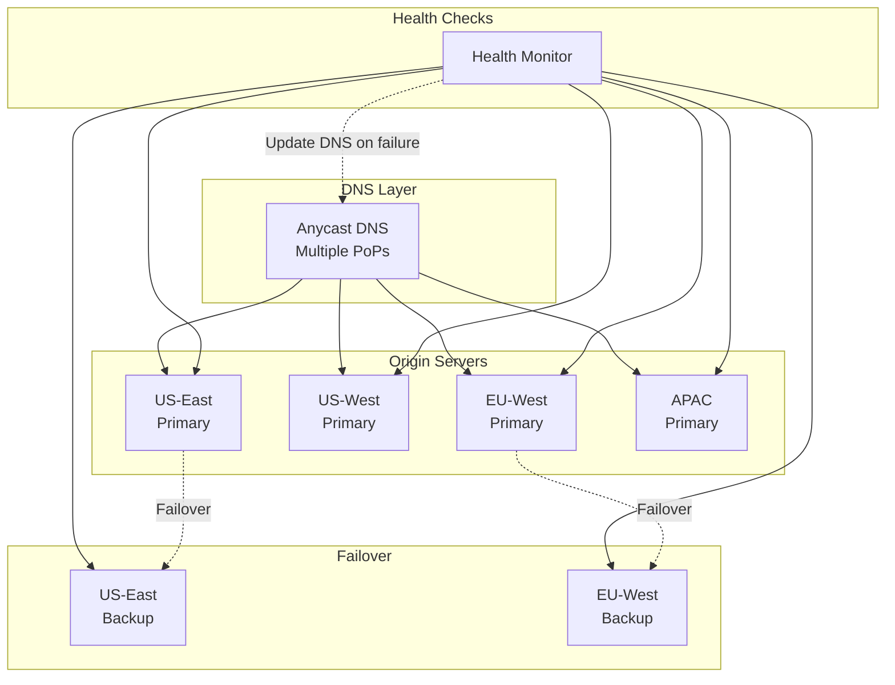

# How to Build GeoDNS for Global Traffic Routing

Author: [nawazdhandala](https://www.github.com/nawazdhandala)

Tags: DNS, Networking, GeoDNS, Load Balancing, CDN, Global Infrastructure, Traffic Management

Description: Learn how to implement GeoDNS to route users to the nearest server based on geographic location, reducing latency and improving application performance worldwide.

---

When your application serves users across multiple continents, every millisecond of latency matters. A user in Tokyo shouldn't wait for responses from a server in Virginia when you have a perfectly good server in Singapore. GeoDNS solves this by returning different IP addresses based on where the DNS query originates - routing users to their nearest datacenter automatically.

This guide covers GeoDNS fundamentals, implementation options, and how to build a global traffic routing system.

---

## How GeoDNS Works

Traditional DNS returns the same IP address regardless of who's asking. GeoDNS adds location awareness:



The DNS server determines the client's location using:
1. **Client IP geolocation** - Maps the resolver's IP to a geographic region
2. **EDNS Client Subnet (ECS)** - Modern resolvers forward the client's subnet for more accurate routing

---

## Implementation Options

### Option 1: Managed GeoDNS Services

The easiest approach is using a DNS provider with built-in GeoDNS:

**AWS Route 53 Geolocation Routing:**

```bash
# Create a geolocation record set using AWS CLI
aws route53 change-resource-record-sets \
  --hosted-zone-id Z1234567890ABC \
  --change-batch '{
    "Changes": [{
      "Action": "CREATE",
      "ResourceRecordSet": {
        "Name": "app.example.com",
        "Type": "A",
        "SetIdentifier": "Europe",
        "GeoLocation": {
          "ContinentCode": "EU"
        },
        "TTL": 60,
        "ResourceRecords": [{"Value": "52.1.2.3"}]
      }
    }]
  }'
```

**Cloudflare Load Balancing with Geo Steering:**

```bash
# Using Cloudflare API to create geo-steered pool
curl -X POST "https://api.cloudflare.com/client/v4/zones/{zone_id}/load_balancers" \
  -H "Authorization: Bearer $CF_API_TOKEN" \
  -H "Content-Type: application/json" \
  --data '{
    "name": "app.example.com",
    "default_pools": ["pool_us_east"],
    "region_pools": {
      "WNAM": ["pool_us_west"],
      "ENAM": ["pool_us_east"],
      "WEU": ["pool_eu_west"],
      "EEU": ["pool_eu_east"],
      "SEAS": ["pool_singapore"],
      "NEAS": ["pool_tokyo"]
    },
    "fallback_pool": "pool_us_east"
  }'
```

### Option 2: Self-Hosted with PowerDNS

For more control, run your own GeoDNS with PowerDNS and its GeoIP backend:

```bash
# Install PowerDNS with GeoIP backend
apt-get install pdns-server pdns-backend-geoip

# Download MaxMind GeoIP database
# (Requires free registration at maxmind.com)
wget "https://download.maxmind.com/app/geoip_download?edition_id=GeoLite2-City&suffix=tar.gz" \
  -O GeoLite2-City.tar.gz
tar -xzf GeoLite2-City.tar.gz
```

Configure PowerDNS:

```yaml
# /etc/powerdns/pdns.d/geoip.conf
launch=geoip
geoip-database-files=/usr/share/GeoIP/GeoLite2-City.mmdb
geoip-zones-file=/etc/powerdns/geo-zones.yaml
geoip-dnssec-keydir=/etc/powerdns/keys
```

Define geographic zones:

```yaml
# /etc/powerdns/geo-zones.yaml
domains:
  - domain: example.com
    ttl: 300
    records:
      app.example.com:
        - svc: '%co.%cn.service.example.com'
          # %co = continent code, %cn = country code
          # Resolves to: na.us.service.example.com for US users

        # Fallback for unmapped regions
        - svc: 'default.service.example.com'

services:
  # North America
  na.us.service.example.com:
    - 192.0.2.1
  na.ca.service.example.com:
    - 192.0.2.1

  # Europe
  eu.de.service.example.com:
    - 192.0.2.2
  eu.gb.service.example.com:
    - 192.0.2.2
  eu.fr.service.example.com:
    - 192.0.2.2

  # Asia Pacific
  as.jp.service.example.com:
    - 192.0.2.3
  as.sg.service.example.com:
    - 192.0.2.3
  oc.au.service.example.com:
    - 192.0.2.3

  # Default fallback
  default.service.example.com:
    - 192.0.2.1
```

### Option 3: BIND with GeoIP

BIND 9.10+ includes native GeoIP support:

```
// /etc/bind/named.conf
options {
    geoip-directory "/usr/share/GeoIP";
};

// Define ACLs based on geography
acl "north-america" {
    geoip country US;
    geoip country CA;
    geoip country MX;
};

acl "europe" {
    geoip country DE;
    geoip country FR;
    geoip country GB;
    geoip country NL;
    // ... other EU countries
};

acl "asia-pacific" {
    geoip country JP;
    geoip country SG;
    geoip country AU;
    geoip country IN;
};

// Use views to return different responses
view "north-america" {
    match-clients { north-america; };
    zone "example.com" {
        type master;
        file "/etc/bind/zones/example.com.na";
    };
};

view "europe" {
    match-clients { europe; };
    zone "example.com" {
        type master;
        file "/etc/bind/zones/example.com.eu";
    };
};

view "asia-pacific" {
    match-clients { asia-pacific; };
    zone "example.com" {
        type master;
        file "/etc/bind/zones/example.com.apac";
    };
};

view "default" {
    match-clients { any; };
    zone "example.com" {
        type master;
        file "/etc/bind/zones/example.com.default";
    };
};
```

---

## Building a GeoDNS System from Scratch

For complete control and customization, here's how to build GeoDNS using Node.js:

```javascript
// geodns-server.js
const dgram = require('dgram');
const dnsPacket = require('dns-packet');
const maxmind = require('maxmind');

class GeoDNSServer {
  constructor(options = {}) {
    this.port = options.port || 53;
    this.geoDbPath = options.geoDbPath || './GeoLite2-City.mmdb';
    this.records = options.records || {};
    this.defaultRecords = options.defaultRecords || {};
  }

  async start() {
    // Load MaxMind database
    this.geoLookup = await maxmind.open(this.geoDbPath);

    // Create UDP server
    this.server = dgram.createSocket('udp4');

    this.server.on('message', (msg, rinfo) => {
      this.handleQuery(msg, rinfo);
    });

    this.server.on('listening', () => {
      console.log(`GeoDNS server listening on port ${this.port}`);
    });

    this.server.bind(this.port);
  }

  handleQuery(msg, rinfo) {
    try {
      const query = dnsPacket.decode(msg);
      const question = query.questions[0];

      if (!question) return;

      // Determine client location
      const location = this.getLocation(rinfo.address);
      console.log(`Query from ${rinfo.address} (${location.continent}/${location.country}): ${question.name}`);

      // Get appropriate answer based on location
      const answer = this.resolveWithGeo(question.name, question.type, location);

      // Build response
      const response = dnsPacket.encode({
        id: query.id,
        type: 'response',
        flags: dnsPacket.RECURSION_DESIRED | dnsPacket.RECURSION_AVAILABLE,
        questions: query.questions,
        answers: answer ? [answer] : []
      });

      this.server.send(response, rinfo.port, rinfo.address);

    } catch (err) {
      console.error('Error handling query:', err);
    }
  }

  getLocation(ip) {
    try {
      const result = this.geoLookup.get(ip);

      return {
        continent: result?.continent?.code || 'XX',
        country: result?.country?.iso_code || 'XX',
        city: result?.city?.names?.en || 'Unknown',
        latitude: result?.location?.latitude,
        longitude: result?.location?.longitude
      };
    } catch (err) {
      return { continent: 'XX', country: 'XX' };
    }
  }

  resolveWithGeo(name, type, location) {
    const recordConfig = this.records[name];

    if (!recordConfig) {
      return this.defaultRecords[name] || null;
    }

    // Try continent-specific record
    let ip = recordConfig[location.continent];

    // Fall back to country-specific
    if (!ip) {
      ip = recordConfig[location.country];
    }

    // Fall back to default
    if (!ip) {
      ip = recordConfig.default;
    }

    if (!ip) return null;

    return {
      name: name,
      type: type,
      class: 'IN',
      ttl: 60,
      data: ip
    };
  }
}

// Configuration
const config = {
  port: 5353, // Use 53 in production (requires root)
  geoDbPath: './GeoLite2-City.mmdb',
  records: {
    'app.example.com': {
      // Continent-level routing
      'NA': '192.0.2.1',   // North America -> US East
      'EU': '192.0.2.2',   // Europe -> Frankfurt
      'AS': '192.0.2.3',   // Asia -> Singapore
      'OC': '192.0.2.3',   // Oceania -> Singapore
      'SA': '192.0.2.4',   // South America -> Sao Paulo
      'AF': '192.0.2.2',   // Africa -> Frankfurt (closest)
      'default': '192.0.2.1'
    },
    'api.example.com': {
      // Country-level routing for API
      'US': '10.0.1.1',
      'CA': '10.0.1.1',
      'DE': '10.0.2.1',
      'GB': '10.0.2.1',
      'JP': '10.0.3.1',
      'SG': '10.0.3.1',
      'AU': '10.0.3.1',
      'default': '10.0.1.1'
    }
  }
};

// Start server
const server = new GeoDNSServer(config);
server.start();
```

---

## GeoDNS Architecture for Production

A production GeoDNS setup needs redundancy and health checking:



### Health-Aware GeoDNS

Combine geographic routing with health checking:

```python
# health_aware_geodns.py
import asyncio
import aiohttp
from dataclasses import dataclass
from typing import Dict, List, Optional
import maxminddb

@dataclass
class Server:
    ip: str
    region: str
    healthy: bool = True
    last_check: float = 0
    latency_ms: float = 0

class HealthAwareGeoDNS:
    def __init__(self, geoip_path: str):
        self.geoip = maxminddb.open_database(geoip_path)
        self.servers: Dict[str, List[Server]] = {}
        self.check_interval = 30  # seconds
        self.check_timeout = 5    # seconds

    def add_server(self, region: str, ip: str):
        """Add a server to a geographic region."""
        if region not in self.servers:
            self.servers[region] = []
        self.servers[region].append(Server(ip=ip, region=region))

    async def health_check(self, server: Server) -> bool:
        """Check if a server is healthy."""
        try:
            async with aiohttp.ClientSession() as session:
                start = asyncio.get_event_loop().time()
                async with session.get(
                    f'http://{server.ip}/health',
                    timeout=aiohttp.ClientTimeout(total=self.check_timeout)
                ) as response:
                    server.latency_ms = (asyncio.get_event_loop().time() - start) * 1000
                    server.healthy = response.status == 200
                    return server.healthy
        except Exception:
            server.healthy = False
            return False

    async def run_health_checks(self):
        """Continuously check server health."""
        while True:
            tasks = []
            for region_servers in self.servers.values():
                for server in region_servers:
                    tasks.append(self.health_check(server))

            await asyncio.gather(*tasks)
            await asyncio.sleep(self.check_interval)

    def get_client_region(self, client_ip: str) -> str:
        """Determine the client's geographic region."""
        try:
            result = self.geoip.get(client_ip)
            continent = result.get('continent', {}).get('code', 'XX')

            # Map continents to our regions
            region_map = {
                'NA': 'us-east',
                'SA': 'us-east',
                'EU': 'eu-west',
                'AF': 'eu-west',
                'AS': 'apac',
                'OC': 'apac'
            }
            return region_map.get(continent, 'us-east')
        except Exception:
            return 'us-east'  # Default fallback

    def resolve(self, client_ip: str) -> Optional[str]:
        """Resolve to the best server for a client."""
        region = self.get_client_region(client_ip)

        # Get healthy servers in the preferred region
        candidates = [s for s in self.servers.get(region, []) if s.healthy]

        if not candidates:
            # Failover: find any healthy server
            for servers in self.servers.values():
                candidates = [s for s in servers if s.healthy]
                if candidates:
                    break

        if not candidates:
            return None

        # Return server with lowest latency
        return min(candidates, key=lambda s: s.latency_ms).ip


# Usage
async def main():
    geodns = HealthAwareGeoDNS('./GeoLite2-City.mmdb')

    # Add servers
    geodns.add_server('us-east', '192.0.2.1')
    geodns.add_server('us-east', '192.0.2.2')
    geodns.add_server('eu-west', '192.0.2.10')
    geodns.add_server('eu-west', '192.0.2.11')
    geodns.add_server('apac', '192.0.2.20')

    # Start health checks in background
    asyncio.create_task(geodns.run_health_checks())

    # Resolve for different clients
    print(geodns.resolve('8.8.8.8'))      # US client
    print(geodns.resolve('185.86.151.1')) # EU client
    print(geodns.resolve('1.1.1.1'))      # APAC client

asyncio.run(main())
```

---

## Testing GeoDNS

Verify your GeoDNS configuration works correctly:

```bash
# Test from different geographic perspectives using EDNS Client Subnet
# dig supports ECS with the +subnet option

# Simulate query from US (Google's DNS IP range)
dig @your-geodns-server app.example.com +subnet=8.8.8.0/24

# Simulate query from Germany
dig @your-geodns-server app.example.com +subnet=185.86.151.0/24

# Simulate query from Japan
dig @your-geodns-server app.example.com +subnet=202.12.27.0/24

# Compare responses - they should return different IPs
```

For comprehensive testing, use global DNS checking tools:

```bash
# Using dnschecker.org API or similar services
# Check resolution from multiple global locations

# Or run your own checks from cloud instances in different regions
for region in us-east-1 eu-west-1 ap-southeast-1; do
  echo "Testing from $region:"
  ssh ec2-$region "dig +short app.example.com"
done
```

---

## Performance Considerations

### TTL Strategy

Lower TTLs enable faster failover but increase DNS query load:

| TTL | Failover Time | Query Load | Use Case |
|-----|---------------|------------|----------|
| 30s | ~30 seconds | High | Critical services needing fast failover |
| 300s | ~5 minutes | Medium | Standard web applications |
| 3600s | ~1 hour | Low | Stable services, CDN origins |

### EDNS Client Subnet Support

For accurate geolocation with public resolvers like 8.8.8.8, support ECS:

```javascript
// Check for EDNS Client Subnet in incoming queries
function getClientSubnet(query) {
  const edns = query.additionals?.find(r => r.type === 'OPT');

  if (edns?.options) {
    const ecs = edns.options.find(o => o.code === 8); // CLIENT_SUBNET
    if (ecs) {
      return ecs.ip; // The client's actual subnet
    }
  }

  return null; // Fall back to resolver IP
}
```

---

## Common Pitfalls

**Resolver location vs user location**: Public DNS resolvers (8.8.8.8, 1.1.1.1) have global anycast presence. Without ECS, you're routing based on the resolver's location, not the user's.

**Caching inconsistency**: If a user's DNS resolver caches your response, they might get routed to the wrong region until TTL expires. Keep TTLs reasonable.

**Failover gaps**: Pure GeoDNS doesn't know if a server is down. Always combine with health checks or use a provider that includes them.

**GeoIP database accuracy**: Free GeoIP databases have lower accuracy than commercial ones. For business-critical routing, consider MaxMind's paid offerings or similar services.

---

GeoDNS is a foundational technology for building globally distributed applications. Whether you use a managed service like Route 53 or Cloudflare, or build your own with PowerDNS or custom code, the key is combining geographic awareness with health monitoring. Users get routed to fast, healthy servers automatically - and that's the difference between a good user experience and a frustrating one.
