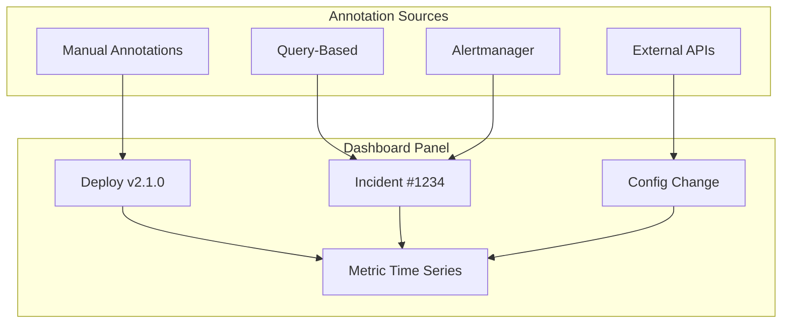
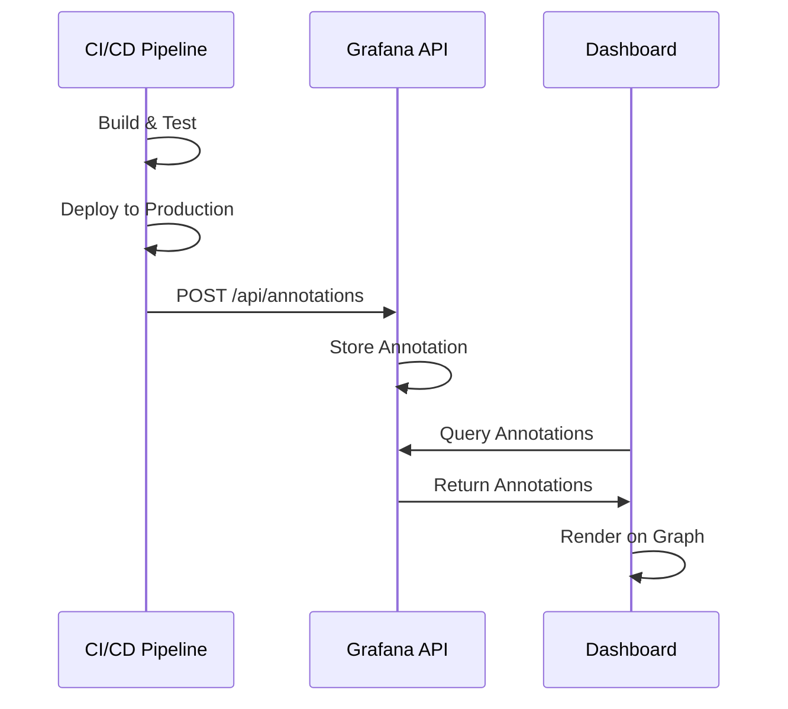
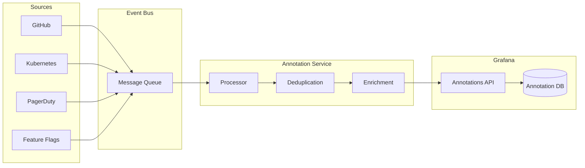

# How to Implement Grafana Annotations

Author: [nawazdhandala](https://www.github.com/nawazdhandala)

Tags: Grafana, Annotations, Observability, Monitoring, Dashboards

Description: Learn how to implement Grafana annotations to overlay events, deployments, and incidents on your dashboards for better context and correlation.

---

Annotations in Grafana are vertical markers on time-series graphs that highlight specific events. They provide crucial context for understanding metric behavior - showing when deployments happened, incidents started, or configuration changes were made. This guide covers everything from basic manual annotations to automated annotation pipelines.

---

## Table of Contents

1. Understanding Annotations
2. Creating Manual Annotations
3. Query-Based Annotations
4. Annotations from Prometheus Alertmanager
5. Annotations from External APIs
6. Automated Annotation Pipelines
7. Annotation Tags and Filtering
8. Annotation API Reference
9. Dashboard Configuration
10. Best Practices

---

## 1. Understanding Annotations

Annotations overlay contextual information on time-series panels. They answer the question: "What else was happening when this metric changed?"



| Annotation Type | Use Case | Source |
|-----------------|----------|--------|
| Manual | Ad-hoc notes, incidents | UI or API |
| Query-based | Database events, alerts | Data source query |
| Native | Built-in Grafana alerts | Grafana Alerting |
| External | CI/CD, deployments, changes | REST API |

---

## 2. Creating Manual Annotations

Manual annotations are the simplest way to mark events on your dashboards.

### Via the UI

1. Hold Ctrl (or Cmd on Mac) and click on a graph at the desired time
2. Fill in the annotation details:
   - Description: What happened
   - Tags: Categories for filtering (e.g., deployment, incident)

### Via the API

```bash
# Create an annotation
curl -X POST \
  -H "Authorization: Bearer ${GRAFANA_API_KEY}" \
  -H "Content-Type: application/json" \
  -d '{
    "dashboardUID": "abc123",
    "panelId": 1,
    "time": 1706450400000,
    "timeEnd": 1706454000000,
    "tags": ["deployment", "production"],
    "text": "Deployed version 2.1.0 to production"
  }' \
  http://localhost:3000/api/annotations
```

### Region Annotations (Time Ranges)

Region annotations highlight a duration rather than a single point:

```bash
# Create a region annotation for a maintenance window
curl -X POST \
  -H "Authorization: Bearer ${GRAFANA_API_KEY}" \
  -H "Content-Type: application/json" \
  -d '{
    "time": 1706450400000,
    "timeEnd": 1706461200000,
    "tags": ["maintenance", "database"],
    "text": "Database maintenance window - expected latency increase"
  }' \
  http://localhost:3000/api/annotations
```

---

## 3. Query-Based Annotations

Query-based annotations pull events directly from your data sources. This is useful for displaying alerts, errors, or business events stored in your metrics or logs.

### Prometheus Annotations

```yaml
# Dashboard JSON annotation configuration
{
  "annotations": {
    "list": [
      {
        "name": "Deployments",
        "datasource": {
          "type": "prometheus",
          "uid": "prometheus-prod"
        },
        "enable": true,
        "hide": false,
        "iconColor": "green",
        "expr": "changes(deployment_timestamp{environment=\"production\"}[1m]) > 0",
        "titleFormat": "Deployment: {{service}}",
        "textFormat": "Version: {{version}}, Replicas: {{replicas}}",
        "tagKeys": "service,environment",
        "useValueForTime": false
      }
    ]
  }
}
```

### Recording Deployment Events in Prometheus

```yaml
# prometheus-rules.yaml
groups:
  - name: deployment-events
    rules:
      - record: deployment_timestamp
        expr: |
          timestamp(
            kube_deployment_status_observed_generation{namespace="production"}
          ) * on(deployment) group_left(image)
          kube_deployment_spec_template_spec_containers_image
```

### Loki Annotations (Log-Based)

```yaml
{
  "annotations": {
    "list": [
      {
        "name": "Errors",
        "datasource": {
          "type": "loki",
          "uid": "loki-prod"
        },
        "enable": true,
        "iconColor": "red",
        "expr": "{job=\"api-server\"} |= \"ERROR\" | json | line_format \"{{.message}}\"",
        "titleFormat": "Error in {{job}}",
        "tagKeys": "job,level"
      }
    ]
  }
}
```

---

## 4. Annotations from Prometheus Alertmanager

Alertmanager alerts can automatically appear as annotations when alerts fire.

### Configure Alert State Annotations

```yaml
# Dashboard annotation for alert states
{
  "annotations": {
    "list": [
      {
        "name": "Alert States",
        "datasource": {
          "type": "prometheus",
          "uid": "prometheus-prod"
        },
        "enable": true,
        "iconColor": "orange",
        "expr": "ALERTS{alertstate=\"firing\", severity=\"critical\"}",
        "titleFormat": "Alert: {{alertname}}",
        "textFormat": "Instance: {{instance}}, Severity: {{severity}}",
        "tagKeys": "alertname,severity"
      }
    ]
  }
}
```

### Webhook to Grafana from Alertmanager

```yaml
# alertmanager.yml
receivers:
  - name: 'grafana-annotations'
    webhook_configs:
      - url: 'http://grafana:3000/api/annotations'
        http_config:
          authorization:
            type: Bearer
            credentials: ${GRAFANA_API_KEY}
        send_resolved: true

route:
  receiver: 'grafana-annotations'
  routes:
    - match:
        severity: critical
      receiver: 'grafana-annotations'
      continue: true  # Continue to other receivers
```

### Alertmanager Webhook Handler

```python
# annotation_webhook.py
from flask import Flask, request
import requests
import os

app = Flask(__name__)

GRAFANA_URL = os.environ.get('GRAFANA_URL', 'http://grafana:3000')
GRAFANA_API_KEY = os.environ.get('GRAFANA_API_KEY')

@app.route('/webhook', methods=['POST'])
def handle_alert():
    data = request.json

    for alert in data.get('alerts', []):
        annotation = {
            'time': parse_time(alert['startsAt']),
            'tags': [
                alert['labels'].get('alertname', 'unknown'),
                alert['labels'].get('severity', 'info'),
                alert['status']
            ],
            'text': f"{alert['annotations'].get('summary', 'No summary')}\n\n{alert['annotations'].get('description', '')}"
        }

        # Add end time for resolved alerts
        if alert['status'] == 'resolved' and alert.get('endsAt'):
            annotation['timeEnd'] = parse_time(alert['endsAt'])

        response = requests.post(
            f"{GRAFANA_URL}/api/annotations",
            json=annotation,
            headers={'Authorization': f'Bearer {GRAFANA_API_KEY}'}
        )

    return {'status': 'ok'}, 200

def parse_time(iso_time):
    from datetime import datetime
    dt = datetime.fromisoformat(iso_time.replace('Z', '+00:00'))
    return int(dt.timestamp() * 1000)

if __name__ == '__main__':
    app.run(host='0.0.0.0', port=5000)
```

---

## 5. Annotations from External APIs

Integrating external systems like CI/CD pipelines, incident management, or feature flags creates a complete picture of your system state.

### CI/CD Pipeline Integration



### GitHub Actions Integration

```yaml
# .github/workflows/deploy.yml
name: Deploy and Annotate

on:
  push:
    branches: [main]

jobs:
  deploy:
    runs-on: ubuntu-latest
    steps:
      - uses: actions/checkout@v4

      - name: Deploy Application
        run: |
          # Your deployment steps here
          echo "Deploying..."

      - name: Create Grafana Annotation
        if: success()
        run: |
          # Get current timestamp in milliseconds
          TIMESTAMP=$(date +%s)000

          # Create annotation
          curl -X POST \
            -H "Authorization: Bearer ${{ secrets.GRAFANA_API_KEY }}" \
            -H "Content-Type: application/json" \
            -d "{
              \"tags\": [\"deployment\", \"github-actions\", \"${{ github.repository }}\"],
              \"text\": \"Deployed commit ${{ github.sha }}\nBranch: ${{ github.ref_name }}\nAuthor: ${{ github.actor }}\nMessage: ${{ github.event.head_commit.message }}\"
            }" \
            ${{ secrets.GRAFANA_URL }}/api/annotations
```

### GitLab CI Integration

```yaml
# .gitlab-ci.yml
deploy:
  stage: deploy
  script:
    - ./deploy.sh
  after_script:
    - |
      if [ "$CI_JOB_STATUS" == "success" ]; then
        curl -X POST \
          -H "Authorization: Bearer ${GRAFANA_API_KEY}" \
          -H "Content-Type: application/json" \
          -d "{
            \"tags\": [\"deployment\", \"gitlab-ci\", \"${CI_PROJECT_NAME}\"],
            \"text\": \"Pipeline: ${CI_PIPELINE_URL}\nCommit: ${CI_COMMIT_SHA}\nAuthor: ${GITLAB_USER_NAME}\"
          }" \
          ${GRAFANA_URL}/api/annotations
      fi
```

### Kubernetes Deployment Annotation Controller

```python
# k8s_annotation_controller.py
from kubernetes import client, config, watch
import requests
import os
from datetime import datetime

GRAFANA_URL = os.environ['GRAFANA_URL']
GRAFANA_API_KEY = os.environ['GRAFANA_API_KEY']

def create_annotation(deployment, event_type):
    """Create Grafana annotation for deployment events."""
    metadata = deployment.metadata
    spec = deployment.spec

    annotation_data = {
        'time': int(datetime.utcnow().timestamp() * 1000),
        'tags': [
            'kubernetes',
            'deployment',
            metadata.namespace,
            event_type
        ],
        'text': f"""
Deployment: {metadata.name}
Namespace: {metadata.namespace}
Replicas: {spec.replicas}
Image: {spec.template.spec.containers[0].image}
Event: {event_type}
        """.strip()
    }

    response = requests.post(
        f"{GRAFANA_URL}/api/annotations",
        json=annotation_data,
        headers={'Authorization': f'Bearer {GRAFANA_API_KEY}'}
    )
    print(f"Created annotation for {metadata.name}: {response.status_code}")

def main():
    config.load_incluster_config()
    v1 = client.AppsV1Api()
    w = watch.Watch()

    print("Watching for deployment changes...")

    for event in w.stream(v1.list_deployment_for_all_namespaces):
        event_type = event['type']
        deployment = event['object']

        # Only annotate MODIFIED events (actual changes)
        if event_type == 'MODIFIED':
            create_annotation(deployment, event_type)

if __name__ == '__main__':
    main()
```

---

## 6. Automated Annotation Pipelines

Building a complete annotation pipeline ensures all relevant events are captured automatically.



### Annotation Service Implementation

```python
# annotation_service.py
from fastapi import FastAPI, HTTPException
from pydantic import BaseModel
from typing import List, Optional
import httpx
import hashlib
from datetime import datetime, timedelta
from redis import Redis

app = FastAPI()
redis = Redis(host='redis', port=6379, db=0)

GRAFANA_URL = "http://grafana:3000"
GRAFANA_API_KEY = "your-api-key"

class AnnotationEvent(BaseModel):
    source: str
    event_type: str
    timestamp: Optional[int] = None
    end_timestamp: Optional[int] = None
    tags: List[str]
    title: str
    description: str
    metadata: Optional[dict] = {}

def generate_event_hash(event: AnnotationEvent) -> str:
    """Generate hash for deduplication."""
    content = f"{event.source}:{event.event_type}:{event.title}:{event.timestamp}"
    return hashlib.sha256(content.encode()).hexdigest()[:16]

def is_duplicate(event_hash: str, window_seconds: int = 60) -> bool:
    """Check if event was already processed within the dedup window."""
    key = f"annotation:dedup:{event_hash}"
    if redis.exists(key):
        return True
    redis.setex(key, window_seconds, "1")
    return False

async def enrich_event(event: AnnotationEvent) -> AnnotationEvent:
    """Enrich event with additional context."""
    # Add standard tags based on source
    source_tags = {
        'github': ['ci-cd', 'code-change'],
        'kubernetes': ['infrastructure', 'orchestration'],
        'pagerduty': ['incident', 'on-call'],
        'launchdarkly': ['feature-flag', 'release']
    }

    event.tags.extend(source_tags.get(event.source, []))
    event.tags = list(set(event.tags))  # Remove duplicates

    return event

async def create_grafana_annotation(event: AnnotationEvent):
    """Create annotation in Grafana."""
    payload = {
        'time': event.timestamp or int(datetime.utcnow().timestamp() * 1000),
        'tags': event.tags,
        'text': f"**{event.title}**\n\n{event.description}"
    }

    if event.end_timestamp:
        payload['timeEnd'] = event.end_timestamp

    async with httpx.AsyncClient() as client:
        response = await client.post(
            f"{GRAFANA_URL}/api/annotations",
            json=payload,
            headers={'Authorization': f'Bearer {GRAFANA_API_KEY}'}
        )
        response.raise_for_status()
        return response.json()

@app.post("/events")
async def process_event(event: AnnotationEvent):
    """Process incoming event and create annotation."""
    event_hash = generate_event_hash(event)

    if is_duplicate(event_hash):
        return {"status": "duplicate", "hash": event_hash}

    enriched = await enrich_event(event)
    result = await create_grafana_annotation(enriched)

    return {"status": "created", "annotation_id": result.get('id')}

# Webhook handlers for specific sources
@app.post("/webhooks/github")
async def github_webhook(payload: dict):
    """Handle GitHub deployment events."""
    if payload.get('action') != 'completed':
        return {"status": "ignored"}

    deployment = payload.get('deployment', {})

    event = AnnotationEvent(
        source='github',
        event_type='deployment',
        tags=['deployment', payload.get('repository', {}).get('name', 'unknown')],
        title=f"Deployment to {deployment.get('environment', 'unknown')}",
        description=f"Ref: {deployment.get('ref')}\nSHA: {deployment.get('sha')}"
    )

    return await process_event(event)

@app.post("/webhooks/pagerduty")
async def pagerduty_webhook(payload: dict):
    """Handle PagerDuty incident events."""
    event_type = payload.get('event', {}).get('event_type', '')
    incident = payload.get('event', {}).get('data', {})

    event = AnnotationEvent(
        source='pagerduty',
        event_type=event_type,
        tags=['incident', incident.get('urgency', 'unknown')],
        title=f"Incident: {incident.get('title', 'Unknown')}",
        description=f"Status: {incident.get('status')}\nService: {incident.get('service', {}).get('name')}"
    )

    return await process_event(event)
```

---

## 7. Annotation Tags and Filtering

Tags enable filtering annotations on dashboards, allowing users to focus on relevant events.

### Tag Strategy

```yaml
# Recommended tag taxonomy
tags:
  # Source systems
  - github
  - kubernetes
  - pagerduty
  - terraform

  # Event types
  - deployment
  - incident
  - maintenance
  - config-change
  - feature-flag

  # Environments
  - production
  - staging
  - development

  # Severity/Impact
  - critical
  - warning
  - info
```

### Dashboard Variable for Tag Filtering

```json
{
  "templating": {
    "list": [
      {
        "name": "annotation_tags",
        "type": "custom",
        "query": "deployment,incident,maintenance,config-change",
        "multi": true,
        "includeAll": true,
        "current": {
          "selected": true,
          "text": "All",
          "value": "$__all"
        }
      }
    ]
  },
  "annotations": {
    "list": [
      {
        "name": "Events",
        "datasource": "-- Grafana --",
        "enable": true,
        "filter": {
          "exclude": false,
          "ids": [],
          "tags": ["$annotation_tags"]
        }
      }
    ]
  }
}
```

---

## 8. Annotation API Reference

### Create Annotation

```bash
# POST /api/annotations
curl -X POST \
  -H "Authorization: Bearer ${API_KEY}" \
  -H "Content-Type: application/json" \
  -d '{
    "dashboardUID": "optional-dashboard-uid",
    "panelId": 0,
    "time": 1706450400000,
    "timeEnd": 1706454000000,
    "tags": ["deployment", "production"],
    "text": "Deployed version 2.1.0"
  }' \
  http://localhost:3000/api/annotations
```

### Query Annotations

```bash
# GET /api/annotations
# Parameters: from, to, dashboardId, panelId, tags, limit

# Get all annotations in a time range
curl -H "Authorization: Bearer ${API_KEY}" \
  "http://localhost:3000/api/annotations?from=1706400000000&to=1706500000000"

# Filter by tags
curl -H "Authorization: Bearer ${API_KEY}" \
  "http://localhost:3000/api/annotations?tags=deployment&tags=production"
```

### Update Annotation

```bash
# PATCH /api/annotations/:id
curl -X PATCH \
  -H "Authorization: Bearer ${API_KEY}" \
  -H "Content-Type: application/json" \
  -d '{
    "text": "Updated annotation text",
    "tags": ["deployment", "production", "verified"]
  }' \
  http://localhost:3000/api/annotations/123
```

### Delete Annotation

```bash
# DELETE /api/annotations/:id
curl -X DELETE \
  -H "Authorization: Bearer ${API_KEY}" \
  http://localhost:3000/api/annotations/123
```

---

## 9. Dashboard Configuration

### Enabling Annotations on Panels

```json
{
  "panels": [
    {
      "title": "Request Rate",
      "type": "timeseries",
      "options": {
        "annotations": {
          "enable": true,
          "showAnnotations": true
        }
      }
    }
  ],
  "annotations": {
    "list": [
      {
        "builtIn": 1,
        "datasource": "-- Grafana --",
        "enable": true,
        "hide": false,
        "iconColor": "rgba(0, 211, 255, 1)",
        "name": "Annotations & Alerts",
        "type": "dashboard"
      },
      {
        "datasource": {
          "type": "prometheus",
          "uid": "prometheus-prod"
        },
        "enable": true,
        "hide": false,
        "iconColor": "green",
        "name": "Deployments",
        "expr": "changes(deployment_info[5m]) > 0",
        "titleFormat": "Deploy: {{service}}",
        "tagKeys": "service,version"
      }
    ]
  }
}
```

### Custom Annotation Colors

```json
{
  "annotations": {
    "list": [
      {
        "name": "Deployments",
        "iconColor": "#73BF69"  // Green
      },
      {
        "name": "Incidents",
        "iconColor": "#F2495C"  // Red
      },
      {
        "name": "Maintenance",
        "iconColor": "#FF9830"  // Orange
      },
      {
        "name": "Config Changes",
        "iconColor": "#5794F2"  // Blue
      }
    ]
  }
}
```

---

## 10. Best Practices

### Annotation Hygiene

1. **Use Consistent Tags**: Establish a tag taxonomy and document it
2. **Avoid Over-Annotation**: Too many annotations create noise
3. **Include Actionable Information**: Links to PRs, runbooks, or tickets
4. **Set Time Ranges for Duration Events**: Use timeEnd for maintenance windows
5. **Clean Up Old Annotations**: Implement retention policies

### Retention Policy Script

```bash
#!/bin/bash
# cleanup-annotations.sh
# Delete annotations older than 90 days

GRAFANA_URL="http://localhost:3000"
API_KEY="your-api-key"
RETENTION_DAYS=90

# Calculate cutoff timestamp (90 days ago in milliseconds)
CUTOFF=$(( ($(date +%s) - ($RETENTION_DAYS * 86400)) * 1000 ))

# Get old annotations
OLD_ANNOTATIONS=$(curl -s -H "Authorization: Bearer $API_KEY" \
  "$GRAFANA_URL/api/annotations?to=$CUTOFF&limit=1000" | jq -r '.[].id')

# Delete each annotation
for id in $OLD_ANNOTATIONS; do
  echo "Deleting annotation $id"
  curl -X DELETE -H "Authorization: Bearer $API_KEY" \
    "$GRAFANA_URL/api/annotations/$id"
done

echo "Cleanup complete"
```

### Performance Considerations

```yaml
# Limit query-based annotation queries
annotations:
  list:
    - name: High-Cardinality Query
      expr: "up == 0"
      # Add step to reduce query load
      step: "1m"
      # Limit maximum annotations returned
      limit: 100
```

---

## Summary

Grafana annotations transform dashboards from simple metric displays into rich operational timelines. Key implementation points:

- Use manual annotations for ad-hoc events and query-based annotations for automated correlation
- Integrate with CI/CD pipelines to automatically annotate deployments
- Build annotation services to process events from multiple sources with deduplication
- Implement consistent tagging for effective filtering
- Set up retention policies to manage annotation volume

When metrics spike or dip, annotations provide the immediate context needed to understand why - making troubleshooting faster and more effective.

---

*Want annotations without the integration overhead? [OneUptime](https://oneuptime.com) automatically correlates deployments, incidents, and alerts with your metrics - giving you instant context for every anomaly.*
