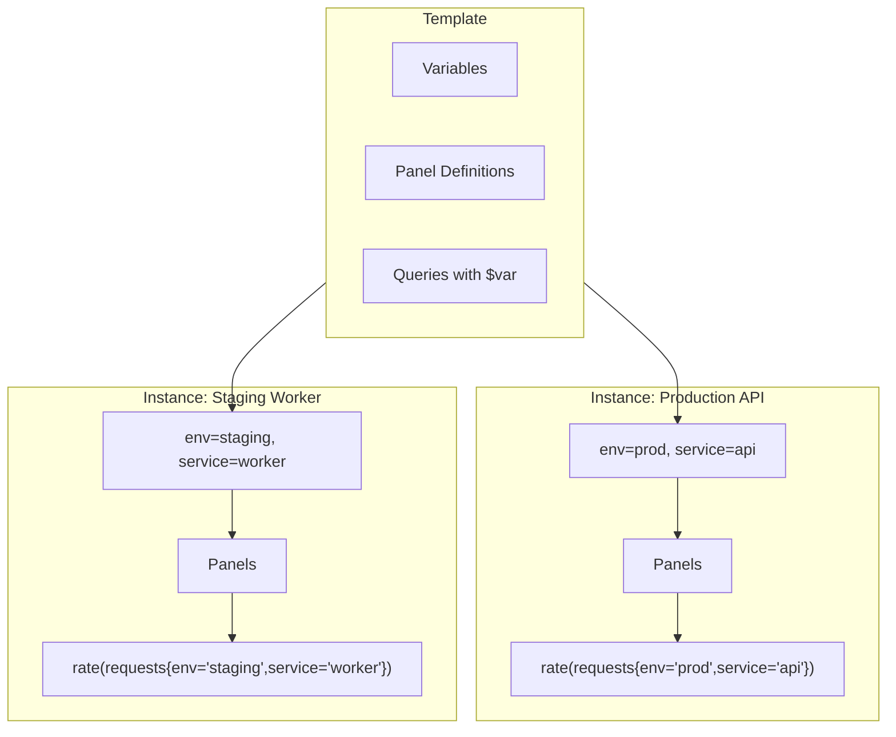
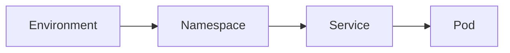
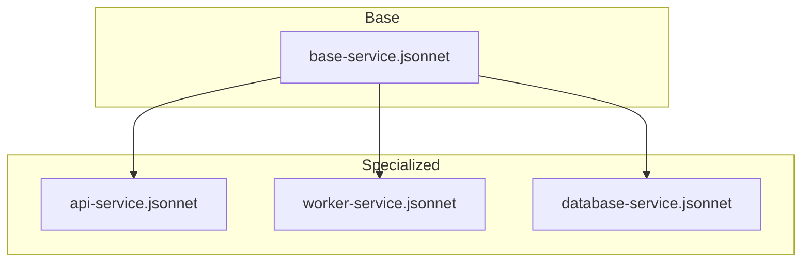

# How to Implement Grafana Dashboard Templates

Author: [nawazdhandala](https://www.github.com/nawazdhandala)

Tags: Grafana, Dashboards, Templates, Observability, Monitoring, DevOps

Description: Learn how to create reusable Grafana dashboard templates with variables, provisioning, and jsonnet for scalable observability across environments and teams.

---

Dashboard templates allow you to create reusable, parameterized dashboards that adapt to different services, environments, and use cases. Instead of maintaining dozens of nearly identical dashboards, you maintain one template that works everywhere. This guide covers variables, provisioning, and programmatic dashboard generation.

---

## Table of Contents

1. Understanding Dashboard Templates
2. Template Variables
3. Variable Types and Configuration
4. Chained Variables
5. Dashboard Provisioning
6. Jsonnet for Dashboard Generation
7. Grafonnet Library
8. Template Inheritance Patterns
9. Multi-Tenant Dashboard Templates
10. Best Practices

---

## 1. Understanding Dashboard Templates

Dashboard templates use variables to make panels dynamic. A single dashboard can display data for any service, environment, or time window based on user selection.



Benefits of templated dashboards:

| Benefit | Description |
|---------|-------------|
| Reduced Maintenance | Update once, apply everywhere |
| Consistency | Same metrics and layouts across teams |
| Self-Service | Users select their own context |
| Scalability | Onboard new services without new dashboards |

---

## 2. Template Variables

Variables appear as dropdowns at the top of dashboards. They are referenced in queries using `$variable` or `${variable}` syntax.

### Basic Variable Usage in Queries

```promql
# Prometheus query with variables
rate(http_requests_total{
  environment="$environment",
  service="$service",
  instance=~"$instance"
}[5m])
```

### Variable Reference Syntax

```yaml
# Different reference formats
$variable           # Simple reference
${variable}         # Explicit boundary (use in strings)
${variable:csv}     # Format as comma-separated values
${variable:pipe}    # Format as pipe-separated values
${variable:regex}   # Format as regex alternation (a|b|c)
${variable:json}    # Format as JSON array
```

### Example Panel JSON with Variables

```json
{
  "panels": [
    {
      "title": "Request Rate - $service",
      "targets": [
        {
          "expr": "sum(rate(http_requests_total{service=\"$service\", environment=\"$environment\"}[5m])) by (status_code)",
          "legendFormat": "{{status_code}}"
        }
      ]
    }
  ]
}
```

---

## 3. Variable Types and Configuration

Grafana supports several variable types, each suited to different use cases.

### Query Variable

Dynamically populated from a data source query.

```json
{
  "templating": {
    "list": [
      {
        "name": "service",
        "type": "query",
        "datasource": {
          "type": "prometheus",
          "uid": "prometheus-prod"
        },
        "query": {
          "query": "label_values(http_requests_total, service)",
          "refId": "StandardVariableQuery"
        },
        "refresh": 2,
        "sort": 1,
        "multi": true,
        "includeAll": true,
        "allValue": ".*"
      }
    ]
  }
}
```

### Custom Variable

Manually defined list of options.

```json
{
  "name": "environment",
  "type": "custom",
  "query": "production,staging,development",
  "current": {
    "text": "production",
    "value": "production"
  },
  "options": [
    {"text": "production", "value": "production", "selected": true},
    {"text": "staging", "value": "staging", "selected": false},
    {"text": "development", "value": "development", "selected": false}
  ]
}
```

### Data Source Variable

Allows switching between data sources.

```json
{
  "name": "datasource",
  "type": "datasource",
  "query": "prometheus",
  "regex": "/.*-prod/",
  "current": {
    "text": "Prometheus-Prod",
    "value": "prometheus-prod"
  }
}
```

### Interval Variable

Predefined time intervals for aggregation.

```json
{
  "name": "interval",
  "type": "interval",
  "query": "1m,5m,15m,30m,1h,6h,12h,1d",
  "auto": true,
  "auto_count": 100,
  "auto_min": "30s"
}
```

### Text Box Variable

Free-form user input.

```json
{
  "name": "filter",
  "type": "textbox",
  "query": "",
  "current": {
    "text": "",
    "value": ""
  }
}
```

---

## 4. Chained Variables

Variables can depend on each other, creating hierarchical filters.



### Configuration Example

```json
{
  "templating": {
    "list": [
      {
        "name": "environment",
        "type": "query",
        "query": "label_values(kube_namespace_labels, environment)",
        "refresh": 1
      },
      {
        "name": "namespace",
        "type": "query",
        "query": "label_values(kube_namespace_labels{environment=\"$environment\"}, namespace)",
        "refresh": 1
      },
      {
        "name": "service",
        "type": "query",
        "query": "label_values(kube_pod_labels{namespace=\"$namespace\"}, app)",
        "refresh": 1
      },
      {
        "name": "pod",
        "type": "query",
        "query": "label_values(kube_pod_info{namespace=\"$namespace\", pod=~\"$service.*\"}, pod)",
        "refresh": 2,
        "multi": true,
        "includeAll": true
      }
    ]
  }
}
```

### Query Dependencies

```promql
# Pod-level CPU query using chained variables
sum(
  rate(container_cpu_usage_seconds_total{
    namespace="$namespace",
    pod=~"$pod"
  }[5m])
) by (pod)
```

---

## 5. Dashboard Provisioning

Provisioning allows you to deploy dashboards from files, enabling version control and CI/CD integration.

### Directory Structure

```
/etc/grafana/provisioning/
  dashboards/
    default.yaml           # Dashboard provider config
    dashboards/
      service-overview.json
      infrastructure.json
```

### Provider Configuration

```yaml
# /etc/grafana/provisioning/dashboards/default.yaml
apiVersion: 1

providers:
  - name: 'default'
    orgId: 1
    folder: 'Provisioned'
    folderUid: 'provisioned'
    type: file
    disableDeletion: false
    updateIntervalSeconds: 30
    allowUiUpdates: true
    options:
      path: /etc/grafana/provisioning/dashboards/dashboards
      foldersFromFilesStructure: true
```

### Folder-Based Organization

```yaml
# Organize by team or domain
providers:
  - name: 'platform'
    folder: 'Platform Team'
    options:
      path: /etc/grafana/provisioning/dashboards/platform

  - name: 'application'
    folder: 'Application Team'
    options:
      path: /etc/grafana/provisioning/dashboards/application
```

### Environment-Specific Dashboards

```yaml
# docker-compose.yml
services:
  grafana:
    image: grafana/grafana:latest
    environment:
      - GF_DASHBOARDS_DEFAULT_HOME_DASHBOARD_PATH=/etc/grafana/provisioning/dashboards/home.json
    volumes:
      - ./dashboards/${ENVIRONMENT}:/etc/grafana/provisioning/dashboards/dashboards
```

---

## 6. Jsonnet for Dashboard Generation

Jsonnet is a data templating language that generates JSON. It is ideal for creating parameterized dashboards programmatically.

### Basic Jsonnet Structure

```jsonnet
// dashboard.jsonnet
local grafana = import 'grafonnet/grafana.libsonnet';
local dashboard = grafana.dashboard;
local prometheus = grafana.prometheus;
local graphPanel = grafana.graphPanel;

// Parameters
local service = std.extVar('service');
local environment = std.extVar('environment');

// Dashboard definition
dashboard.new(
  title='%s Service Overview' % service,
  tags=['generated', service, environment],
  editable=true,
  time_from='now-1h',
)
.addTemplate(
  grafana.template.datasource(
    name='datasource',
    query='prometheus',
    current='Prometheus',
  )
)
.addPanel(
  graphPanel.new(
    title='Request Rate',
    datasource='$datasource',
  )
  .addTarget(
    prometheus.target(
      'sum(rate(http_requests_total{service="%s", environment="%s"}[5m])) by (status_code)' % [service, environment],
      legendFormat='{{status_code}}',
    )
  ),
  gridPos={x: 0, y: 0, w: 12, h: 8},
)
```

### Generating Dashboard JSON

```bash
# Install jsonnet
brew install jsonnet  # macOS
# or
apt-get install jsonnet  # Ubuntu

# Generate dashboard
jsonnet -J vendor dashboard.jsonnet \
  --ext-str service=api-gateway \
  --ext-str environment=production \
  > api-gateway-dashboard.json
```

### Reusable Panel Library

```jsonnet
// panels.libsonnet
local grafana = import 'grafonnet/grafana.libsonnet';
local prometheus = grafana.prometheus;
local graphPanel = grafana.graphPanel;
local statPanel = grafana.statPanel;

{
  // Request rate panel factory
  requestRatePanel(service, title='Request Rate')::
    graphPanel.new(
      title=title,
      datasource='$datasource',
      format='reqps',
      fill=1,
      linewidth=2,
    )
    .addTarget(
      prometheus.target(
        'sum(rate(http_requests_total{service="%s"}[$__rate_interval])) by (status_code)' % service,
        legendFormat='{{status_code}}',
      )
    ),

  // Error rate panel factory
  errorRatePanel(service, title='Error Rate')::
    graphPanel.new(
      title=title,
      datasource='$datasource',
      format='percentunit',
      fill=1,
      linewidth=2,
    )
    .addTarget(
      prometheus.target(
        |||
          sum(rate(http_requests_total{service="%s", status_code=~"5.."}[$__rate_interval]))
          /
          sum(rate(http_requests_total{service="%s"}[$__rate_interval]))
        ||| % [service, service],
        legendFormat='error_rate',
      )
    ),

  // Latency percentiles panel factory
  latencyPanel(service, title='Latency Percentiles')::
    graphPanel.new(
      title=title,
      datasource='$datasource',
      format='s',
      fill=0,
      linewidth=2,
    )
    .addTargets([
      prometheus.target(
        'histogram_quantile(0.50, sum(rate(http_request_duration_seconds_bucket{service="%s"}[$__rate_interval])) by (le))' % service,
        legendFormat='p50',
      ),
      prometheus.target(
        'histogram_quantile(0.95, sum(rate(http_request_duration_seconds_bucket{service="%s"}[$__rate_interval])) by (le))' % service,
        legendFormat='p95',
      ),
      prometheus.target(
        'histogram_quantile(0.99, sum(rate(http_request_duration_seconds_bucket{service="%s"}[$__rate_interval])) by (le))' % service,
        legendFormat='p99',
      ),
    ]),
}
```

---

## 7. Grafonnet Library

Grafonnet is the official Jsonnet library for generating Grafana dashboards.

### Installation

```bash
# Using jsonnet-bundler (recommended)
jb init
jb install github.com/grafana/grafonnet-lib/grafonnet

# Or clone directly
git clone https://github.com/grafana/grafonnet-lib.git vendor/grafonnet-lib
```

### Complete Dashboard Example

```jsonnet
// service-dashboard.jsonnet
local grafana = import 'grafonnet/grafana.libsonnet';
local dashboard = grafana.dashboard;
local row = grafana.row;
local prometheus = grafana.prometheus;
local template = grafana.template;
local graphPanel = grafana.graphPanel;
local statPanel = grafana.statPanel;
local tablePanel = grafana.tablePanel;

// Import custom panel library
local panels = import 'panels.libsonnet';

// Service configuration
local config = {
  service: std.extVar('service'),
  namespace: std.extVar('namespace'),
  sloTarget: 0.999,
};

dashboard.new(
  title='%s Service Dashboard' % config.service,
  tags=['service', config.service, 'generated'],
  editable=true,
  time_from='now-6h',
  refresh='30s',
  uid='%s-overview' % config.service,
)

// Variables
.addTemplate(
  template.datasource(
    name='datasource',
    query='prometheus',
    current='Prometheus',
  )
)
.addTemplate(
  template.new(
    name='instance',
    datasource='$datasource',
    query='label_values(up{service="%s"}, instance)' % config.service,
    multi=true,
    includeAll=true,
    refresh='time',
  )
)

// SLO Row
.addRow(
  row.new(title='Service Level Objectives')
)
.addPanel(
  statPanel.new(
    title='Availability (30d)',
    datasource='$datasource',
    unit='percentunit',
    colorMode='value',
    graphMode='none',
  )
  .addTarget(
    prometheus.target(
      |||
        1 - (
          sum(increase(http_requests_total{service="%s", status_code=~"5.."}[30d]))
          /
          sum(increase(http_requests_total{service="%s"}[30d]))
        )
      ||| % [config.service, config.service],
    )
  )
  .addThreshold({color: 'red', value: 0})
  .addThreshold({color: 'yellow', value: config.sloTarget - 0.001})
  .addThreshold({color: 'green', value: config.sloTarget}),
  gridPos={x: 0, y: 0, w: 6, h: 4},
)
.addPanel(
  statPanel.new(
    title='P99 Latency',
    datasource='$datasource',
    unit='s',
    colorMode='value',
  )
  .addTarget(
    prometheus.target(
      'histogram_quantile(0.99, sum(rate(http_request_duration_seconds_bucket{service="%s"}[5m])) by (le))' % config.service,
    )
  )
  .addThreshold({color: 'green', value: 0})
  .addThreshold({color: 'yellow', value: 0.5})
  .addThreshold({color: 'red', value: 1}),
  gridPos={x: 6, y: 0, w: 6, h: 4},
)

// Traffic Row
.addRow(
  row.new(title='Traffic')
)
.addPanel(
  panels.requestRatePanel(config.service),
  gridPos={x: 0, y: 4, w: 12, h: 8},
)
.addPanel(
  panels.errorRatePanel(config.service),
  gridPos={x: 12, y: 4, w: 12, h: 8},
)

// Latency Row
.addRow(
  row.new(title='Latency')
)
.addPanel(
  panels.latencyPanel(config.service),
  gridPos={x: 0, y: 12, w: 24, h: 8},
)
```

### Build Pipeline

```makefile
# Makefile
SERVICES := api-gateway user-service order-service payment-service

.PHONY: dashboards
dashboards: $(SERVICES:%=dashboards/%-dashboard.json)

dashboards/%-dashboard.json: service-dashboard.jsonnet panels.libsonnet
	@mkdir -p dashboards
	jsonnet -J vendor \
		--ext-str service=$* \
		--ext-str namespace=production \
		$< > $@

.PHONY: deploy
deploy: dashboards
	@for f in dashboards/*.json; do \
		curl -X POST \
			-H "Authorization: Bearer $(GRAFANA_API_KEY)" \
			-H "Content-Type: application/json" \
			-d @$$f \
			$(GRAFANA_URL)/api/dashboards/db; \
	done
```

---

## 8. Template Inheritance Patterns

Create base templates that specialized dashboards extend.



### Base Dashboard Template

```jsonnet
// base-service.libsonnet
local grafana = import 'grafonnet/grafana.libsonnet';

{
  // Base configuration
  baseConfig:: {
    datasource: 'Prometheus',
    refresh: '30s',
    timeFrom: 'now-6h',
  },

  // Base variables
  baseVariables:: [
    grafana.template.datasource(
      name='datasource',
      query='prometheus',
      current=$.baseConfig.datasource,
    ),
    grafana.template.new(
      name='environment',
      datasource='$datasource',
      query='label_values(up, environment)',
      refresh='load',
    ),
  ],

  // Base panels
  basePanels:: {
    availability(service)::
      grafana.statPanel.new(
        title='Availability',
        datasource='$datasource',
        unit='percentunit',
      )
      .addTarget(
        grafana.prometheus.target(
          'avg_over_time(up{service="%s"}[1h])' % service,
        )
      ),
  },

  // Dashboard factory
  newServiceDashboard(service, extraPanels=[], extraVariables=[])::
    grafana.dashboard.new(
      title='%s Dashboard' % service,
      tags=['service', service],
      refresh=$.baseConfig.refresh,
      time_from=$.baseConfig.timeFrom,
    )
    .addTemplates($.baseVariables + extraVariables)
    .addPanel($.basePanels.availability(service), gridPos={x: 0, y: 0, w: 6, h: 4})
    + { panels+: extraPanels },
}
```

### Specialized Dashboard

```jsonnet
// api-service.jsonnet
local base = import 'base-service.libsonnet';
local grafana = import 'grafonnet/grafana.libsonnet';

local service = 'api-gateway';

// API-specific panels
local apiPanels = [
  grafana.graphPanel.new(
    title='Requests by Endpoint',
    datasource='$datasource',
  )
  .addTarget(
    grafana.prometheus.target(
      'sum(rate(http_requests_total{service="%s"}[5m])) by (endpoint)' % service,
      legendFormat='{{endpoint}}',
    )
  )
  + { gridPos: {x: 6, y: 0, w: 18, h: 8} },

  grafana.graphPanel.new(
    title='Response Size',
    datasource='$datasource',
    format='bytes',
  )
  .addTarget(
    grafana.prometheus.target(
      'avg(http_response_size_bytes{service="%s"}) by (endpoint)' % service,
      legendFormat='{{endpoint}}',
    )
  )
  + { gridPos: {x: 0, y: 8, w: 24, h: 8} },
];

// API-specific variables
local apiVariables = [
  grafana.template.new(
    name='endpoint',
    datasource='$datasource',
    query='label_values(http_requests_total{service="%s"}, endpoint)' % service,
    multi=true,
    includeAll=true,
  ),
];

base.newServiceDashboard(
  service,
  extraPanels=apiPanels,
  extraVariables=apiVariables,
)
```

---

## 9. Multi-Tenant Dashboard Templates

For SaaS platforms or managed services, templates can adapt to different tenants.

### Tenant-Aware Variables

```json
{
  "templating": {
    "list": [
      {
        "name": "tenant",
        "type": "query",
        "datasource": "Prometheus",
        "query": "label_values(tenant_info, tenant_id)",
        "refresh": 1,
        "hide": 0
      },
      {
        "name": "tenant_name",
        "type": "query",
        "datasource": "Prometheus",
        "query": "label_values(tenant_info{tenant_id=\"$tenant\"}, tenant_name)",
        "refresh": 1,
        "hide": 2
      }
    ]
  }
}
```

### Tenant Dashboard Generator

```python
# generate_tenant_dashboards.py
import json
import requests
from typing import Dict, List

GRAFANA_URL = "http://localhost:3000"
API_KEY = "your-api-key"

def load_template(path: str) -> Dict:
    """Load dashboard template from file."""
    with open(path) as f:
        return json.load(f)

def customize_for_tenant(template: Dict, tenant: Dict) -> Dict:
    """Customize template for specific tenant."""
    dashboard = template.copy()

    # Update title and UID
    dashboard['title'] = f"{tenant['name']} - Service Overview"
    dashboard['uid'] = f"tenant-{tenant['id']}-overview"

    # Update tags
    dashboard['tags'] = ['tenant', tenant['id'], tenant['tier']]

    # Update variables with tenant defaults
    for var in dashboard.get('templating', {}).get('list', []):
        if var['name'] == 'tenant':
            var['current'] = {'text': tenant['id'], 'value': tenant['id']}
            var['hide'] = 2  # Hide variable for tenant users

    # Apply tier-specific customizations
    if tenant['tier'] == 'enterprise':
        dashboard['refresh'] = '10s'  # Faster refresh for enterprise
    else:
        dashboard['refresh'] = '1m'

    return dashboard

def deploy_dashboard(dashboard: Dict, folder_uid: str):
    """Deploy dashboard to Grafana."""
    payload = {
        'dashboard': dashboard,
        'folderUid': folder_uid,
        'overwrite': True,
    }

    response = requests.post(
        f"{GRAFANA_URL}/api/dashboards/db",
        json=payload,
        headers={'Authorization': f'Bearer {API_KEY}'}
    )
    response.raise_for_status()
    return response.json()

def main():
    # Load tenant list
    tenants = [
        {'id': 'acme-corp', 'name': 'Acme Corporation', 'tier': 'enterprise'},
        {'id': 'startup-io', 'name': 'Startup.io', 'tier': 'standard'},
        {'id': 'small-biz', 'name': 'Small Business LLC', 'tier': 'basic'},
    ]

    # Load template
    template = load_template('templates/service-overview.json')

    for tenant in tenants:
        # Create folder for tenant
        folder_uid = f"tenant-{tenant['id']}"

        # Customize and deploy
        dashboard = customize_for_tenant(template, tenant)
        result = deploy_dashboard(dashboard, folder_uid)

        print(f"Deployed dashboard for {tenant['name']}: {result['url']}")

if __name__ == '__main__':
    main()
```

---

## 10. Best Practices

### Variable Naming Conventions

```yaml
# Recommended naming
environment    # Not: env, environ
service        # Not: svc, app
instance       # Not: host, node
namespace      # Not: ns

# Use underscores for multi-word
status_code    # Not: statusCode, status-code
```

### Performance Optimization

```jsonnet
// Limit variable query cardinality
template.new(
  name='pod',
  query='label_values(up{namespace="$namespace"}, pod)',
  refresh='time',  // Only refresh on time range change
  sort=1,          // Sort alphabetically
  regex='/^(?!.*test).*$/',  // Exclude test pods
)
```

### Dashboard Organization

```
dashboards/
  _templates/           # Base templates
    base-service.jsonnet
    base-infrastructure.jsonnet
  platform/             # Platform team dashboards
    kubernetes.json
    networking.json
  services/             # Service dashboards (generated)
    api-gateway.json
    user-service.json
  tenants/              # Tenant-specific (generated)
    acme-corp/
    startup-io/
```

### Version Control Strategy

```yaml
# .github/workflows/dashboards.yml
name: Dashboard CI/CD

on:
  push:
    paths:
      - 'dashboards/**'
      - 'templates/**'

jobs:
  validate:
    runs-on: ubuntu-latest
    steps:
      - uses: actions/checkout@v4

      - name: Install jsonnet
        run: |
          wget https://github.com/google/go-jsonnet/releases/download/v0.20.0/jsonnet_0.20.0_linux_amd64.tar.gz
          tar xzf jsonnet_0.20.0_linux_amd64.tar.gz
          sudo mv jsonnet /usr/local/bin/

      - name: Validate jsonnet
        run: |
          for f in templates/*.jsonnet; do
            jsonnet --lint $f
          done

      - name: Generate dashboards
        run: make dashboards

      - name: Validate JSON
        run: |
          for f in dashboards/*.json; do
            jq empty $f
          done

  deploy:
    needs: validate
    if: github.ref == 'refs/heads/main'
    runs-on: ubuntu-latest
    steps:
      - uses: actions/checkout@v4

      - name: Deploy to Grafana
        env:
          GRAFANA_URL: ${{ secrets.GRAFANA_URL }}
          GRAFANA_API_KEY: ${{ secrets.GRAFANA_API_KEY }}
        run: make deploy
```

---

## Summary

Grafana dashboard templates transform dashboard management from manual toil into a scalable, automated process. Key implementation strategies:

- Use variables extensively to make dashboards adaptable to different contexts
- Implement chained variables for hierarchical filtering
- Adopt provisioning for version-controlled dashboard deployment
- Use Jsonnet and Grafonnet for programmatic dashboard generation
- Build template inheritance patterns for consistency across teams
- Automate multi-tenant dashboard generation for SaaS platforms

Well-designed templates reduce maintenance overhead while ensuring consistency across your observability stack.

---

*Building dashboards from scratch for every service? [OneUptime](https://oneuptime.com) provides auto-generated service dashboards based on your telemetry data - no template maintenance required.*
