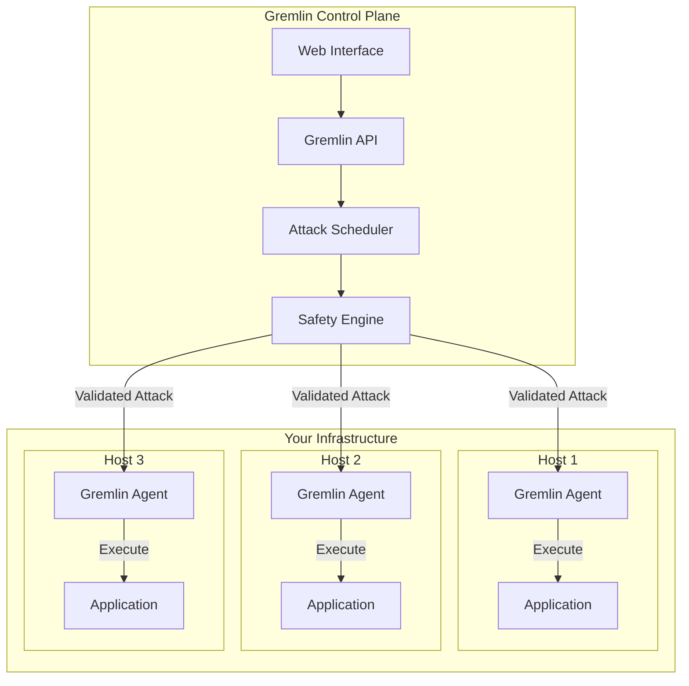
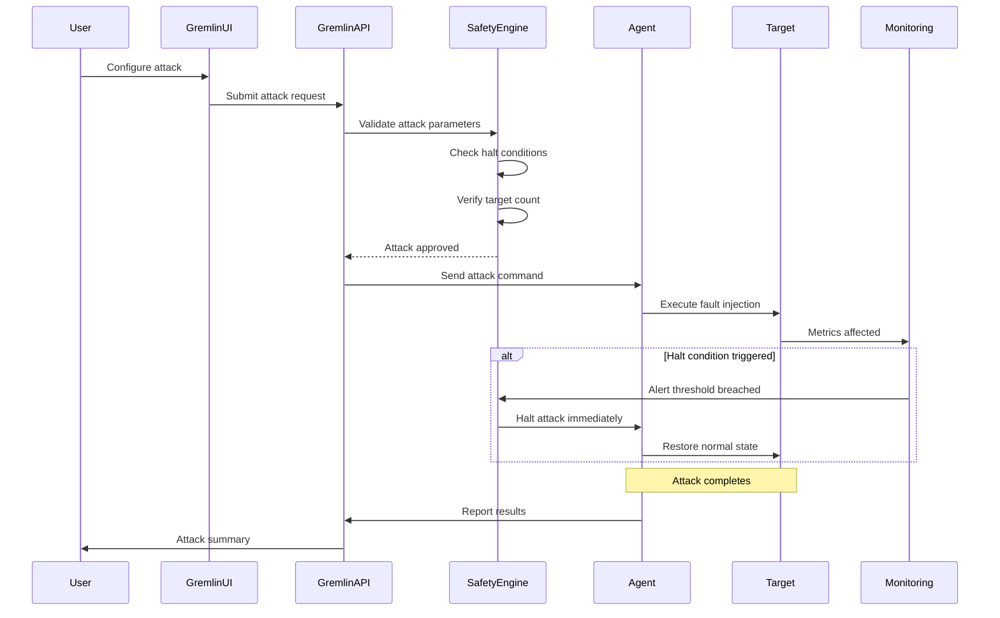

# How to Use Gremlin for Controlled Chaos

Author: [nawazdhandala](https://www.github.com/nawazdhandala)

Tags: Chaos Engineering, Gremlin, Resilience Testing, Fault Injection, SRE, Reliability

Description: A hands-on guide to implementing controlled chaos experiments using Gremlin's enterprise-grade fault injection platform.

---

## What is Gremlin?

Gremlin is an enterprise chaos engineering platform that allows you to safely inject failures into your systems. Unlike open-source tools that require significant setup, Gremlin provides a managed platform with pre-built attack types, safety controls, and detailed reporting.

The platform supports three categories of attacks:

- **Resource attacks**: CPU, memory, disk, and I/O exhaustion
- **Network attacks**: Latency, packet loss, DNS failures, and blackhole traffic
- **State attacks**: Process killing, time travel, and shutdown

## Why Choose Gremlin?

Gremlin reduces the barrier to entry for chaos engineering. You get a web UI for designing experiments, built-in safety mechanisms, and audit logs for compliance. For teams without dedicated chaos engineering expertise, Gremlin provides guardrails that prevent experiments from causing unintended damage.

Key advantages:

- No need to build custom tooling
- Fine-grained targeting using tags and metadata
- Automatic rollback when experiments cause too much impact
- Integration with major cloud providers and container orchestrators

## Gremlin Architecture



## Installing the Gremlin Agent

### Linux Installation

```bash
#!/bin/bash
# install_gremlin.sh
# Install Gremlin agent on Ubuntu/Debian

# Add Gremlin repository
echo "deb https://deb.gremlin.com/ release non-free" | sudo tee /etc/apt/sources.list.d/gremlin.list

# Import GPG key
sudo apt-key adv --keyserver keyserver.ubuntu.com --recv-keys 9CDB294B29A5B1E2E00C24C022E8EF3461A50EF6

# Install agent and daemon
sudo apt-get update
sudo apt-get install -y gremlin gremlind

# Configure with your team credentials
sudo gremlin init \
  --team-id "$GREMLIN_TEAM_ID" \
  --team-secret "$GREMLIN_TEAM_SECRET" \
  --identifier "$(hostname)"
```

### Kubernetes Installation

Deploy Gremlin using Helm:

```bash
# Add Gremlin Helm repository
helm repo add gremlin https://helm.gremlin.com
helm repo update

# Create namespace
kubectl create namespace gremlin

# Create secret with credentials
kubectl create secret generic gremlin-team-cert \
  --namespace=gremlin \
  --from-literal=GREMLIN_TEAM_ID="$GREMLIN_TEAM_ID" \
  --from-literal=GREMLIN_TEAM_SECRET="$GREMLIN_TEAM_SECRET"

# Install Gremlin
helm install gremlin gremlin/gremlin \
  --namespace gremlin \
  --set gremlin.secret.managed=true \
  --set gremlin.secret.type=secret \
  --set gremlin.secret.name=gremlin-team-cert
```

### Verify Installation

```bash
# Check agent status on Linux
sudo systemctl status gremlind

# Check agent status on Kubernetes
kubectl get pods -n gremlin
kubectl logs -n gremlin -l app.kubernetes.io/name=gremlin
```

## Running Attacks via the API

While the web UI is convenient, the API enables automation and integration with CI/CD pipelines.

### CPU Attack

Stress CPU to verify auto-scaling and performance degradation handling:

```python
# gremlin_cpu_attack.py
# Run a CPU stress attack using Gremlin API

import requests
import os

GREMLIN_API_KEY = os.environ["GREMLIN_API_KEY"]
GREMLIN_TEAM_ID = os.environ["GREMLIN_TEAM_ID"]

def run_cpu_attack(target_tags, cpu_cores=1, duration_seconds=60):
    """
    Run a CPU stress attack on hosts matching the target tags.

    Args:
        target_tags: Dict of tag key-value pairs to target
        cpu_cores: Number of CPU cores to stress
        duration_seconds: How long to run the attack
    """
    headers = {
        "Authorization": f"Key {GREMLIN_API_KEY}",
        "Content-Type": "application/json"
    }

    payload = {
        "command": {
            "type": "cpu",
            "args": [
                "-c", str(cpu_cores),
                "-l", str(duration_seconds)
            ]
        },
        "target": {
            "type": "Random",
            "tags": target_tags,
            "percent": 50  # Target 50% of matching hosts
        }
    }

    response = requests.post(
        f"https://api.gremlin.com/v1/attacks/new",
        headers=headers,
        json=payload
    )

    if response.status_code == 201:
        attack_id = response.json()["attackId"]
        print(f"Attack started: {attack_id}")
        return attack_id
    else:
        print(f"Attack failed: {response.text}")
        return None

# Run attack on production API servers
run_cpu_attack(
    target_tags={"service": "api", "environment": "production"},
    cpu_cores=2,
    duration_seconds=120
)
```

### Network Latency Attack

Inject latency to test timeout handling and circuit breakers:

```python
# gremlin_latency_attack.py
# Inject network latency between services

import requests
import os

GREMLIN_API_KEY = os.environ["GREMLIN_API_KEY"]

def run_latency_attack(target_tags, latency_ms=500, duration_seconds=60,
                        target_hosts=None, target_ports=None):
    """
    Inject network latency to test timeout handling.

    Args:
        target_tags: Dict of tag key-value pairs
        latency_ms: Latency to add in milliseconds
        duration_seconds: Attack duration
        target_hosts: List of destination hostnames/IPs to affect
        target_ports: List of destination ports to affect
    """
    headers = {
        "Authorization": f"Key {GREMLIN_API_KEY}",
        "Content-Type": "application/json"
    }

    args = [
        "-l", str(duration_seconds),
        "-m", str(latency_ms)
    ]

    # Only affect traffic to specific destinations
    if target_hosts:
        args.extend(["-h", ",".join(target_hosts)])
    if target_ports:
        args.extend(["-p", ",".join(map(str, target_ports))])

    payload = {
        "command": {
            "type": "latency",
            "args": args
        },
        "target": {
            "type": "Exact",
            "tags": target_tags,
            "exact": 1  # Target exactly 1 host
        }
    }

    response = requests.post(
        "https://api.gremlin.com/v1/attacks/new",
        headers=headers,
        json=payload
    )

    return response.json()

# Add 500ms latency to database connections
run_latency_attack(
    target_tags={"service": "api", "tier": "web"},
    latency_ms=500,
    duration_seconds=120,
    target_hosts=["postgres.internal"],
    target_ports=[5432]
)
```

### Blackhole Attack

Simulate complete network failures:

```python
# gremlin_blackhole_attack.py
# Drop all traffic to specific destinations

def run_blackhole_attack(target_tags, duration_seconds=30,
                          blocked_hosts=None, blocked_ports=None):
    """
    Drop all traffic to specified destinations.
    Use carefully - this simulates complete outages.
    """
    headers = {
        "Authorization": f"Key {GREMLIN_API_KEY}",
        "Content-Type": "application/json"
    }

    args = ["-l", str(duration_seconds)]

    if blocked_hosts:
        args.extend(["-h", ",".join(blocked_hosts)])
    if blocked_ports:
        args.extend(["-p", ",".join(map(str, blocked_ports))])

    payload = {
        "command": {
            "type": "blackhole",
            "args": args
        },
        "target": {
            "type": "Exact",
            "tags": target_tags,
            "exact": 1
        }
    }

    response = requests.post(
        "https://api.gremlin.com/v1/attacks/new",
        headers=headers,
        json=payload
    )

    return response.json()

# Simulate Redis being completely unreachable
run_blackhole_attack(
    target_tags={"service": "api"},
    duration_seconds=30,
    blocked_hosts=["redis.internal"],
    blocked_ports=[6379]
)
```

## Gremlin Attack Flow



## Creating Scenarios

Scenarios combine multiple attacks to simulate complex failure modes:

```yaml
# scenario_database_failover.yaml
# Test database failover under realistic conditions

name: "Database Failover Test"
description: "Verify application handles database failover gracefully"

hypothesis: "Application continues serving requests with less than 5% error rate during database failover"

steps:
  - name: "Baseline metrics"
    type: "observation"
    duration: 60

  - name: "Primary database CPU stress"
    type: "attack"
    attack_type: "cpu"
    target:
      tags:
        service: "postgres"
        role: "primary"
    parameters:
      cores: 4
      duration: 120

  - name: "Network partition primary"
    type: "attack"
    attack_type: "blackhole"
    target:
      tags:
        service: "postgres"
        role: "primary"
    parameters:
      duration: 60
      egress: true
      ingress: true

  - name: "Verify failover completed"
    type: "observation"
    duration: 120
    success_criteria:
      - metric: "error_rate"
        threshold: 0.05
        comparison: "less_than"
      - metric: "p99_latency"
        threshold: 2000
        comparison: "less_than"
```

## Safety Controls

Gremlin provides multiple safety mechanisms to prevent experiments from causing real outages:

```python
# gremlin_safety_config.py
# Configure safety controls for your team

def configure_safety_controls():
    """Set up halt conditions and safeguards."""

    safety_config = {
        # Global halt conditions
        "halt_conditions": [
            {
                "name": "High Error Rate",
                "metric_source": "datadog",
                "query": "sum:http.errors{env:production}.as_count()",
                "threshold": 100,
                "comparison": "greater_than",
                "duration_seconds": 60
            },
            {
                "name": "Service Unavailable",
                "metric_source": "prometheus",
                "query": "up{job='api'} == 0",
                "threshold": 1,
                "comparison": "greater_than",
                "duration_seconds": 30
            }
        ],

        # Time-based restrictions
        "blackout_windows": [
            {
                "name": "No chaos during deploys",
                "calendar": "deploy-calendar",
                "buffer_minutes": 30
            },
            {
                "name": "No chaos during peak hours",
                "schedule": {
                    "days": ["Monday", "Tuesday", "Wednesday", "Thursday", "Friday"],
                    "start_time": "09:00",
                    "end_time": "11:00",
                    "timezone": "America/New_York"
                }
            }
        ],

        # Target restrictions
        "protected_resources": [
            {"tag": "critical", "value": "true"},
            {"tag": "chaos-exempt", "value": "true"}
        ]
    }

    return safety_config
```

## Integrating Gremlin with CI/CD

Run chaos experiments as part of your deployment pipeline:

```yaml
# .github/workflows/chaos_test.yaml
# GitHub Actions workflow for chaos testing

name: Chaos Testing

on:
  workflow_dispatch:
  schedule:
    - cron: '0 14 * * 1-5'  # Weekdays at 2 PM UTC

jobs:
  chaos_test:
    runs-on: ubuntu-latest
    environment: chaos-testing

    steps:
      - name: Checkout
        uses: actions/checkout@v4

      - name: Install Gremlin CLI
        run: |
          curl -sL https://get.gremlin.com/gremlin | sudo bash

      - name: Run latency experiment
        env:
          GREMLIN_API_KEY: ${{ secrets.GREMLIN_API_KEY }}
        run: |
          gremlin attack network latency \
            --length 60 \
            --delay 200 \
            --target-tags "service=api,environment=staging" \
            --percent 25

      - name: Wait for experiment
        run: sleep 70

      - name: Validate service health
        run: |
          response=$(curl -s -o /dev/null -w "%{http_code}" https://staging-api.example.com/health)
          if [ "$response" != "200" ]; then
            echo "Health check failed during chaos experiment"
            exit 1
          fi

      - name: Run blackhole experiment
        env:
          GREMLIN_API_KEY: ${{ secrets.GREMLIN_API_KEY }}
        run: |
          gremlin attack network blackhole \
            --length 30 \
            --target-tags "service=api,environment=staging" \
            --hostnames "cache.internal" \
            --exact 1

      - name: Validate degraded mode
        run: |
          # Service should still work without cache
          ./scripts/verify_degraded_mode.sh
```

## Monitoring Gremlin Experiments

Track experiment outcomes in your observability platform:

```python
# gremlin_observability.py
# Send Gremlin events to OneUptime

import requests
from datetime import datetime

def send_experiment_to_oneuptime(experiment_data):
    """Report Gremlin experiment to OneUptime for correlation."""

    payload = {
        "eventType": "chaos_experiment",
        "source": "gremlin",
        "timestamp": datetime.utcnow().isoformat() + "Z",
        "experiment": {
            "id": experiment_data["attack_id"],
            "type": experiment_data["attack_type"],
            "targets": experiment_data["targets"],
            "parameters": experiment_data["parameters"]
        },
        "status": experiment_data["status"],
        "results": {
            "duration_seconds": experiment_data["duration"],
            "targets_affected": experiment_data["affected_count"],
            "halted_early": experiment_data.get("halted", False),
            "halt_reason": experiment_data.get("halt_reason")
        }
    }

    response = requests.post(
        "https://oneuptime.com/api/telemetry/events",
        headers={
            "Content-Type": "application/json",
            "X-OneUptime-Token": os.environ["ONEUPTIME_TOKEN"]
        },
        json=payload
    )

    return response.status_code == 200
```

---

Gremlin provides a structured approach to chaos engineering with enterprise-grade safety controls. By using the API and integrating with your CI/CD pipeline, you can automate resilience testing and catch weaknesses before they cause production incidents. Start with small, targeted experiments in non-production environments, establish baseline metrics, and gradually expand your chaos practice as confidence grows.
