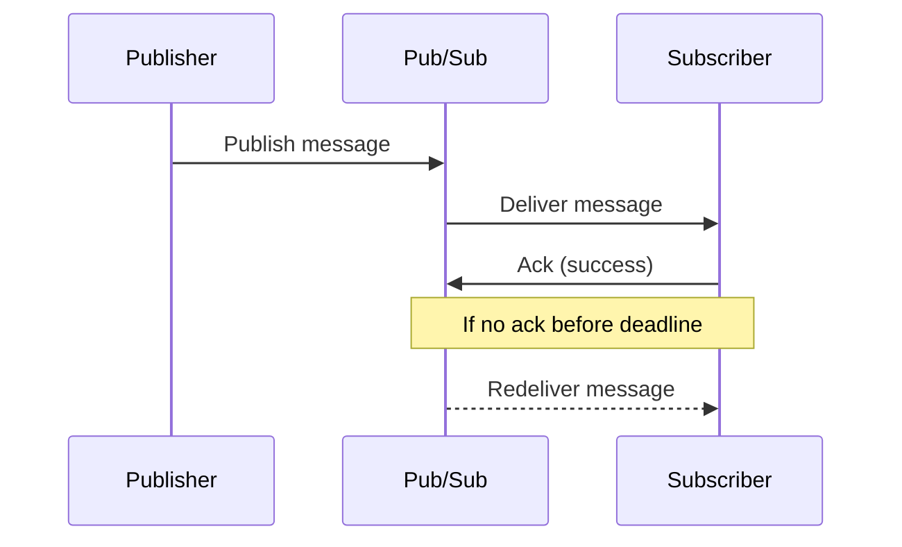

# How to Handle Pub/Sub Message Acknowledgment

Author: [nawazdhandala](https://www.github.com/nawazdhandala)

Tags: Google Pub/Sub, Google Cloud Pub/Sub, Acknowledgments, Messaging, Reliability

Description: Learn how Pub/Sub acknowledgments work, how to tune ack deadlines, handle retries, and design reliable consumers that avoid duplicate processing.

---

Message acknowledgment is the switch that tells Pub/Sub you successfully processed a message. Get it wrong and you can lose data or drown in redeliveries. This guide shows how acknowledgments work for pull and push subscriptions, how to tune ack deadlines, and how to build safe, idempotent consumers.

## Acknowledgment Basics

Pub/Sub sends a message and expects a positive signal that it was handled. If the acknowledgment does not arrive before the ack deadline, Pub/Sub will redeliver the message. Redelivery is normal behavior. Your job is to make processing safe when it happens.

### Pull vs Push Acknowledgment Flow



## Pull Subscriptions

With pull subscriptions, your subscriber receives a message plus an ack ID. You must call `ack` when processing finishes. If processing may exceed the ack deadline, extend the deadline while you work.

### When to Ack

- Ack only after the side effects are complete.
- If you cannot process the message, do not ack it. Let it be redelivered or send it to a dead letter topic.
- Handle duplicates by designing idempotent processing.

### Example: Pull Subscriber with Ack Deadline Extensions

The snippet below shows a pull worker that extends the ack deadline while processing and then acknowledges only after success.

```python
import time
from google.cloud import pubsub_v1

project_id = "my-project"
subscription_id = "orders-sub"

subscriber = pubsub_v1.SubscriberClient()
subscription_path = subscriber.subscription_path(project_id, subscription_id)

# Keep track of ack IDs currently in flight so we can extend them.
in_flight = {}

# Extend ack deadlines for messages still being processed.
def extend_ack_deadlines():
    while True:
        time.sleep(10)
        for ack_id, start_time in list(in_flight.items()):
            # Extend the ack deadline in small increments while work continues.
            subscriber.modify_ack_deadline(
                request={"subscription": subscription_path, "ack_ids": [ack_id], "ack_deadline_seconds": 60}
            )
            # Stop extending if the task is taking too long and you prefer redelivery.
            if time.time() - start_time > 300:
                in_flight.pop(ack_id, None)

# Start a background thread to extend deadlines.
import threading
threading.Thread(target=extend_ack_deadlines, daemon=True).start()

# Pull and process messages.
response = subscriber.pull(request={"subscription": subscription_path, "max_messages": 5})
for message in response.received_messages:
    ack_id = message.ack_id
    in_flight[ack_id] = time.time()

    try:
        # Replace with your real processing logic.
        payload = message.message.data.decode("utf-8")
        print(f"Processing: {payload}")

        # Ack only after successful processing.
        subscriber.acknowledge(request={"subscription": subscription_path, "ack_ids": [ack_id]})
    finally:
        # Remove from in-flight tracking after ack or failure.
        in_flight.pop(ack_id, None)
```

### Nack vs Letting the Deadline Expire

- If your client supports `nack`, use it when you know the message must be retried quickly.
- If not, simply let the ack deadline expire. Pub/Sub will redeliver.

## Push Subscriptions

For push subscriptions, Pub/Sub sends an HTTP request to your endpoint. A 2xx response acknowledges the message. Non-2xx responses trigger redelivery.

### Example: Push Endpoint That Acks Only on Success

The example below shows a minimal HTTP handler that returns 2xx only after work succeeds.

```javascript
import express from "express";

const app = express();
app.use(express.json());

app.post("/pubsub", async (req, res) => {
  try {
    // Decode the Pub/Sub message data.
    const message = req.body.message || {};
    const data = Buffer.from(message.data || "", "base64").toString("utf8");

    // Replace with your real processing logic.
    console.log("Processing:", data);

    // Return 2xx only after success so Pub/Sub can ack.
    res.status(204).send();
  } catch (error) {
    // Non-2xx triggers redelivery.
    console.error("Processing failed:", error);
    res.status(500).send();
  }
});

app.listen(8080, () => {
  console.log("Listening on :8080");
});
```

## Tuning Ack Deadlines

Ack deadlines should cover your normal processing time, plus headroom for spikes. If work can be long or variable:

- Extend deadlines while processing.
- Keep extensions short and repeated, so stuck workers do not hold messages forever.
- Use redelivery for truly failed work, not for slow work.

## Handling Retries and Dead Letters

Retries are part of the normal delivery model. Build a clear path for messages that repeatedly fail:

1. Track delivery attempts.
2. Route failed messages to a dead letter topic.
3. Alert when dead letter volume grows.

## Idempotency: The Real Safety Net

Acknowledgments reduce duplicates but do not eliminate them. You still need idempotent processing:

- Use a unique message ID and store a processed marker.
- Make writes idempotent with upserts or conditional updates.
- Avoid charging or dispatching twice by enforcing a single-write guard.

## Monitoring What Matters

Focus on signals that reveal acknowledgment problems:

- Delivery attempt counts rising
- Backlog size growing
- Oldest unacked message age
- Ack deadline exceeded errors

## Quick Checklist

- Ack only after success.
- Extend deadlines for long work.
- Prefer idempotency over perfect acknowledgment.
- Use dead letter topics for poison messages.
- Alert on growing backlog and failed deliveries.

## Conclusion

Pub/Sub acknowledgments are simple on the surface but critical in practice. If you tune deadlines, design for idempotency, and handle redeliveries intentionally, your consumers stay reliable even under load and failure conditions.
