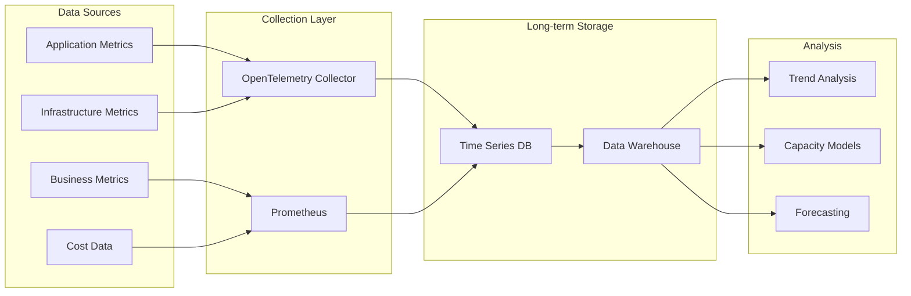
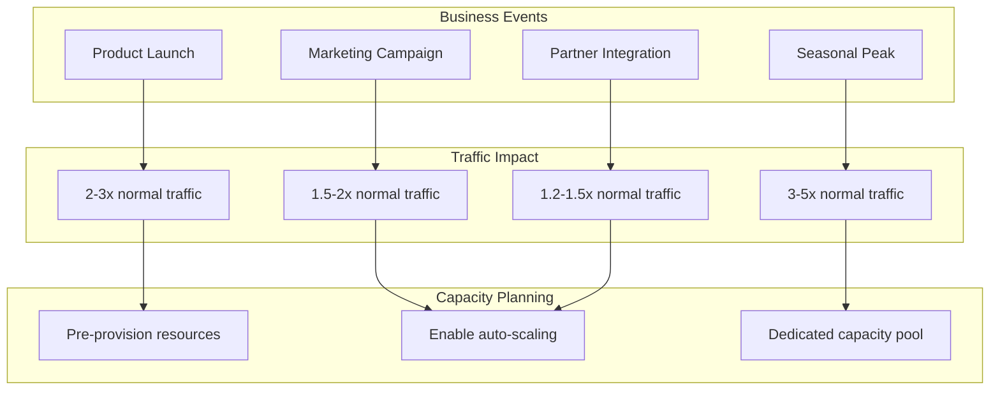
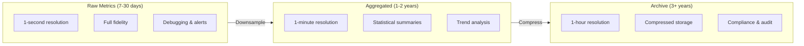

# How to Use Historical Data for Capacity Planning

Author: [nawazdhandala](https://www.github.com/nawazdhandala)

Tags: Site Reliability Engineering, Capacity Planning, Data Analysis, Forecasting, Observability

Description: Learn how to leverage historical metrics and trends to build accurate capacity forecasts and prevent resource exhaustion.

---

## The Value of Historical Data

Capacity planning without historical data is guesswork. With it, you can identify patterns, predict growth, and provision resources before problems occur. This guide walks through practical techniques for collecting, analyzing, and using historical data to make informed capacity decisions.

## Data Collection Architecture

Before you can analyze historical data, you need to collect it systematically.



## Step 1: Identify Key Metrics for Capacity Planning

Not all metrics are useful for capacity planning. Focus on resource utilization and demand indicators.

```python
# capacity_metrics.py - Define and collect capacity-relevant metrics
from dataclasses import dataclass
from enum import Enum
from typing import List, Optional
from datetime import datetime

class MetricType(Enum):
    UTILIZATION = "utilization"      # CPU, memory, disk usage
    THROUGHPUT = "throughput"        # Requests/sec, messages/sec
    SATURATION = "saturation"        # Queue depth, connection pool usage
    LATENCY = "latency"              # Response times at various percentiles

@dataclass
class CapacityMetric:
    name: str
    metric_type: MetricType
    unit: str
    warning_threshold: float
    critical_threshold: float
    description: str

# Define your capacity metrics catalog
CAPACITY_METRICS = [
    CapacityMetric(
        name="cpu_utilization",
        metric_type=MetricType.UTILIZATION,
        unit="percent",
        warning_threshold=70.0,
        critical_threshold=85.0,
        description="CPU usage across all cores",
    ),
    CapacityMetric(
        name="memory_utilization",
        metric_type=MetricType.UTILIZATION,
        unit="percent",
        warning_threshold=75.0,
        critical_threshold=90.0,
        description="Memory usage including buffers and cache",
    ),
    CapacityMetric(
        name="disk_utilization",
        metric_type=MetricType.UTILIZATION,
        unit="percent",
        warning_threshold=70.0,
        critical_threshold=85.0,
        description="Disk space usage",
    ),
    CapacityMetric(
        name="requests_per_second",
        metric_type=MetricType.THROUGHPUT,
        unit="req/s",
        warning_threshold=8000,
        critical_threshold=10000,
        description="Incoming request rate",
    ),
    CapacityMetric(
        name="connection_pool_usage",
        metric_type=MetricType.SATURATION,
        unit="percent",
        warning_threshold=70.0,
        critical_threshold=90.0,
        description="Database connection pool saturation",
    ),
    CapacityMetric(
        name="p99_latency",
        metric_type=MetricType.LATENCY,
        unit="ms",
        warning_threshold=200,
        critical_threshold=500,
        description="99th percentile response time",
    ),
]

@dataclass
class MetricDataPoint:
    metric_name: str
    value: float
    timestamp: datetime
    labels: dict

class HistoricalMetricsStore:
    """Store and query historical capacity metrics."""

    def __init__(self):
        self.data: List[MetricDataPoint] = []

    def record(self, metric_name: str, value: float,
               labels: Optional[dict] = None):
        self.data.append(MetricDataPoint(
            metric_name=metric_name,
            value=value,
            timestamp=datetime.utcnow(),
            labels=labels or {},
        ))

    def query(self, metric_name: str, start: datetime,
              end: datetime) -> List[MetricDataPoint]:
        return [
            p for p in self.data
            if p.metric_name == metric_name
            and start <= p.timestamp <= end
        ]
```

## Step 2: Analyze Seasonality Patterns

Most systems have predictable usage patterns. Identifying these helps you plan for peak capacity needs.

```python
# seasonality_analysis.py - Detect and quantify usage patterns
from dataclasses import dataclass
from datetime import datetime, timedelta
from typing import List, Dict, Tuple
import statistics

@dataclass
class SeasonalityPattern:
    pattern_type: str  # hourly, daily, weekly, monthly
    peak_periods: List[str]
    trough_periods: List[str]
    peak_to_trough_ratio: float
    confidence: float

def analyze_hourly_pattern(data_points: List[Tuple[datetime, float]]) -> Dict[int, float]:
    """Group metrics by hour of day and calculate averages."""
    hourly_values: Dict[int, List[float]] = {h: [] for h in range(24)}

    for timestamp, value in data_points:
        hour = timestamp.hour
        hourly_values[hour].append(value)

    return {
        hour: statistics.mean(values) if values else 0
        for hour, values in hourly_values.items()
    }

def analyze_daily_pattern(data_points: List[Tuple[datetime, float]]) -> Dict[int, float]:
    """Group metrics by day of week (0=Monday, 6=Sunday)."""
    daily_values: Dict[int, List[float]] = {d: [] for d in range(7)}

    for timestamp, value in data_points:
        day = timestamp.weekday()
        daily_values[day].append(value)

    return {
        day: statistics.mean(values) if values else 0
        for day, values in daily_values.items()
    }

def detect_seasonality(data_points: List[Tuple[datetime, float]]) -> SeasonalityPattern:
    """Analyze data to detect seasonality patterns."""

    # Analyze hourly patterns
    hourly = analyze_hourly_pattern(data_points)
    hourly_values = list(hourly.values())

    if not hourly_values or max(hourly_values) == 0:
        return SeasonalityPattern(
            pattern_type="none",
            peak_periods=[],
            trough_periods=[],
            peak_to_trough_ratio=1.0,
            confidence=0.0,
        )

    peak_hour = max(hourly, key=hourly.get)
    trough_hour = min(hourly, key=hourly.get)

    peak_value = hourly[peak_hour]
    trough_value = hourly[trough_hour]

    ratio = peak_value / trough_value if trough_value > 0 else float('inf')

    # Determine peak and trough periods
    avg_value = statistics.mean(hourly_values)
    peak_hours = [h for h, v in hourly.items() if v > avg_value * 1.1]
    trough_hours = [h for h, v in hourly.items() if v < avg_value * 0.9]

    # Calculate confidence based on consistency
    std_dev = statistics.stdev(hourly_values) if len(hourly_values) > 1 else 0
    cv = std_dev / avg_value if avg_value > 0 else 0
    confidence = min(1.0, cv * 2)  # Higher variance = more confident pattern exists

    return SeasonalityPattern(
        pattern_type="hourly",
        peak_periods=[f"{h}:00" for h in sorted(peak_hours)],
        trough_periods=[f"{h}:00" for h in sorted(trough_hours)],
        peak_to_trough_ratio=ratio,
        confidence=confidence,
    )

# Example usage
def plan_for_seasonality(pattern: SeasonalityPattern, base_capacity: int) -> dict:
    """Calculate capacity needs based on seasonality."""
    return {
        "base_capacity": base_capacity,
        "peak_capacity": int(base_capacity * pattern.peak_to_trough_ratio),
        "recommended_buffer": int(base_capacity * pattern.peak_to_trough_ratio * 0.2),
        "scale_up_before": pattern.peak_periods[0] if pattern.peak_periods else None,
        "scale_down_after": pattern.trough_periods[0] if pattern.trough_periods else None,
    }
```

## Step 3: Build Growth Trend Models

Historical data reveals growth trends that inform long-term capacity planning.

```python
# growth_modeling.py - Model and extrapolate growth trends
from dataclasses import dataclass
from datetime import datetime, timedelta
from typing import List, Tuple, Optional
import math

@dataclass
class GrowthModel:
    model_type: str  # linear, exponential, logarithmic
    growth_rate: float  # per month
    r_squared: float  # goodness of fit
    projected_values: List[Tuple[datetime, float]]

def calculate_linear_regression(
    data_points: List[Tuple[datetime, float]]
) -> Tuple[float, float, float]:
    """Simple linear regression returning slope, intercept, and R-squared."""
    if len(data_points) < 2:
        return 0.0, 0.0, 0.0

    # Convert timestamps to numeric values (days from start)
    start_time = data_points[0][0]
    x_values = [(p[0] - start_time).days for p in data_points]
    y_values = [p[1] for p in data_points]

    n = len(data_points)
    sum_x = sum(x_values)
    sum_y = sum(y_values)
    sum_xy = sum(x * y for x, y in zip(x_values, y_values))
    sum_x2 = sum(x * x for x in x_values)

    # Calculate slope and intercept
    denominator = n * sum_x2 - sum_x * sum_x
    if denominator == 0:
        return 0.0, sum_y / n if n > 0 else 0.0, 0.0

    slope = (n * sum_xy - sum_x * sum_y) / denominator
    intercept = (sum_y - slope * sum_x) / n

    # Calculate R-squared
    y_mean = sum_y / n
    ss_tot = sum((y - y_mean) ** 2 for y in y_values)
    ss_res = sum((y - (slope * x + intercept)) ** 2
                 for x, y in zip(x_values, y_values))

    r_squared = 1 - (ss_res / ss_tot) if ss_tot > 0 else 0.0

    return slope, intercept, r_squared

def build_growth_model(
    historical_data: List[Tuple[datetime, float]],
    forecast_months: int = 12
) -> GrowthModel:
    """Build a growth model from historical data and project forward."""

    slope, intercept, r_squared = calculate_linear_regression(historical_data)

    # Convert daily slope to monthly growth rate
    monthly_growth_rate = slope * 30

    # Generate projections
    last_date = historical_data[-1][0]
    last_value = historical_data[-1][1]

    projections = []
    for month in range(1, forecast_months + 1):
        future_date = last_date + timedelta(days=30 * month)
        # Linear projection
        projected_value = last_value + (monthly_growth_rate * month)
        projections.append((future_date, max(0, projected_value)))

    return GrowthModel(
        model_type="linear",
        growth_rate=monthly_growth_rate,
        r_squared=r_squared,
        projected_values=projections,
    )

def calculate_time_to_threshold(
    model: GrowthModel,
    current_value: float,
    threshold: float
) -> Optional[int]:
    """Calculate days until a threshold is reached."""
    if model.growth_rate <= 0:
        return None  # Not growing

    if current_value >= threshold:
        return 0  # Already exceeded

    # For linear model: days = (threshold - current) / daily_growth
    daily_growth = model.growth_rate / 30
    if daily_growth <= 0:
        return None

    days = (threshold - current_value) / daily_growth
    return int(days)

# Example: Predict when you'll hit capacity limits
def capacity_runway_report(
    metric_name: str,
    historical_data: List[Tuple[datetime, float]],
    current_capacity: float,
    warning_threshold_percent: float = 70,
    critical_threshold_percent: float = 85,
) -> dict:
    """Generate a capacity runway report."""

    model = build_growth_model(historical_data)
    current_value = historical_data[-1][1]

    warning_threshold = current_capacity * (warning_threshold_percent / 100)
    critical_threshold = current_capacity * (critical_threshold_percent / 100)

    days_to_warning = calculate_time_to_threshold(model, current_value, warning_threshold)
    days_to_critical = calculate_time_to_threshold(model, current_value, critical_threshold)

    return {
        "metric": metric_name,
        "current_value": current_value,
        "current_capacity": current_capacity,
        "utilization_percent": (current_value / current_capacity) * 100,
        "monthly_growth_rate": model.growth_rate,
        "model_confidence": model.r_squared,
        "days_to_warning": days_to_warning,
        "days_to_critical": days_to_critical,
        "recommendation": _generate_recommendation(days_to_critical),
    }

def _generate_recommendation(days_to_critical: Optional[int]) -> str:
    if days_to_critical is None:
        return "No growth detected - monitor for changes"
    elif days_to_critical < 30:
        return "URGENT: Scale capacity immediately"
    elif days_to_critical < 90:
        return "Plan capacity expansion within 30 days"
    elif days_to_critical < 180:
        return "Schedule capacity review for next quarter"
    else:
        return "Capacity runway is healthy"
```

## Step 4: Correlate Business Events with Capacity

Traffic spikes often correlate with business events. Tracking these improves forecast accuracy.



```python
# event_correlation.py - Track business events and their capacity impact
from dataclasses import dataclass
from datetime import datetime, timedelta
from typing import List, Optional
import statistics

@dataclass
class BusinessEvent:
    event_type: str
    name: str
    start_time: datetime
    end_time: datetime
    expected_impact_multiplier: float
    actual_impact_multiplier: Optional[float] = None

@dataclass
class EventImpactAnalysis:
    event_type: str
    sample_size: int
    average_impact: float
    min_impact: float
    max_impact: float
    std_deviation: float

class EventCapacityCorrelator:
    """Correlate business events with capacity requirements."""

    def __init__(self):
        self.events: List[BusinessEvent] = []
        self.baseline_metrics: dict = {}

    def record_event(self, event: BusinessEvent):
        self.events.append(event)

    def set_baseline(self, metric_name: str, value: float):
        self.baseline_metrics[metric_name] = value

    def calculate_actual_impact(
        self,
        event: BusinessEvent,
        metric_name: str,
        metric_values: List[Tuple[datetime, float]]
    ) -> float:
        """Calculate the actual impact of an event on a metric."""
        baseline = self.baseline_metrics.get(metric_name, 0)
        if baseline == 0:
            return 1.0

        # Get metric values during the event window
        event_values = [
            v for t, v in metric_values
            if event.start_time <= t <= event.end_time
        ]

        if not event_values:
            return 1.0

        peak_during_event = max(event_values)
        return peak_during_event / baseline

    def analyze_event_type_impact(
        self,
        event_type: str
    ) -> Optional[EventImpactAnalysis]:
        """Analyze historical impact of a specific event type."""
        type_events = [
            e for e in self.events
            if e.event_type == event_type and e.actual_impact_multiplier
        ]

        if len(type_events) < 2:
            return None

        impacts = [e.actual_impact_multiplier for e in type_events]

        return EventImpactAnalysis(
            event_type=event_type,
            sample_size=len(type_events),
            average_impact=statistics.mean(impacts),
            min_impact=min(impacts),
            max_impact=max(impacts),
            std_deviation=statistics.stdev(impacts),
        )

    def recommend_capacity_for_event(
        self,
        event_type: str,
        current_capacity: float,
        confidence_level: float = 0.95
    ) -> dict:
        """Recommend capacity for an upcoming event."""
        analysis = self.analyze_event_type_impact(event_type)

        if not analysis:
            # No historical data - use conservative estimate
            return {
                "recommended_capacity": current_capacity * 2.0,
                "confidence": "low",
                "basis": "no historical data - using 2x multiplier",
            }

        # Use max historical impact plus buffer
        buffer = 1.0 + (1.0 - confidence_level)
        recommended_multiplier = analysis.max_impact * buffer

        return {
            "recommended_capacity": current_capacity * recommended_multiplier,
            "confidence": "high" if analysis.sample_size >= 5 else "medium",
            "basis": f"Based on {analysis.sample_size} previous {event_type} events",
            "historical_average_impact": analysis.average_impact,
            "historical_max_impact": analysis.max_impact,
        }
```

## Step 5: Automate Capacity Reports

Regular capacity reports keep stakeholders informed and drive proactive planning.

```python
# capacity_report.py - Generate automated capacity reports
from dataclasses import dataclass
from datetime import datetime
from typing import List, Dict
import json

@dataclass
class CapacityReportSection:
    title: str
    status: str  # healthy, warning, critical
    current_utilization: float
    trend: str  # growing, stable, declining
    runway_days: int
    recommendations: List[str]

def generate_capacity_report(
    service_metrics: Dict[str, dict],
    report_date: datetime = None
) -> dict:
    """Generate a comprehensive capacity report."""

    if report_date is None:
        report_date = datetime.utcnow()

    sections = []
    overall_status = "healthy"

    for service_name, metrics in service_metrics.items():
        utilization = metrics.get("utilization", 0)
        growth_rate = metrics.get("monthly_growth_rate", 0)
        runway = metrics.get("runway_days", 365)

        # Determine status
        if utilization > 85 or runway < 30:
            status = "critical"
            overall_status = "critical"
        elif utilization > 70 or runway < 90:
            status = "warning"
            if overall_status != "critical":
                overall_status = "warning"
        else:
            status = "healthy"

        # Determine trend
        if growth_rate > 5:
            trend = "growing"
        elif growth_rate < -5:
            trend = "declining"
        else:
            trend = "stable"

        # Generate recommendations
        recommendations = []
        if status == "critical":
            recommendations.append(f"Immediately provision additional capacity for {service_name}")
        if trend == "growing" and runway < 180:
            recommendations.append(f"Plan capacity expansion for {service_name} within {runway // 2} days")
        if utilization < 30:
            recommendations.append(f"Consider right-sizing {service_name} to reduce costs")

        sections.append(CapacityReportSection(
            title=service_name,
            status=status,
            current_utilization=utilization,
            trend=trend,
            runway_days=runway,
            recommendations=recommendations,
        ))

    return {
        "report_date": report_date.isoformat(),
        "overall_status": overall_status,
        "sections": [
            {
                "title": s.title,
                "status": s.status,
                "current_utilization": f"{s.current_utilization:.1f}%",
                "trend": s.trend,
                "runway_days": s.runway_days,
                "recommendations": s.recommendations,
            }
            for s in sections
        ],
        "summary": {
            "total_services": len(sections),
            "healthy": sum(1 for s in sections if s.status == "healthy"),
            "warning": sum(1 for s in sections if s.status == "warning"),
            "critical": sum(1 for s in sections if s.status == "critical"),
        },
    }

# Example usage
sample_metrics = {
    "api-gateway": {
        "utilization": 72,
        "monthly_growth_rate": 8,
        "runway_days": 85,
    },
    "user-database": {
        "utilization": 45,
        "monthly_growth_rate": 3,
        "runway_days": 240,
    },
    "cache-cluster": {
        "utilization": 88,
        "monthly_growth_rate": 12,
        "runway_days": 25,
    },
}

report = generate_capacity_report(sample_metrics)
print(json.dumps(report, indent=2))
```

## Data Retention Strategy

Historical data needs vary by use case:



## Key Takeaways

Historical data transforms capacity planning from reactive firefighting to proactive management. Collect metrics at appropriate resolutions, analyze seasonality and growth trends, correlate with business events, and automate reporting. When your historical metrics flow into a unified platform like OneUptime alongside real-time observability data, you gain the context needed to make confident capacity decisions.

---

The best time to start collecting historical data was a year ago. The second best time is now. Begin instrumenting your systems today, and within a few months you will have the data foundation needed for accurate capacity forecasting.
