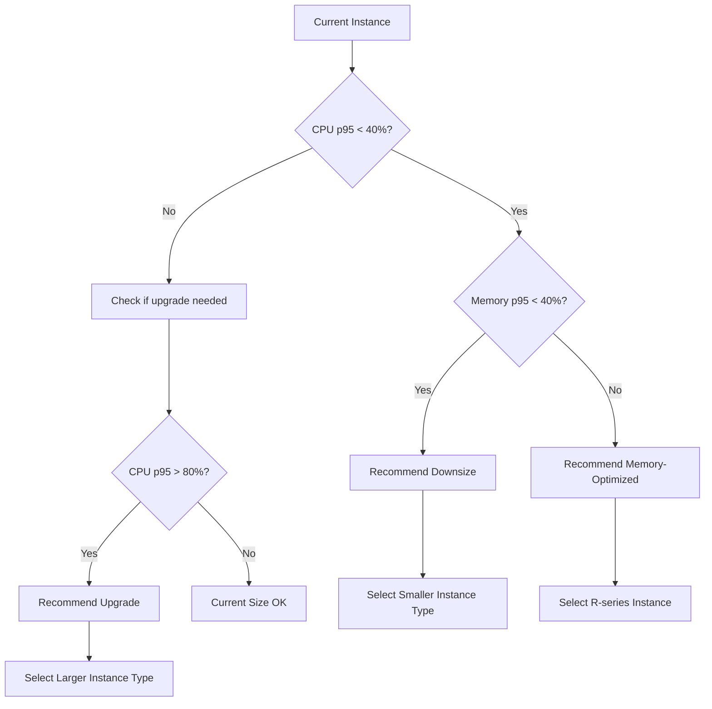
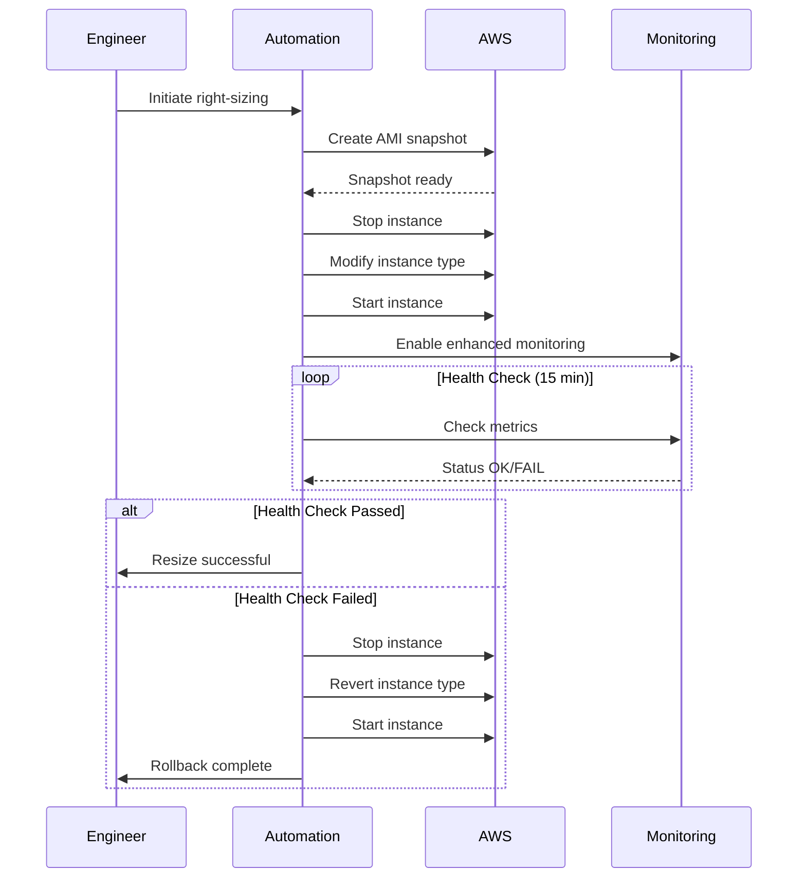

# How to Implement Right-Sizing Recommendations

Author: [nawazdhandala](https://www.github.com/nawazdhandala)

Tags: FinOps, Cloud Cost Management, Right-Sizing, Performance Optimization, AWS, Resource Optimization

Description: A step-by-step guide to identifying and safely implementing right-sizing recommendations to eliminate wasted cloud resources.

---

## The Right-Sizing Problem

Studies consistently show that 30-40% of cloud compute resources are oversized. Teams provision for peak load that rarely comes, copy instance sizes from documentation examples, or simply never revisit initial sizing decisions. Right-sizing means matching your resource allocation to actual usage - not too big, not too small.

## Why Right-Sizing Gets Ignored

Right-sizing recommendations are easy to generate but hard to implement. Common blockers include:

- Fear of causing performance issues
- No clear ownership of resource decisions
- Lack of a safe rollback process
- Recommendations that do not account for peak usage

This guide addresses each of these blockers with practical solutions.

## Step 1: Collect Accurate Utilization Data

Before resizing anything, establish baseline metrics over a meaningful time period:

```python
import boto3
from datetime import datetime, timedelta
from statistics import mean, stdev

def get_instance_utilization(instance_id, days=14):
    """
    Collect CPU and memory utilization metrics for an EC2 instance.
    Requires CloudWatch agent for memory metrics.
    """
    cloudwatch = boto3.client('cloudwatch')

    end_time = datetime.utcnow()
    start_time = end_time - timedelta(days=days)

    # CPU utilization from EC2 metrics
    cpu_response = cloudwatch.get_metric_statistics(
        Namespace='AWS/EC2',
        MetricName='CPUUtilization',
        Dimensions=[{'Name': 'InstanceId', 'Value': instance_id}],
        StartTime=start_time,
        EndTime=end_time,
        Period=3600,  # Hourly data points
        Statistics=['Average', 'Maximum']
    )

    # Memory utilization from CloudWatch agent
    memory_response = cloudwatch.get_metric_statistics(
        Namespace='CWAgent',
        MetricName='mem_used_percent',
        Dimensions=[{'Name': 'InstanceId', 'Value': instance_id}],
        StartTime=start_time,
        EndTime=end_time,
        Period=3600,
        Statistics=['Average', 'Maximum']
    )

    cpu_data = cpu_response['Datapoints']
    memory_data = memory_response['Datapoints']

    return {
        'instance_id': instance_id,
        'observation_days': days,
        'cpu': {
            'average': mean([d['Average'] for d in cpu_data]) if cpu_data else None,
            'max': max([d['Maximum'] for d in cpu_data]) if cpu_data else None,
            'p95': calculate_percentile([d['Average'] for d in cpu_data], 95) if cpu_data else None
        },
        'memory': {
            'average': mean([d['Average'] for d in memory_data]) if memory_data else None,
            'max': max([d['Maximum'] for d in memory_data]) if memory_data else None,
            'p95': calculate_percentile([d['Average'] for d in memory_data], 95) if memory_data else None
        }
    }

def calculate_percentile(data, percentile):
    """Calculate the given percentile of a list of values."""
    if not data:
        return None
    sorted_data = sorted(data)
    index = int(len(sorted_data) * percentile / 100)
    return sorted_data[min(index, len(sorted_data) - 1)]
```

## Step 2: Generate Right-Sizing Recommendations

Use utilization data to recommend appropriate instance sizes:



```python
# Instance family specifications for sizing decisions
INSTANCE_SPECS = {
    't3.micro': {'vcpu': 2, 'memory_gb': 1, 'price_hourly': 0.0104},
    't3.small': {'vcpu': 2, 'memory_gb': 2, 'price_hourly': 0.0208},
    't3.medium': {'vcpu': 2, 'memory_gb': 4, 'price_hourly': 0.0416},
    't3.large': {'vcpu': 2, 'memory_gb': 8, 'price_hourly': 0.0832},
    't3.xlarge': {'vcpu': 4, 'memory_gb': 16, 'price_hourly': 0.1664},
    'm5.large': {'vcpu': 2, 'memory_gb': 8, 'price_hourly': 0.096},
    'm5.xlarge': {'vcpu': 4, 'memory_gb': 16, 'price_hourly': 0.192},
    'm5.2xlarge': {'vcpu': 8, 'memory_gb': 32, 'price_hourly': 0.384},
    'r5.large': {'vcpu': 2, 'memory_gb': 16, 'price_hourly': 0.126},
    'r5.xlarge': {'vcpu': 4, 'memory_gb': 32, 'price_hourly': 0.252},
    'c5.large': {'vcpu': 2, 'memory_gb': 4, 'price_hourly': 0.085},
    'c5.xlarge': {'vcpu': 4, 'memory_gb': 8, 'price_hourly': 0.170},
}

def generate_right_sizing_recommendation(instance_id, current_type, utilization):
    """
    Generate a right-sizing recommendation based on utilization data.
    Uses conservative thresholds to avoid performance issues.
    """
    current_specs = INSTANCE_SPECS.get(current_type)
    if not current_specs:
        return {'recommendation': 'unknown_instance_type', 'action': 'manual_review'}

    cpu_p95 = utilization['cpu']['p95']
    memory_p95 = utilization['memory']['p95']

    # Skip if we do not have enough data
    if cpu_p95 is None or memory_p95 is None:
        return {
            'instance_id': instance_id,
            'current_type': current_type,
            'recommendation': 'insufficient_data',
            'action': 'install_cloudwatch_agent'
        }

    # Determine if resize is needed
    action = 'no_change'
    reason = []

    # Check for oversizing (both CPU and memory under 40% at p95)
    if cpu_p95 < 40 and memory_p95 < 40:
        action = 'downsize'
        reason.append(f"CPU p95 ({cpu_p95:.1f}%) and memory p95 ({memory_p95:.1f}%) both under 40%")

    # Check for undersizing
    elif cpu_p95 > 80 or memory_p95 > 80:
        action = 'upsize'
        if cpu_p95 > 80:
            reason.append(f"CPU p95 ({cpu_p95:.1f}%) exceeds 80%")
        if memory_p95 > 80:
            reason.append(f"Memory p95 ({memory_p95:.1f}%) exceeds 80%")

    # Find recommended instance type
    recommended_type = current_type
    monthly_savings = 0

    if action == 'downsize':
        recommended_type = find_smaller_instance(current_type, cpu_p95, memory_p95)
        if recommended_type != current_type:
            current_monthly = current_specs['price_hourly'] * 730
            new_monthly = INSTANCE_SPECS[recommended_type]['price_hourly'] * 730
            monthly_savings = current_monthly - new_monthly

    elif action == 'upsize':
        recommended_type = find_larger_instance(current_type, cpu_p95, memory_p95)

    return {
        'instance_id': instance_id,
        'current_type': current_type,
        'recommended_type': recommended_type,
        'action': action,
        'reason': reason,
        'utilization': {
            'cpu_p95': cpu_p95,
            'memory_p95': memory_p95
        },
        'estimated_monthly_savings': monthly_savings,
        'confidence': 'high' if utilization['observation_days'] >= 14 else 'medium'
    }

def find_smaller_instance(current_type, cpu_util, memory_util):
    """
    Find a smaller instance that can handle the workload with headroom.
    Target: 60-70% utilization after resize.
    """
    current_specs = INSTANCE_SPECS[current_type]

    # Calculate required resources with 40% headroom
    required_vcpu = current_specs['vcpu'] * (cpu_util / 100) * 1.4
    required_memory = current_specs['memory_gb'] * (memory_util / 100) * 1.4

    # Find smallest instance that meets requirements
    candidates = []
    for instance_type, specs in INSTANCE_SPECS.items():
        if specs['vcpu'] >= required_vcpu and specs['memory_gb'] >= required_memory:
            if specs['price_hourly'] < current_specs['price_hourly']:
                candidates.append((instance_type, specs['price_hourly']))

    if candidates:
        # Return cheapest option
        return min(candidates, key=lambda x: x[1])[0]

    return current_type

def find_larger_instance(current_type, cpu_util, memory_util):
    """
    Find a larger instance to handle the workload.
    """
    current_specs = INSTANCE_SPECS[current_type]

    # Get instance family
    family = current_type.split('.')[0]

    # Find next size up in same family
    for instance_type, specs in INSTANCE_SPECS.items():
        if instance_type.startswith(family):
            if specs['vcpu'] > current_specs['vcpu'] or specs['memory_gb'] > current_specs['memory_gb']:
                return instance_type

    return current_type
```

## Step 3: Validate Recommendations Safely

Before implementing changes, validate recommendations will not cause issues:

```python
def validate_recommendation(recommendation, instance_metadata):
    """
    Validate a right-sizing recommendation against constraints.
    """
    warnings = []
    blockers = []

    # Check if instance is in an Auto Scaling Group
    if instance_metadata.get('auto_scaling_group'):
        blockers.append("Instance is part of ASG - modify launch template instead")

    # Check for reserved instance coverage
    if instance_metadata.get('has_ri_coverage'):
        warnings.append("Instance has RI coverage - verify RI flexibility or modify RI")

    # Check instance store requirements
    if instance_metadata.get('uses_instance_store'):
        warnings.append("Instance uses instance store - data will be lost on resize")

    # Verify new instance type is available in the AZ
    recommended_type = recommendation['recommended_type']
    availability_zone = instance_metadata.get('availability_zone')

    if not is_instance_available(recommended_type, availability_zone):
        blockers.append(f"{recommended_type} not available in {availability_zone}")

    # Check for ENA/NVMe driver requirements
    current_gen = recommendation['current_type'][0] in ['t', 'm', 'c', 'r']
    new_gen = recommended_type[0] in ['t', 'm', 'c', 'r']

    if not current_gen and new_gen:
        warnings.append("New instance requires ENA drivers - verify AMI compatibility")

    return {
        'can_proceed': len(blockers) == 0,
        'blockers': blockers,
        'warnings': warnings
    }

def is_instance_available(instance_type, availability_zone):
    """Check if instance type is available in the given AZ."""
    ec2 = boto3.client('ec2')

    try:
        response = ec2.describe_instance_type_offerings(
            LocationType='availability-zone',
            Filters=[
                {'Name': 'instance-type', 'Values': [instance_type]},
                {'Name': 'location', 'Values': [availability_zone]}
            ]
        )
        return len(response['InstanceTypeOfferings']) > 0
    except Exception:
        return False
```

## Step 4: Implement Changes with Rollback Plan

Create a safe implementation process:



```python
import time

class RightSizingImplementation:
    """
    Safely implement right-sizing recommendations with automatic rollback.
    """

    def __init__(self):
        self.ec2 = boto3.client('ec2')
        self.cloudwatch = boto3.client('cloudwatch')

    def implement_resize(self, instance_id, new_instance_type,
                         health_check_duration_minutes=15):
        """
        Resize an instance with automatic health check and rollback.
        """
        # Get current state for rollback
        instance = self.ec2.describe_instances(
            InstanceIds=[instance_id]
        )['Reservations'][0]['Instances'][0]

        original_type = instance['InstanceType']

        print(f"Starting resize: {instance_id} from {original_type} to {new_instance_type}")

        # Step 1: Create AMI for safety
        ami_id = self._create_backup_ami(instance_id)
        print(f"Created backup AMI: {ami_id}")

        try:
            # Step 2: Stop instance
            print("Stopping instance...")
            self.ec2.stop_instances(InstanceIds=[instance_id])
            self._wait_for_state(instance_id, 'stopped')

            # Step 3: Modify instance type
            print(f"Changing instance type to {new_instance_type}...")
            self.ec2.modify_instance_attribute(
                InstanceId=instance_id,
                InstanceType={'Value': new_instance_type}
            )

            # Step 4: Start instance
            print("Starting instance...")
            self.ec2.start_instances(InstanceIds=[instance_id])
            self._wait_for_state(instance_id, 'running')

            # Step 5: Run health checks
            print(f"Running health checks for {health_check_duration_minutes} minutes...")
            health_ok = self._run_health_checks(
                instance_id,
                duration_minutes=health_check_duration_minutes
            )

            if health_ok:
                print("Health checks passed. Resize complete.")
                return {
                    'success': True,
                    'instance_id': instance_id,
                    'old_type': original_type,
                    'new_type': new_instance_type,
                    'backup_ami': ami_id
                }
            else:
                print("Health checks failed. Initiating rollback...")
                self._rollback(instance_id, original_type)
                return {
                    'success': False,
                    'instance_id': instance_id,
                    'reason': 'health_check_failed',
                    'rolled_back_to': original_type
                }

        except Exception as e:
            print(f"Error during resize: {e}")
            print("Initiating rollback...")
            self._rollback(instance_id, original_type)
            raise

    def _create_backup_ami(self, instance_id):
        """Create an AMI backup before resizing."""
        timestamp = datetime.now().strftime('%Y%m%d-%H%M%S')
        response = self.ec2.create_image(
            InstanceId=instance_id,
            Name=f"pre-resize-backup-{instance_id}-{timestamp}",
            NoReboot=True
        )
        return response['ImageId']

    def _wait_for_state(self, instance_id, target_state, timeout=300):
        """Wait for instance to reach target state."""
        start_time = time.time()
        while time.time() - start_time < timeout:
            response = self.ec2.describe_instances(InstanceIds=[instance_id])
            current_state = response['Reservations'][0]['Instances'][0]['State']['Name']

            if current_state == target_state:
                return True

            time.sleep(10)

        raise TimeoutError(f"Instance did not reach {target_state} within {timeout}s")

    def _run_health_checks(self, instance_id, duration_minutes=15):
        """
        Run health checks after resize.
        Returns True if instance appears healthy.
        """
        check_interval = 60  # Check every minute
        checks_passed = 0
        checks_required = duration_minutes

        for i in range(duration_minutes):
            time.sleep(check_interval)

            # Check EC2 status checks
            status = self.ec2.describe_instance_status(InstanceIds=[instance_id])

            if not status['InstanceStatuses']:
                print(f"  Check {i+1}/{duration_minutes}: No status available")
                continue

            instance_status = status['InstanceStatuses'][0]
            system_ok = instance_status['SystemStatus']['Status'] == 'ok'
            instance_ok = instance_status['InstanceStatus']['Status'] == 'ok'

            if system_ok and instance_ok:
                checks_passed += 1
                print(f"  Check {i+1}/{duration_minutes}: PASSED")
            else:
                print(f"  Check {i+1}/{duration_minutes}: FAILED")

        # Require 80% of checks to pass
        return checks_passed >= (checks_required * 0.8)

    def _rollback(self, instance_id, original_type):
        """Rollback to original instance type."""
        self.ec2.stop_instances(InstanceIds=[instance_id])
        self._wait_for_state(instance_id, 'stopped')

        self.ec2.modify_instance_attribute(
            InstanceId=instance_id,
            InstanceType={'Value': original_type}
        )

        self.ec2.start_instances(InstanceIds=[instance_id])
        self._wait_for_state(instance_id, 'running')

        print(f"Rollback complete. Instance restored to {original_type}")


# Example usage
resizer = RightSizingImplementation()

# Implement a resize with 15-minute health check period
result = resizer.implement_resize(
    instance_id='i-0123456789abcdef',
    new_instance_type='t3.medium',
    health_check_duration_minutes=15
)

if result['success']:
    print(f"Successfully resized to {result['new_type']}")
else:
    print(f"Resize failed: {result['reason']}")
```

## Step 5: Handle Auto Scaling Groups

For instances in ASGs, modify the launch template instead:

```python
def resize_asg_instances(asg_name, new_instance_type):
    """
    Update ASG to use new instance type via launch template.
    Performs rolling update to minimize disruption.
    """
    autoscaling = boto3.client('autoscaling')
    ec2 = boto3.client('ec2')

    # Get current ASG configuration
    asg = autoscaling.describe_auto_scaling_groups(
        AutoScalingGroupNames=[asg_name]
    )['AutoScalingGroups'][0]

    # Get current launch template
    launch_template = asg.get('LaunchTemplate', {})
    template_id = launch_template.get('LaunchTemplateId')

    if not template_id:
        raise ValueError("ASG does not use a launch template")

    # Create new launch template version with new instance type
    current_template = ec2.describe_launch_template_versions(
        LaunchTemplateId=template_id,
        Versions=['$Latest']
    )['LaunchTemplateVersions'][0]

    new_version = ec2.create_launch_template_version(
        LaunchTemplateId=template_id,
        SourceVersion=str(current_template['VersionNumber']),
        LaunchTemplateData={
            'InstanceType': new_instance_type
        },
        VersionDescription=f"Right-sized to {new_instance_type}"
    )

    new_version_number = new_version['LaunchTemplateVersion']['VersionNumber']

    # Update ASG to use new version
    autoscaling.update_auto_scaling_group(
        AutoScalingGroupName=asg_name,
        LaunchTemplate={
            'LaunchTemplateId': template_id,
            'Version': str(new_version_number)
        }
    )

    # Start instance refresh for rolling update
    autoscaling.start_instance_refresh(
        AutoScalingGroupName=asg_name,
        Strategy='Rolling',
        Preferences={
            'MinHealthyPercentage': 90,
            'InstanceWarmup': 300
        }
    )

    print(f"ASG {asg_name} update initiated with rolling refresh")
    return {
        'asg_name': asg_name,
        'new_instance_type': new_instance_type,
        'new_template_version': new_version_number
    }
```

## Tracking Right-Sizing Progress

Create a dashboard to track your right-sizing efforts:

```python
def generate_rightsizing_report(recommendations):
    """
    Generate a summary report of right-sizing recommendations and progress.
    """
    total_instances = len(recommendations)

    by_action = {
        'downsize': [],
        'upsize': [],
        'no_change': [],
        'insufficient_data': []
    }

    for rec in recommendations:
        action = rec.get('action', 'unknown')
        if action in by_action:
            by_action[action].append(rec)

    total_savings = sum(
        r.get('estimated_monthly_savings', 0)
        for r in by_action['downsize']
    )

    report = f"""
=== Right-Sizing Report ===

Total Instances Analyzed: {total_instances}

Summary:
  - Candidates for Downsize: {len(by_action['downsize'])}
  - Candidates for Upsize: {len(by_action['upsize'])}
  - Correctly Sized: {len(by_action['no_change'])}
  - Insufficient Data: {len(by_action['insufficient_data'])}

Estimated Monthly Savings: ${total_savings:,.2f}
Estimated Annual Savings: ${total_savings * 12:,.2f}

Top 10 Downsize Candidates:
"""

    top_downsizes = sorted(
        by_action['downsize'],
        key=lambda x: x.get('estimated_monthly_savings', 0),
        reverse=True
    )[:10]

    for rec in top_downsizes:
        report += f"  {rec['instance_id']}: {rec['current_type']} -> {rec['recommended_type']} "
        report += f"(saves ${rec['estimated_monthly_savings']:.2f}/month)\n"

    return report
```

---

Right-sizing is not a one-time project but an ongoing practice. Resources drift over time as workloads change, so schedule quarterly reviews of your instance fleet. Start with low-risk workloads in non-production environments, build confidence in your process, then expand to production. The savings compound quickly - even modest right-sizing across hundreds of instances can save tens of thousands of dollars monthly.
