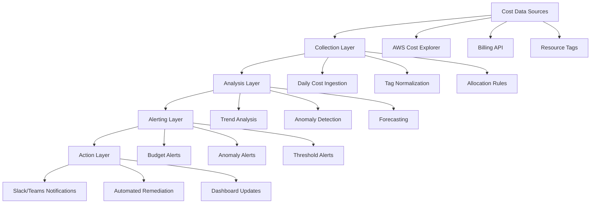
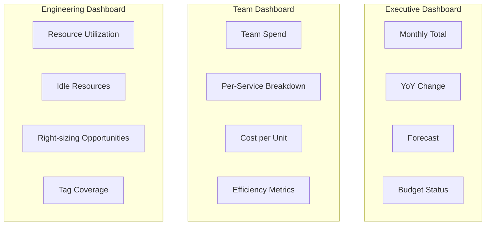
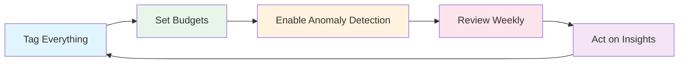

# How to Monitor Cloud Cost Trends

Author: [nawazdhandala](https://www.github.com/nawazdhandala)

Tags: FinOps, Cloud Cost Management, Cost Monitoring, AWS Cost Explorer, Budgets, Observability

Description: Learn how to build effective cloud cost monitoring that catches anomalies early and provides actionable insights for optimization.

---

## Why Cost Monitoring Matters

Without proper cost monitoring, cloud bills become a monthly surprise. Teams discover overspending weeks after it happens, when it is too late to take corrective action. Effective cost monitoring gives you early warning signals, identifies optimization opportunities, and builds organizational accountability for cloud spending.

## The Cost Monitoring Stack

A complete cost monitoring system includes multiple layers:



## Step 1: Establish Cost Visibility

Start by enabling detailed billing and setting up proper tagging:

```python
import boto3
from datetime import datetime, timedelta
from collections import defaultdict

class CostDataCollector:
    """
    Collects and organizes cost data from AWS Cost Explorer.
    """

    def __init__(self):
        self.ce = boto3.client('ce')

    def get_daily_costs(self, days=30, granularity='DAILY'):
        """
        Retrieve daily cost breakdown by service.
        """
        end_date = datetime.now().strftime('%Y-%m-%d')
        start_date = (datetime.now() - timedelta(days=days)).strftime('%Y-%m-%d')

        response = self.ce.get_cost_and_usage(
            TimePeriod={'Start': start_date, 'End': end_date},
            Granularity=granularity,
            Metrics=['UnblendedCost', 'UsageQuantity'],
            GroupBy=[
                {'Type': 'DIMENSION', 'Key': 'SERVICE'}
            ]
        )

        daily_costs = []
        for result in response['ResultsByTime']:
            date = result['TimePeriod']['Start']
            services = {}
            total = 0

            for group in result['Groups']:
                service = group['Keys'][0]
                cost = float(group['Metrics']['UnblendedCost']['Amount'])
                services[service] = cost
                total += cost

            daily_costs.append({
                'date': date,
                'total': total,
                'by_service': services
            })

        return daily_costs

    def get_costs_by_tag(self, tag_key, days=30):
        """
        Get costs grouped by a specific tag (e.g., team, environment, project).
        """
        end_date = datetime.now().strftime('%Y-%m-%d')
        start_date = (datetime.now() - timedelta(days=days)).strftime('%Y-%m-%d')

        response = self.ce.get_cost_and_usage(
            TimePeriod={'Start': start_date, 'End': end_date},
            Granularity='MONTHLY',
            Metrics=['UnblendedCost'],
            GroupBy=[
                {'Type': 'TAG', 'Key': tag_key}
            ]
        )

        tag_costs = defaultdict(float)
        for result in response['ResultsByTime']:
            for group in result['Groups']:
                tag_value = group['Keys'][0]
                # Handle untagged resources
                if tag_value == f"{tag_key}$":
                    tag_value = "untagged"
                cost = float(group['Metrics']['UnblendedCost']['Amount'])
                tag_costs[tag_value] += cost

        return dict(tag_costs)

    def get_cost_forecast(self, days_forward=30):
        """
        Get AWS cost forecast for the specified period.
        """
        start_date = datetime.now().strftime('%Y-%m-%d')
        end_date = (datetime.now() + timedelta(days=days_forward)).strftime('%Y-%m-%d')

        try:
            response = self.ce.get_cost_forecast(
                TimePeriod={'Start': start_date, 'End': end_date},
                Metric='UNBLENDED_COST',
                Granularity='MONTHLY'
            )

            return {
                'total_forecast': float(response['Total']['Amount']),
                'forecast_by_period': [
                    {
                        'period': r['TimePeriod'],
                        'mean': float(r['MeanValue']),
                        'prediction_interval_lower': float(r.get('PredictionIntervalLowerBound', 0)),
                        'prediction_interval_upper': float(r.get('PredictionIntervalUpperBound', 0))
                    }
                    for r in response.get('ForecastResultsByTime', [])
                ]
            }
        except Exception as e:
            # Forecast requires sufficient historical data
            return {'error': str(e)}


# Example usage
collector = CostDataCollector()

# Get last 30 days of costs
daily_costs = collector.get_daily_costs(days=30)
print(f"Total spend last 30 days: ${sum(d['total'] for d in daily_costs):,.2f}")

# Get costs by team
team_costs = collector.get_costs_by_tag('Team', days=30)
for team, cost in sorted(team_costs.items(), key=lambda x: x[1], reverse=True):
    print(f"  {team}: ${cost:,.2f}")
```

## Step 2: Implement Anomaly Detection

Detect unusual spending patterns before they become expensive problems:

```python
import statistics
from datetime import datetime, timedelta

class CostAnomalyDetector:
    """
    Detect anomalies in cloud spending using statistical methods.
    """

    def __init__(self, sensitivity=2.0):
        """
        sensitivity: Number of standard deviations for anomaly threshold.
        Lower = more sensitive, Higher = fewer false positives.
        """
        self.sensitivity = sensitivity

    def detect_anomalies(self, daily_costs, min_absolute_change=100):
        """
        Detect days with anomalous spending.
        Uses rolling average and standard deviation.
        """
        if len(daily_costs) < 14:
            return {'error': 'Need at least 14 days of data for anomaly detection'}

        anomalies = []

        for i in range(14, len(daily_costs)):
            # Use previous 14 days as baseline
            baseline_costs = [d['total'] for d in daily_costs[i-14:i]]
            current_cost = daily_costs[i]['total']
            current_date = daily_costs[i]['date']

            mean = statistics.mean(baseline_costs)
            std_dev = statistics.stdev(baseline_costs)

            # Avoid division by zero for stable costs
            if std_dev < 1:
                std_dev = mean * 0.1  # Use 10% of mean as minimum std

            # Calculate z-score
            z_score = (current_cost - mean) / std_dev

            # Check if anomaly
            is_anomaly = abs(z_score) > self.sensitivity
            absolute_change = current_cost - mean

            # Only flag if absolute change is significant
            if is_anomaly and abs(absolute_change) > min_absolute_change:
                anomalies.append({
                    'date': current_date,
                    'cost': current_cost,
                    'expected': mean,
                    'deviation': absolute_change,
                    'deviation_percent': (absolute_change / mean) * 100,
                    'z_score': z_score,
                    'direction': 'increase' if absolute_change > 0 else 'decrease'
                })

        return anomalies

    def detect_service_anomalies(self, daily_costs):
        """
        Detect which services are causing cost anomalies.
        """
        # Aggregate by service
        service_history = defaultdict(list)

        for day in daily_costs:
            for service, cost in day['by_service'].items():
                service_history[service].append({
                    'date': day['date'],
                    'cost': cost
                })

        service_anomalies = []

        for service, history in service_history.items():
            if len(history) < 14:
                continue

            costs = [h['cost'] for h in history]
            recent_avg = statistics.mean(costs[-7:])
            baseline_avg = statistics.mean(costs[-14:-7])

            if baseline_avg > 10:  # Only analyze services with meaningful spend
                change_percent = ((recent_avg - baseline_avg) / baseline_avg) * 100

                if abs(change_percent) > 20:  # 20% change threshold
                    service_anomalies.append({
                        'service': service,
                        'baseline_daily_avg': baseline_avg,
                        'recent_daily_avg': recent_avg,
                        'change_percent': change_percent,
                        'direction': 'increase' if change_percent > 0 else 'decrease'
                    })

        return sorted(service_anomalies, key=lambda x: abs(x['change_percent']), reverse=True)


# Example usage
detector = CostAnomalyDetector(sensitivity=2.0)

# Detect daily anomalies
anomalies = detector.detect_anomalies(daily_costs)
print(f"\nFound {len(anomalies)} cost anomalies:")
for anomaly in anomalies:
    print(f"  {anomaly['date']}: ${anomaly['cost']:.2f} "
          f"({anomaly['deviation_percent']:+.1f}% vs expected)")

# Detect service-level anomalies
service_anomalies = detector.detect_service_anomalies(daily_costs)
print(f"\nService cost changes:")
for sa in service_anomalies[:5]:
    print(f"  {sa['service']}: {sa['change_percent']:+.1f}%")
```

## Step 3: Set Up Budget Alerts

Create budgets with meaningful thresholds:

```python
def create_monthly_budget(budget_name, amount, email_subscribers):
    """
    Create a monthly budget with alerts at multiple thresholds.
    """
    budgets = boto3.client('budgets')
    account_id = boto3.client('sts').get_caller_identity()['Account']

    budget_config = {
        'BudgetName': budget_name,
        'BudgetLimit': {
            'Amount': str(amount),
            'Unit': 'USD'
        },
        'BudgetType': 'COST',
        'TimeUnit': 'MONTHLY',
        'CostFilters': {},
        'CostTypes': {
            'IncludeTax': True,
            'IncludeSubscription': True,
            'UseBlended': False,
            'IncludeRefund': False,
            'IncludeCredit': False,
            'IncludeUpfront': True,
            'IncludeRecurring': True,
            'IncludeOtherSubscription': True,
            'IncludeSupport': True,
            'IncludeDiscount': True,
            'UseAmortized': False
        }
    }

    # Create notifications at different thresholds
    notifications = [
        {
            'Notification': {
                'NotificationType': 'ACTUAL',
                'ComparisonOperator': 'GREATER_THAN',
                'Threshold': 50,
                'ThresholdType': 'PERCENTAGE'
            },
            'Subscribers': [
                {'SubscriptionType': 'EMAIL', 'Address': email}
                for email in email_subscribers
            ]
        },
        {
            'Notification': {
                'NotificationType': 'ACTUAL',
                'ComparisonOperator': 'GREATER_THAN',
                'Threshold': 80,
                'ThresholdType': 'PERCENTAGE'
            },
            'Subscribers': [
                {'SubscriptionType': 'EMAIL', 'Address': email}
                for email in email_subscribers
            ]
        },
        {
            'Notification': {
                'NotificationType': 'ACTUAL',
                'ComparisonOperator': 'GREATER_THAN',
                'Threshold': 100,
                'ThresholdType': 'PERCENTAGE'
            },
            'Subscribers': [
                {'SubscriptionType': 'EMAIL', 'Address': email}
                for email in email_subscribers
            ]
        },
        {
            'Notification': {
                'NotificationType': 'FORECASTED',
                'ComparisonOperator': 'GREATER_THAN',
                'Threshold': 100,
                'ThresholdType': 'PERCENTAGE'
            },
            'Subscribers': [
                {'SubscriptionType': 'EMAIL', 'Address': email}
                for email in email_subscribers
            ]
        }
    ]

    budgets.create_budget(
        AccountId=account_id,
        Budget=budget_config,
        NotificationsWithSubscribers=notifications
    )

    print(f"Created budget '{budget_name}' with ${amount} limit")


def create_team_budgets(team_allocations):
    """
    Create per-team budgets based on tag-based cost allocation.
    """
    budgets = boto3.client('budgets')
    account_id = boto3.client('sts').get_caller_identity()['Account']

    for team, config in team_allocations.items():
        budget_config = {
            'BudgetName': f"team-{team}-monthly",
            'BudgetLimit': {
                'Amount': str(config['monthly_budget']),
                'Unit': 'USD'
            },
            'BudgetType': 'COST',
            'TimeUnit': 'MONTHLY',
            'CostFilters': {
                'TagKeyValue': [f"user:Team${team}"]
            }
        }

        notifications = [
            {
                'Notification': {
                    'NotificationType': 'ACTUAL',
                    'ComparisonOperator': 'GREATER_THAN',
                    'Threshold': 80,
                    'ThresholdType': 'PERCENTAGE'
                },
                'Subscribers': [
                    {'SubscriptionType': 'EMAIL', 'Address': config['owner_email']}
                ]
            }
        ]

        try:
            budgets.create_budget(
                AccountId=account_id,
                Budget=budget_config,
                NotificationsWithSubscribers=notifications
            )
            print(f"Created budget for team {team}: ${config['monthly_budget']}")
        except budgets.exceptions.DuplicateRecordException:
            print(f"Budget for team {team} already exists")


# Example: Create team budgets
team_allocations = {
    'platform': {'monthly_budget': 50000, 'owner_email': 'platform-lead@example.com'},
    'data': {'monthly_budget': 30000, 'owner_email': 'data-lead@example.com'},
    'frontend': {'monthly_budget': 10000, 'owner_email': 'frontend-lead@example.com'}
}

create_team_budgets(team_allocations)
```

## Step 4: Build Cost Dashboards

Create dashboards that surface actionable insights:



```python
def generate_executive_dashboard_data():
    """
    Generate data for executive cost dashboard.
    """
    collector = CostDataCollector()

    # Current month costs
    current_month_costs = collector.get_daily_costs(days=30)
    current_month_total = sum(d['total'] for d in current_month_costs)

    # Previous month for comparison
    previous_month_costs = collector.get_daily_costs(days=60)
    previous_month_total = sum(d['total'] for d in previous_month_costs[:30])

    # Month over month change
    mom_change = ((current_month_total - previous_month_total) / previous_month_total) * 100

    # Forecast
    forecast = collector.get_cost_forecast(days_forward=30)

    # Top services
    service_totals = defaultdict(float)
    for day in current_month_costs:
        for service, cost in day['by_service'].items():
            service_totals[service] += cost

    top_services = sorted(service_totals.items(), key=lambda x: x[1], reverse=True)[:5]

    return {
        'current_month_total': current_month_total,
        'previous_month_total': previous_month_total,
        'month_over_month_change_percent': mom_change,
        'forecast_next_month': forecast.get('total_forecast', 0),
        'top_services': top_services,
        'daily_trend': [
            {'date': d['date'], 'cost': d['total']}
            for d in current_month_costs
        ]
    }


def generate_efficiency_metrics(daily_costs, resource_utilization):
    """
    Calculate efficiency metrics that track cost effectiveness.
    """
    total_cost = sum(d['total'] for d in daily_costs)

    # Cost per transaction (if you track transactions)
    # cost_per_transaction = total_cost / transaction_count

    # Average utilization weighted by cost
    weighted_utilization = 0
    total_compute_cost = 0

    for resource_id, data in resource_utilization.items():
        resource_cost = data.get('monthly_cost', 0)
        utilization = data.get('cpu_avg', 0)
        weighted_utilization += utilization * resource_cost
        total_compute_cost += resource_cost

    avg_utilization = weighted_utilization / total_compute_cost if total_compute_cost > 0 else 0

    # Waste metric - resources under 10% utilization
    low_utilization_resources = [
        r for r, d in resource_utilization.items()
        if d.get('cpu_avg', 0) < 10
    ]

    waste_estimate = sum(
        resource_utilization[r].get('monthly_cost', 0)
        for r in low_utilization_resources
    )

    return {
        'total_monthly_cost': total_cost,
        'average_compute_utilization': avg_utilization,
        'estimated_monthly_waste': waste_estimate,
        'waste_percentage': (waste_estimate / total_cost) * 100 if total_cost > 0 else 0,
        'low_utilization_resource_count': len(low_utilization_resources)
    }
```

## Step 5: Automate Cost Reports

Set up automated reporting for stakeholders:

```python
import json
from datetime import datetime

def generate_weekly_cost_report():
    """
    Generate a weekly cost report for stakeholders.
    """
    collector = CostDataCollector()
    detector = CostAnomalyDetector()

    # Collect data
    daily_costs = collector.get_daily_costs(days=14)
    team_costs = collector.get_costs_by_tag('Team', days=7)
    anomalies = detector.detect_anomalies(daily_costs)
    service_anomalies = detector.detect_service_anomalies(daily_costs)

    # Calculate metrics
    this_week = sum(d['total'] for d in daily_costs[-7:])
    last_week = sum(d['total'] for d in daily_costs[:7])
    wow_change = ((this_week - last_week) / last_week) * 100 if last_week > 0 else 0

    report = f"""
Weekly Cloud Cost Report
Generated: {datetime.now().strftime('%Y-%m-%d %H:%M')}
{'=' * 50}

SUMMARY
-------
This Week's Spend: ${this_week:,.2f}
Last Week's Spend: ${last_week:,.2f}
Week-over-Week Change: {wow_change:+.1f}%

SPEND BY TEAM
-------------
"""

    for team, cost in sorted(team_costs.items(), key=lambda x: x[1], reverse=True):
        report += f"  {team}: ${cost:,.2f}\n"

    report += f"""
ANOMALIES DETECTED: {len(anomalies)}
-------------------
"""

    if anomalies:
        for anomaly in anomalies[:5]:
            report += f"  {anomaly['date']}: ${anomaly['cost']:,.2f} "
            report += f"({anomaly['deviation_percent']:+.1f}% vs expected)\n"
    else:
        report += "  No significant anomalies detected.\n"

    report += f"""
SERVICE COST CHANGES
--------------------
"""

    for sa in service_anomalies[:5]:
        report += f"  {sa['service']}: {sa['change_percent']:+.1f}%\n"

    report += f"""
ACTION ITEMS
------------
"""

    # Generate action items based on findings
    if wow_change > 10:
        report += "  - Investigate week-over-week cost increase\n"

    if any(a['deviation_percent'] > 50 for a in anomalies):
        report += "  - Review significant cost anomalies\n"

    untagged_cost = team_costs.get('untagged', 0)
    if untagged_cost > 1000:
        report += f"  - Tag untagged resources (${untagged_cost:,.2f} unattributed)\n"

    return report


def send_report_to_slack(report, webhook_url):
    """
    Send the cost report to a Slack channel.
    """
    import requests

    # Format for Slack
    slack_message = {
        "blocks": [
            {
                "type": "header",
                "text": {
                    "type": "plain_text",
                    "text": "Weekly Cloud Cost Report"
                }
            },
            {
                "type": "section",
                "text": {
                    "type": "mrkdwn",
                    "text": f"```{report}```"
                }
            }
        ]
    }

    response = requests.post(webhook_url, json=slack_message)
    return response.status_code == 200


# Generate and send report
report = generate_weekly_cost_report()
print(report)
```

## Cost Monitoring Best Practices



1. **Tag consistently** - Enforce tagging policies. Untagged resources are invisible to cost attribution.

2. **Set realistic budgets** - Base budgets on historical spending plus planned growth, not arbitrary numbers.

3. **Monitor daily** - Do not wait for monthly bills. Daily monitoring catches issues 30x faster.

4. **Automate alerts** - Human review does not scale. Let automation surface the exceptions.

5. **Track unit economics** - Cost per customer, per transaction, or per request tells you if growth is efficient.

---

Cost monitoring is the foundation of FinOps maturity. Start with visibility - you cannot optimize what you cannot see. Layer in anomaly detection to catch problems early. Build automated reporting to keep stakeholders informed. Over time, your cost monitoring will evolve from reactive bill review to proactive cost intelligence that drives better architectural and business decisions.
