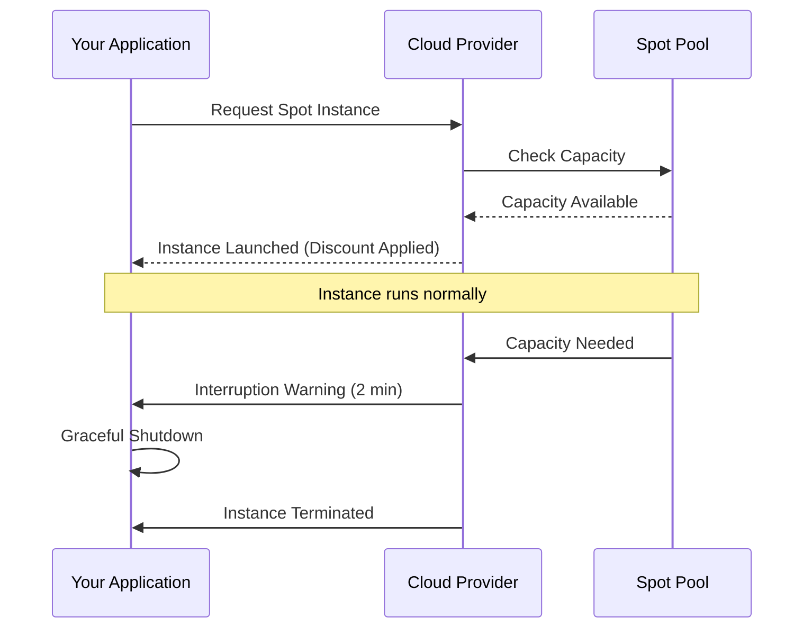
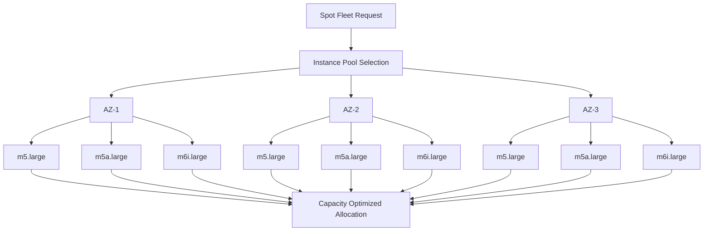
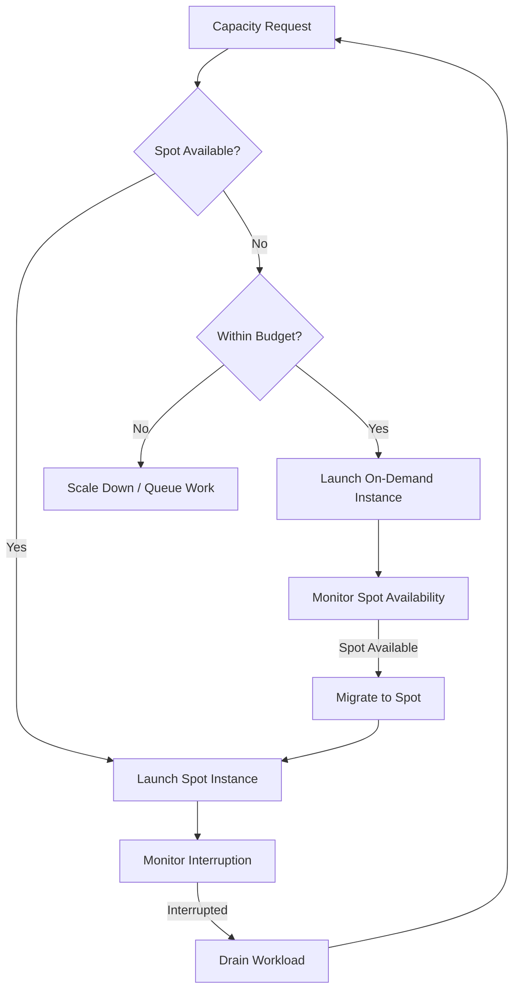

# How to Optimize Spot Instance Usage

Author: [nawazdhandala](https://www.github.com/nawazdhandala)

Tags: FinOps, Cloud Cost Management, Spot Instances, AWS, Kubernetes, Cost Optimization, High Availability

Description: Learn how to safely leverage spot instances for up to 90% cost savings while maintaining application reliability through proper architecture and interruption handling.

---

## The Case for Spot Instances

Spot instances offer 60-90% discounts compared to on-demand pricing. The catch? They can be interrupted with as little as two minutes notice when capacity is needed elsewhere. Despite this limitation, organizations running stateless workloads, batch processing, or Kubernetes clusters can safely use spots to dramatically cut compute costs.

## Understanding Spot Instance Behavior

Before diving into optimization strategies, understand how spot pricing and interruptions work:



## Step 1: Identify Spot-Friendly Workloads

Not every workload suits spot instances. Use this classification:

```python
def classify_workload_for_spot(workload):
    """
    Classify whether a workload is suitable for spot instances.
    Returns a score from 0-100 indicating spot suitability.
    """
    score = 100
    reasons = []

    # Stateful workloads are risky on spot
    if workload.get('stateful', False):
        score -= 40
        reasons.append("Stateful workloads need careful state management")

    # Long-running jobs without checkpointing are problematic
    if workload.get('avg_task_duration_minutes', 0) > 60:
        if not workload.get('supports_checkpointing', False):
            score -= 30
            reasons.append("Long tasks without checkpointing may lose progress")

    # Single-instance workloads cannot tolerate interruption
    if workload.get('min_replicas', 1) < 2:
        score -= 25
        reasons.append("No redundancy to handle interruptions")

    # Workloads requiring specific instance types have limited pools
    if workload.get('requires_specific_instance', False):
        score -= 15
        reasons.append("Limited instance type flexibility reduces spot availability")

    # Graceful shutdown support is essential
    if not workload.get('handles_sigterm', False):
        score -= 20
        reasons.append("Must handle SIGTERM for graceful shutdown")

    return {
        'score': max(0, score),
        'suitable': score >= 60,
        'reasons': reasons,
        'recommendation': get_spot_recommendation(score)
    }

def get_spot_recommendation(score):
    if score >= 80:
        return "Excellent spot candidate - use aggressively"
    elif score >= 60:
        return "Good spot candidate with proper safeguards"
    elif score >= 40:
        return "Use spot for non-critical portions only"
    else:
        return "Not recommended for spot - use on-demand or reserved"

# Example workloads
workloads = [
    {
        'name': 'Web API Server',
        'stateful': False,
        'min_replicas': 3,
        'handles_sigterm': True,
        'avg_task_duration_minutes': 0.5
    },
    {
        'name': 'Database Primary',
        'stateful': True,
        'min_replicas': 1,
        'handles_sigterm': True
    },
    {
        'name': 'Batch Processing Worker',
        'stateful': False,
        'min_replicas': 5,
        'handles_sigterm': True,
        'supports_checkpointing': True,
        'avg_task_duration_minutes': 30
    }
]

for workload in workloads:
    result = classify_workload_for_spot(workload)
    print(f"\n{workload['name']}: Score {result['score']}/100")
    print(f"  Recommendation: {result['recommendation']}")
```

## Step 2: Implement Diversification Strategy

Never rely on a single instance type or availability zone. Diversification is key to spot reliability:



```python
# AWS Spot Fleet configuration with diversification
spot_fleet_config = {
    "IamFleetRole": "arn:aws:iam::123456789:role/spot-fleet-role",
    "AllocationStrategy": "capacityOptimized",  # Prioritize pools with most capacity
    "TargetCapacity": 10,
    "TerminateInstancesWithExpiration": True,
    "LaunchTemplateConfigs": [
        {
            "LaunchTemplateSpecification": {
                "LaunchTemplateId": "lt-0123456789abcdef",
                "Version": "$Latest"
            },
            "Overrides": [
                # Diversify across instance types (same vCPU/memory class)
                {"InstanceType": "m5.large", "AvailabilityZone": "us-east-1a"},
                {"InstanceType": "m5.large", "AvailabilityZone": "us-east-1b"},
                {"InstanceType": "m5.large", "AvailabilityZone": "us-east-1c"},
                {"InstanceType": "m5a.large", "AvailabilityZone": "us-east-1a"},
                {"InstanceType": "m5a.large", "AvailabilityZone": "us-east-1b"},
                {"InstanceType": "m5a.large", "AvailabilityZone": "us-east-1c"},
                {"InstanceType": "m6i.large", "AvailabilityZone": "us-east-1a"},
                {"InstanceType": "m6i.large", "AvailabilityZone": "us-east-1b"},
                {"InstanceType": "m6i.large", "AvailabilityZone": "us-east-1c"},
                # Add older generation as fallback
                {"InstanceType": "m4.large", "AvailabilityZone": "us-east-1a"},
                {"InstanceType": "m4.large", "AvailabilityZone": "us-east-1b"},
            ]
        }
    ]
}
```

## Step 3: Handle Interruptions Gracefully

Your application must handle the two-minute warning. Here is a pattern for graceful shutdown:

```python
import signal
import sys
import requests
import time
from threading import Event

class SpotInterruptionHandler:
    """
    Handles AWS Spot Instance interruption notices.
    Checks both the instance metadata service and SIGTERM signals.
    """

    def __init__(self, shutdown_callback):
        self.shutdown_event = Event()
        self.shutdown_callback = shutdown_callback

        # Register signal handlers
        signal.signal(signal.SIGTERM, self._handle_sigterm)
        signal.signal(signal.SIGINT, self._handle_sigterm)

    def _handle_sigterm(self, signum, frame):
        print(f"Received signal {signum}, initiating graceful shutdown")
        self.shutdown_event.set()
        self.shutdown_callback()

    def check_spot_interruption(self):
        """
        Poll the instance metadata service for interruption notices.
        Returns True if an interruption is scheduled.
        """
        try:
            # AWS Instance Metadata Service v2
            token_response = requests.put(
                "http://169.254.169.254/latest/api/token",
                headers={"X-aws-ec2-metadata-token-ttl-seconds": "300"},
                timeout=1
            )
            token = token_response.text

            response = requests.get(
                "http://169.254.169.254/latest/meta-data/spot/instance-action",
                headers={"X-aws-ec2-metadata-token": token},
                timeout=1
            )

            if response.status_code == 200:
                action = response.json()
                print(f"Spot interruption scheduled: {action}")
                return True
            return False

        except requests.exceptions.RequestException:
            # No interruption notice
            return False

    def start_monitoring(self, check_interval=5):
        """
        Start monitoring for spot interruptions in a loop.
        """
        print("Starting spot interruption monitoring")
        while not self.shutdown_event.is_set():
            if self.check_spot_interruption():
                self.shutdown_event.set()
                self.shutdown_callback()
                break
            time.sleep(check_interval)


# Example usage in a worker application
class WorkerApplication:
    def __init__(self):
        self.running = True
        self.current_job = None

    def graceful_shutdown(self):
        print("Graceful shutdown initiated")
        self.running = False

        if self.current_job:
            # Save checkpoint for current job
            self.save_checkpoint(self.current_job)
            # Return job to queue for another worker
            self.return_job_to_queue(self.current_job)

        print("Shutdown complete")
        sys.exit(0)

    def save_checkpoint(self, job):
        print(f"Saving checkpoint for job {job['id']}")
        # Save progress to durable storage

    def return_job_to_queue(self, job):
        print(f"Returning job {job['id']} to queue")
        # Make job available for other workers

# Initialize
app = WorkerApplication()
handler = SpotInterruptionHandler(app.graceful_shutdown)
```

## Step 4: Configure Kubernetes for Spot Nodes

Kubernetes makes spot usage easier with proper node labeling and pod disruption budgets:

```yaml
# Node pool configuration for spot instances (EKS example)
apiVersion: eksctl.io/v1alpha5
kind: ClusterConfig
metadata:
  name: production-cluster
  region: us-east-1

managedNodeGroups:
  # On-demand node group for critical workloads
  - name: on-demand-critical
    instanceTypes: ["m5.large"]
    desiredCapacity: 3
    minSize: 3
    maxSize: 10
    labels:
      node-type: on-demand
      workload-type: critical

  # Spot node group for fault-tolerant workloads
  - name: spot-workers
    instanceTypes:
      - m5.large
      - m5a.large
      - m6i.large
      - m5.xlarge
      - m5a.xlarge
    desiredCapacity: 10
    minSize: 0
    maxSize: 50
    spot: true
    labels:
      node-type: spot
      workload-type: fault-tolerant
    taints:
      - key: spot-instance
        value: "true"
        effect: NoSchedule
```

```yaml
# Pod spec that targets spot nodes with proper tolerations
apiVersion: apps/v1
kind: Deployment
metadata:
  name: batch-processor
spec:
  replicas: 10
  selector:
    matchLabels:
      app: batch-processor
  template:
    metadata:
      labels:
        app: batch-processor
    spec:
      # Tolerate spot taint
      tolerations:
        - key: spot-instance
          operator: Equal
          value: "true"
          effect: NoSchedule

      # Prefer spot nodes
      affinity:
        nodeAffinity:
          preferredDuringSchedulingIgnoredDuringExecution:
            - weight: 100
              preference:
                matchExpressions:
                  - key: node-type
                    operator: In
                    values:
                      - spot

      # Handle termination gracefully
      terminationGracePeriodSeconds: 120

      containers:
        - name: processor
          image: batch-processor:latest
          lifecycle:
            preStop:
              exec:
                command: ["/bin/sh", "-c", "sleep 5 && /app/graceful-shutdown.sh"]
```

```yaml
# Pod Disruption Budget to limit simultaneous evictions
apiVersion: policy/v1
kind: PodDisruptionBudget
metadata:
  name: batch-processor-pdb
spec:
  minAvailable: 60%  # Keep at least 60% of pods running
  selector:
    matchLabels:
      app: batch-processor
```

## Step 5: Implement Fallback to On-Demand

Always have a fallback strategy when spot capacity is unavailable:



```python
import boto3
from botocore.exceptions import ClientError

class SpotWithFallback:
    """
    Manages spot instance requests with automatic on-demand fallback.
    """

    def __init__(self, region='us-east-1'):
        self.ec2 = boto3.client('ec2', region_name=region)
        self.max_spot_price_multiplier = 0.9  # Max 90% of on-demand price

    def get_on_demand_price(self, instance_type):
        """Get current on-demand price for instance type."""
        # In production, use AWS Price List API
        # Simplified example with hardcoded prices
        prices = {
            'm5.large': 0.096,
            'm5.xlarge': 0.192,
            'm6i.large': 0.096,
        }
        return prices.get(instance_type, 0.10)

    def launch_instance(self, instance_type, ami_id, subnet_id,
                        security_groups, prefer_spot=True):
        """
        Launch an instance, preferring spot but falling back to on-demand.
        """
        if prefer_spot:
            spot_instance = self._try_spot_launch(
                instance_type, ami_id, subnet_id, security_groups
            )
            if spot_instance:
                return {'instance_id': spot_instance, 'type': 'spot'}

            print(f"Spot unavailable for {instance_type}, falling back to on-demand")

        on_demand_instance = self._launch_on_demand(
            instance_type, ami_id, subnet_id, security_groups
        )
        return {'instance_id': on_demand_instance, 'type': 'on-demand'}

    def _try_spot_launch(self, instance_type, ami_id, subnet_id, security_groups):
        """Attempt to launch a spot instance."""
        max_price = self.get_on_demand_price(instance_type) * self.max_spot_price_multiplier

        try:
            response = self.ec2.run_instances(
                ImageId=ami_id,
                InstanceType=instance_type,
                MinCount=1,
                MaxCount=1,
                SubnetId=subnet_id,
                SecurityGroupIds=security_groups,
                InstanceMarketOptions={
                    'MarketType': 'spot',
                    'SpotOptions': {
                        'MaxPrice': str(max_price),
                        'SpotInstanceType': 'one-time',
                        'InstanceInterruptionBehavior': 'terminate'
                    }
                },
                TagSpecifications=[{
                    'ResourceType': 'instance',
                    'Tags': [{'Key': 'LaunchType', 'Value': 'spot'}]
                }]
            )
            return response['Instances'][0]['InstanceId']

        except ClientError as e:
            if 'InsufficientInstanceCapacity' in str(e):
                return None
            raise

    def _launch_on_demand(self, instance_type, ami_id, subnet_id, security_groups):
        """Launch an on-demand instance."""
        response = self.ec2.run_instances(
            ImageId=ami_id,
            InstanceType=instance_type,
            MinCount=1,
            MaxCount=1,
            SubnetId=subnet_id,
            SecurityGroupIds=security_groups,
            TagSpecifications=[{
                'ResourceType': 'instance',
                'Tags': [{'Key': 'LaunchType', 'Value': 'on-demand'}]
            }]
        )
        return response['Instances'][0]['InstanceId']
```

## Monitoring Spot Usage and Savings

Track your spot instance metrics to quantify savings:

```python
def calculate_spot_savings(days=30):
    """
    Calculate actual savings from spot instance usage.
    """
    ce_client = boto3.client('ce')

    from datetime import datetime, timedelta
    end_date = datetime.now().strftime('%Y-%m-%d')
    start_date = (datetime.now() - timedelta(days=days)).strftime('%Y-%m-%d')

    # Get spot costs
    spot_response = ce_client.get_cost_and_usage(
        TimePeriod={'Start': start_date, 'End': end_date},
        Granularity='MONTHLY',
        Metrics=['UnblendedCost', 'UsageQuantity'],
        Filter={
            'And': [
                {'Dimensions': {'Key': 'SERVICE', 'Values': ['Amazon Elastic Compute Cloud - Compute']}},
                {'Dimensions': {'Key': 'PURCHASE_TYPE', 'Values': ['Spot']}}
            ]
        }
    )

    spot_cost = sum(
        float(r['Total']['UnblendedCost']['Amount'])
        for r in spot_response['ResultsByTime']
    )
    spot_hours = sum(
        float(r['Total']['UsageQuantity']['Amount'])
        for r in spot_response['ResultsByTime']
    )

    # Estimate on-demand equivalent cost (typically 3-5x spot cost)
    # More accurate: use instance type specific on-demand rates
    estimated_on_demand_cost = spot_cost * 3.5

    return {
        'spot_cost': spot_cost,
        'spot_hours': spot_hours,
        'estimated_on_demand_equivalent': estimated_on_demand_cost,
        'estimated_savings': estimated_on_demand_cost - spot_cost,
        'savings_percentage': ((estimated_on_demand_cost - spot_cost) / estimated_on_demand_cost) * 100
    }

savings = calculate_spot_savings(30)
print(f"Spot spending: ${savings['spot_cost']:.2f}")
print(f"On-demand equivalent: ${savings['estimated_on_demand_equivalent']:.2f}")
print(f"Estimated savings: ${savings['estimated_savings']:.2f} ({savings['savings_percentage']:.1f}%)")
```

---

Spot instances deliver substantial savings when used correctly. The key is treating interruptions as expected events rather than failures. Design for redundancy, implement graceful shutdown handlers, diversify across instance pools, and always maintain fallback capacity. With these practices in place, you can safely run 60-80% of your compute workloads on spot instances.
