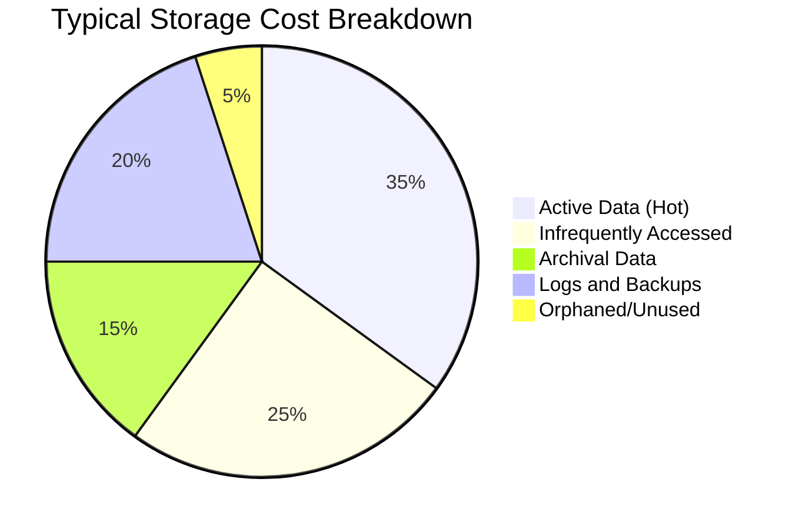
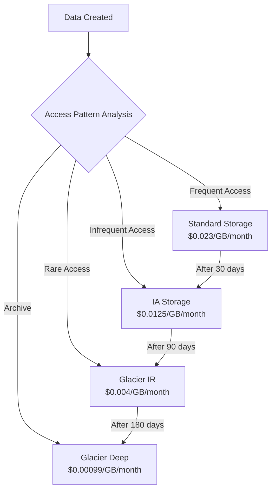
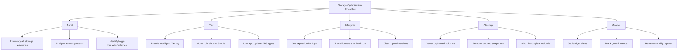

# How to Optimize Storage Costs

Author: [nawazdhandala](https://www.github.com/nawazdhandala)

Tags: FinOps, Cloud Cost Management, Storage Optimization, AWS S3, Data Lifecycle, Cost Optimization

Description: Practical strategies to reduce cloud storage costs through tiering, lifecycle policies, compression, and cleanup automation.

---

## Why Storage Costs Spiral Out of Control

Storage costs often start small but grow exponentially. Teams create backups, logs accumulate, old data never gets deleted, and before long storage represents 20-30% of your cloud bill. The good news: storage is one of the easiest cost categories to optimize with immediate results.

## Understanding Storage Cost Drivers



Most organizations store far more data in expensive hot storage than necessary. The first step is understanding what you have and where it lives.

## Step 1: Audit Your Storage Usage

Before optimizing, get visibility into what you are storing:

```python
import boto3
from datetime import datetime, timedelta
from collections import defaultdict

def audit_s3_storage():
    """
    Audit S3 buckets to understand storage usage and identify optimization opportunities.
    """
    s3 = boto3.client('s3')
    cloudwatch = boto3.client('cloudwatch')

    buckets = s3.list_buckets()['Buckets']
    audit_results = []

    for bucket in buckets:
        bucket_name = bucket['Name']

        try:
            # Get bucket size from CloudWatch
            response = cloudwatch.get_metric_statistics(
                Namespace='AWS/S3',
                MetricName='BucketSizeBytes',
                Dimensions=[
                    {'Name': 'BucketName', 'Value': bucket_name},
                    {'Name': 'StorageType', 'Value': 'StandardStorage'}
                ],
                StartTime=datetime.now() - timedelta(days=2),
                EndTime=datetime.now(),
                Period=86400,
                Statistics=['Average']
            )

            size_bytes = 0
            if response['Datapoints']:
                size_bytes = response['Datapoints'][0]['Average']

            # Check for lifecycle policy
            has_lifecycle = False
            try:
                s3.get_bucket_lifecycle_configuration(Bucket=bucket_name)
                has_lifecycle = True
            except s3.exceptions.ClientError:
                pass

            # Check for versioning
            versioning = s3.get_bucket_versioning(Bucket=bucket_name)
            is_versioned = versioning.get('Status') == 'Enabled'

            audit_results.append({
                'bucket': bucket_name,
                'size_gb': size_bytes / (1024**3),
                'has_lifecycle_policy': has_lifecycle,
                'versioning_enabled': is_versioned,
                'created': bucket['CreationDate']
            })

        except Exception as e:
            print(f"Error auditing {bucket_name}: {e}")

    return sorted(audit_results, key=lambda x: x['size_gb'], reverse=True)


def analyze_object_age_distribution(bucket_name, sample_size=1000):
    """
    Sample objects in a bucket to understand age distribution.
    This helps identify data that should be in cheaper storage tiers.
    """
    s3 = boto3.client('s3')

    age_distribution = defaultdict(lambda: {'count': 0, 'size_bytes': 0})
    now = datetime.now(tz=None)

    paginator = s3.get_paginator('list_objects_v2')
    objects_sampled = 0

    for page in paginator.paginate(Bucket=bucket_name):
        for obj in page.get('Contents', []):
            if objects_sampled >= sample_size:
                break

            last_modified = obj['LastModified'].replace(tzinfo=None)
            age_days = (now - last_modified).days

            # Categorize by age
            if age_days < 30:
                category = 'under_30_days'
            elif age_days < 90:
                category = '30_to_90_days'
            elif age_days < 365:
                category = '90_days_to_1_year'
            else:
                category = 'over_1_year'

            age_distribution[category]['count'] += 1
            age_distribution[category]['size_bytes'] += obj['Size']
            objects_sampled += 1

        if objects_sampled >= sample_size:
            break

    return dict(age_distribution)


# Run audit
print("=== S3 Storage Audit ===")
results = audit_s3_storage()

for bucket in results[:10]:
    lifecycle_status = "Yes" if bucket['has_lifecycle_policy'] else "NO - ACTION NEEDED"
    print(f"\n{bucket['bucket']}")
    print(f"  Size: {bucket['size_gb']:.2f} GB")
    print(f"  Lifecycle Policy: {lifecycle_status}")
    print(f"  Versioning: {bucket['versioning_enabled']}")
```

## Step 2: Implement Storage Tiering

Cloud providers offer multiple storage tiers with different price and access characteristics:



Configure intelligent tiering for automatic optimization:

```python
# S3 Intelligent Tiering configuration
intelligent_tiering_config = {
    'Id': 'auto-tier-all-objects',
    'Status': 'Enabled',
    'Filter': {
        'Prefix': ''  # Apply to all objects
    },
    'Tierings': [
        {
            'Days': 90,
            'AccessTier': 'ARCHIVE_ACCESS'
        },
        {
            'Days': 180,
            'AccessTier': 'DEEP_ARCHIVE_ACCESS'
        }
    ]
}

def enable_intelligent_tiering(bucket_name):
    """
    Enable S3 Intelligent Tiering on a bucket.
    Objects automatically move between tiers based on access patterns.
    """
    s3 = boto3.client('s3')

    s3.put_bucket_intelligent_tiering_configuration(
        Bucket=bucket_name,
        Id='auto-tier-all-objects',
        IntelligentTieringConfiguration=intelligent_tiering_config
    )
    print(f"Intelligent tiering enabled for {bucket_name}")
```

## Step 3: Create Lifecycle Policies

Lifecycle policies automate data movement and deletion:

```python
def create_lifecycle_policy(bucket_name, policy_type='standard'):
    """
    Create a lifecycle policy based on common patterns.
    """
    s3 = boto3.client('s3')

    policies = {
        'standard': {
            'Rules': [
                {
                    'ID': 'transition-to-ia',
                    'Status': 'Enabled',
                    'Filter': {'Prefix': ''},
                    'Transitions': [
                        {'Days': 30, 'StorageClass': 'STANDARD_IA'},
                        {'Days': 90, 'StorageClass': 'GLACIER_IR'},
                        {'Days': 365, 'StorageClass': 'DEEP_ARCHIVE'}
                    ]
                }
            ]
        },
        'logs': {
            'Rules': [
                {
                    'ID': 'expire-old-logs',
                    'Status': 'Enabled',
                    'Filter': {'Prefix': 'logs/'},
                    'Transitions': [
                        {'Days': 7, 'StorageClass': 'STANDARD_IA'},
                        {'Days': 30, 'StorageClass': 'GLACIER_IR'}
                    ],
                    'Expiration': {'Days': 90}  # Delete after 90 days
                }
            ]
        },
        'backups': {
            'Rules': [
                {
                    'ID': 'manage-backups',
                    'Status': 'Enabled',
                    'Filter': {'Prefix': 'backups/'},
                    'Transitions': [
                        {'Days': 1, 'StorageClass': 'GLACIER_IR'}
                    ],
                    'Expiration': {'Days': 365}  # Keep backups for 1 year
                }
            ]
        },
        'versioned': {
            'Rules': [
                {
                    'ID': 'cleanup-old-versions',
                    'Status': 'Enabled',
                    'Filter': {'Prefix': ''},
                    'NoncurrentVersionTransitions': [
                        {'NoncurrentDays': 30, 'StorageClass': 'GLACIER_IR'}
                    ],
                    'NoncurrentVersionExpiration': {'NoncurrentDays': 90}
                }
            ]
        }
    }

    policy = policies.get(policy_type, policies['standard'])

    s3.put_bucket_lifecycle_configuration(
        Bucket=bucket_name,
        LifecycleConfiguration=policy
    )
    print(f"Applied '{policy_type}' lifecycle policy to {bucket_name}")


# Example: Apply appropriate policies
create_lifecycle_policy('my-app-logs', 'logs')
create_lifecycle_policy('my-app-backups', 'backups')
create_lifecycle_policy('my-app-data', 'standard')
```

## Step 4: Clean Up Orphaned Resources

Orphaned storage resources silently drain budgets:

```python
def find_orphaned_ebs_volumes():
    """
    Find EBS volumes not attached to any instance.
    These are often forgotten after instance termination.
    """
    ec2 = boto3.client('ec2')

    response = ec2.describe_volumes(
        Filters=[{'Name': 'status', 'Values': ['available']}]
    )

    orphaned = []
    for volume in response['Volumes']:
        age_days = (datetime.now(volume['CreateTime'].tzinfo) - volume['CreateTime']).days

        orphaned.append({
            'volume_id': volume['VolumeId'],
            'size_gb': volume['Size'],
            'created': volume['CreateTime'],
            'age_days': age_days,
            'monthly_cost': volume['Size'] * 0.10  # Approximate gp3 cost
        })

    return sorted(orphaned, key=lambda x: x['monthly_cost'], reverse=True)


def find_unused_ebs_snapshots():
    """
    Find EBS snapshots that may no longer be needed.
    """
    ec2 = boto3.client('ec2')

    # Get all snapshots owned by this account
    snapshots = ec2.describe_snapshots(OwnerIds=['self'])['Snapshots']

    # Get all AMIs to find which snapshots are in use
    amis = ec2.describe_images(Owners=['self'])['Images']
    ami_snapshot_ids = set()

    for ami in amis:
        for mapping in ami.get('BlockDeviceMappings', []):
            if 'Ebs' in mapping:
                ami_snapshot_ids.add(mapping['Ebs'].get('SnapshotId'))

    # Find snapshots not used by any AMI
    unused = []
    for snapshot in snapshots:
        if snapshot['SnapshotId'] not in ami_snapshot_ids:
            age_days = (datetime.now(snapshot['StartTime'].tzinfo) - snapshot['StartTime']).days

            unused.append({
                'snapshot_id': snapshot['SnapshotId'],
                'volume_size_gb': snapshot['VolumeSize'],
                'age_days': age_days,
                'description': snapshot.get('Description', ''),
                'monthly_cost': snapshot['VolumeSize'] * 0.05  # Snapshot storage cost
            })

    return sorted(unused, key=lambda x: x['age_days'], reverse=True)


def cleanup_incomplete_multipart_uploads(bucket_name, days_threshold=7):
    """
    Find and abort incomplete multipart uploads that waste storage.
    """
    s3 = boto3.client('s3')

    response = s3.list_multipart_uploads(Bucket=bucket_name)

    aborted = []
    for upload in response.get('Uploads', []):
        initiated = upload['Initiated'].replace(tzinfo=None)
        age_days = (datetime.now() - initiated).days

        if age_days > days_threshold:
            s3.abort_multipart_upload(
                Bucket=bucket_name,
                Key=upload['Key'],
                UploadId=upload['UploadId']
            )
            aborted.append({
                'key': upload['Key'],
                'age_days': age_days
            })

    return aborted


# Run cleanup analysis
print("=== Orphaned EBS Volumes ===")
orphaned_volumes = find_orphaned_ebs_volumes()
total_waste = sum(v['monthly_cost'] for v in orphaned_volumes)
print(f"Found {len(orphaned_volumes)} orphaned volumes")
print(f"Potential monthly savings: ${total_waste:.2f}")

print("\n=== Unused EBS Snapshots ===")
unused_snapshots = find_unused_ebs_snapshots()
snapshot_waste = sum(s['monthly_cost'] for s in unused_snapshots)
print(f"Found {len(unused_snapshots)} potentially unused snapshots")
print(f"Potential monthly savings: ${snapshot_waste:.2f}")
```

## Step 5: Optimize Data Formats and Compression

How you store data matters as much as where:

```python
import gzip
import json

def compare_storage_formats(data):
    """
    Compare storage sizes for different formats and compression options.
    """
    results = {}

    # JSON uncompressed
    json_data = json.dumps(data).encode('utf-8')
    results['json_uncompressed'] = len(json_data)

    # JSON compressed
    json_compressed = gzip.compress(json_data)
    results['json_gzip'] = len(json_compressed)

    # For tabular data, Parquet is significantly more efficient
    # This requires pandas and pyarrow
    try:
        import pandas as pd
        import pyarrow as pa
        import pyarrow.parquet as pq
        from io import BytesIO

        df = pd.DataFrame(data)

        # Parquet uncompressed
        buffer = BytesIO()
        df.to_parquet(buffer, compression=None)
        results['parquet_uncompressed'] = buffer.tell()

        # Parquet with snappy compression
        buffer = BytesIO()
        df.to_parquet(buffer, compression='snappy')
        results['parquet_snappy'] = buffer.tell()

        # Parquet with gzip compression
        buffer = BytesIO()
        df.to_parquet(buffer, compression='gzip')
        results['parquet_gzip'] = buffer.tell()

    except ImportError:
        pass

    # Print comparison
    baseline = results['json_uncompressed']
    print("Storage format comparison:")
    for format_name, size in results.items():
        savings = ((baseline - size) / baseline) * 100
        print(f"  {format_name}: {size:,} bytes ({savings:.1f}% smaller than JSON)")

    return results


# Example: Compare formats for log-like data
sample_data = [
    {'timestamp': '2026-01-28T10:00:00Z', 'level': 'INFO', 'service': 'api', 'message': 'Request processed', 'duration_ms': 45}
    for _ in range(10000)
]

compare_storage_formats(sample_data)
```

## Step 6: Set Up Cost Monitoring and Alerts

Track storage costs and get alerted on anomalies:

```yaml
# CloudWatch alarm for unexpected storage growth
# Deploy via CloudFormation or Terraform

Resources:
  StorageCostAlarm:
    Type: AWS::CloudWatch::Alarm
    Properties:
      AlarmName: S3StorageCostAnomaly
      AlarmDescription: Alert when S3 costs increase significantly
      MetricName: EstimatedCharges
      Namespace: AWS/Billing
      Dimensions:
        - Name: ServiceName
          Value: AmazonS3
        - Name: Currency
          Value: USD
      Statistic: Maximum
      Period: 86400  # Daily
      EvaluationPeriods: 1
      Threshold: 1000  # Alert if daily S3 cost exceeds $1000
      ComparisonOperator: GreaterThanThreshold
      AlarmActions:
        - !Ref AlertSNSTopic
```

```python
def create_storage_cost_report():
    """
    Generate a weekly storage cost report.
    """
    ce = boto3.client('ce')

    from datetime import datetime, timedelta
    end_date = datetime.now().strftime('%Y-%m-%d')
    start_date = (datetime.now() - timedelta(days=30)).strftime('%Y-%m-%d')

    response = ce.get_cost_and_usage(
        TimePeriod={'Start': start_date, 'End': end_date},
        Granularity='DAILY',
        Metrics=['UnblendedCost'],
        GroupBy=[
            {'Type': 'DIMENSION', 'Key': 'SERVICE'}
        ],
        Filter={
            'Dimensions': {
                'Key': 'SERVICE',
                'Values': [
                    'Amazon Simple Storage Service',
                    'Amazon Elastic Block Store',
                    'Amazon Elastic File System',
                    'Amazon FSx'
                ]
            }
        }
    )

    # Aggregate by service
    service_costs = defaultdict(float)
    for day in response['ResultsByTime']:
        for group in day['Groups']:
            service = group['Keys'][0]
            cost = float(group['Metrics']['UnblendedCost']['Amount'])
            service_costs[service] += cost

    print("=== 30-Day Storage Cost Report ===")
    total = 0
    for service, cost in sorted(service_costs.items(), key=lambda x: x[1], reverse=True):
        print(f"  {service}: ${cost:.2f}")
        total += cost
    print(f"\n  Total Storage Costs: ${total:.2f}")

    return dict(service_costs)
```

## Storage Optimization Checklist

Use this checklist to ensure you have covered the basics:



---

Storage optimization delivers some of the quickest wins in cloud cost management. Start with an audit to understand what you have, implement lifecycle policies to automate tiering, and clean up orphaned resources. Most organizations can reduce storage costs by 30-50% within the first month by applying these techniques consistently.
