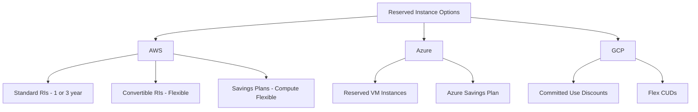
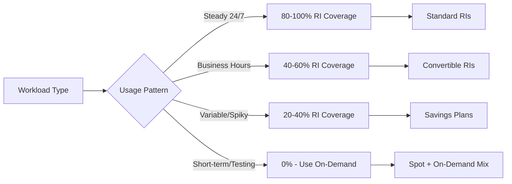
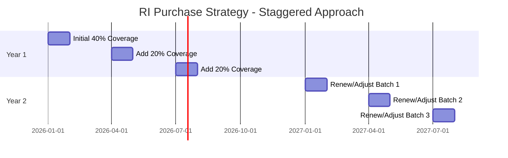

# How to Use Reserved Instances Effectively

Author: [nawazdhandala](https://www.github.com/nawazdhandala)

Tags: FinOps, Cloud Cost Management, Reserved Instances, AWS, Azure, GCP, Cost Optimization

Description: A practical guide to maximizing savings with reserved instances through proper planning, coverage analysis, and commitment strategies.

---

## Why Reserved Instances Matter

Reserved Instances (RIs) offer 30-72% savings compared to on-demand pricing across all major cloud providers. However, many organizations either undercommit and leave money on the table, or overcommit and end up paying for unused capacity. Getting the balance right requires understanding your workload patterns and making data-driven decisions.

## Understanding RI Pricing Models

Each cloud provider offers different commitment options:



## Step 1: Analyze Your Baseline Usage

Before purchasing any reservations, establish your baseline. Pull at least 30 days of usage data, preferably 90 days to account for monthly variations.

```python
# Example: Analyzing EC2 usage patterns with boto3
import boto3
from datetime import datetime, timedelta
from collections import defaultdict

def analyze_instance_usage(days=30):
    """
    Analyze EC2 instance usage to identify RI candidates.
    Instances running consistently for 30+ days are good RI candidates.
    """
    ce_client = boto3.client('ce')

    end_date = datetime.now().strftime('%Y-%m-%d')
    start_date = (datetime.now() - timedelta(days=days)).strftime('%Y-%m-%d')

    # Get usage grouped by instance type and region
    response = ce_client.get_cost_and_usage(
        TimePeriod={
            'Start': start_date,
            'End': end_date
        },
        Granularity='DAILY',
        Metrics=['UsageQuantity'],
        GroupBy=[
            {'Type': 'DIMENSION', 'Key': 'INSTANCE_TYPE'},
            {'Type': 'DIMENSION', 'Key': 'REGION'}
        ],
        Filter={
            'Dimensions': {
                'Key': 'SERVICE',
                'Values': ['Amazon Elastic Compute Cloud - Compute']
            }
        }
    )

    # Aggregate usage by instance type and region
    usage_summary = defaultdict(lambda: {'hours': 0, 'days_active': 0})

    for result in response['ResultsByTime']:
        for group in result['Groups']:
            instance_type = group['Keys'][0]
            region = group['Keys'][1]
            hours = float(group['Metrics']['UsageQuantity']['Amount'])

            key = f"{instance_type}:{region}"
            usage_summary[key]['hours'] += hours
            if hours > 0:
                usage_summary[key]['days_active'] += 1

    # Filter for consistent usage - good RI candidates
    ri_candidates = []
    for key, data in usage_summary.items():
        instance_type, region = key.split(':')
        # If running more than 70% of the time, it's a good RI candidate
        if data['days_active'] >= days * 0.7:
            ri_candidates.append({
                'instance_type': instance_type,
                'region': region,
                'total_hours': data['hours'],
                'days_active': data['days_active'],
                'coverage_percent': (data['days_active'] / days) * 100
            })

    return sorted(ri_candidates, key=lambda x: x['total_hours'], reverse=True)

# Run the analysis
candidates = analyze_instance_usage(days=30)
for candidate in candidates[:10]:
    print(f"{candidate['instance_type']} in {candidate['region']}: "
          f"{candidate['coverage_percent']:.1f}% coverage")
```

## Step 2: Calculate Your Target Coverage

Not all workloads should be covered by reservations. Use this framework:



A good starting point is 70% coverage for production workloads:

```yaml
# Example coverage targets by environment
coverage_targets:
  production:
    compute: 70-80%
    database: 80-90%

  staging:
    compute: 30-50%
    database: 50-70%

  development:
    compute: 0-20%
    database: 20-40%
```

## Step 3: Choose the Right Commitment Type

Here is a decision matrix for AWS (similar principles apply to other clouds):

```python
def recommend_commitment_type(workload_profile):
    """
    Recommend the best commitment type based on workload characteristics.
    """
    recommendations = []

    # High stability, known instance types
    if workload_profile['instance_type_stability'] > 0.9:
        if workload_profile['commitment_tolerance'] >= 3:
            recommendations.append({
                'type': 'Standard RI - 3 Year',
                'savings': '60-72%',
                'flexibility': 'Low',
                'reason': 'Stable workload with long-term commitment'
            })
        else:
            recommendations.append({
                'type': 'Standard RI - 1 Year',
                'savings': '30-40%',
                'flexibility': 'Low',
                'reason': 'Stable workload with medium-term commitment'
            })

    # Moderate stability, may change instance families
    elif workload_profile['instance_type_stability'] > 0.7:
        recommendations.append({
            'type': 'Convertible RI',
            'savings': '20-54%',
            'flexibility': 'Medium',
            'reason': 'May need to change instance types during term'
        })

    # Variable workloads across services
    else:
        recommendations.append({
            'type': 'Compute Savings Plan',
            'savings': '20-66%',
            'flexibility': 'High',
            'reason': 'Flexible across instance families and regions'
        })

    return recommendations

# Example usage
profile = {
    'instance_type_stability': 0.85,  # 85% of spend on same instance types
    'commitment_tolerance': 1,         # Years willing to commit
    'region_flexibility_needed': False
}

for rec in recommend_commitment_type(profile):
    print(f"Recommended: {rec['type']}")
    print(f"Expected Savings: {rec['savings']}")
    print(f"Reason: {rec['reason']}")
```

## Step 4: Implement a Staggered Purchase Strategy

Avoid buying all reservations at once. Stagger purchases to reduce risk and maintain flexibility:



```python
def create_staggered_purchase_plan(target_coverage, current_coverage, budget_per_quarter):
    """
    Create a staggered RI purchase plan to reach target coverage.
    """
    coverage_gap = target_coverage - current_coverage

    # Split into quarterly purchases over 9 months
    quarterly_increase = coverage_gap / 3

    plan = []
    current = current_coverage

    for quarter in range(1, 4):
        current += quarterly_increase
        plan.append({
            'quarter': f"Q{quarter}",
            'target_coverage': round(current, 1),
            'purchase_amount': round(quarterly_increase, 1),
            'budget_allocation': budget_per_quarter
        })

    return plan

# Example: Going from 30% to 75% coverage
plan = create_staggered_purchase_plan(
    target_coverage=75,
    current_coverage=30,
    budget_per_quarter=50000
)

for step in plan:
    print(f"{step['quarter']}: Purchase {step['purchase_amount']}% more "
          f"to reach {step['target_coverage']}% total coverage")
```

## Step 5: Monitor and Optimize Continuously

Set up automated monitoring to track RI utilization and coverage:

```python
import boto3
from datetime import datetime, timedelta

def check_ri_utilization():
    """
    Check Reserved Instance utilization and flag underutilized RIs.
    Target: 80%+ utilization for all RIs.
    """
    ce_client = boto3.client('ce')

    end_date = datetime.now().strftime('%Y-%m-%d')
    start_date = (datetime.now() - timedelta(days=30)).strftime('%Y-%m-%d')

    response = ce_client.get_reservation_utilization(
        TimePeriod={
            'Start': start_date,
            'End': end_date
        },
        Granularity='MONTHLY'
    )

    alerts = []

    for period in response['UtilizationsByTime']:
        utilization = float(period['Total']['UtilizationPercentage'])

        if utilization < 80:
            alerts.append({
                'period': period['TimePeriod'],
                'utilization': utilization,
                'severity': 'high' if utilization < 60 else 'medium',
                'recommendation': 'Consider selling unused RIs or consolidating workloads'
            })

    return {
        'current_utilization': utilization,
        'target': 80,
        'alerts': alerts
    }

def check_ri_coverage():
    """
    Check Reserved Instance coverage and identify gaps.
    """
    ce_client = boto3.client('ce')

    end_date = datetime.now().strftime('%Y-%m-%d')
    start_date = (datetime.now() - timedelta(days=30)).strftime('%Y-%m-%d')

    response = ce_client.get_reservation_coverage(
        TimePeriod={
            'Start': start_date,
            'End': end_date
        },
        Granularity='MONTHLY'
    )

    coverage_data = response['CoveragesByTime'][0]['Total']

    return {
        'coverage_hours_percentage': float(coverage_data['CoverageHours']['CoverageHoursPercentage']),
        'on_demand_hours': float(coverage_data['CoverageHours']['OnDemandHours']),
        'reserved_hours': float(coverage_data['CoverageHours']['ReservedHours']),
        'total_running_hours': float(coverage_data['CoverageHours']['TotalRunningHours'])
    }

# Run checks
utilization = check_ri_utilization()
coverage = check_ri_coverage()

print(f"RI Utilization: {utilization['current_utilization']:.1f}%")
print(f"RI Coverage: {coverage['coverage_hours_percentage']:.1f}%")
```

## Common Mistakes to Avoid

1. **Overcommitting too early** - Start with 50% coverage and increase gradually
2. **Ignoring instance family changes** - Use Convertible RIs or Savings Plans if you upgrade frequently
3. **Not monitoring utilization** - Unused RIs are wasted money
4. **Buying in a single region** - If you run multi-region, consider regional flexibility
5. **Forgetting about expiration dates** - Set calendar reminders 60 days before expiration

## Integration with OneUptime

Track your RI utilization and coverage alongside your infrastructure metrics in OneUptime. Set up custom dashboards to visualize:

- Current RI coverage percentage
- Utilization trends over time
- Cost savings achieved vs. potential savings
- Upcoming RI expirations

This gives your team visibility into cloud spending without switching between multiple tools.

---

Reserved Instances remain one of the most effective ways to reduce cloud costs, but they require ongoing attention. Start with conservative coverage, monitor utilization religiously, and adjust your strategy quarterly. The goal is not 100% coverage - it is optimal coverage that balances savings against flexibility.
