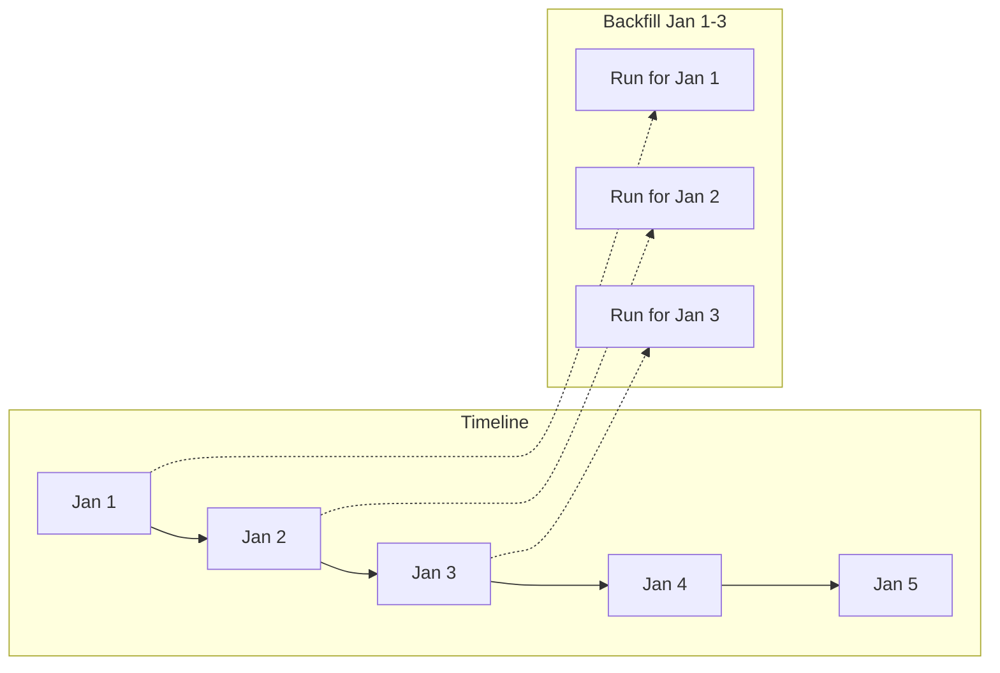
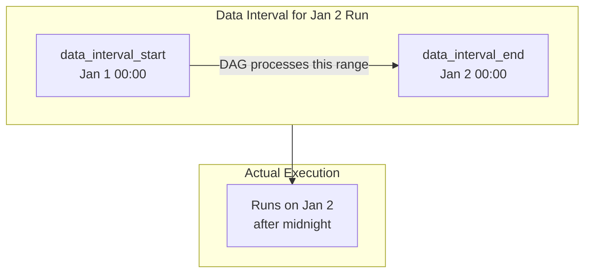

# How to Implement Airflow Backfills

Author: [nawazdhandala](https://www.github.com/nawazdhandala)

Tags: Apache Airflow, Data Engineering, Backfill, ETL, Python, Data Pipelines

Description: A comprehensive guide to implementing backfills in Apache Airflow, covering CLI commands, best practices, and strategies for handling historical data processing.

---

Backfilling is one of Airflow's most powerful features. When your data pipeline needs to process historical data or reprocess failed runs, backfills let you execute DAG runs for past dates without manually triggering each one. Getting backfills right is critical for data integrity.

## Understanding Backfills

A backfill runs your DAG for a range of historical dates. Each execution processes data for its logical date (previously called execution_date), not the current date.



## Basic Backfill Commands

### CLI Backfill

The most common way to run backfills:

```bash
# Backfill a date range
airflow dags backfill \
    --start-date 2024-01-01 \
    --end-date 2024-01-31 \
    my_dag_id

# Include the end date in the backfill
airflow dags backfill \
    --start-date 2024-01-01 \
    --end-date 2024-01-31 \
    --include-end-date \
    my_dag_id
```

### Backfill Options

```bash
# Run specific tasks only
airflow dags backfill \
    --start-date 2024-01-01 \
    --end-date 2024-01-07 \
    --task-regex "^extract_.*" \
    my_dag_id

# Dry run to see what would execute
airflow dags backfill \
    --start-date 2024-01-01 \
    --end-date 2024-01-07 \
    --dry-run \
    my_dag_id

# Rerun failed tasks only
airflow dags backfill \
    --start-date 2024-01-01 \
    --end-date 2024-01-07 \
    --rerun-failed-tasks \
    my_dag_id

# Reset state and rerun everything
airflow dags backfill \
    --start-date 2024-01-01 \
    --end-date 2024-01-07 \
    --reset-dagruns \
    my_dag_id
```

## Designing Backfill-Friendly DAGs

### Use Logical Date, Not Current Date

```python
from airflow import DAG
from airflow.operators.python import PythonOperator
from datetime import datetime, timedelta

def process_data(**context):
    # WRONG: Uses current date
    # today = datetime.now()

    # CORRECT: Uses logical date from context
    logical_date = context['logical_date']

    # Process data for the logical date
    start_of_day = logical_date.replace(hour=0, minute=0, second=0)
    end_of_day = start_of_day + timedelta(days=1)

    query = f"""
        SELECT * FROM events
        WHERE event_time >= '{start_of_day}'
        AND event_time < '{end_of_day}'
    """
    print(f"Processing data for {logical_date.date()}")
    return query

with DAG(
    'backfill_friendly_dag',
    start_date=datetime(2024, 1, 1),
    schedule='@daily',
    catchup=False  # Disable automatic catchup
) as dag:

    process = PythonOperator(
        task_id='process_data',
        python_callable=process_data
    )
```

### Make Tasks Idempotent

Idempotent tasks produce the same result regardless of how many times they run:

```python
from airflow.operators.python import PythonOperator
from airflow.providers.postgres.hooks.postgres import PostgresHook

def load_data(**context):
    logical_date = context['logical_date']
    date_str = logical_date.strftime('%Y-%m-%d')

    hook = PostgresHook(postgres_conn_id='warehouse')

    # Delete existing data for this date first (idempotent)
    hook.run(f"DELETE FROM daily_summary WHERE date = '{date_str}'")

    # Then insert fresh data
    hook.run(f"""
        INSERT INTO daily_summary (date, total_sales, order_count)
        SELECT
            '{date_str}' as date,
            SUM(amount) as total_sales,
            COUNT(*) as order_count
        FROM orders
        WHERE order_date = '{date_str}'
    """)

load_task = PythonOperator(
    task_id='load_data',
    python_callable=load_data
)
```

### Use Data Interval Instead of Execution Date

Airflow 2.2+ introduced data intervals for clearer semantics:

```python
def process_with_interval(**context):
    # Data interval defines the time range this run covers
    data_interval_start = context['data_interval_start']
    data_interval_end = context['data_interval_end']

    print(f"Processing data from {data_interval_start} to {data_interval_end}")

    # For a daily DAG running on Jan 2:
    # data_interval_start = Jan 1 00:00
    # data_interval_end = Jan 2 00:00
    # logical_date = Jan 1 00:00 (same as data_interval_start)
```



## Backfill Strategies

### Strategy 1: Partition-Based Backfill

Process data in partitions to enable targeted reruns:

```python
from airflow import DAG
from airflow.operators.python import PythonOperator
from datetime import datetime

def extract_partition(**context):
    partition_date = context['logical_date'].strftime('%Y-%m-%d')

    # Read from partitioned source
    source_path = f"s3://data-lake/events/date={partition_date}/"
    print(f"Extracting from {source_path}")
    return source_path

def transform_partition(**context):
    partition_date = context['logical_date'].strftime('%Y-%m-%d')

    # Write to partitioned destination
    dest_path = f"s3://warehouse/processed/date={partition_date}/"
    print(f"Writing to {dest_path}")
    return dest_path

with DAG(
    'partitioned_etl',
    start_date=datetime(2024, 1, 1),
    schedule='@daily'
) as dag:

    extract = PythonOperator(
        task_id='extract',
        python_callable=extract_partition
    )

    transform = PythonOperator(
        task_id='transform',
        python_callable=transform_partition
    )

    extract >> transform
```

### Strategy 2: Dependency-Aware Backfill

Handle dependencies between DAGs during backfills:

```python
from airflow import DAG
from airflow.sensors.external_task import ExternalTaskSensor
from airflow.operators.python import PythonOperator
from datetime import datetime, timedelta

with DAG(
    'downstream_dag',
    start_date=datetime(2024, 1, 1),
    schedule='@daily'
) as dag:

    # Wait for upstream DAG to complete for same date
    wait_for_upstream = ExternalTaskSensor(
        task_id='wait_for_upstream',
        external_dag_id='upstream_dag',
        external_task_id='final_task',
        # Look for upstream run with same logical date
        execution_delta=timedelta(0),
        timeout=3600,
        mode='reschedule'
    )

    process = PythonOperator(
        task_id='process',
        python_callable=lambda: print("Processing")
    )

    wait_for_upstream >> process
```

When backfilling, run the upstream DAG first:

```bash
# Step 1: Backfill upstream
airflow dags backfill --start-date 2024-01-01 --end-date 2024-01-31 upstream_dag

# Step 2: Backfill downstream (sensors will find completed upstream runs)
airflow dags backfill --start-date 2024-01-01 --end-date 2024-01-31 downstream_dag
```

### Strategy 3: Incremental Backfill

For large date ranges, process in chunks to manage resource usage:

```bash
#!/bin/bash
# incremental_backfill.sh

START_DATE="2024-01-01"
END_DATE="2024-12-31"
DAG_ID="heavy_processing_dag"
CHUNK_DAYS=7

current="$START_DATE"
while [[ "$current" < "$END_DATE" ]]; do
    chunk_end=$(date -d "$current + $CHUNK_DAYS days" +%Y-%m-%d)

    if [[ "$chunk_end" > "$END_DATE" ]]; then
        chunk_end="$END_DATE"
    fi

    echo "Backfilling $current to $chunk_end"
    airflow dags backfill \
        --start-date "$current" \
        --end-date "$chunk_end" \
        "$DAG_ID"

    # Wait between chunks to reduce load
    sleep 60

    current=$(date -d "$chunk_end + 1 day" +%Y-%m-%d)
done
```

## Controlling Backfill Behavior

### Limit Concurrent Backfill Runs

```ini
# airflow.cfg
[core]
# Max active runs per DAG (affects backfill parallelism)
max_active_runs_per_dag = 16

[scheduler]
# Max DAG runs to process per loop
max_dagruns_to_create_per_loop = 10
```

### Task-Level Concurrency

```python
with DAG(
    'controlled_backfill',
    start_date=datetime(2024, 1, 1),
    schedule='@daily',
    max_active_runs=4,  # Limit concurrent backfill runs
    concurrency=8  # Limit total concurrent tasks
) as dag:

    # Pool limits concurrent DB connections across all runs
    heavy_db_task = PythonOperator(
        task_id='heavy_db_query',
        python_callable=run_heavy_query,
        pool='database_pool'  # Max 5 concurrent (configured separately)
    )
```

Create pools for resource management:

```bash
# Create a pool with 5 slots
airflow pools set database_pool 5 "Limit concurrent DB connections"
```

## Handling Backfill Edge Cases

### Skipping Weekends

```python
from airflow import DAG
from airflow.operators.python import PythonOperator, BranchPythonOperator
from airflow.operators.empty import EmptyOperator
from datetime import datetime

def check_weekday(**context):
    logical_date = context['logical_date']
    # Skip weekends (5=Saturday, 6=Sunday)
    if logical_date.weekday() >= 5:
        return 'skip_weekend'
    return 'process_data'

with DAG(
    'weekday_only_dag',
    start_date=datetime(2024, 1, 1),
    schedule='@daily'
) as dag:

    branch = BranchPythonOperator(
        task_id='check_weekday',
        python_callable=check_weekday
    )

    process = PythonOperator(
        task_id='process_data',
        python_callable=lambda: print("Processing weekday data")
    )

    skip = EmptyOperator(
        task_id='skip_weekend'
    )

    join = EmptyOperator(
        task_id='join',
        trigger_rule='none_failed_min_one_success'
    )

    branch >> [process, skip] >> join
```

### Dealing with Schema Changes

```python
def load_with_schema_version(**context):
    logical_date = context['logical_date']

    # Schema v1 was used before March 2024
    schema_cutoff = datetime(2024, 3, 1)

    if logical_date < schema_cutoff:
        schema_version = 'v1'
        columns = ['id', 'name', 'value']
    else:
        schema_version = 'v2'
        columns = ['id', 'name', 'value', 'category', 'metadata']

    print(f"Using schema {schema_version} for {logical_date}")
    # Load data with appropriate schema
```

### Late Data Handling

```python
from airflow import DAG
from airflow.operators.python import PythonOperator
from datetime import datetime, timedelta

def process_with_late_data(**context):
    logical_date = context['logical_date']

    # For backfills, we have all data
    # For real-time, we might need to wait for late arrivals
    is_backfill = context.get('dag_run').run_type == 'backfill'

    if is_backfill:
        # Process all available data for historical date
        lookback_hours = 48  # Capture late data
    else:
        # Recent run, use standard window
        lookback_hours = 0

    query_end = logical_date + timedelta(days=1, hours=lookback_hours)
    print(f"Processing with lookback: {lookback_hours} hours")

with DAG(
    'late_data_aware_dag',
    start_date=datetime(2024, 1, 1),
    schedule='@daily'
) as dag:

    process = PythonOperator(
        task_id='process',
        python_callable=process_with_late_data
    )
```

## Monitoring Backfills

### Track Backfill Progress

```python
from airflow.models import DagRun
from airflow.utils.state import State

def get_backfill_progress(dag_id, start_date, end_date):
    from airflow.models import DagRun
    from sqlalchemy import and_

    runs = DagRun.find(
        dag_id=dag_id,
        execution_start_date=start_date,
        execution_end_date=end_date
    )

    total = len(runs)
    success = sum(1 for r in runs if r.state == State.SUCCESS)
    failed = sum(1 for r in runs if r.state == State.FAILED)
    running = sum(1 for r in runs if r.state == State.RUNNING)

    print(f"Backfill Progress: {success}/{total} complete")
    print(f"  Running: {running}")
    print(f"  Failed: {failed}")

    return success / total if total > 0 else 0
```

### Backfill Status Script

```bash
#!/bin/bash
# check_backfill.sh

DAG_ID=$1
START_DATE=$2
END_DATE=$3

echo "Backfill Status for $DAG_ID ($START_DATE to $END_DATE)"
echo "================================================"

# Get run counts by state
airflow dags list-runs -d "$DAG_ID" -s "$START_DATE" -e "$END_DATE" -o table

# Count by state
echo ""
echo "Summary:"
airflow dags list-runs -d "$DAG_ID" -s "$START_DATE" -e "$END_DATE" -o json | \
    python3 -c "
import json, sys
runs = json.load(sys.stdin)
states = {}
for r in runs:
    states[r['state']] = states.get(r['state'], 0) + 1
for state, count in sorted(states.items()):
    print(f'  {state}: {count}')
"
```

## Common Backfill Pitfalls

### Pitfall 1: catchup=True on Large Date Ranges

```python
# Dangerous - will create thousands of runs at once
with DAG(
    'dangerous_dag',
    start_date=datetime(2020, 1, 1),  # 4+ years ago
    schedule='@hourly',
    catchup=True  # Default is True
) as dag:
    pass

# Safe - disable catchup, use explicit backfill
with DAG(
    'safe_dag',
    start_date=datetime(2020, 1, 1),
    schedule='@hourly',
    catchup=False  # Explicitly disable
) as dag:
    pass
```

### Pitfall 2: Non-Idempotent Appends

```python
# BAD - appending creates duplicates on rerun
def bad_load(**context):
    hook.run("INSERT INTO table SELECT * FROM staging")

# GOOD - delete and insert is idempotent
def good_load(**context):
    date_str = context['logical_date'].strftime('%Y-%m-%d')
    hook.run(f"DELETE FROM table WHERE date = '{date_str}'")
    hook.run(f"INSERT INTO table SELECT * FROM staging WHERE date = '{date_str}'")
```

### Pitfall 3: Hardcoded Dates

```python
# BAD - ignores logical date
def bad_extract():
    return "SELECT * FROM events WHERE date = CURRENT_DATE"

# GOOD - uses logical date from context
def good_extract(**context):
    date_str = context['logical_date'].strftime('%Y-%m-%d')
    return f"SELECT * FROM events WHERE date = '{date_str}'"
```

---

Backfills are essential for data pipeline operations. Design your DAGs with backfills in mind from the start: use logical dates, make tasks idempotent, and handle schema evolution gracefully. When running backfills, control concurrency to avoid overwhelming your infrastructure and monitor progress to catch failures early. A well-designed backfill strategy ensures your historical data is always accurate and your pipelines can recover from any failure.
