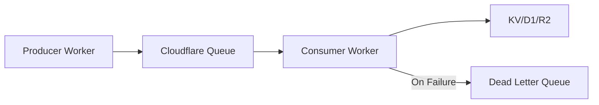

# How to Implement Cloudflare Queues

Author: [nawazdhandala](https://www.github.com/nawazdhandala)

Tags: Cloudflare, Cloudflare Workers, Queues, Serverless, Message Queue, Distributed Systems

Description: Learn how to implement Cloudflare Queues for reliable message processing in your serverless applications.

---

> Message queues decouple your application components, enabling reliable async processing at scale. Cloudflare Queues integrates directly with Workers, giving you a fully managed queue service without the infrastructure overhead.

Background job processing requires reliability. Cloudflare Queues delivers guaranteed message delivery with at-least-once semantics.

---

## Overview



---

## Prerequisites

Before you begin, make sure you have:

- A Cloudflare account with Workers paid plan
- Wrangler CLI installed (`npm install -g wrangler`)
- Node.js 18 or later

---

## Creating Your First Queue

### Step 1: Configure wrangler.toml

Set up your project configuration to define a queue:

```toml
# wrangler.toml
name = "queue-producer"
main = "src/producer.ts"
compatibility_date = "2024-01-01"

# Define a queue binding for the producer
[[queues.producers]]
queue = "my-task-queue"
binding = "TASK_QUEUE"
```

### Step 2: Create the Producer Worker

The producer sends messages to the queue for async processing:

```typescript
// src/producer.ts
export interface Env {
  TASK_QUEUE: Queue;
}

interface TaskMessage {
  taskId: string;
  type: string;
  payload: Record<string, unknown>;
  timestamp: number;
}

export default {
  async fetch(request: Request, env: Env): Promise<Response> {
    // Parse incoming request
    const url = new URL(request.url);

    if (url.pathname === "/enqueue" && request.method === "POST") {
      const body = await request.json() as { type: string; data: Record<string, unknown> };

      // Create a task message with unique ID
      const message: TaskMessage = {
        taskId: crypto.randomUUID(),
        type: body.type,
        payload: body.data,
        timestamp: Date.now()
      };

      // Send message to queue
      await env.TASK_QUEUE.send(message);

      return Response.json({
        success: true,
        taskId: message.taskId,
        status: "queued"
      });
    }

    return new Response("Not found", { status: 404 });
  }
};
```

---

## Creating the Consumer

### Configure Consumer Binding

Add the consumer configuration to a separate worker:

```toml
# wrangler.toml (consumer worker)
name = "queue-consumer"
main = "src/consumer.ts"
compatibility_date = "2024-01-01"

# Define the consumer binding
[[queues.consumers]]
queue = "my-task-queue"
max_batch_size = 10
max_batch_timeout = 30
max_retries = 3
dead_letter_queue = "my-task-dlq"
```

### Implement the Consumer Handler

Process messages from the queue with proper error handling:

```typescript
// src/consumer.ts
export interface Env {
  KV_STORE: KVNamespace;
}

interface TaskMessage {
  taskId: string;
  type: string;
  payload: Record<string, unknown>;
  timestamp: number;
}

export default {
  // Queue handler receives batches of messages
  async queue(batch: MessageBatch<TaskMessage>, env: Env): Promise<void> {
    // Process each message in the batch
    for (const message of batch.messages) {
      try {
        await processTask(message.body, env);

        // Acknowledge successful processing
        message.ack();
      } catch (error) {
        console.error(`Failed to process task ${message.body.taskId}:`, error);

        // Retry the message - it will be redelivered
        message.retry();
      }
    }
  }
};

async function processTask(task: TaskMessage, env: Env): Promise<void> {
  console.log(`Processing task ${task.taskId} of type ${task.type}`);

  switch (task.type) {
    case "email":
      await sendEmail(task.payload);
      break;
    case "webhook":
      await deliverWebhook(task.payload);
      break;
    case "report":
      await generateReport(task.payload, env);
      break;
    default:
      throw new Error(`Unknown task type: ${task.type}`);
  }

  // Store completion status
  await env.KV_STORE.put(
    `task:${task.taskId}`,
    JSON.stringify({ status: "completed", completedAt: Date.now() }),
    { expirationTtl: 86400 } // 24 hours
  );
}

async function sendEmail(payload: Record<string, unknown>): Promise<void> {
  // Email sending logic here
  console.log("Sending email:", payload);
}

async function deliverWebhook(payload: Record<string, unknown>): Promise<void> {
  const response = await fetch(payload.url as string, {
    method: "POST",
    headers: { "Content-Type": "application/json" },
    body: JSON.stringify(payload.data)
  });

  if (!response.ok) {
    throw new Error(`Webhook failed: ${response.status}`);
  }
}

async function generateReport(payload: Record<string, unknown>, env: Env): Promise<void> {
  // Report generation logic
  console.log("Generating report:", payload);
}
```

---

## Batch Processing Patterns

### Process Batches Efficiently

Handle multiple messages together for better throughput:

```typescript
// src/batch-consumer.ts
export default {
  async queue(batch: MessageBatch<TaskMessage>, env: Env): Promise<void> {
    // Group messages by type for batch processing
    const messagesByType = new Map<string, Message<TaskMessage>[]>();

    for (const message of batch.messages) {
      const type = message.body.type;
      const group = messagesByType.get(type) || [];
      group.push(message);
      messagesByType.set(type, group);
    }

    // Process each group
    for (const [type, messages] of messagesByType) {
      try {
        await processBatchByType(type, messages, env);

        // Acknowledge all messages in the group
        messages.forEach(m => m.ack());
      } catch (error) {
        console.error(`Batch processing failed for type ${type}:`, error);

        // Retry all messages in the failed group
        messages.forEach(m => m.retry());
      }
    }
  }
};

async function processBatchByType(
  type: string,
  messages: Message<TaskMessage>[],
  env: Env
): Promise<void> {
  const payloads = messages.map(m => m.body.payload);

  switch (type) {
    case "db-insert":
      // Batch insert to D1
      await batchInsert(payloads, env);
      break;
    case "cache-update":
      // Batch update to KV
      await batchCacheUpdate(payloads, env);
      break;
  }
}
```

---

## Dead Letter Queue Handling

### Configure Dead Letter Queue

Handle messages that repeatedly fail:

```toml
# wrangler.toml
[[queues.consumers]]
queue = "my-task-queue"
max_retries = 3
dead_letter_queue = "my-task-dlq"

# DLQ consumer
[[queues.consumers]]
queue = "my-task-dlq"
max_batch_size = 1
```

### Process Dead Letters

Analyze and handle failed messages:

```typescript
// src/dlq-handler.ts
export interface Env {
  ALERTS_KV: KVNamespace;
}

interface FailedMessage {
  taskId: string;
  type: string;
  payload: Record<string, unknown>;
  timestamp: number;
}

export default {
  async queue(batch: MessageBatch<FailedMessage>, env: Env): Promise<void> {
    for (const message of batch.messages) {
      const task = message.body;

      // Log failure for investigation
      console.error("Dead letter received:", {
        taskId: task.taskId,
        type: task.type,
        originalTimestamp: task.timestamp,
        age: Date.now() - task.timestamp
      });

      // Store failed task for manual review
      await env.ALERTS_KV.put(
        `dlq:${task.taskId}`,
        JSON.stringify({
          task,
          failedAt: Date.now(),
          retryCount: message.attempts
        })
      );

      // Acknowledge to remove from DLQ
      message.ack();
    }
  }
};
```

---

## Priority Queues Pattern

### Multiple Queues for Priority

Use separate queues for different priority levels:

```toml
# wrangler.toml
[[queues.producers]]
queue = "high-priority-queue"
binding = "HIGH_PRIORITY"

[[queues.producers]]
queue = "normal-priority-queue"
binding = "NORMAL_PRIORITY"

[[queues.producers]]
queue = "low-priority-queue"
binding = "LOW_PRIORITY"
```

### Route Messages by Priority

```typescript
// src/priority-producer.ts
export interface Env {
  HIGH_PRIORITY: Queue;
  NORMAL_PRIORITY: Queue;
  LOW_PRIORITY: Queue;
}

type Priority = "high" | "normal" | "low";

interface PriorityTask {
  taskId: string;
  priority: Priority;
  payload: Record<string, unknown>;
}

export default {
  async fetch(request: Request, env: Env): Promise<Response> {
    if (request.method !== "POST") {
      return new Response("Method not allowed", { status: 405 });
    }

    const task = await request.json() as PriorityTask;
    task.taskId = crypto.randomUUID();

    // Route to appropriate queue based on priority
    const queue = getQueueForPriority(task.priority, env);
    await queue.send(task);

    return Response.json({
      taskId: task.taskId,
      priority: task.priority,
      status: "queued"
    });
  }
};

function getQueueForPriority(priority: Priority, env: Env): Queue {
  switch (priority) {
    case "high":
      return env.HIGH_PRIORITY;
    case "low":
      return env.LOW_PRIORITY;
    default:
      return env.NORMAL_PRIORITY;
  }
}
```

---

## Delayed Message Processing

### Implement Delay with Scheduled Workers

Combine Queues with Cron Triggers for delayed processing:

```typescript
// src/delayed-queue.ts
export interface Env {
  TASK_QUEUE: Queue;
  DELAYED_TASKS: KVNamespace;
}

interface DelayedTask {
  executeAt: number;
  task: {
    type: string;
    payload: Record<string, unknown>;
  };
}

export default {
  // HTTP handler to schedule delayed tasks
  async fetch(request: Request, env: Env): Promise<Response> {
    const body = await request.json() as { delaySeconds: number; task: unknown };
    const taskId = crypto.randomUUID();

    const delayedTask: DelayedTask = {
      executeAt: Date.now() + (body.delaySeconds * 1000),
      task: body.task as DelayedTask["task"]
    };

    // Store in KV for later processing
    await env.DELAYED_TASKS.put(
      `delayed:${taskId}`,
      JSON.stringify(delayedTask)
    );

    return Response.json({ taskId, scheduledFor: delayedTask.executeAt });
  },

  // Cron handler runs every minute to check for due tasks
  async scheduled(event: ScheduledEvent, env: Env): Promise<void> {
    const now = Date.now();

    // List all delayed tasks
    const list = await env.DELAYED_TASKS.list({ prefix: "delayed:" });

    for (const key of list.keys) {
      const data = await env.DELAYED_TASKS.get(key.name);
      if (!data) continue;

      const delayedTask = JSON.parse(data) as DelayedTask;

      // Check if task is due
      if (delayedTask.executeAt <= now) {
        // Move to main queue for processing
        await env.TASK_QUEUE.send(delayedTask.task);

        // Remove from delayed storage
        await env.DELAYED_TASKS.delete(key.name);
      }
    }
  }
};
```

---

## Monitoring Queue Health

### Track Queue Metrics

```typescript
// src/queue-metrics.ts
export interface Env {
  TASK_QUEUE: Queue;
  METRICS_KV: KVNamespace;
}

interface QueueMetrics {
  processed: number;
  failed: number;
  avgProcessingTime: number;
  lastProcessed: number;
}

export default {
  async queue(batch: MessageBatch<unknown>, env: Env): Promise<void> {
    const startTime = Date.now();
    let processedCount = 0;
    let failedCount = 0;

    for (const message of batch.messages) {
      try {
        await processMessage(message.body);
        message.ack();
        processedCount++;
      } catch (error) {
        message.retry();
        failedCount++;
      }
    }

    const processingTime = Date.now() - startTime;

    // Update metrics
    await updateMetrics(env, {
      processed: processedCount,
      failed: failedCount,
      batchProcessingTime: processingTime
    });
  }
};

async function updateMetrics(
  env: Env,
  stats: { processed: number; failed: number; batchProcessingTime: number }
): Promise<void> {
  const metricsKey = `metrics:${new Date().toISOString().split("T")[0]}`;
  const existing = await env.METRICS_KV.get(metricsKey);

  let metrics: QueueMetrics = existing
    ? JSON.parse(existing)
    : { processed: 0, failed: 0, avgProcessingTime: 0, lastProcessed: 0 };

  // Update running totals
  const totalProcessed = metrics.processed + stats.processed;
  metrics.avgProcessingTime = (
    (metrics.avgProcessingTime * metrics.processed) +
    (stats.batchProcessingTime * stats.processed)
  ) / totalProcessed;

  metrics.processed = totalProcessed;
  metrics.failed += stats.failed;
  metrics.lastProcessed = Date.now();

  await env.METRICS_KV.put(metricsKey, JSON.stringify(metrics));
}

async function processMessage(body: unknown): Promise<void> {
  // Processing logic
}
```

---

## Best Practices

1. **Set appropriate batch sizes** - Balance throughput and latency based on your workload
2. **Use dead letter queues** - Always configure DLQ for failed message handling
3. **Implement idempotency** - Messages may be delivered more than once
4. **Monitor queue depth** - Track pending messages to identify bottlenecks
5. **Handle partial failures** - Ack successful messages even when some fail
6. **Set reasonable timeouts** - Configure max_batch_timeout based on processing time

---

## Conclusion

Cloudflare Queues provides a straightforward way to implement async message processing in your serverless applications. Key takeaways:

- **Producers and consumers** are separate Workers connected by queue bindings
- **Batch processing** improves throughput for high-volume workloads
- **Dead letter queues** capture failed messages for analysis
- **Priority routing** enables different SLAs for different message types

---

*Building reliable async workflows? [OneUptime](https://oneuptime.com) helps you monitor queue health, track processing latency, and alert on failures before they impact users.*
