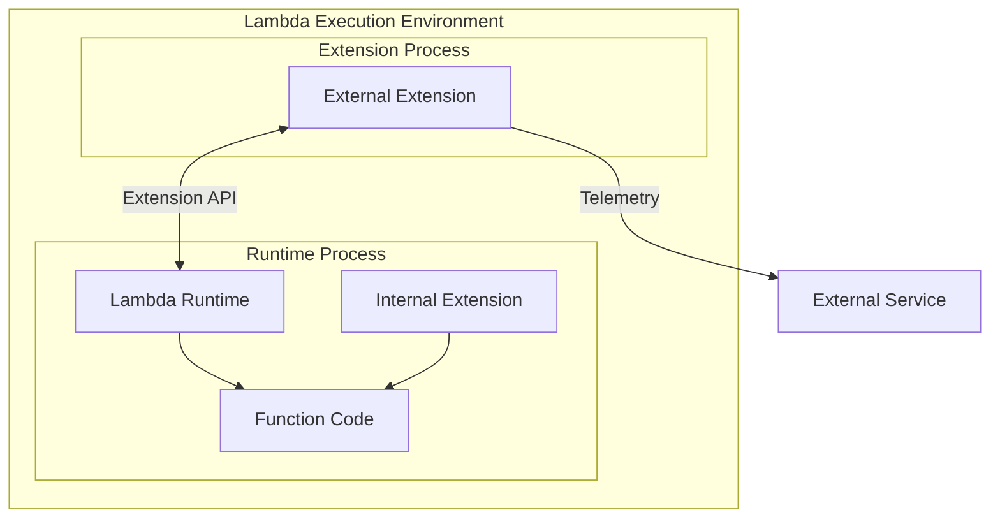
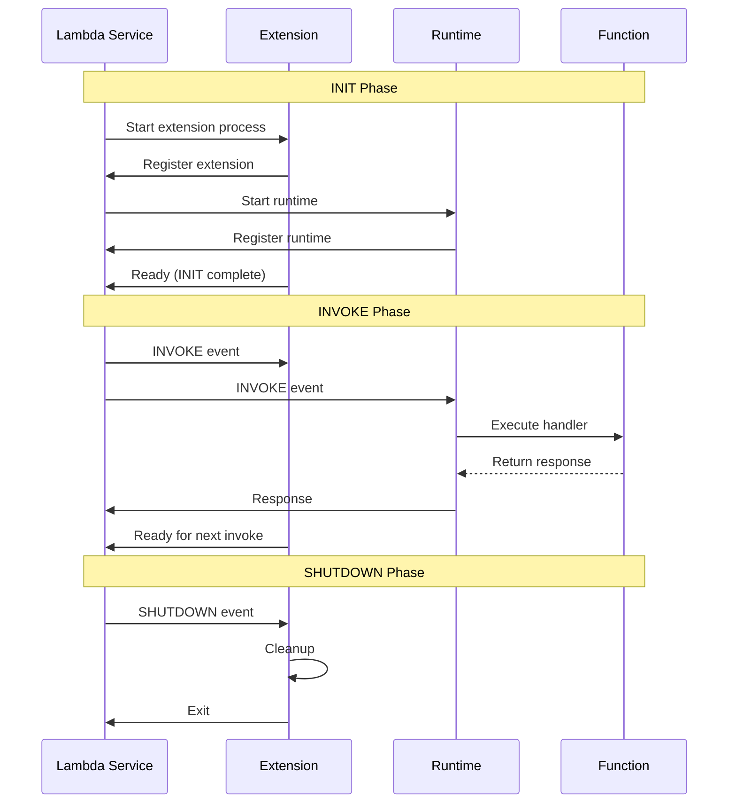

# How to Implement Lambda Extensions

Author: [nawazdhandala](https://www.github.com/nawazdhandala)

Tags: AWS, Lambda, Serverless, Extensions, Monitoring, Observability

Description: Learn how to implement AWS Lambda Extensions to add monitoring, security, and configuration capabilities to your functions without modifying application code.

---

Lambda Extensions allow you to integrate monitoring, security, and other tools directly into the Lambda execution environment. Instead of bundling these capabilities into your function code, extensions run as separate processes alongside your function, sharing lifecycle events and resources. This guide covers building both internal and external extensions with practical examples.

## What Are Lambda Extensions?

Extensions are companion processes that run within the Lambda execution environment. They can:

- Capture diagnostic information before, during, and after function invocations
- Instrument code without modifying the function itself
- Fetch configuration or secrets before the function initializes
- Send telemetry data to external services asynchronously



## Types of Extensions

### External Extensions

- Run as separate processes
- Started before the runtime initializes
- Survive across invocations within the same execution environment
- Best for: monitoring agents, log collectors, security scanners

### Internal Extensions

- Run within the runtime process
- Loaded as part of the function code
- Best for: language-specific instrumentation, SDK wrappers

## Extension Lifecycle



## Building an External Extension

### Project Structure

```
my-extension/
├── extensions/
│   └── my-extension          # Executable (must match directory name)
├── extension.go              # Extension source code
└── Makefile
```

### Extension Code (Go)

```go
// extension.go
package main

import (
	"bytes"
	"context"
	"encoding/json"
	"fmt"
	"net/http"
	"os"
	"os/signal"
	"syscall"
	"time"
)

const (
	extensionName   = "my-extension"
	lambdaRuntimeAPI = "AWS_LAMBDA_RUNTIME_API"
)

// Event types from Lambda
type RegisterResponse struct {
	FunctionName    string `json:"functionName"`
	FunctionVersion string `json:"functionVersion"`
	Handler         string `json:"handler"`
}

type EventType string

const (
	Invoke   EventType = "INVOKE"
	Shutdown EventType = "SHUTDOWN"
)

type NextEventResponse struct {
	EventType          EventType `json:"eventType"`
	DeadlineMs         int64     `json:"deadlineMs"`
	RequestID          string    `json:"requestId"`
	InvokedFunctionArn string    `json:"invokedFunctionArn"`
	Tracing            struct {
		Type  string `json:"type"`
		Value string `json:"value"`
	} `json:"tracing"`
}

// TelemetryData represents data we collect
type TelemetryData struct {
	Timestamp   time.Time `json:"timestamp"`
	RequestID   string    `json:"requestId"`
	FunctionArn string    `json:"functionArn"`
	EventType   string    `json:"eventType"`
	MemoryUsed  int64     `json:"memoryUsed,omitempty"`
}

var (
	extensionClient *http.Client
	runtimeAPI      string
	telemetryBuffer []TelemetryData
)

func main() {
	runtimeAPI = os.Getenv(lambdaRuntimeAPI)
	if runtimeAPI == "" {
		fmt.Println("AWS_LAMBDA_RUNTIME_API not set")
		os.Exit(1)
	}

	extensionClient = &http.Client{
		Timeout: 30 * time.Second,
	}

	ctx, cancel := context.WithCancel(context.Background())

	// Handle signals for graceful shutdown
	sigs := make(chan os.Signal, 1)
	signal.Notify(sigs, syscall.SIGTERM, syscall.SIGINT)
	go func() {
		<-sigs
		cancel()
	}()

	// Register the extension
	extensionID, err := registerExtension()
	if err != nil {
		fmt.Printf("Failed to register extension: %v\n", err)
		os.Exit(1)
	}
	fmt.Printf("Registered extension with ID: %s\n", extensionID)

	// Main event loop
	processEvents(ctx, extensionID)
}

func registerExtension() (string, error) {
	url := fmt.Sprintf("http://%s/2020-01-01/extension/register", runtimeAPI)

	body, _ := json.Marshal(map[string][]string{
		"events": {"INVOKE", "SHUTDOWN"},
	})

	req, err := http.NewRequest("POST", url, bytes.NewReader(body))
	if err != nil {
		return "", err
	}

	req.Header.Set("Lambda-Extension-Name", extensionName)
	req.Header.Set("Content-Type", "application/json")

	resp, err := extensionClient.Do(req)
	if err != nil {
		return "", err
	}
	defer resp.Body.Close()

	if resp.StatusCode != http.StatusOK {
		return "", fmt.Errorf("registration failed with status: %d", resp.StatusCode)
	}

	return resp.Header.Get("Lambda-Extension-Identifier"), nil
}

func processEvents(ctx context.Context, extensionID string) {
	for {
		select {
		case <-ctx.Done():
			return
		default:
			event, err := getNextEvent(extensionID)
			if err != nil {
				fmt.Printf("Error getting next event: %v\n", err)
				continue
			}

			switch event.EventType {
			case Invoke:
				handleInvoke(event)
			case Shutdown:
				handleShutdown(event)
				return
			}
		}
	}
}

func getNextEvent(extensionID string) (*NextEventResponse, error) {
	url := fmt.Sprintf("http://%s/2020-01-01/extension/event/next", runtimeAPI)

	req, err := http.NewRequest("GET", url, nil)
	if err != nil {
		return nil, err
	}

	req.Header.Set("Lambda-Extension-Identifier", extensionID)

	resp, err := extensionClient.Do(req)
	if err != nil {
		return nil, err
	}
	defer resp.Body.Close()

	var event NextEventResponse
	if err := json.NewDecoder(resp.Body).Decode(&event); err != nil {
		return nil, err
	}

	return &event, nil
}

func handleInvoke(event *NextEventResponse) {
	fmt.Printf("INVOKE: RequestID=%s\n", event.RequestID)

	// Collect telemetry
	data := TelemetryData{
		Timestamp:   time.Now(),
		RequestID:   event.RequestID,
		FunctionArn: event.InvokedFunctionArn,
		EventType:   "invoke",
	}
	telemetryBuffer = append(telemetryBuffer, data)

	// Flush telemetry periodically
	if len(telemetryBuffer) >= 10 {
		flushTelemetry()
	}
}

func handleShutdown(event *NextEventResponse) {
	fmt.Println("SHUTDOWN: Flushing remaining telemetry...")
	flushTelemetry()
}

func flushTelemetry() {
	if len(telemetryBuffer) == 0 {
		return
	}

	// Send telemetry to external service
	endpoint := os.Getenv("TELEMETRY_ENDPOINT")
	if endpoint == "" {
		fmt.Println("TELEMETRY_ENDPOINT not set, skipping flush")
		telemetryBuffer = nil
		return
	}

	body, _ := json.Marshal(telemetryBuffer)
	resp, err := http.Post(endpoint, "application/json", bytes.NewReader(body))
	if err != nil {
		fmt.Printf("Failed to send telemetry: %v\n", err)
		return
	}
	defer resp.Body.Close()

	fmt.Printf("Flushed %d telemetry records\n", len(telemetryBuffer))
	telemetryBuffer = nil
}
```

### Build and Package

```makefile
# Makefile
GOOS=linux
GOARCH=amd64
EXTENSION_NAME=my-extension

build:
	GOOS=$(GOOS) GOARCH=$(GOARCH) go build -o extensions/$(EXTENSION_NAME) extension.go

package: build
	chmod +x extensions/$(EXTENSION_NAME)
	zip -r extension.zip extensions/

deploy: package
	aws lambda publish-layer-version \
		--layer-name $(EXTENSION_NAME) \
		--zip-file fileb://extension.zip \
		--compatible-runtimes nodejs20.x python3.12 \
		--compatible-architectures x86_64
```

```bash
# Build and deploy
make deploy

# Attach to a function
aws lambda update-function-configuration \
	--function-name my-function \
	--layers arn:aws:lambda:us-east-1:123456789:layer:my-extension:1
```

## Building an Internal Extension (Node.js)

Internal extensions run within the runtime process and can intercept function calls.

```javascript
// internal-extension.js
const https = require('https');

// Store original handler reference
let originalHandler = null;

// Metrics collection
const metrics = {
  invocations: 0,
  errors: 0,
  totalDuration: 0
};

// Wrap the handler function
function wrapHandler(handler) {
  return async (event, context) => {
    const startTime = Date.now();
    metrics.invocations++;

    console.log(`[Extension] Invocation started: ${context.awsRequestId}`);

    try {
      // Call original handler
      const result = await handler(event, context);

      const duration = Date.now() - startTime;
      metrics.totalDuration += duration;

      console.log(`[Extension] Invocation completed: ${duration}ms`);

      // Send metrics asynchronously (don't await)
      sendMetrics({
        requestId: context.awsRequestId,
        functionName: context.functionName,
        duration,
        success: true
      });

      return result;
    } catch (error) {
      metrics.errors++;

      console.error(`[Extension] Invocation failed: ${error.message}`);

      sendMetrics({
        requestId: context.awsRequestId,
        functionName: context.functionName,
        duration: Date.now() - startTime,
        success: false,
        error: error.message
      });

      throw error;
    }
  };
}

// Non-blocking metrics send
function sendMetrics(data) {
  const endpoint = process.env.METRICS_ENDPOINT;
  if (!endpoint) return;

  const url = new URL(endpoint);
  const payload = JSON.stringify(data);

  const req = https.request({
    hostname: url.hostname,
    port: url.port || 443,
    path: url.pathname,
    method: 'POST',
    headers: {
      'Content-Type': 'application/json',
      'Content-Length': payload.length
    }
  });

  req.on('error', (err) => {
    console.error(`[Extension] Failed to send metrics: ${err.message}`);
  });

  req.write(payload);
  req.end();
}

// Export wrapper function
module.exports = { wrapHandler };
```

### Using the Internal Extension

```javascript
// index.js
const { wrapHandler } = require('./internal-extension');

// Define your handler
async function handler(event, context) {
  const { name } = event;

  // Simulate some work
  await new Promise(resolve => setTimeout(resolve, 100));

  return {
    statusCode: 200,
    body: JSON.stringify({ message: `Hello, ${name}!` })
  };
}

// Export wrapped handler
exports.handler = wrapHandler(handler);
```

## Using the Telemetry API

The Telemetry API allows extensions to receive logs, metrics, and traces from the Lambda runtime.

```go
// telemetry-extension.go
package main

import (
	"bytes"
	"encoding/json"
	"fmt"
	"io"
	"net/http"
	"os"
)

const telemetryListenerPort = 9000

type TelemetrySubscription struct {
	SchemaVersion string   `json:"schemaVersion"`
	Types         []string `json:"types"`
	Buffering     struct {
		MaxItems  int `json:"maxItems"`
		MaxBytes  int `json:"maxBytes"`
		TimeoutMs int `json:"timeoutMs"`
	} `json:"buffering"`
	Destination struct {
		Protocol string `json:"protocol"`
		URI      string `json:"URI"`
	} `json:"destination"`
}

func subscribeTelemetry(extensionID string) error {
	runtimeAPI := os.Getenv("AWS_LAMBDA_RUNTIME_API")
	url := fmt.Sprintf("http://%s/2022-07-01/telemetry", runtimeAPI)

	subscription := TelemetrySubscription{
		SchemaVersion: "2022-07-01",
		Types:         []string{"platform", "function"},
	}
	subscription.Buffering.MaxItems = 1000
	subscription.Buffering.MaxBytes = 256 * 1024
	subscription.Buffering.TimeoutMs = 1000
	subscription.Destination.Protocol = "HTTP"
	subscription.Destination.URI = fmt.Sprintf("http://sandbox:%d", telemetryListenerPort)

	body, _ := json.Marshal(subscription)

	req, err := http.NewRequest("PUT", url, bytes.NewReader(body))
	if err != nil {
		return err
	}

	req.Header.Set("Lambda-Extension-Identifier", extensionID)
	req.Header.Set("Content-Type", "application/json")

	resp, err := http.DefaultClient.Do(req)
	if err != nil {
		return err
	}
	defer resp.Body.Close()

	if resp.StatusCode != http.StatusOK {
		body, _ := io.ReadAll(resp.Body)
		return fmt.Errorf("subscription failed: %s", string(body))
	}

	return nil
}

// HTTP server to receive telemetry
func startTelemetryListener() {
	http.HandleFunc("/", func(w http.ResponseWriter, r *http.Request) {
		body, err := io.ReadAll(r.Body)
		if err != nil {
			http.Error(w, err.Error(), http.StatusBadRequest)
			return
		}

		// Process telemetry events
		var events []map[string]interface{}
		if err := json.Unmarshal(body, &events); err != nil {
			http.Error(w, err.Error(), http.StatusBadRequest)
			return
		}

		for _, event := range events {
			eventType := event["type"].(string)
			switch eventType {
			case "platform.start":
				fmt.Printf("Function invocation started: %v\n", event)
			case "platform.runtimeDone":
				fmt.Printf("Function invocation completed: %v\n", event)
			case "function":
				fmt.Printf("Function log: %v\n", event)
			}
		}

		w.WriteHeader(http.StatusOK)
	})

	fmt.Printf("Starting telemetry listener on port %d\n", telemetryListenerPort)
	http.ListenAndServe(fmt.Sprintf(":%d", telemetryListenerPort), nil)
}
```

## Practical Example: Secrets Caching Extension

This extension fetches secrets during initialization and caches them for the function to use.

```go
// secrets-extension.go
package main

import (
	"context"
	"encoding/json"
	"fmt"
	"net/http"
	"os"
	"sync"

	"github.com/aws/aws-sdk-go-v2/config"
	"github.com/aws/aws-sdk-go-v2/service/secretsmanager"
)

var (
	secretsCache = make(map[string]string)
	cacheMutex   sync.RWMutex
	httpServer   *http.Server
)

const (
	cacheServerPort = 4000
)

func main() {
	// Load secrets during INIT phase
	if err := loadSecrets(); err != nil {
		fmt.Printf("Failed to load secrets: %v\n", err)
		os.Exit(1)
	}

	// Start local HTTP server for function to access secrets
	go startCacheServer()

	// Register and process extension events
	extensionID, _ := registerExtension()
	processEvents(extensionID)
}

func loadSecrets() error {
	secretNames := os.Getenv("SECRETS_TO_CACHE")
	if secretNames == "" {
		return nil
	}

	ctx := context.Background()
	cfg, err := config.LoadDefaultConfig(ctx)
	if err != nil {
		return err
	}

	client := secretsmanager.NewFromConfig(cfg)

	var names []string
	json.Unmarshal([]byte(secretNames), &names)

	for _, name := range names {
		result, err := client.GetSecretValue(ctx, &secretsmanager.GetSecretValueInput{
			SecretId: &name,
		})
		if err != nil {
			fmt.Printf("Failed to get secret %s: %v\n", name, err)
			continue
		}

		cacheMutex.Lock()
		secretsCache[name] = *result.SecretString
		cacheMutex.Unlock()

		fmt.Printf("Cached secret: %s\n", name)
	}

	return nil
}

func startCacheServer() {
	mux := http.NewServeMux()

	mux.HandleFunc("/secrets/", func(w http.ResponseWriter, r *http.Request) {
		secretName := r.URL.Path[len("/secrets/"):]

		cacheMutex.RLock()
		value, exists := secretsCache[secretName]
		cacheMutex.RUnlock()

		if !exists {
			http.Error(w, "Secret not found", http.StatusNotFound)
			return
		}

		w.Header().Set("Content-Type", "application/json")
		json.NewEncoder(w).Encode(map[string]string{
			"value": value,
		})
	})

	httpServer = &http.Server{
		Addr:    fmt.Sprintf(":%d", cacheServerPort),
		Handler: mux,
	}

	fmt.Printf("Secrets cache server started on port %d\n", cacheServerPort)
	httpServer.ListenAndServe()
}
```

### Function Using the Secrets Extension

```javascript
// index.js - Function that uses the secrets extension
const http = require('http');

// Get secret from extension cache
async function getSecret(name) {
  return new Promise((resolve, reject) => {
    const req = http.request({
      hostname: 'localhost',
      port: 4000,
      path: `/secrets/${name}`,
      method: 'GET'
    }, (res) => {
      let data = '';
      res.on('data', chunk => data += chunk);
      res.on('end', () => {
        if (res.statusCode === 200) {
          resolve(JSON.parse(data).value);
        } else {
          reject(new Error(`Secret not found: ${name}`));
        }
      });
    });

    req.on('error', reject);
    req.end();
  });
}

exports.handler = async (event) => {
  // Get database credentials from extension cache
  const dbPassword = await getSecret('prod/database/password');

  // Use the secret
  const connection = await connectToDatabase({
    host: process.env.DB_HOST,
    password: dbPassword
  });

  // ... rest of function logic
};
```

## Deploying Extensions with Terraform

```hcl
# Build and package extension
resource "null_resource" "build_extension" {
  triggers = {
    source_hash = filemd5("${path.module}/extension/extension.go")
  }

  provisioner "local-exec" {
    command = <<EOF
      cd ${path.module}/extension
      GOOS=linux GOARCH=amd64 go build -o extensions/my-extension extension.go
      chmod +x extensions/my-extension
      zip -r extension.zip extensions/
    EOF
  }
}

# Publish as Lambda Layer
resource "aws_lambda_layer_version" "extension" {
  layer_name          = "my-monitoring-extension"
  filename            = "${path.module}/extension/extension.zip"
  compatible_runtimes = ["nodejs20.x", "python3.12"]

  depends_on = [null_resource.build_extension]
}

# Attach to Lambda function
resource "aws_lambda_function" "api" {
  function_name = "api-handler"
  role          = aws_iam_role.lambda.arn
  handler       = "index.handler"
  runtime       = "nodejs20.x"
  filename      = "function.zip"

  layers = [
    aws_lambda_layer_version.extension.arn
  ]

  environment {
    variables = {
      TELEMETRY_ENDPOINT = "https://telemetry.example.com/ingest"
    }
  }
}
```

## Best Practices

### 1. Minimize Initialization Time

Extensions run during the INIT phase, so keep initialization fast:

```go
// Good: Parallel initialization
func init() {
	var wg sync.WaitGroup
	wg.Add(2)

	go func() {
		defer wg.Done()
		loadConfig()
	}()

	go func() {
		defer wg.Done()
		initializeClient()
	}()

	wg.Wait()
}
```

### 2. Use Non-Blocking Operations

Avoid blocking the function response:

```go
// Good: Non-blocking telemetry send
func handleInvoke(event *NextEventResponse) {
	go func() {
		// Send telemetry in background
		sendTelemetry(event)
	}()
}
```

### 3. Handle Shutdown Gracefully

Flush all buffered data during shutdown:

```go
func handleShutdown() {
	// Flush remaining data
	flushTelemetry()

	// Close connections
	closeConnections()

	// Wait for pending operations (with timeout)
	ctx, cancel := context.WithTimeout(context.Background(), 2*time.Second)
	defer cancel()

	waitForPendingOps(ctx)
}
```

### 4. Respect Resource Limits

Extensions share memory and CPU with the function:

| Resource | Consideration |
|----------|---------------|
| Memory | Extensions use function memory allocation |
| CPU | Extensions compete with function for CPU |
| Storage | /tmp is shared (512MB - 10GB) |
| Network | Shared connections and bandwidth |

---

Lambda Extensions provide a powerful way to add cross-cutting concerns like monitoring, security, and configuration management without modifying function code. By running as separate processes or within the runtime, extensions can capture telemetry, cache secrets, and integrate with external services while keeping your business logic clean. Start with AWS Partner extensions for common use cases, and build custom extensions when you need specialized behavior.
