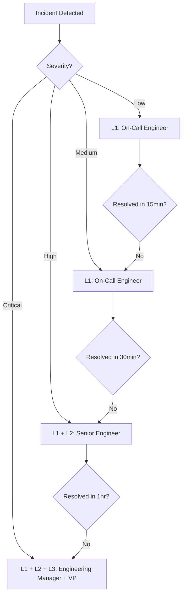
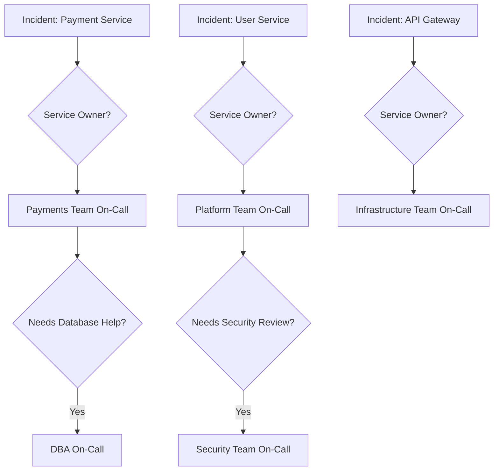
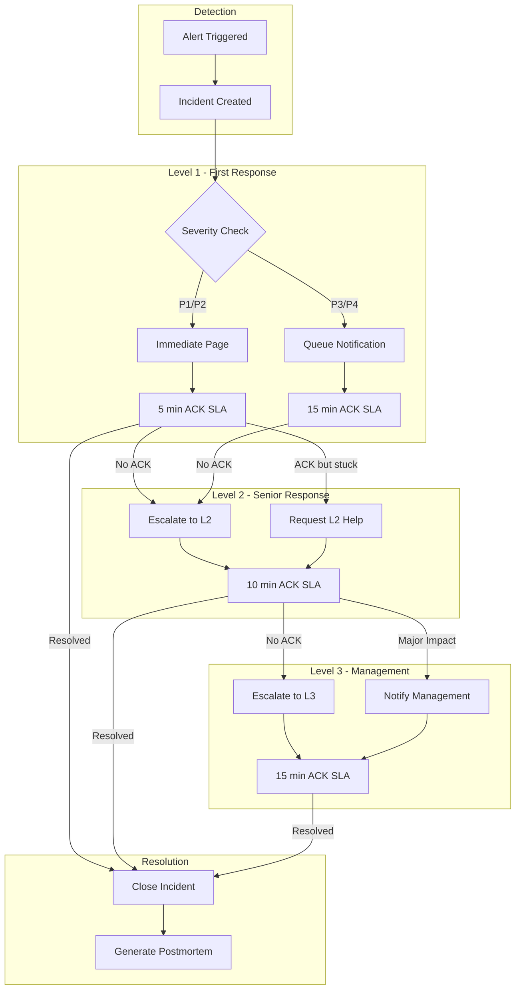

# How to Implement Incident Escalation Paths

Author: [nawazdhandala](https://www.github.com/nawazdhandala)

Tags: Incident Management, SRE, Escalation, On-Call, Alerting

Description: Learn how to design and implement effective incident escalation paths that ensure the right people are engaged at the right time.

---

When an incident strikes at 3 AM, the last thing you want is confusion about who to call. Incident escalation paths define the chain of responsibility when things go wrong. A well-designed escalation system ensures that incidents are handled by the right people with the right skills, without overwhelming your team with unnecessary alerts.

## What is an Escalation Path?

An escalation path is a predefined sequence of notifications and handoffs that activates when an incident occurs or when initial responders need help. Think of it as a decision tree for incident routing.



## Core Components of Escalation Paths

### 1. Escalation Levels

Define clear tiers with specific responsibilities:

```python
# Escalation level definitions

from dataclasses import dataclass
from typing import List, Optional
from enum import Enum

class EscalationLevel(Enum):
    L1 = "level_1"  # First responder
    L2 = "level_2"  # Senior/specialist
    L3 = "level_3"  # Management
    L4 = "level_4"  # Executive

@dataclass
class EscalationTier:
    level: EscalationLevel
    name: str
    response_time_sla: int  # seconds
    contacts: List[str]
    responsibilities: List[str]
    escalation_criteria: List[str]

# Example escalation tiers
escalation_tiers = [
    EscalationTier(
        level=EscalationLevel.L1,
        name="Primary On-Call",
        response_time_sla=300,  # 5 minutes
        contacts=["primary-oncall@company.com"],
        responsibilities=[
            "Initial triage and assessment",
            "Execute documented runbooks",
            "Mitigate customer impact",
            "Communicate status updates"
        ],
        escalation_criteria=[
            "Unable to resolve within 15 minutes",
            "Requires expertise outside primary domain",
            "Customer-facing impact exceeds threshold"
        ]
    ),
    EscalationTier(
        level=EscalationLevel.L2,
        name="Secondary On-Call / Subject Matter Expert",
        response_time_sla=600,  # 10 minutes
        contacts=["secondary-oncall@company.com", "sme-{service}@company.com"],
        responsibilities=[
            "Deep technical investigation",
            "Cross-service coordination",
            "Approve risky mitigation actions",
            "Guide L1 responders"
        ],
        escalation_criteria=[
            "Unable to resolve within 30 minutes",
            "Requires infrastructure or security changes",
            "Multiple services affected"
        ]
    ),
    EscalationTier(
        level=EscalationLevel.L3,
        name="Engineering Management",
        response_time_sla=900,  # 15 minutes
        contacts=["eng-managers@company.com"],
        responsibilities=[
            "Resource allocation decisions",
            "Cross-team coordination",
            "External communication approval",
            "Business impact assessment"
        ],
        escalation_criteria=[
            "Unable to resolve within 1 hour",
            "Significant revenue impact",
            "Requires external vendor engagement"
        ]
    ),
    EscalationTier(
        level=EscalationLevel.L4,
        name="Executive Response",
        response_time_sla=1800,  # 30 minutes
        contacts=["vp-engineering@company.com", "cto@company.com"],
        responsibilities=[
            "Executive communication",
            "Major business decisions",
            "PR and legal coordination",
            "Post-incident accountability"
        ],
        escalation_criteria=[
            "Company-wide impact",
            "Data breach or security incident",
            "Regulatory implications",
            "Media attention"
        ]
    )
]
```

### 2. Escalation Triggers

Define when escalation should happen:

```python
# Escalation trigger configuration

from datetime import timedelta

@dataclass
class EscalationTrigger:
    name: str
    condition: str
    target_level: EscalationLevel
    bypass_levels: bool = False  # Skip directly to this level

escalation_triggers = [
    # Time-based triggers
    EscalationTrigger(
        name="time_without_ack",
        condition="no_acknowledgment_after_5_minutes",
        target_level=EscalationLevel.L2
    ),
    EscalationTrigger(
        name="time_without_resolution",
        condition="not_resolved_after_30_minutes",
        target_level=EscalationLevel.L2
    ),

    # Severity-based triggers
    EscalationTrigger(
        name="critical_severity",
        condition="severity == 'critical'",
        target_level=EscalationLevel.L2,
        bypass_levels=True  # Immediately engage L2
    ),

    # Impact-based triggers
    EscalationTrigger(
        name="high_error_rate",
        condition="error_rate > 50%",
        target_level=EscalationLevel.L2
    ),
    EscalationTrigger(
        name="revenue_impact",
        condition="estimated_revenue_loss > $10000",
        target_level=EscalationLevel.L3
    ),

    # Manual triggers
    EscalationTrigger(
        name="responder_request",
        condition="responder_requests_escalation",
        target_level=EscalationLevel.L2
    )
]
```

### 3. Notification Channels

Configure how people get alerted at each level:

```python
# Multi-channel notification configuration

from enum import Enum
from typing import Dict, List

class NotificationChannel(Enum):
    EMAIL = "email"
    SMS = "sms"
    PHONE = "phone"
    SLACK = "slack"
    PAGERDUTY = "pagerduty"
    PUSH = "push_notification"

@dataclass
class NotificationPolicy:
    level: EscalationLevel
    channels: List[NotificationChannel]
    repeat_interval: Optional[int]  # seconds, None = no repeat
    max_repeats: int

notification_policies = {
    EscalationLevel.L1: NotificationPolicy(
        level=EscalationLevel.L1,
        channels=[
            NotificationChannel.PAGERDUTY,
            NotificationChannel.SLACK,
            NotificationChannel.PUSH
        ],
        repeat_interval=300,  # Repeat every 5 minutes
        max_repeats=3
    ),
    EscalationLevel.L2: NotificationPolicy(
        level=EscalationLevel.L2,
        channels=[
            NotificationChannel.PAGERDUTY,
            NotificationChannel.PHONE,
            NotificationChannel.SLACK
        ],
        repeat_interval=300,
        max_repeats=5
    ),
    EscalationLevel.L3: NotificationPolicy(
        level=EscalationLevel.L3,
        channels=[
            NotificationChannel.PHONE,
            NotificationChannel.SMS,
            NotificationChannel.EMAIL
        ],
        repeat_interval=600,
        max_repeats=3
    ),
    EscalationLevel.L4: NotificationPolicy(
        level=EscalationLevel.L4,
        channels=[
            NotificationChannel.PHONE,
            NotificationChannel.SMS
        ],
        repeat_interval=900,
        max_repeats=2
    )
}
```

## Implementing the Escalation Engine

Here is a complete escalation engine implementation:

```python
# Escalation engine implementation

import asyncio
from datetime import datetime, timedelta
from typing import Optional, Dict, List
import logging

logger = logging.getLogger(__name__)

class EscalationEngine:
    def __init__(self, config: Dict):
        self.tiers = config["tiers"]
        self.triggers = config["triggers"]
        self.notification_policies = config["notification_policies"]
        self.active_escalations: Dict[str, "EscalationState"] = {}

    async def handle_incident(self, incident: Dict) -> None:
        """Main entry point for incident escalation"""
        incident_id = incident["id"]

        # Initialize escalation state
        state = EscalationState(
            incident_id=incident_id,
            current_level=EscalationLevel.L1,
            started_at=datetime.utcnow(),
            acknowledged=False,
            resolved=False
        )
        self.active_escalations[incident_id] = state

        # Check for immediate escalation triggers
        initial_level = self._check_bypass_triggers(incident)
        if initial_level:
            state.current_level = initial_level

        # Send initial notifications
        await self._notify_level(state.current_level, incident)

        # Start escalation monitoring
        asyncio.create_task(self._monitor_escalation(incident_id))

    def _check_bypass_triggers(self, incident: Dict) -> Optional[EscalationLevel]:
        """Check if incident should bypass L1"""
        for trigger in self.triggers:
            if trigger.bypass_levels and self._evaluate_trigger(trigger, incident):
                logger.info(
                    f"Incident {incident['id']} bypassing to {trigger.target_level} "
                    f"due to {trigger.name}"
                )
                return trigger.target_level
        return None

    def _evaluate_trigger(self, trigger: EscalationTrigger,
                          incident: Dict) -> bool:
        """Evaluate if a trigger condition is met"""
        # Example trigger evaluations
        if trigger.condition == "severity == 'critical'":
            return incident.get("severity") == "critical"

        if trigger.condition.startswith("error_rate >"):
            threshold = float(trigger.condition.split(">")[1].strip().rstrip("%"))
            return incident.get("error_rate", 0) > threshold

        if trigger.condition.startswith("estimated_revenue_loss >"):
            threshold = float(
                trigger.condition.split(">")[1].strip().lstrip("$")
            )
            return incident.get("estimated_revenue_loss", 0) > threshold

        return False

    async def _monitor_escalation(self, incident_id: str) -> None:
        """Monitor incident and escalate as needed"""
        while True:
            await asyncio.sleep(60)  # Check every minute

            state = self.active_escalations.get(incident_id)
            if not state or state.resolved:
                break

            # Check time-based escalation
            elapsed = (datetime.utcnow() - state.started_at).total_seconds()

            if not state.acknowledged and elapsed > 300:
                # No ack after 5 minutes - escalate
                await self._escalate(incident_id, "No acknowledgment after 5 minutes")

            if not state.resolved and elapsed > 1800:
                # Not resolved after 30 minutes - escalate
                await self._escalate(incident_id, "Not resolved after 30 minutes")

    async def _escalate(self, incident_id: str, reason: str) -> None:
        """Escalate to the next level"""
        state = self.active_escalations.get(incident_id)
        if not state:
            return

        # Determine next level
        current_index = list(EscalationLevel).index(state.current_level)
        if current_index >= len(EscalationLevel) - 1:
            logger.warning(f"Incident {incident_id} already at highest escalation level")
            return

        next_level = list(EscalationLevel)[current_index + 1]
        state.current_level = next_level
        state.escalation_history.append({
            "timestamp": datetime.utcnow(),
            "from_level": list(EscalationLevel)[current_index],
            "to_level": next_level,
            "reason": reason
        })

        logger.info(f"Escalating incident {incident_id} to {next_level}: {reason}")

        # Get incident details and notify
        incident = await self._get_incident(incident_id)
        await self._notify_level(next_level, incident)

    async def _notify_level(self, level: EscalationLevel,
                            incident: Dict) -> None:
        """Send notifications to a specific escalation level"""
        policy = self.notification_policies[level]
        tier = next(t for t in self.tiers if t.level == level)

        for contact in tier.contacts:
            for channel in policy.channels:
                await self._send_notification(
                    channel=channel,
                    recipient=contact,
                    incident=incident,
                    level=level
                )

    async def _send_notification(self, channel: NotificationChannel,
                                  recipient: str, incident: Dict,
                                  level: EscalationLevel) -> None:
        """Send notification via specific channel"""
        message = self._format_message(incident, level)

        if channel == NotificationChannel.SLACK:
            await slack_client.send_message(recipient, message)
        elif channel == NotificationChannel.PAGERDUTY:
            await pagerduty_client.create_incident(
                service=recipient,
                title=message["title"],
                body=message["body"],
                urgency="high" if level.value >= "level_2" else "low"
            )
        elif channel == NotificationChannel.PHONE:
            await phone_client.call(recipient, message["voice_message"])
        elif channel == NotificationChannel.SMS:
            await sms_client.send(recipient, message["short_message"])
        elif channel == NotificationChannel.EMAIL:
            await email_client.send(recipient, message["subject"], message["body"])

    def _format_message(self, incident: Dict, level: EscalationLevel) -> Dict:
        """Format incident message for notifications"""
        severity_emoji = {
            "critical": "P1",
            "high": "P2",
            "medium": "P3",
            "low": "P4"
        }

        return {
            "title": f"[{severity_emoji.get(incident['severity'], 'P?')}] {incident['title']}",
            "body": f"""
Incident: {incident['title']}
Severity: {incident['severity']}
Impact: {incident.get('impact', 'Unknown')}
Started: {incident['started_at']}
Escalation Level: {level.value}

Action Required: Please acknowledge and investigate immediately.

Dashboard: https://oneuptime.com/incidents/{incident['id']}
            """.strip(),
            "short_message": f"[{incident['severity'].upper()}] {incident['title']} - ACK required",
            "voice_message": f"Alert. {incident['severity']} incident. {incident['title']}. Please acknowledge.",
            "subject": f"[Incident] {incident['title']}"
        }

    async def acknowledge(self, incident_id: str, responder: str) -> None:
        """Mark incident as acknowledged"""
        state = self.active_escalations.get(incident_id)
        if state:
            state.acknowledged = True
            state.acknowledged_by = responder
            state.acknowledged_at = datetime.utcnow()
            logger.info(f"Incident {incident_id} acknowledged by {responder}")

    async def resolve(self, incident_id: str, responder: str) -> None:
        """Mark incident as resolved"""
        state = self.active_escalations.get(incident_id)
        if state:
            state.resolved = True
            state.resolved_by = responder
            state.resolved_at = datetime.utcnow()
            logger.info(f"Incident {incident_id} resolved by {responder}")

@dataclass
class EscalationState:
    incident_id: str
    current_level: EscalationLevel
    started_at: datetime
    acknowledged: bool
    resolved: bool
    acknowledged_by: Optional[str] = None
    acknowledged_at: Optional[datetime] = None
    resolved_by: Optional[str] = None
    resolved_at: Optional[datetime] = None
    escalation_history: List[Dict] = None

    def __post_init__(self):
        if self.escalation_history is None:
            self.escalation_history = []
```

## Escalation Path Design Patterns

### Pattern 1: Service-Based Escalation

Route incidents to the team that owns the affected service:



```yaml
# Service-based escalation configuration

escalation_paths:
  payment-service:
    l1:
      schedule: payments-primary-oncall
      timeout: 15m
    l2:
      schedule: payments-secondary-oncall
      timeout: 30m
    l3:
      schedule: payments-manager
      timeout: 1h
    specialists:
      - condition: "involves_database"
        schedule: dba-oncall
      - condition: "involves_fraud"
        schedule: fraud-oncall

  user-service:
    l1:
      schedule: platform-primary-oncall
      timeout: 15m
    l2:
      schedule: platform-secondary-oncall
      timeout: 30m
    l3:
      schedule: platform-manager
      timeout: 1h
    specialists:
      - condition: "involves_pii"
        schedule: security-oncall
      - condition: "involves_auth"
        schedule: identity-oncall

  api-gateway:
    l1:
      schedule: infra-primary-oncall
      timeout: 10m  # Shorter timeout for critical path
    l2:
      schedule: infra-secondary-oncall
      timeout: 20m
    l3:
      schedule: infra-manager
      timeout: 45m
```

### Pattern 2: Severity-Based Parallel Notification

For critical incidents, notify multiple levels simultaneously:

```python
# Parallel notification for high-severity incidents

async def handle_critical_incident(incident: Dict) -> None:
    """Handle critical incidents with parallel escalation"""

    if incident["severity"] == "critical":
        # Notify L1, L2, and L3 simultaneously
        await asyncio.gather(
            notify_level(EscalationLevel.L1, incident),
            notify_level(EscalationLevel.L2, incident),
            notify_level(EscalationLevel.L3, incident),
            # Also notify specific stakeholders
            notify_stakeholders(incident)
        )

        # Start incident bridge automatically
        bridge_url = await create_incident_bridge(incident)

        # Update incident with bridge info
        await update_incident(incident["id"], {
            "bridge_url": bridge_url,
            "status": "active_response"
        })
```

### Pattern 3: Follow-the-Sun Escalation

For global teams, route to whoever is awake:

```python
# Follow-the-sun escalation

from datetime import datetime
import pytz

class FollowTheSunEscalation:
    def __init__(self):
        self.regions = {
            "americas": {
                "timezone": "America/New_York",
                "business_hours": (9, 17),  # 9 AM - 5 PM
                "schedule": "americas-oncall"
            },
            "emea": {
                "timezone": "Europe/London",
                "business_hours": (9, 17),
                "schedule": "emea-oncall"
            },
            "apac": {
                "timezone": "Asia/Tokyo",
                "business_hours": (9, 17),
                "schedule": "apac-oncall"
            }
        }

    def get_active_region(self) -> str:
        """Determine which region is currently in business hours"""
        now_utc = datetime.utcnow()

        for region_name, config in self.regions.items():
            tz = pytz.timezone(config["timezone"])
            local_time = now_utc.replace(tzinfo=pytz.UTC).astimezone(tz)
            hour = local_time.hour

            start, end = config["business_hours"]
            if start <= hour < end:
                return region_name

        # No region in business hours - use follow-the-sun logic
        # Find the region closest to starting business hours
        return self._get_next_active_region(now_utc)

    def get_escalation_path(self, incident: Dict) -> List[str]:
        """Get region-aware escalation path"""
        active_region = self.get_active_region()
        primary_schedule = self.regions[active_region]["schedule"]

        # Build escalation path starting with active region
        path = [primary_schedule]

        # Add other regions as backup
        for region_name, config in self.regions.items():
            if region_name != active_region:
                path.append(config["schedule"])

        return path
```

## Escalation Path Visualization



## Best Practices for Escalation Paths

### 1. Keep Escalation Paths Short

Long escalation chains delay response. Aim for 3-4 levels maximum.

### 2. Define Clear Handoff Procedures

```python
# Escalation handoff procedure

async def perform_handoff(incident_id: str, from_responder: str,
                          to_level: EscalationLevel) -> None:
    """Perform a clean escalation handoff"""

    # Get current incident state
    incident = await get_incident(incident_id)

    # Create handoff summary
    handoff_summary = {
        "incident_id": incident_id,
        "from_responder": from_responder,
        "handoff_time": datetime.utcnow().isoformat(),
        "current_status": incident["status"],
        "actions_taken": incident.get("actions_taken", []),
        "hypotheses_tested": incident.get("hypotheses", []),
        "current_theory": incident.get("current_theory"),
        "recommended_next_steps": incident.get("next_steps", []),
        "relevant_links": {
            "dashboard": f"https://monitoring.company.com/d/{incident_id}",
            "logs": f"https://logs.company.com/search?incident={incident_id}",
            "runbook": incident.get("runbook_url")
        }
    }

    # Post handoff summary to incident channel
    await post_to_incident_channel(
        incident_id,
        format_handoff_message(handoff_summary)
    )

    # Notify incoming responder with context
    await notify_responder(
        to_level,
        incident,
        handoff_summary
    )
```

### 3. Build in Manual Override

Allow responders to escalate or de-escalate manually:

```python
# Manual escalation controls

class EscalationControls:
    @staticmethod
    async def manual_escalate(incident_id: str, responder: str,
                              reason: str) -> None:
        """Allow responder to manually escalate"""
        await escalation_engine.escalate(
            incident_id,
            reason=f"Manual escalation by {responder}: {reason}"
        )

    @staticmethod
    async def manual_de_escalate(incident_id: str, responder: str,
                                  reason: str) -> None:
        """Allow responder to de-escalate if situation improves"""
        state = escalation_engine.active_escalations.get(incident_id)
        if state and state.current_level.value > "level_1":
            current_index = list(EscalationLevel).index(state.current_level)
            state.current_level = list(EscalationLevel)[current_index - 1]

            await post_to_incident_channel(
                incident_id,
                f"De-escalated by {responder}: {reason}"
            )

    @staticmethod
    async def add_responder(incident_id: str, responder_email: str,
                            role: str) -> None:
        """Add additional responder to incident"""
        incident = await get_incident(incident_id)
        await notify_specific_user(
            responder_email,
            incident,
            f"You have been added to this incident as {role}"
        )
```

### 4. Test Escalation Paths Regularly

```python
# Escalation path testing

async def test_escalation_path(service: str, dry_run: bool = True) -> Dict:
    """Test an escalation path without actually paging people"""

    test_incident = {
        "id": f"test-{uuid.uuid4()}",
        "title": f"[TEST] Escalation path test for {service}",
        "severity": "high",
        "service": service,
        "is_test": True
    }

    results = {
        "service": service,
        "tested_at": datetime.utcnow().isoformat(),
        "levels_tested": [],
        "issues_found": []
    }

    # Get escalation path for service
    path = get_escalation_path_for_service(service)

    for level in path:
        tier = get_tier(level)

        # Verify contacts exist and are reachable
        for contact in tier.contacts:
            if dry_run:
                # Just verify contact is valid
                is_valid = await verify_contact(contact)
                if not is_valid:
                    results["issues_found"].append({
                        "level": level.value,
                        "contact": contact,
                        "issue": "Contact not found or invalid"
                    })
            else:
                # Actually send test notification
                success = await send_test_notification(contact, test_incident)
                if not success:
                    results["issues_found"].append({
                        "level": level.value,
                        "contact": contact,
                        "issue": "Notification delivery failed"
                    })

        results["levels_tested"].append({
            "level": level.value,
            "contacts_count": len(tier.contacts),
            "channels": [c.value for c in notification_policies[level].channels]
        })

    return results
```

### 5. Track Escalation Metrics

```python
# Escalation metrics tracking

def calculate_escalation_metrics(incidents: List[Dict]) -> Dict:
    """Calculate escalation-related metrics"""

    metrics = {
        "total_incidents": len(incidents),
        "escalation_rate": 0,
        "avg_time_to_escalation": 0,
        "escalations_by_level": defaultdict(int),
        "escalations_by_reason": defaultdict(int),
        "false_escalations": 0
    }

    escalated_incidents = [i for i in incidents if i.get("escalation_history")]
    metrics["escalation_rate"] = len(escalated_incidents) / len(incidents) if incidents else 0

    escalation_times = []
    for incident in escalated_incidents:
        for escalation in incident["escalation_history"]:
            # Track by level
            metrics["escalations_by_level"][escalation["to_level"]] += 1

            # Track by reason
            reason_category = categorize_escalation_reason(escalation["reason"])
            metrics["escalations_by_reason"][reason_category] += 1

            # Calculate time to escalation
            incident_start = datetime.fromisoformat(incident["started_at"])
            escalation_time = datetime.fromisoformat(escalation["timestamp"])
            escalation_times.append(
                (escalation_time - incident_start).total_seconds()
            )

            # Check if escalation was necessary (resolved at lower level possible)
            if was_false_escalation(incident, escalation):
                metrics["false_escalations"] += 1

    if escalation_times:
        metrics["avg_time_to_escalation"] = sum(escalation_times) / len(escalation_times)

    return metrics
```

---

Effective escalation paths ensure that incidents get the attention they need without overwhelming your team. Start with simple severity-based escalation, then refine based on your incident patterns and team structure. Remember that the goal is not to page more people, but to page the right people at the right time. Regular testing and metrics tracking will help you continuously improve your escalation effectiveness.
