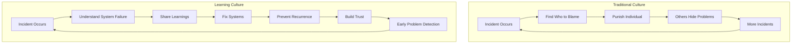
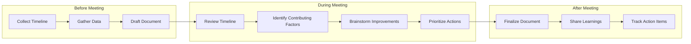
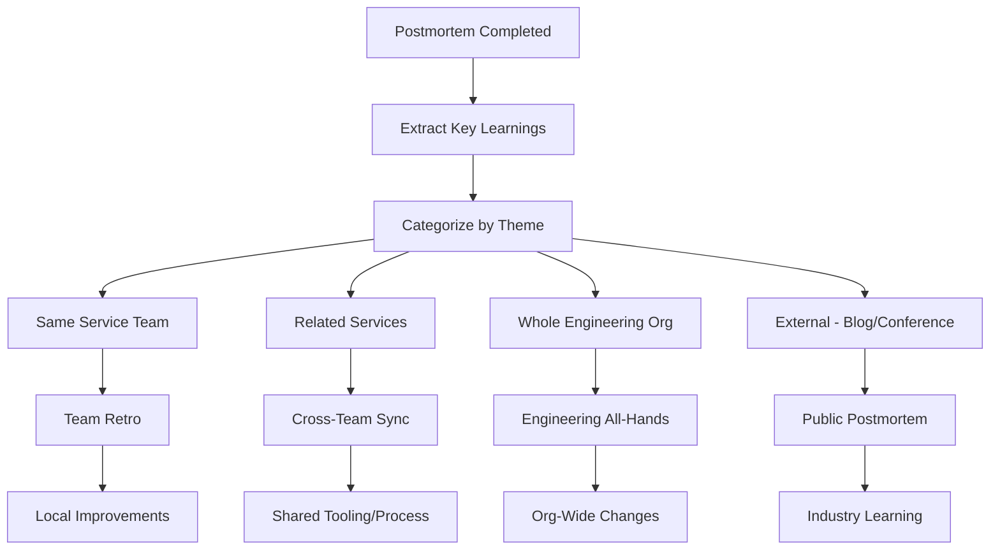

# How to Build Incident Learning Culture

Author: [nawazdhandala](https://www.github.com/nawazdhandala)

Tags: Incident Management, SRE, Blameless Culture, Postmortems, Learning Organization

Description: Learn how to build an engineering culture that treats incidents as learning opportunities rather than failures to be punished.

---

The best engineering teams do not have fewer incidents - they learn more from each one. Building an incident learning culture transforms failures from career-damaging events into opportunities for growth. This is not about going soft on quality. It is about creating an environment where engineers report problems early, share mistakes openly, and continuously improve systems and processes.

## What is an Incident Learning Culture?

An incident learning culture has these characteristics:

- Engineers feel safe reporting problems and mistakes
- Postmortems focus on systems, not individuals
- Learnings are shared widely across the organization
- Action items from incidents actually get completed
- The same incident rarely happens twice



## The Foundation: Psychological Safety

Without psychological safety, engineers hide problems rather than report them. Building safety requires consistent behavior from leadership.

### What Leaders Must Do

```python
# Leadership behaviors for psychological safety

leadership_behaviors = {
    "when_incident_occurs": [
        "Thank the person who reported it",
        "Ask 'what can we learn?' not 'who did this?'",
        "Publicly acknowledge that incidents are normal",
        "Share your own past mistakes",
        "Focus discussion on systems, not people"
    ],

    "in_postmortems": [
        "Never assign blame to individuals",
        "Redirect blame-focused comments",
        "Celebrate thorough investigation",
        "Thank people for honest contributions",
        "Commit to fixing systemic issues"
    ],

    "ongoing": [
        "Share learnings from other companies' incidents",
        "Recognize engineers who find problems early",
        "Fund improvements identified in postmortems",
        "Never use incidents in performance reviews negatively",
        "Measure teams on MTTR improvement, not incident count"
    ]
}
```

### Setting the Right Tone

```python
# Example: Incident response message templates

INCIDENT_ANNOUNCED_TEMPLATE = """
We have an incident affecting {service}.

Current Status: {status}
Impact: {impact}
Lead Responder: {responder}

Thanks to {reporter} for catching this quickly. We will post updates every {update_interval} minutes.

Bridge: {bridge_link}
"""

POSTMORTEM_INVITATION_TEMPLATE = """
Postmortem scheduled for {incident_title}

This is a learning opportunity, not a blame session. We want to understand:
- What systems and processes allowed this to happen
- What we can change to prevent recurrence
- What went well in our response

All perspectives are valuable. Please come prepared to share openly.

Document: {doc_link}
Meeting: {meeting_link}
"""

LEARNING_SHARED_TEMPLATE = """
New Incident Learning: {title}

We recently had an incident that taught us something valuable. Here is the summary:

What happened: {summary}
Key insight: {insight}
What we changed: {changes}

Full postmortem: {postmortem_link}

These learnings help everyone. If you have questions, reach out to {contact}.
"""
```

## Running Blameless Postmortems

The postmortem is where learning culture lives or dies. Get this right.

### The Postmortem Process



### Facilitating Blameless Discussion

```python
# Postmortem facilitation guide

class PostmortemFacilitator:
    """Guide for running blameless postmortems"""

    REDIRECT_PHRASES = {
        # If someone says -> Redirect to
        "X should have known better":
            "What information was X missing? How could the system have provided it?",

        "This was human error":
            "What system conditions made this error possible? How can we make it harder to make this mistake?",

        "X didn't follow the process":
            "Was the process clear and accessible? What made it easy to skip?",

        "If only X had checked":
            "What automated checks could catch this? How can we make the right action the default?",

        "X was careless":
            "What pressures or constraints was X operating under? How can we reduce those?",
    }

    GOOD_QUESTIONS = [
        "What information would have helped you make a different decision?",
        "At what point did the situation become unclear?",
        "What tools or dashboards were you using? Were they helpful?",
        "What did you expect to happen? What actually happened?",
        "If you could add one thing to our systems, what would have helped here?",
        "What made this failure mode possible in the first place?",
        "How could we detect this earlier next time?",
        "What would need to be true for this to never happen again?",
    ]

    OPENING_STATEMENT = """
    Welcome to the postmortem for {incident_title}.

    Before we begin, a reminder: this is a blameless postmortem. Our goal is to
    understand what happened and improve our systems, not to assign blame.

    People make mistakes - that's expected. Our job is to build systems that
    are resilient to human error. Every person in this room made the best
    decisions they could with the information they had at the time.

    Let's start by reviewing the timeline.
    """

    @staticmethod
    def redirect_blame(statement: str) -> str:
        """Redirect blame-focused statements to systemic thinking"""
        for blame_pattern, redirect in PostmortemFacilitator.REDIRECT_PHRASES.items():
            if blame_pattern.lower() in statement.lower():
                return redirect
        return "Can you help me understand what system factors contributed to this?"
```

### The Five Whys - Done Right

The Five Whys technique is powerful but often misused. Here is how to do it properly:

```python
# Five Whys analysis example

def five_whys_example():
    """
    Incident: Production database became unresponsive

    WRONG WAY (finds blame):
    1. Why did the database become unresponsive?
       - Because a query consumed all available memory
    2. Why did someone run that query?
       - Because the developer didn't test it properly
    3. Why didn't they test it?
       - Because they were rushing to meet a deadline
    4. Why were they rushing?
       - Because the project manager pushed too hard
    5. Why? -> Leads to finger pointing

    RIGHT WAY (finds systemic issues):
    1. Why did the database become unresponsive?
       - Because a query consumed all available memory
    2. Why could a single query consume all memory?
       - Because there are no query resource limits configured
    3. Why are there no resource limits?
       - Because our database setup doesn't include them by default
    4. Why doesn't our default setup include safety limits?
       - Because our provisioning templates were created before
         we had this incident type
    5. Why haven't we updated our templates based on past incidents?
       - Because we don't have a process to update infrastructure
         templates from postmortem learnings

    ROOT CAUSE: Missing feedback loop from postmortems to infrastructure templates

    ACTION ITEMS:
    - Add query resource limits to database provisioning templates
    - Create process to review and update templates after relevant incidents
    - Add monitoring alert for queries approaching resource limits
    """
    pass
```

### Documenting Learnings Effectively

```python
# Postmortem document structure

POSTMORTEM_TEMPLATE = """
# Postmortem: {incident_title}

## Incident Summary
- **Date**: {date}
- **Duration**: {duration}
- **Severity**: {severity}
- **Impact**: {impact_summary}
- **Lead Responder**: {responder}

## Executive Summary
{executive_summary}

## Timeline
{timeline_markdown}

## Root Cause Analysis

### Primary Root Cause
{root_cause}

### Contributing Factors
{contributing_factors}

### System Factors
{system_factors}

## What Went Well
{what_went_well}

## What Could Be Improved
{improvements}

## Action Items

| Priority | Action | Owner | Due Date | Status |
|----------|--------|-------|----------|--------|
{action_items_table}

## Lessons Learned
{lessons}

## References
- Incident ticket: {ticket_link}
- Monitoring dashboard: {dashboard_link}
- Relevant runbooks: {runbook_links}

---
*This postmortem was conducted {days_after} days after the incident.*
*Document owner: {owner}*
*Last updated: {last_updated}*
"""
```

## Sharing and Scaling Learnings

Individual postmortems are valuable. Scaled learning transforms organizations.

### Learning Distribution System



### Implementing Learning Channels

```python
# Learning distribution implementation

class LearningDistributor:
    def __init__(self):
        self.channels = {
            "immediate": self._distribute_immediate,
            "weekly": self._distribute_weekly,
            "monthly": self._distribute_monthly,
            "quarterly": self._distribute_quarterly
        }

    async def distribute_learning(self, postmortem: Dict) -> None:
        """Distribute postmortem learnings through appropriate channels"""

        learnings = self._extract_learnings(postmortem)

        # Immediate: Notify affected teams
        await self._distribute_immediate(learnings, postmortem)

        # Queue for aggregated distribution
        await self._queue_for_digest(learnings)

    async def _distribute_immediate(self, learnings: List[Dict],
                                     postmortem: Dict) -> None:
        """Send immediate notifications to relevant teams"""

        affected_services = postmortem.get("affected_services", [])

        for service in affected_services:
            team = get_service_owner(service)

            await slack_client.post_message(
                channel=f"#{team}-engineering",
                text=self._format_learning_alert(learnings, postmortem)
            )

        # Also post to cross-cutting channels if relevant
        if any(l["category"] == "security" for l in learnings):
            await slack_client.post_message(
                channel="#security-learnings",
                text=self._format_security_alert(learnings, postmortem)
            )

        if any(l["category"] == "infrastructure" for l in learnings):
            await slack_client.post_message(
                channel="#infrastructure",
                text=self._format_infra_alert(learnings, postmortem)
            )

    async def _distribute_weekly(self) -> None:
        """Send weekly learning digest"""

        learnings = await self._get_weekly_learnings()

        if not learnings:
            return

        digest = self._format_weekly_digest(learnings)

        await email_client.send_to_list(
            list_name="engineering-all",
            subject=f"Weekly Incident Learnings - {len(learnings)} insights",
            body=digest
        )

        await slack_client.post_message(
            channel="#engineering",
            text=digest
        )

    async def _distribute_monthly(self) -> None:
        """Send monthly trends and patterns"""

        learnings = await self._get_monthly_learnings()
        patterns = self._identify_patterns(learnings)

        report = self._format_monthly_report(learnings, patterns)

        # Present at engineering all-hands
        await calendar_client.add_agenda_item(
            meeting="engineering-all-hands",
            title="Monthly Incident Patterns Review",
            presenter="SRE Team",
            materials=report
        )

    def _extract_learnings(self, postmortem: Dict) -> List[Dict]:
        """Extract shareable learnings from postmortem"""

        learnings = []

        # Root cause learning
        learnings.append({
            "type": "root_cause",
            "category": postmortem.get("root_cause_category"),
            "summary": postmortem.get("root_cause_summary"),
            "prevention": postmortem.get("prevention_recommendation"),
            "services": postmortem.get("affected_services")
        })

        # Process learnings
        for item in postmortem.get("what_could_be_improved", []):
            learnings.append({
                "type": "process",
                "category": "incident_response",
                "summary": item,
                "services": None
            })

        # Detection learnings
        if postmortem.get("detection_gap"):
            learnings.append({
                "type": "detection",
                "category": "monitoring",
                "summary": postmortem["detection_gap"],
                "services": postmortem.get("affected_services")
            })

        return learnings

    def _identify_patterns(self, learnings: List[Dict]) -> List[Dict]:
        """Identify patterns across multiple postmortems"""

        patterns = []

        # Group by category
        by_category = defaultdict(list)
        for learning in learnings:
            by_category[learning["category"]].append(learning)

        # Find repeated categories
        for category, items in by_category.items():
            if len(items) >= 3:  # Pattern threshold
                patterns.append({
                    "category": category,
                    "frequency": len(items),
                    "examples": items[:3],
                    "recommendation": self._generate_pattern_recommendation(category, items)
                })

        return patterns

    def _generate_pattern_recommendation(self, category: str,
                                          items: List[Dict]) -> str:
        """Generate recommendation based on pattern"""

        recommendations = {
            "configuration": "Consider implementing configuration validation in CI/CD",
            "capacity": "Review capacity planning process and add predictive alerting",
            "dependency": "Implement circuit breakers and fallbacks for external dependencies",
            "deployment": "Add deployment verification steps and canary releases",
            "monitoring": "Expand monitoring coverage and reduce alert thresholds"
        }

        return recommendations.get(
            category,
            f"Review {category} practices across teams"
        )
```

## Action Item Follow-Through

Learning without action is just documentation. Build systems to ensure improvements actually happen.

### Tracking Action Items

```python
# Action item tracking system

from datetime import datetime, timedelta
from enum import Enum

class ActionItemStatus(Enum):
    OPEN = "open"
    IN_PROGRESS = "in_progress"
    BLOCKED = "blocked"
    COMPLETED = "completed"
    WONT_DO = "wont_do"

@dataclass
class ActionItem:
    id: str
    postmortem_id: str
    title: str
    description: str
    owner: str
    due_date: datetime
    priority: str  # P1, P2, P3
    status: ActionItemStatus
    created_at: datetime
    updated_at: datetime
    completion_notes: str = None

class ActionItemTracker:
    def __init__(self, storage, notification_service):
        self.storage = storage
        self.notifications = notification_service

    async def create_action_item(self, postmortem_id: str,
                                  item_data: Dict) -> ActionItem:
        """Create and track a postmortem action item"""

        action_item = ActionItem(
            id=generate_id(),
            postmortem_id=postmortem_id,
            title=item_data["title"],
            description=item_data["description"],
            owner=item_data["owner"],
            due_date=item_data["due_date"],
            priority=item_data["priority"],
            status=ActionItemStatus.OPEN,
            created_at=datetime.utcnow(),
            updated_at=datetime.utcnow()
        )

        await self.storage.save(action_item)

        # Notify owner
        await self.notifications.send(
            recipient=action_item.owner,
            template="action_item_assigned",
            data={
                "item": action_item,
                "postmortem_link": f"/postmortems/{postmortem_id}"
            }
        )

        return action_item

    async def check_overdue_items(self) -> List[ActionItem]:
        """Find and escalate overdue action items"""

        overdue = await self.storage.query(
            status__in=[ActionItemStatus.OPEN, ActionItemStatus.IN_PROGRESS],
            due_date__lt=datetime.utcnow()
        )

        for item in overdue:
            days_overdue = (datetime.utcnow() - item.due_date).days

            if days_overdue <= 7:
                # Reminder to owner
                await self.notifications.send(
                    recipient=item.owner,
                    template="action_item_overdue",
                    data={"item": item, "days_overdue": days_overdue}
                )
            elif days_overdue <= 14:
                # Escalate to manager
                manager = await get_manager(item.owner)
                await self.notifications.send(
                    recipient=manager,
                    template="action_item_escalation",
                    data={"item": item, "days_overdue": days_overdue}
                )
            else:
                # Escalate to director
                await self.notifications.send(
                    recipient="engineering-directors",
                    template="action_item_critical_overdue",
                    data={"item": item, "days_overdue": days_overdue}
                )

        return overdue

    async def generate_completion_report(self) -> Dict:
        """Generate action item completion metrics"""

        all_items = await self.storage.query()

        completed = [i for i in all_items if i.status == ActionItemStatus.COMPLETED]

        on_time = [
            i for i in completed
            if i.updated_at <= i.due_date
        ]

        return {
            "total_items": len(all_items),
            "completed": len(completed),
            "completion_rate": len(completed) / len(all_items) if all_items else 0,
            "on_time_rate": len(on_time) / len(completed) if completed else 0,
            "by_priority": {
                "P1": self._priority_stats(all_items, "P1"),
                "P2": self._priority_stats(all_items, "P2"),
                "P3": self._priority_stats(all_items, "P3")
            },
            "avg_completion_days": self._avg_completion_time(completed)
        }

    def _priority_stats(self, items: List[ActionItem], priority: str) -> Dict:
        priority_items = [i for i in items if i.priority == priority]
        completed = [i for i in priority_items if i.status == ActionItemStatus.COMPLETED]
        return {
            "total": len(priority_items),
            "completed": len(completed),
            "completion_rate": len(completed) / len(priority_items) if priority_items else 0
        }

    def _avg_completion_time(self, completed: List[ActionItem]) -> float:
        if not completed:
            return 0

        times = [
            (i.updated_at - i.created_at).days
            for i in completed
        ]
        return sum(times) / len(times)
```

## Measuring Learning Culture Health

Track whether your learning culture is actually working:

```python
# Learning culture health metrics

def calculate_learning_culture_health(org_data: Dict) -> Dict:
    """Calculate metrics that indicate learning culture health"""

    metrics = {}

    # 1. Postmortem completion rate
    incidents = org_data["incidents"]
    postmortems = org_data["postmortems"]

    eligible_incidents = [
        i for i in incidents
        if i["severity"] in ["critical", "high"]
    ]
    completed_postmortems = [
        p for p in postmortems
        if p["status"] == "completed"
    ]

    metrics["postmortem_completion_rate"] = (
        len(completed_postmortems) / len(eligible_incidents)
        if eligible_incidents else 1.0
    )

    # 2. Time to postmortem
    times_to_postmortem = []
    for pm in completed_postmortems:
        incident = next(
            (i for i in incidents if i["id"] == pm["incident_id"]),
            None
        )
        if incident:
            incident_end = datetime.fromisoformat(incident["resolved_at"])
            pm_completed = datetime.fromisoformat(pm["completed_at"])
            times_to_postmortem.append((pm_completed - incident_end).days)

    metrics["avg_days_to_postmortem"] = (
        sum(times_to_postmortem) / len(times_to_postmortem)
        if times_to_postmortem else 0
    )

    # 3. Action item completion rate
    all_action_items = org_data["action_items"]
    completed_items = [
        a for a in all_action_items
        if a["status"] == "completed"
    ]

    metrics["action_item_completion_rate"] = (
        len(completed_items) / len(all_action_items)
        if all_action_items else 1.0
    )

    # 4. Recurring incident rate
    incident_fingerprints = [i.get("fingerprint") for i in incidents]
    recurring = len(incident_fingerprints) - len(set(incident_fingerprints))

    metrics["recurring_incident_rate"] = (
        recurring / len(incidents)
        if incidents else 0
    )

    # 5. Learning engagement
    # How many people participate in postmortems?
    pm_participants = set()
    for pm in postmortems:
        pm_participants.update(pm.get("participants", []))

    total_engineers = org_data["total_engineers"]

    metrics["postmortem_participation_rate"] = (
        len(pm_participants) / total_engineers
        if total_engineers else 0
    )

    # 6. Voluntary incident reporting rate
    # Are people proactively reporting issues?
    self_reported = [
        i for i in incidents
        if i.get("detection_method") == "human_report"
    ]

    metrics["voluntary_reporting_rate"] = (
        len(self_reported) / len(incidents)
        if incidents else 0
    )

    # Calculate overall health score
    weights = {
        "postmortem_completion_rate": 0.2,
        "action_item_completion_rate": 0.25,
        "recurring_incident_rate": -0.2,  # Negative - lower is better
        "postmortem_participation_rate": 0.15,
        "voluntary_reporting_rate": 0.2
    }

    health_score = 0
    for metric, weight in weights.items():
        if metric == "recurring_incident_rate":
            # Invert - we want low recurring rate
            health_score += (1 - metrics[metric]) * abs(weight)
        elif metric == "avg_days_to_postmortem":
            # Normalize: 0-3 days = good, 7+ days = bad
            normalized = max(0, 1 - (metrics[metric] / 7))
            health_score += normalized * 0.1
        else:
            health_score += metrics[metric] * weight

    metrics["overall_health_score"] = min(100, health_score * 100)

    return metrics
```

## Common Pitfalls and How to Avoid Them

### Pitfall 1: Blame Creep

Even in "blameless" postmortems, blame can creep in:

```python
# Detecting blame in postmortem language

BLAME_INDICATORS = [
    "should have",
    "failed to",
    "didn't bother",
    "careless",
    "negligent",
    "obvious",
    "stupid",
    "mistake by",
    "fault of",
    "whose fault"
]

def check_for_blame(postmortem_text: str) -> List[Dict]:
    """Identify potentially blame-focused language"""

    issues = []
    sentences = postmortem_text.split('.')

    for i, sentence in enumerate(sentences):
        for indicator in BLAME_INDICATORS:
            if indicator.lower() in sentence.lower():
                issues.append({
                    "sentence_number": i + 1,
                    "sentence": sentence.strip(),
                    "indicator": indicator,
                    "suggestion": get_reframe_suggestion(indicator)
                })

    return issues

def get_reframe_suggestion(indicator: str) -> str:
    suggestions = {
        "should have": "Consider: 'The system could be improved to...'",
        "failed to": "Consider: 'The process did not include...'",
        "careless": "Consider: 'The safeguards did not prevent...'",
        "obvious": "Consider: 'In hindsight, we can see that...'",
        "mistake by": "Consider: 'The system allowed...' or 'There was no check for...'"
    }
    return suggestions.get(indicator, "Consider focusing on the system, not the person")
```

### Pitfall 2: Action Item Graveyards

Action items get created but never completed:

```python
# Preventing action item abandonment

class ActionItemHealthChecker:
    def weekly_health_check(self):
        """Run weekly to prevent action item decay"""

        open_items = self.storage.query(
            status__in=[ActionItemStatus.OPEN, ActionItemStatus.IN_PROGRESS]
        )

        for item in open_items:
            age_days = (datetime.utcnow() - item.created_at).days

            # Flag stale items
            if age_days > 14 and item.status == ActionItemStatus.OPEN:
                self.flag_stale(item)

            # Check for forgotten high-priority items
            if item.priority == "P1" and age_days > 7:
                self.escalate_critical(item)

            # Auto-close very old low-priority items with notice
            if item.priority == "P3" and age_days > 90:
                self.auto_close_with_notice(item)

    def flag_stale(self, item: ActionItem):
        """Flag item as needing attention"""
        self.notifications.send(
            recipient=item.owner,
            template="stale_action_item",
            data={
                "item": item,
                "message": "This item has been open for 2+ weeks. "
                          "Please update status or request help."
            }
        )

    def auto_close_with_notice(self, item: ActionItem):
        """Close abandoned low-priority items"""
        item.status = ActionItemStatus.WONT_DO
        item.completion_notes = (
            "Auto-closed after 90 days without progress. "
            "Reopen if still relevant."
        )
        self.storage.save(item)

        self.notifications.send(
            recipient=item.owner,
            template="action_item_auto_closed",
            data={"item": item}
        )
```

### Pitfall 3: Knowledge Silos

Learnings stay within teams:

```python
# Cross-team learning promotion

class CrossTeamLearningPromoter:
    def identify_shareable_learnings(self, postmortem: Dict) -> List[Dict]:
        """Identify learnings that would benefit other teams"""

        shareable = []

        # Infrastructure learnings benefit everyone
        if postmortem.get("root_cause_category") in [
            "infrastructure", "configuration", "deployment"
        ]:
            shareable.append({
                "learning": postmortem["key_learning"],
                "target_audience": "all_engineering",
                "format": "tech_talk"
            })

        # Security learnings are critical
        if postmortem.get("root_cause_category") == "security":
            shareable.append({
                "learning": postmortem["key_learning"],
                "target_audience": "all_engineering",
                "format": "mandatory_training"
            })

        # Similar services should learn from each other
        affected_services = postmortem.get("affected_services", [])
        similar_services = self.find_similar_services(affected_services)

        if similar_services:
            shareable.append({
                "learning": postmortem["key_learning"],
                "target_audience": [
                    get_service_owner(s) for s in similar_services
                ],
                "format": "direct_share"
            })

        return shareable
```

---

Building an incident learning culture is a long-term investment. It requires consistent behavior from leadership, well-designed processes, and the right tools. Start with the foundation of psychological safety, run truly blameless postmortems, share learnings widely, and follow through on action items. The payoff is an organization that gets stronger with every incident rather than one that repeats the same failures. Remember: the goal is not zero incidents - it is maximum learning from every incident that does occur.
