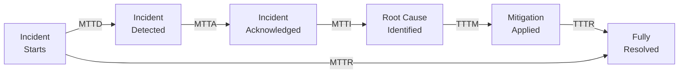
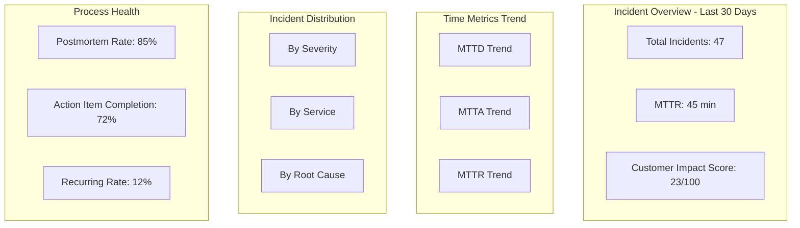
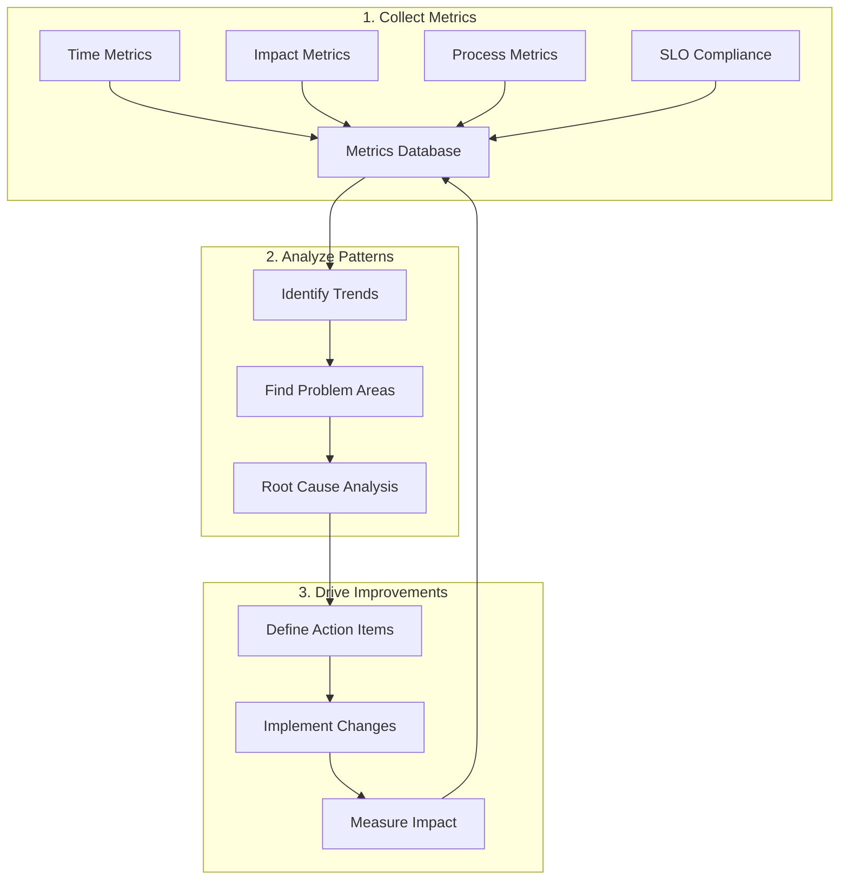

# How to Measure Incident Response Effectiveness

Author: [nawazdhandala](https://www.github.com/nawazdhandala)

Tags: Incident Management, SRE, Metrics, MTTR, MTTD, Reliability

Description: Learn which metrics to track for measuring incident response effectiveness and how to use them to drive continuous improvement.

---

You cannot improve what you do not measure. Incident response effectiveness is not about gut feelings - it is about data. The right metrics help you understand where your response process excels and where it breaks down. This guide covers the essential metrics for incident response, how to calculate them, and how to use them for continuous improvement.

## The Core Incident Response Metrics

### Time-Based Metrics

These metrics measure how quickly your team detects, responds to, and resolves incidents:



```python
# Core incident response metrics

from dataclasses import dataclass
from datetime import datetime, timedelta
from typing import List, Optional, Dict
from statistics import mean, median, stdev

@dataclass
class IncidentMetrics:
    incident_id: str

    # Timestamps
    trigger_time: datetime      # When the problem actually started
    detection_time: datetime    # When monitoring detected it
    alert_time: datetime        # When alert was fired
    ack_time: Optional[datetime]  # When responder acknowledged
    investigation_start: Optional[datetime]
    root_cause_time: Optional[datetime]  # When root cause was identified
    mitigation_time: Optional[datetime]   # When bleeding was stopped
    resolution_time: Optional[datetime]   # When fully resolved

    @property
    def mttd(self) -> Optional[float]:
        """Mean Time to Detect - from trigger to detection"""
        if self.trigger_time and self.detection_time:
            return (self.detection_time - self.trigger_time).total_seconds()
        return None

    @property
    def mtta(self) -> Optional[float]:
        """Mean Time to Acknowledge - from alert to human engagement"""
        if self.alert_time and self.ack_time:
            return (self.ack_time - self.alert_time).total_seconds()
        return None

    @property
    def mtti(self) -> Optional[float]:
        """Mean Time to Investigate - from ack to root cause"""
        if self.ack_time and self.root_cause_time:
            return (self.root_cause_time - self.ack_time).total_seconds()
        return None

    @property
    def tttm(self) -> Optional[float]:
        """Time to Mitigate - from root cause to mitigation"""
        if self.root_cause_time and self.mitigation_time:
            return (self.mitigation_time - self.root_cause_time).total_seconds()
        return None

    @property
    def mttr(self) -> Optional[float]:
        """Mean Time to Resolve - full incident duration"""
        if self.trigger_time and self.resolution_time:
            return (self.resolution_time - self.trigger_time).total_seconds()
        return None

def calculate_aggregate_metrics(incidents: List[IncidentMetrics]) -> Dict:
    """Calculate aggregate metrics across incidents"""

    metrics = {}

    for metric_name in ['mttd', 'mtta', 'mtti', 'tttm', 'mttr']:
        values = [
            getattr(i, metric_name)
            for i in incidents
            if getattr(i, metric_name) is not None
        ]

        if values:
            metrics[metric_name] = {
                'mean': mean(values),
                'median': median(values),
                'p95': sorted(values)[int(len(values) * 0.95)],
                'stdev': stdev(values) if len(values) > 1 else 0,
                'min': min(values),
                'max': max(values),
                'count': len(values)
            }

    return metrics
```

### Impact Metrics

Measure the business impact of incidents:

```python
# Impact metrics calculation

@dataclass
class IncidentImpact:
    incident_id: str

    # User impact
    users_affected: int
    user_minutes_lost: float  # users * duration in minutes

    # Service impact
    requests_failed: int
    error_rate_peak: float  # percentage
    latency_increase_p99: float  # milliseconds

    # Business impact
    revenue_loss_estimated: float
    sla_violations: int
    support_tickets_created: int

    # Operational impact
    engineer_hours_spent: float
    pages_sent: int
    escalations: int

def calculate_customer_impact_score(impact: IncidentImpact,
                                     config: Dict) -> float:
    """Calculate a normalized customer impact score (0-100)"""

    # Weight factors (customize based on your business)
    weights = config.get('impact_weights', {
        'users_affected': 0.3,
        'duration_minutes': 0.25,
        'error_rate': 0.2,
        'revenue_loss': 0.15,
        'sla_violations': 0.1
    })

    # Normalize each factor to 0-100 scale
    normalized = {}

    # Users affected (log scale for large numbers)
    max_users = config.get('max_users', 1000000)
    normalized['users_affected'] = min(100, (impact.users_affected / max_users) * 100)

    # Duration (cap at 4 hours = 100)
    duration_minutes = impact.user_minutes_lost / max(impact.users_affected, 1)
    normalized['duration_minutes'] = min(100, (duration_minutes / 240) * 100)

    # Error rate (50% = 100)
    normalized['error_rate'] = min(100, (impact.error_rate_peak / 50) * 100)

    # Revenue loss (cap at $100k = 100)
    max_revenue = config.get('max_revenue_impact', 100000)
    normalized['revenue_loss'] = min(100, (impact.revenue_loss_estimated / max_revenue) * 100)

    # SLA violations (10 = 100)
    normalized['sla_violations'] = min(100, (impact.sla_violations / 10) * 100)

    # Calculate weighted score
    score = sum(
        normalized[factor] * weight
        for factor, weight in weights.items()
    )

    return round(score, 2)
```

### Process Metrics

Measure how well your incident process is working:

```python
# Process effectiveness metrics

def calculate_process_metrics(incidents: List[Dict]) -> Dict:
    """Calculate incident process effectiveness metrics"""

    total = len(incidents)
    if total == 0:
        return {}

    metrics = {
        # Response quality
        'acknowledgment_rate': calculate_rate(
            incidents,
            lambda i: i.get('ack_time') is not None
        ),
        'runbook_usage_rate': calculate_rate(
            incidents,
            lambda i: i.get('runbook_executed', False)
        ),
        'postmortem_completion_rate': calculate_rate(
            incidents,
            lambda i: i.get('postmortem_completed', False)
        ),

        # Escalation metrics
        'escalation_rate': calculate_rate(
            incidents,
            lambda i: len(i.get('escalation_history', [])) > 0
        ),
        'false_escalation_rate': calculate_rate(
            [i for i in incidents if i.get('escalation_history')],
            lambda i: i.get('was_false_escalation', False)
        ),

        # Resolution quality
        'first_responder_resolution_rate': calculate_rate(
            incidents,
            lambda i: i.get('resolved_by_first_responder', False)
        ),
        'recurring_incident_rate': calculate_rate(
            incidents,
            lambda i: i.get('is_recurring', False)
        ),

        # Action item follow-through
        'action_items_created': sum(
            len(i.get('action_items', [])) for i in incidents
        ),
        'action_items_completed': sum(
            len([a for a in i.get('action_items', []) if a.get('completed')])
            for i in incidents
        ),

        # Communication
        'status_updates_per_incident': mean([
            len(i.get('status_updates', [])) for i in incidents
        ]) if incidents else 0,
        'customer_communication_rate': calculate_rate(
            incidents,
            lambda i: i.get('customer_notified', False)
        )
    }

    # Calculate action item completion rate
    if metrics['action_items_created'] > 0:
        metrics['action_item_completion_rate'] = (
            metrics['action_items_completed'] / metrics['action_items_created']
        )
    else:
        metrics['action_item_completion_rate'] = 1.0

    return metrics

def calculate_rate(items: List, condition) -> float:
    """Calculate rate of items meeting condition"""
    if not items:
        return 0.0
    matching = sum(1 for item in items if condition(item))
    return matching / len(items)
```

## Building an Incident Metrics Dashboard

### Key Metrics to Display



### Metrics Collection Implementation

```python
# Metrics collection and storage

from datetime import datetime, timedelta
from typing import Dict, List
import json

class IncidentMetricsCollector:
    def __init__(self, storage_backend):
        self.storage = storage_backend

    def record_incident_metrics(self, incident: Dict) -> None:
        """Record metrics for a completed incident"""

        metrics = self._extract_metrics(incident)

        # Store raw metrics
        self.storage.store_metrics(
            metric_type="incident",
            incident_id=incident["id"],
            timestamp=datetime.utcnow(),
            metrics=metrics
        )

        # Update aggregate metrics
        self._update_aggregates(metrics, incident)

    def _extract_metrics(self, incident: Dict) -> Dict:
        """Extract all relevant metrics from incident"""

        timestamps = incident.get("timestamps", {})

        return {
            # Time metrics (in seconds)
            "mttd": self._calculate_duration(
                timestamps.get("trigger"),
                timestamps.get("detected")
            ),
            "mtta": self._calculate_duration(
                timestamps.get("alerted"),
                timestamps.get("acknowledged")
            ),
            "mtti": self._calculate_duration(
                timestamps.get("acknowledged"),
                timestamps.get("root_cause_identified")
            ),
            "mttr": self._calculate_duration(
                timestamps.get("trigger"),
                timestamps.get("resolved")
            ),

            # Impact metrics
            "severity": incident.get("severity"),
            "users_affected": incident.get("users_affected", 0),
            "error_rate_peak": incident.get("error_rate_peak", 0),
            "revenue_impact": incident.get("revenue_impact", 0),

            # Process metrics
            "escalation_count": len(incident.get("escalation_history", [])),
            "responder_count": len(incident.get("responders", [])),
            "runbook_used": incident.get("runbook_used", False),
            "postmortem_completed": incident.get("postmortem_completed", False),

            # Classification
            "service": incident.get("service"),
            "root_cause_category": incident.get("root_cause_category"),
            "is_recurring": incident.get("is_recurring", False)
        }

    def _calculate_duration(self, start: str, end: str) -> Optional[float]:
        """Calculate duration between two ISO timestamps"""
        if not start or not end:
            return None

        start_dt = datetime.fromisoformat(start.replace('Z', '+00:00'))
        end_dt = datetime.fromisoformat(end.replace('Z', '+00:00'))

        return (end_dt - start_dt).total_seconds()

    def get_metrics_summary(self,
                            start_date: datetime,
                            end_date: datetime,
                            filters: Dict = None) -> Dict:
        """Get aggregated metrics summary for a time period"""

        incidents = self.storage.query_incidents(
            start_date=start_date,
            end_date=end_date,
            filters=filters
        )

        metrics_list = [self._extract_metrics(i) for i in incidents]

        summary = {
            "period": {
                "start": start_date.isoformat(),
                "end": end_date.isoformat()
            },
            "incident_count": len(incidents),
            "time_metrics": self._aggregate_time_metrics(metrics_list),
            "severity_distribution": self._count_by_field(metrics_list, "severity"),
            "service_distribution": self._count_by_field(metrics_list, "service"),
            "root_cause_distribution": self._count_by_field(
                metrics_list, "root_cause_category"
            ),
            "process_metrics": {
                "runbook_usage_rate": self._calculate_rate(
                    metrics_list, "runbook_used"
                ),
                "postmortem_completion_rate": self._calculate_rate(
                    metrics_list, "postmortem_completed"
                ),
                "recurring_incident_rate": self._calculate_rate(
                    metrics_list, "is_recurring"
                ),
                "avg_responders": mean([
                    m["responder_count"] for m in metrics_list
                ]) if metrics_list else 0
            }
        }

        return summary

    def _aggregate_time_metrics(self, metrics_list: List[Dict]) -> Dict:
        """Aggregate time-based metrics"""

        result = {}

        for metric_name in ["mttd", "mtta", "mtti", "mttr"]:
            values = [
                m[metric_name]
                for m in metrics_list
                if m.get(metric_name) is not None
            ]

            if values:
                result[metric_name] = {
                    "mean_seconds": mean(values),
                    "median_seconds": median(values),
                    "p95_seconds": sorted(values)[int(len(values) * 0.95)] if len(values) >= 20 else max(values),
                    "sample_size": len(values)
                }

        return result

    def _count_by_field(self, metrics_list: List[Dict], field: str) -> Dict:
        """Count incidents by field value"""
        counts = {}
        for m in metrics_list:
            value = m.get(field, "unknown")
            counts[value] = counts.get(value, 0) + 1
        return counts

    def _calculate_rate(self, metrics_list: List[Dict], field: str) -> float:
        """Calculate rate of True values for boolean field"""
        if not metrics_list:
            return 0.0
        true_count = sum(1 for m in metrics_list if m.get(field))
        return true_count / len(metrics_list)
```

## Setting Targets and SLOs for Incident Response

### Defining Response SLOs

```python
# Incident response SLO definitions

from dataclasses import dataclass
from enum import Enum

class Severity(Enum):
    P1 = "critical"
    P2 = "high"
    P3 = "medium"
    P4 = "low"

@dataclass
class ResponseSLO:
    severity: Severity
    mtta_target_seconds: int
    mttr_target_seconds: int
    update_frequency_minutes: int
    postmortem_required: bool

# Example SLO definitions
response_slos = {
    Severity.P1: ResponseSLO(
        severity=Severity.P1,
        mtta_target_seconds=300,      # 5 minutes
        mttr_target_seconds=3600,     # 1 hour
        update_frequency_minutes=15,
        postmortem_required=True
    ),
    Severity.P2: ResponseSLO(
        severity=Severity.P2,
        mtta_target_seconds=900,      # 15 minutes
        mttr_target_seconds=14400,    # 4 hours
        update_frequency_minutes=30,
        postmortem_required=True
    ),
    Severity.P3: ResponseSLO(
        severity=Severity.P3,
        mtta_target_seconds=1800,     # 30 minutes
        mttr_target_seconds=86400,    # 24 hours
        update_frequency_minutes=60,
        postmortem_required=False
    ),
    Severity.P4: ResponseSLO(
        severity=Severity.P4,
        mtta_target_seconds=3600,     # 1 hour
        mttr_target_seconds=259200,   # 72 hours
        update_frequency_minutes=120,
        postmortem_required=False
    )
}

def check_slo_compliance(incident: Dict, slos: Dict) -> Dict:
    """Check if incident met its response SLOs"""

    severity = Severity(incident["severity"])
    slo = slos[severity]

    metrics = calculate_incident_metrics(incident)

    compliance = {
        "severity": severity.value,
        "slo_targets": {
            "mtta_seconds": slo.mtta_target_seconds,
            "mttr_seconds": slo.mttr_target_seconds
        },
        "actual": {
            "mtta_seconds": metrics.mtta,
            "mttr_seconds": metrics.mttr
        },
        "compliance": {
            "mtta_met": metrics.mtta <= slo.mtta_target_seconds if metrics.mtta else None,
            "mttr_met": metrics.mttr <= slo.mttr_target_seconds if metrics.mttr else None,
            "postmortem_met": (
                not slo.postmortem_required or
                incident.get("postmortem_completed", False)
            )
        }
    }

    compliance["overall_compliant"] = all(
        v for v in compliance["compliance"].values() if v is not None
    )

    return compliance
```

### Tracking SLO Compliance Over Time

```python
# SLO compliance tracking

def calculate_slo_compliance_rate(incidents: List[Dict],
                                   slos: Dict,
                                   time_period_days: int = 30) -> Dict:
    """Calculate SLO compliance rates over time"""

    results = {
        "period_days": time_period_days,
        "total_incidents": len(incidents),
        "by_severity": {},
        "overall": {
            "mtta_compliance_rate": 0,
            "mttr_compliance_rate": 0,
            "postmortem_compliance_rate": 0
        }
    }

    # Group by severity
    by_severity = {}
    for incident in incidents:
        sev = incident["severity"]
        if sev not in by_severity:
            by_severity[sev] = []
        by_severity[sev].append(incident)

    mtta_compliant_total = 0
    mttr_compliant_total = 0
    postmortem_compliant_total = 0

    for severity, sev_incidents in by_severity.items():
        compliance_results = [
            check_slo_compliance(i, slos) for i in sev_incidents
        ]

        mtta_compliant = sum(
            1 for c in compliance_results
            if c["compliance"]["mtta_met"]
        )
        mttr_compliant = sum(
            1 for c in compliance_results
            if c["compliance"]["mttr_met"]
        )
        postmortem_compliant = sum(
            1 for c in compliance_results
            if c["compliance"]["postmortem_met"]
        )

        count = len(sev_incidents)

        results["by_severity"][severity] = {
            "count": count,
            "mtta_compliance_rate": mtta_compliant / count if count else 0,
            "mttr_compliance_rate": mttr_compliant / count if count else 0,
            "postmortem_compliance_rate": postmortem_compliant / count if count else 0
        }

        mtta_compliant_total += mtta_compliant
        mttr_compliant_total += mttr_compliant
        postmortem_compliant_total += postmortem_compliant

    total = len(incidents)
    if total > 0:
        results["overall"]["mtta_compliance_rate"] = mtta_compliant_total / total
        results["overall"]["mttr_compliance_rate"] = mttr_compliant_total / total
        results["overall"]["postmortem_compliance_rate"] = postmortem_compliant_total / total

    return results
```

## Metrics-Driven Improvement Process



### Identifying Improvement Areas

```python
# Identify areas for improvement from metrics

def analyze_improvement_opportunities(metrics_summary: Dict) -> List[Dict]:
    """Analyze metrics to identify improvement opportunities"""

    opportunities = []

    time_metrics = metrics_summary.get("time_metrics", {})
    process_metrics = metrics_summary.get("process_metrics", {})

    # Check detection time
    mttd = time_metrics.get("mttd", {})
    if mttd.get("mean_seconds", 0) > 300:  # > 5 minutes
        opportunities.append({
            "area": "detection",
            "metric": "mttd",
            "current_value": mttd["mean_seconds"],
            "target_value": 300,
            "recommendation": "Improve monitoring coverage and alert thresholds",
            "priority": "high" if mttd["mean_seconds"] > 600 else "medium"
        })

    # Check acknowledgment time
    mtta = time_metrics.get("mtta", {})
    if mtta.get("mean_seconds", 0) > 300:  # > 5 minutes
        opportunities.append({
            "area": "response",
            "metric": "mtta",
            "current_value": mtta["mean_seconds"],
            "target_value": 300,
            "recommendation": "Review on-call notification channels and escalation paths",
            "priority": "high"
        })

    # Check investigation time
    mtti = time_metrics.get("mtti", {})
    if mtti.get("mean_seconds", 0) > 1800:  # > 30 minutes
        opportunities.append({
            "area": "investigation",
            "metric": "mtti",
            "current_value": mtti["mean_seconds"],
            "target_value": 1800,
            "recommendation": "Improve runbooks and observability tooling",
            "priority": "medium"
        })

    # Check runbook usage
    runbook_rate = process_metrics.get("runbook_usage_rate", 0)
    if runbook_rate < 0.5:  # < 50%
        opportunities.append({
            "area": "process",
            "metric": "runbook_usage_rate",
            "current_value": runbook_rate,
            "target_value": 0.8,
            "recommendation": "Create or update runbooks for common incident types",
            "priority": "medium"
        })

    # Check recurring incidents
    recurring_rate = process_metrics.get("recurring_incident_rate", 0)
    if recurring_rate > 0.15:  # > 15%
        opportunities.append({
            "area": "prevention",
            "metric": "recurring_incident_rate",
            "current_value": recurring_rate,
            "target_value": 0.1,
            "recommendation": "Improve action item follow-through and root cause fixes",
            "priority": "high"
        })

    # Check postmortem completion
    postmortem_rate = process_metrics.get("postmortem_completion_rate", 0)
    if postmortem_rate < 0.9:  # < 90%
        opportunities.append({
            "area": "learning",
            "metric": "postmortem_completion_rate",
            "current_value": postmortem_rate,
            "target_value": 0.95,
            "recommendation": "Enforce postmortem requirements and simplify the process",
            "priority": "medium"
        })

    # Sort by priority
    priority_order = {"high": 0, "medium": 1, "low": 2}
    opportunities.sort(key=lambda x: priority_order.get(x["priority"], 2))

    return opportunities
```

### Reporting and Communication

```python
# Generate incident response effectiveness report

def generate_effectiveness_report(
    metrics_summary: Dict,
    slo_compliance: Dict,
    improvements: List[Dict],
    comparison_period: Dict = None
) -> str:
    """Generate a formatted effectiveness report"""

    report_lines = [
        "# Incident Response Effectiveness Report",
        f"Period: {metrics_summary['period']['start']} to {metrics_summary['period']['end']}",
        "",
        "## Summary",
        f"- Total Incidents: {metrics_summary['incident_count']}",
    ]

    # Time metrics
    time_metrics = metrics_summary.get("time_metrics", {})
    report_lines.extend([
        "",
        "## Time Metrics",
        "| Metric | Mean | Median | P95 |",
        "|--------|------|--------|-----|"
    ])

    for metric_name in ["mttd", "mtta", "mtti", "mttr"]:
        if metric_name in time_metrics:
            m = time_metrics[metric_name]
            report_lines.append(
                f"| {metric_name.upper()} | "
                f"{format_duration(m['mean_seconds'])} | "
                f"{format_duration(m['median_seconds'])} | "
                f"{format_duration(m['p95_seconds'])} |"
            )

    # SLO compliance
    report_lines.extend([
        "",
        "## SLO Compliance",
        f"- MTTA Compliance: {slo_compliance['overall']['mtta_compliance_rate']:.1%}",
        f"- MTTR Compliance: {slo_compliance['overall']['mttr_compliance_rate']:.1%}",
        f"- Postmortem Compliance: {slo_compliance['overall']['postmortem_compliance_rate']:.1%}"
    ])

    # Top improvements
    report_lines.extend([
        "",
        "## Top Improvement Opportunities"
    ])

    for i, opp in enumerate(improvements[:5], 1):
        report_lines.append(
            f"{i}. **{opp['area'].title()}**: {opp['recommendation']} "
            f"(Priority: {opp['priority']})"
        )

    # Comparison with previous period
    if comparison_period:
        report_lines.extend([
            "",
            "## Trend vs Previous Period"
        ])

        for metric in ["mttd", "mtta", "mttr"]:
            current = time_metrics.get(metric, {}).get("mean_seconds", 0)
            previous = comparison_period.get("time_metrics", {}).get(
                metric, {}
            ).get("mean_seconds", 0)

            if previous > 0:
                change = ((current - previous) / previous) * 100
                direction = "improved" if change < 0 else "degraded"
                report_lines.append(
                    f"- {metric.upper()}: {abs(change):.1f}% {direction}"
                )

    return "\n".join(report_lines)

def format_duration(seconds: float) -> str:
    """Format seconds as human-readable duration"""
    if seconds < 60:
        return f"{seconds:.0f}s"
    elif seconds < 3600:
        return f"{seconds/60:.1f}m"
    else:
        return f"{seconds/3600:.1f}h"
```

## Best Practices for Incident Metrics

### 1. Automate Data Collection

Manual data entry leads to incomplete metrics. Integrate with your tools:

```yaml
# Example: Automated metrics collection config

integrations:
  alerting:
    - source: pagerduty
      extract:
        - alert_time
        - ack_time
        - resolve_time
        - responders

  incident_management:
    - source: oneuptime
      extract:
        - severity
        - status_updates
        - timeline_events
        - action_items

  monitoring:
    - source: prometheus
      extract:
        - error_rate
        - latency_percentiles
        - affected_services

  communication:
    - source: slack
      channels: ["#incidents"]
      extract:
        - message_count
        - participant_count
        - thread_timestamps
```

### 2. Focus on Trends, Not Individual Data Points

Single incident metrics can be misleading. Look at trends over weeks and months.

### 3. Segment Metrics by Service and Severity

Aggregate metrics hide important patterns. Break down by:
- Service/team ownership
- Incident severity
- Root cause category
- Time of day/week

### 4. Review Metrics Regularly

Schedule regular metrics reviews:
- Weekly: Quick review of SLO compliance
- Monthly: Deep dive into trends and improvement areas
- Quarterly: Strategic review of incident response program

---

Measuring incident response effectiveness gives you the data needed to drive continuous improvement. Start with the core time metrics (MTTD, MTTA, MTTR), add impact and process metrics as you mature, and use the data to identify and prioritize improvements. Remember that metrics are a means to an end - the goal is not better numbers, but better reliability for your users.
