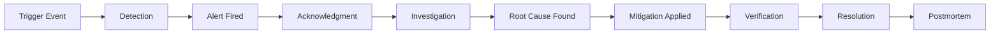
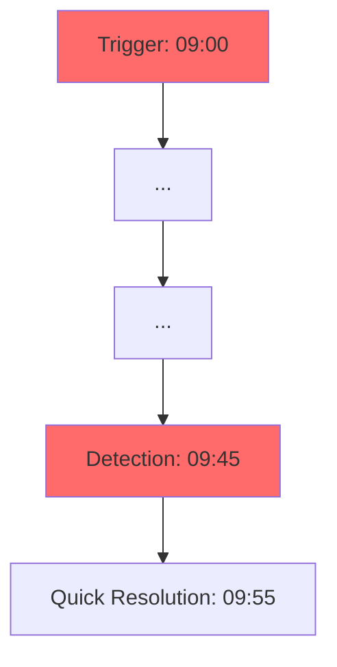
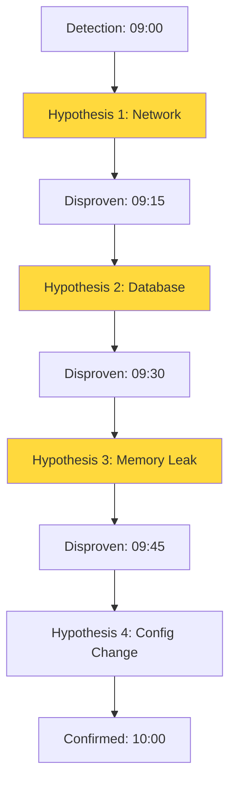
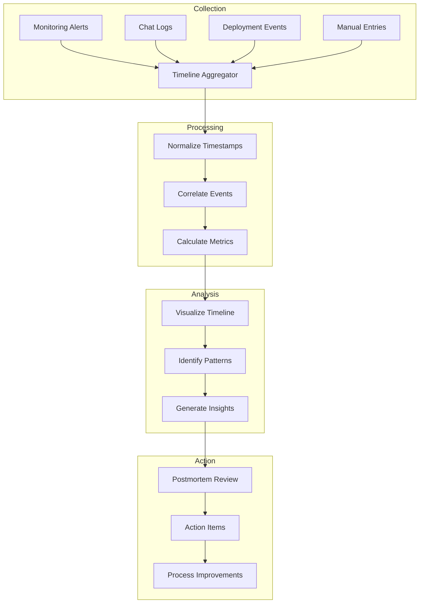

# How to Use Incident Timeline Analysis

Author: [nawazdhandala](https://www.github.com/nawazdhandala)

Tags: Incident Management, SRE, Timeline Analysis, Postmortems, Root Cause Analysis

Description: Learn how to construct and analyze incident timelines to identify root causes, improve response times, and prevent future incidents.

---

Every incident tells a story. The challenge is reconstructing that story accurately so you can learn from it. Incident timeline analysis is the practice of mapping out exactly what happened, when it happened, and who did what during an incident. When done well, it reveals patterns that lead to better incident response and system reliability.

## Why Timeline Analysis Matters

A timeline is more than a list of events. It is a diagnostic tool that helps teams:

- Identify the actual root cause versus symptoms
- Spot delays in detection and response
- Understand communication breakdowns
- Find opportunities for automation
- Build better runbooks for future incidents

Without a clear timeline, postmortems often devolve into guesswork and finger-pointing. With one, you have objective data to drive improvements.

## The Anatomy of an Incident Timeline

A good incident timeline captures several types of events:



Each phase should be documented with timestamps, actors, and context.

## Building an Incident Timeline

### Step 1: Collect Data from Multiple Sources

Your timeline data lives in many places. Pull from all of them:

```python
# Example: Aggregating timeline data from multiple sources

from datetime import datetime
from typing import List, Dict

class TimelineEvent:
    def __init__(self, timestamp: datetime, source: str,
                 event_type: str, description: str, actor: str = None):
        self.timestamp = timestamp
        self.source = source
        self.event_type = event_type
        self.description = description
        self.actor = actor

def collect_timeline_events() -> List[TimelineEvent]:
    events = []

    # Pull from monitoring system
    events.extend(get_alerts_from_monitoring())

    # Pull from incident management tool
    events.extend(get_incident_updates())

    # Pull from chat logs (Slack, Teams)
    events.extend(get_chat_messages())

    # Pull from deployment system
    events.extend(get_recent_deployments())

    # Pull from change management
    events.extend(get_config_changes())

    # Sort by timestamp
    events.sort(key=lambda e: e.timestamp)

    return events

def get_alerts_from_monitoring() -> List[TimelineEvent]:
    # Query your monitoring system API
    # Example with a generic monitoring client
    alerts = monitoring_client.query_alerts(
        start_time=incident_start - timedelta(hours=1),
        end_time=incident_end + timedelta(minutes=30)
    )

    return [
        TimelineEvent(
            timestamp=alert.fired_at,
            source="monitoring",
            event_type="alert",
            description=f"Alert: {alert.name} - {alert.severity}"
        )
        for alert in alerts
    ]
```

### Step 2: Normalize and Correlate Events

Events from different sources use different formats. Normalize them:

```python
# Timeline normalization and correlation

def normalize_timestamp(ts, source: str) -> datetime:
    """Convert various timestamp formats to UTC datetime"""
    if source == "slack":
        # Slack uses Unix epoch with microseconds
        return datetime.utcfromtimestamp(float(ts))
    elif source == "kubernetes":
        # K8s uses RFC3339
        return datetime.fromisoformat(ts.replace('Z', '+00:00'))
    elif source == "custom_app":
        # Your app might use a different format
        return datetime.strptime(ts, "%Y-%m-%d %H:%M:%S.%f")
    else:
        return datetime.fromisoformat(ts)

def correlate_events(events: List[TimelineEvent]) -> List[Dict]:
    """Group related events together"""
    correlated = []

    for event in events:
        # Find related events within a time window
        related = [
            e for e in events
            if e != event
            and abs((e.timestamp - event.timestamp).total_seconds()) < 60
            and is_related(event, e)
        ]

        correlated.append({
            "primary": event,
            "related": related,
            "correlation_id": generate_correlation_id(event, related)
        })

    return correlated

def is_related(event1: TimelineEvent, event2: TimelineEvent) -> bool:
    """Determine if two events are related"""
    # Check for common service names, error codes, or trace IDs
    common_identifiers = extract_identifiers(event1) & extract_identifiers(event2)
    return len(common_identifiers) > 0
```

### Step 3: Visualize the Timeline

A visual timeline makes patterns obvious. Here is how incidents typically flow:

```mermaid
gantt
    title Incident Timeline Example
    dateFormat HH:mm
    axisFormat %H:%M

    section Detection
    CPU spike begins           :crit, 09:15, 5m
    First alert fires          :09:20, 1m
    Alert acknowledged         :09:23, 1m

    section Investigation
    On-call joins bridge       :09:25, 2m
    Initial triage             :09:27, 8m
    Root cause identified      :09:35, 5m

    section Mitigation
    Rollback initiated         :09:40, 3m
    Service recovering         :09:43, 7m
    Full recovery confirmed    :09:50, 5m
```



### Step 4: Identify Key Metrics

Extract quantitative insights from your timeline:

```python
# Calculate incident metrics from timeline

def calculate_timeline_metrics(events: List[TimelineEvent]) -> Dict:
    """Extract key metrics from incident timeline"""

    # Find key events
    trigger = find_event_by_type(events, "trigger")
    detected = find_event_by_type(events, "alert")
    acknowledged = find_event_by_type(events, "acknowledgment")
    root_cause = find_event_by_type(events, "root_cause_identified")
    mitigated = find_event_by_type(events, "mitigation_applied")
    resolved = find_event_by_type(events, "resolution")

    metrics = {
        # Time to Detect: How long until we knew something was wrong?
        "ttd_seconds": (detected.timestamp - trigger.timestamp).total_seconds()
            if trigger and detected else None,

        # Time to Acknowledge: How long until a human engaged?
        "tta_seconds": (acknowledged.timestamp - detected.timestamp).total_seconds()
            if detected and acknowledged else None,

        # Time to Root Cause: How long to understand the problem?
        "ttrc_seconds": (root_cause.timestamp - acknowledged.timestamp).total_seconds()
            if acknowledged and root_cause else None,

        # Time to Mitigate: How long to stop the bleeding?
        "ttm_seconds": (mitigated.timestamp - root_cause.timestamp).total_seconds()
            if root_cause and mitigated else None,

        # Total incident duration
        "total_duration_seconds": (resolved.timestamp - trigger.timestamp).total_seconds()
            if trigger and resolved else None,

        # Number of people involved
        "responders": len(set(e.actor for e in events if e.actor)),

        # Number of communication events
        "communication_events": len([e for e in events if e.source in ["slack", "pagerduty"]])
    }

    return metrics
```

## Timeline Analysis Patterns

### Pattern 1: The Slow Detection

When there is a large gap between trigger and detection:



This indicates missing or misconfigured alerts. Action items:
- Add monitoring for the failure mode
- Review alert thresholds
- Consider synthetic monitoring

### Pattern 2: The Investigation Spiral

When the team struggles to find root cause:



This suggests:
- Observability gaps
- Missing runbooks
- Need for better service maps

### Pattern 3: The Communication Gap

When responders work in silos:

```python
# Detecting communication gaps in timeline

def find_communication_gaps(events: List[TimelineEvent]) -> List[Dict]:
    """Find periods where responders weren't coordinating"""
    gaps = []

    # Group events by actor
    by_actor = defaultdict(list)
    for event in events:
        if event.actor:
            by_actor[event.actor].append(event)

    # Find overlapping work without communication
    for actor1, events1 in by_actor.items():
        for actor2, events2 in by_actor.items():
            if actor1 >= actor2:
                continue

            # Check for parallel work periods
            for e1 in events1:
                for e2 in events2:
                    time_diff = abs((e1.timestamp - e2.timestamp).total_seconds())
                    if time_diff < 300:  # Within 5 minutes
                        # Were they communicating?
                        comms = [
                            e for e in events
                            if e.source == "slack"
                            and e.timestamp >= min(e1.timestamp, e2.timestamp)
                            and e.timestamp <= max(e1.timestamp, e2.timestamp)
                        ]
                        if not comms:
                            gaps.append({
                                "actors": [actor1, actor2],
                                "period_start": min(e1.timestamp, e2.timestamp),
                                "period_end": max(e1.timestamp, e2.timestamp),
                                "parallel_work": [e1.description, e2.description]
                            })

    return gaps
```

## Automating Timeline Collection

Manual timeline construction is tedious. Automate what you can:

```yaml
# Example: Automated timeline collection config

timeline_sources:
  - name: prometheus_alerts
    type: prometheus
    endpoint: http://prometheus:9090/api/v1/alerts
    fields:
      timestamp: activeAt
      description: annotations.summary
      severity: labels.severity

  - name: kubernetes_events
    type: kubernetes
    namespace: production
    fields:
      timestamp: lastTimestamp
      description: message
      component: involvedObject.name

  - name: slack_messages
    type: slack
    channels:
      - "#incidents"
      - "#on-call"
    fields:
      timestamp: ts
      description: text
      actor: user

  - name: github_deployments
    type: github
    repository: org/service
    fields:
      timestamp: created_at
      description: description
      actor: creator.login

correlation_rules:
  - name: deployment_correlation
    match:
      - source: github_deployments
      - source: kubernetes_events
        message_contains: "Scaled"
    window_seconds: 300

  - name: alert_to_incident
    match:
      - source: prometheus_alerts
      - source: slack_messages
        channel: "#incidents"
    window_seconds: 60
```

## Best Practices for Timeline Analysis

### 1. Start Collection Immediately

Begin documenting the timeline as soon as an incident starts. Assign a dedicated scribe if possible.

```python
# Incident scribe bot example

class IncidentScribe:
    def __init__(self, incident_id: str):
        self.incident_id = incident_id
        self.events = []
        self.start_time = datetime.utcnow()

    def log_event(self, description: str, actor: str = None,
                  source: str = "manual"):
        """Log an event to the timeline"""
        event = TimelineEvent(
            timestamp=datetime.utcnow(),
            source=source,
            event_type="manual_entry",
            description=description,
            actor=actor
        )
        self.events.append(event)

        # Also post to incident channel for visibility
        slack_client.post_message(
            channel=f"#inc-{self.incident_id}",
            text=f"[{event.timestamp.strftime('%H:%M:%S')}] {description}"
        )

    def export_timeline(self) -> str:
        """Export timeline as markdown for postmortem"""
        lines = ["## Incident Timeline\n"]

        for event in sorted(self.events, key=lambda e: e.timestamp):
            actor_str = f" ({event.actor})" if event.actor else ""
            lines.append(
                f"- **{event.timestamp.strftime('%H:%M:%S')}**: "
                f"{event.description}{actor_str}"
            )

        return "\n".join(lines)
```

### 2. Include Context, Not Just Events

Raw events without context are hard to interpret later:

```python
# Good vs bad timeline entries

# Bad: Missing context
bad_entry = "Restarted service"

# Good: Full context
good_entry = {
    "description": "Restarted payment-service pods",
    "reason": "Memory usage exceeded 90% threshold",
    "command": "kubectl rollout restart deployment/payment-service -n prod",
    "expected_outcome": "Clear memory leak, restore service",
    "actual_outcome": "Service recovered after 2 minute rolling restart"
}
```

### 3. Review Timelines in Postmortems

Walk through the timeline as a team. Ask these questions at each phase:

- Could we have detected this sooner?
- Did we have the right people involved?
- Were there unnecessary delays?
- What information was missing?
- Could any step be automated?

### 4. Track Timeline Metrics Over Time

Compare incidents to spot trends:

```python
# Track timeline metrics across incidents

def analyze_incident_trends(incidents: List[Dict]) -> Dict:
    """Analyze timeline metrics across multiple incidents"""

    metrics_over_time = defaultdict(list)

    for incident in incidents:
        timeline_metrics = calculate_timeline_metrics(incident["events"])
        incident_date = incident["start_time"].date()

        for metric_name, value in timeline_metrics.items():
            if value is not None:
                metrics_over_time[metric_name].append({
                    "date": incident_date,
                    "value": value,
                    "incident_id": incident["id"]
                })

    # Calculate trends
    trends = {}
    for metric_name, values in metrics_over_time.items():
        sorted_values = sorted(values, key=lambda v: v["date"])

        # Calculate 30-day moving average
        recent = [v["value"] for v in sorted_values[-10:]]
        older = [v["value"] for v in sorted_values[-20:-10]]

        if recent and older:
            trends[metric_name] = {
                "current_avg": sum(recent) / len(recent),
                "previous_avg": sum(older) / len(older),
                "trend": "improving" if sum(recent)/len(recent) < sum(older)/len(older) else "degrading"
            }

    return trends
```

## Timeline Analysis Flow

Here is the complete flow for incident timeline analysis:



---

Incident timeline analysis transforms chaotic incident data into actionable insights. By systematically collecting, correlating, and analyzing timeline events, you can identify exactly where your incident response needs improvement. Start with manual timelines, then gradually automate collection and analysis. The patterns you discover will drive meaningful improvements to your reliability posture over time.
