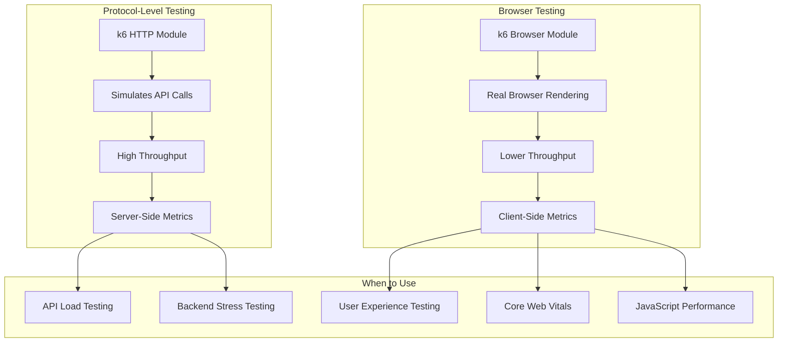
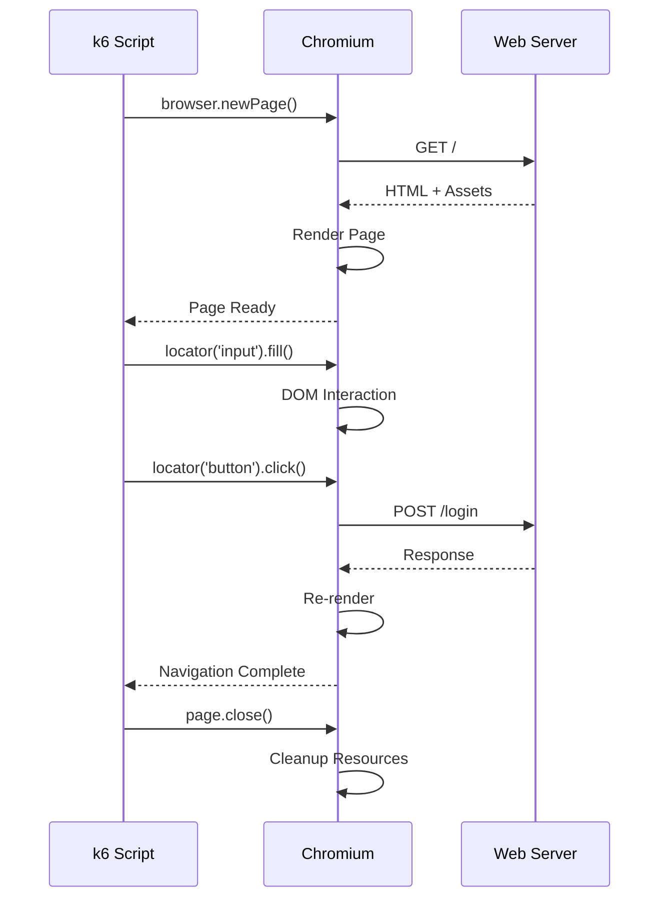

# How to Implement k6 Browser Testing

Author: [nawazdhandala](https://www.github.com/nawazdhandala)

Tags: k6, Browser Testing, Performance Testing, Web Vitals, End-to-End Testing

Description: Learn how to use k6 browser module to run real browser tests that measure Core Web Vitals and user experience metrics.

---

k6 browser module brings real browser automation to your load testing toolkit. Unlike protocol-level tests that simulate HTTP requests, browser tests render pages, execute JavaScript, and measure what users actually experience. This guide walks through practical implementations for performance testing with real browsers.

## Protocol Testing vs Browser Testing

Understanding when to use each approach is critical for effective performance testing.



| Aspect | Protocol Testing | Browser Testing |
|--------|-----------------|-----------------|
| Speed | Thousands of VUs | Tens of VUs |
| Resources | Low memory | High memory |
| Metrics | Server response time | Page load, Web Vitals |
| JavaScript | Not executed | Fully executed |
| CSS/Rendering | Skipped | Full rendering |

## Setting Up k6 Browser

The browser module is included in k6 but requires Chrome or Chromium.

### Installation

```bash
# macOS
brew install k6

# Linux (Debian/Ubuntu)
sudo gpg -k
sudo gpg --no-default-keyring --keyring /usr/share/keyrings/k6-archive-keyring.gpg --keyserver hkp://keyserver.ubuntu.com:80 --recv-keys C5AD17C747E3415A3642D57D77C6C491D6AC1D69
echo "deb [signed-by=/usr/share/keyrings/k6-archive-keyring.gpg] https://dl.k6.io/deb stable main" | sudo tee /etc/apt/sources.list.d/k6.list
sudo apt-get update
sudo apt-get install k6

# Install Chrome/Chromium for browser tests
# Chrome is usually already installed, or:
sudo apt-get install chromium-browser
```

### Basic Browser Test

```javascript
// browser-basic.js
import { browser } from 'k6/browser';
import { check } from 'k6';

export const options = {
  scenarios: {
    browser_test: {
      executor: 'shared-iterations',
      vus: 1,
      iterations: 1,
      options: {
        browser: {
          type: 'chromium',
        },
      },
    },
  },
};

export default async function () {
  // Launch a new browser page
  const page = await browser.newPage();

  try {
    // Navigate to the target URL
    await page.goto('https://example.com');

    // Wait for the page to be fully loaded
    await page.waitForLoadState('networkidle');

    // Check page title
    const title = await page.title();
    check(title, {
      'page title is correct': (t) => t.includes('Example'),
    });

    // Take a screenshot for debugging
    await page.screenshot({ path: 'screenshot.png' });

  } finally {
    // Always close the page to free resources
    await page.close();
  }
}
```

Run the test:

```bash
k6 run browser-basic.js
```

## Measuring Core Web Vitals

Core Web Vitals are Google's metrics for user experience. k6 browser can capture all of them.

```javascript
// web-vitals.js
import { browser } from 'k6/browser';
import { check } from 'k6';
import { Trend } from 'k6/metrics';

// Custom metrics for Web Vitals
const lcpMetric = new Trend('web_vital_lcp');
const fidMetric = new Trend('web_vital_fid');
const clsMetric = new Trend('web_vital_cls');
const ttfbMetric = new Trend('web_vital_ttfb');
const fcpMetric = new Trend('web_vital_fcp');

export const options = {
  scenarios: {
    web_vitals: {
      executor: 'constant-vus',
      vus: 2,
      duration: '5m',
      options: {
        browser: {
          type: 'chromium',
        },
      },
    },
  },
  thresholds: {
    'web_vital_lcp': ['p(75)<2500'],   // LCP should be under 2.5s
    'web_vital_fid': ['p(75)<100'],    // FID should be under 100ms
    'web_vital_cls': ['p(75)<0.1'],    // CLS should be under 0.1
  },
};

export default async function () {
  const page = await browser.newPage();

  try {
    // Navigate and wait for load
    await page.goto('https://example.com');
    await page.waitForLoadState('networkidle');

    // Extract performance metrics using Performance API
    const performanceMetrics = await page.evaluate(() => {
      return new Promise((resolve) => {
        // Wait a bit for LCP to stabilize
        setTimeout(() => {
          const navigation = performance.getEntriesByType('navigation')[0];
          const paint = performance.getEntriesByType('paint');

          // Get LCP
          let lcp = 0;
          const lcpEntries = performance.getEntriesByType('largest-contentful-paint');
          if (lcpEntries.length > 0) {
            lcp = lcpEntries[lcpEntries.length - 1].startTime;
          }

          // Get FCP
          let fcp = 0;
          const fcpEntry = paint.find(e => e.name === 'first-contentful-paint');
          if (fcpEntry) {
            fcp = fcpEntry.startTime;
          }

          // Get CLS (simplified - real implementation needs PerformanceObserver)
          let cls = 0;
          const layoutShifts = performance.getEntriesByType('layout-shift');
          layoutShifts.forEach(entry => {
            if (!entry.hadRecentInput) {
              cls += entry.value;
            }
          });

          resolve({
            ttfb: navigation.responseStart - navigation.requestStart,
            fcp: fcp,
            lcp: lcp,
            cls: cls,
          });
        }, 3000);
      });
    });

    // Record metrics
    ttfbMetric.add(performanceMetrics.ttfb);
    fcpMetric.add(performanceMetrics.fcp);
    lcpMetric.add(performanceMetrics.lcp);
    clsMetric.add(performanceMetrics.cls);

    console.log(`TTFB: ${performanceMetrics.ttfb}ms`);
    console.log(`FCP: ${performanceMetrics.fcp}ms`);
    console.log(`LCP: ${performanceMetrics.lcp}ms`);
    console.log(`CLS: ${performanceMetrics.cls}`);

    check(performanceMetrics, {
      'LCP under 2.5s': (m) => m.lcp < 2500,
      'FCP under 1.8s': (m) => m.fcp < 1800,
      'CLS under 0.1': (m) => m.cls < 0.1,
    });

  } finally {
    await page.close();
  }
}
```

## User Flow Testing

Test complete user journeys through your application.

```javascript
// user-flow.js
import { browser } from 'k6/browser';
import { check, sleep } from 'k6';
import { Trend } from 'k6/metrics';

const loginDuration = new Trend('login_duration_ms');
const searchDuration = new Trend('search_duration_ms');
const checkoutDuration = new Trend('checkout_duration_ms');

export const options = {
  scenarios: {
    user_journey: {
      executor: 'ramping-vus',
      startVUs: 0,
      stages: [
        { duration: '2m', target: 5 },
        { duration: '5m', target: 5 },
        { duration: '2m', target: 0 },
      ],
      options: {
        browser: {
          type: 'chromium',
        },
      },
    },
  },
};

export default async function () {
  const page = await browser.newPage();

  try {
    // Step 1: Visit homepage
    await page.goto('https://shop.example.com');
    await page.waitForLoadState('domcontentloaded');

    // Step 2: Login
    const loginStart = Date.now();

    await page.locator('a[href="/login"]').click();
    await page.waitForSelector('input[name="email"]');

    await page.locator('input[name="email"]').fill('test@example.com');
    await page.locator('input[name="password"]').fill('password123');
    await page.locator('button[type="submit"]').click();

    // Wait for login to complete
    await page.waitForSelector('[data-testid="user-menu"]');

    loginDuration.add(Date.now() - loginStart);

    check(page, {
      'login successful': async (p) => {
        const userMenu = await p.locator('[data-testid="user-menu"]').isVisible();
        return userMenu;
      },
    });

    // Step 3: Search for product
    const searchStart = Date.now();

    await page.locator('input[name="search"]').fill('laptop');
    await page.locator('button[type="submit"][aria-label="Search"]').click();
    await page.waitForSelector('[data-testid="search-results"]');

    searchDuration.add(Date.now() - searchStart);

    // Step 4: Add to cart
    await page.locator('[data-testid="product-card"]:first-child button').click();
    await page.waitForSelector('[data-testid="cart-count"]:has-text("1")');

    // Step 5: Checkout
    const checkoutStart = Date.now();

    await page.locator('[data-testid="cart-icon"]').click();
    await page.waitForSelector('[data-testid="cart-drawer"]');
    await page.locator('button:has-text("Checkout")').click();

    await page.waitForSelector('[data-testid="checkout-form"]');

    checkoutDuration.add(Date.now() - checkoutStart);

    check(page, {
      'checkout page loaded': async (p) => {
        const form = await p.locator('[data-testid="checkout-form"]').isVisible();
        return form;
      },
    });

    // Simulate user reading the page
    sleep(2);

  } finally {
    await page.close();
  }
}
```

## Test Execution Flow

Here is how a browser test progresses through user interactions:



## Handling Authentication

Persist login state across iterations to test authenticated user flows.

```javascript
// authenticated-flow.js
import { browser } from 'k6/browser';
import { check } from 'k6';

export const options = {
  scenarios: {
    authenticated: {
      executor: 'per-vu-iterations',
      vus: 3,
      iterations: 10,
      options: {
        browser: {
          type: 'chromium',
        },
      },
    },
  },
};

export async function setup() {
  // Perform login once and save browser context
  const page = await browser.newPage();

  await page.goto('https://app.example.com/login');
  await page.locator('#email').fill('test@example.com');
  await page.locator('#password').fill('password123');
  await page.locator('button[type="submit"]').click();

  // Wait for login to complete
  await page.waitForSelector('[data-testid="dashboard"]');

  // Export cookies/storage state
  const cookies = await page.context().cookies();

  await page.close();

  return { cookies };
}

export default async function (data) {
  const context = await browser.newContext();

  // Restore authentication state
  await context.addCookies(data.cookies);

  const page = await context.newPage();

  try {
    // Already authenticated - go directly to protected page
    await page.goto('https://app.example.com/dashboard');
    await page.waitForLoadState('networkidle');

    check(page, {
      'dashboard loaded': async (p) => {
        const dashboard = await p.locator('[data-testid="dashboard"]').isVisible();
        return dashboard;
      },
    });

    // Perform authenticated actions
    await page.locator('[data-testid="create-report"]').click();
    await page.waitForSelector('[data-testid="report-form"]');

  } finally {
    await page.close();
    await context.close();
  }
}
```

## Combining Browser and Protocol Tests

Run browser tests alongside high-volume protocol tests.

```javascript
// hybrid-test.js
import { browser } from 'k6/browser';
import http from 'k6/http';
import { check, sleep } from 'k6';

export const options = {
  scenarios: {
    // High volume API testing
    api_load: {
      executor: 'constant-arrival-rate',
      rate: 100,
      timeUnit: '1s',
      duration: '10m',
      preAllocatedVUs: 50,
      maxVUs: 200,
      exec: 'apiTest',
    },

    // Low volume browser testing for UX metrics
    browser_ux: {
      executor: 'constant-vus',
      vus: 3,
      duration: '10m',
      exec: 'browserTest',
      options: {
        browser: {
          type: 'chromium',
        },
      },
    },
  },
};

// Protocol-level API test
export function apiTest() {
  const response = http.get('https://api.example.com/products');

  check(response, {
    'api status 200': (r) => r.status === 200,
    'api response time OK': (r) => r.timings.duration < 200,
  });

  sleep(0.1);
}

// Browser-level UX test
export async function browserTest() {
  const page = await browser.newPage();

  try {
    const startTime = Date.now();

    await page.goto('https://shop.example.com/products');
    await page.waitForSelector('[data-testid="product-grid"]');

    const loadTime = Date.now() - startTime;

    check(loadTime, {
      'page loads under 3s': (t) => t < 3000,
    });

    // Interact with the page
    await page.locator('[data-testid="product-card"]:first-child').click();
    await page.waitForSelector('[data-testid="product-detail"]');

  } finally {
    await page.close();
  }

  sleep(5);  // Longer think time for browser tests
}
```

## Network Throttling

Simulate various network conditions to test real-world performance.

```javascript
// network-conditions.js
import { browser } from 'k6/browser';
import { Trend } from 'k6/metrics';

const pageLoadTime = new Trend('page_load_time_ms');

// Network condition presets
const networkConditions = {
  fast3G: {
    downloadThroughput: 1.5 * 1024 * 1024 / 8,  // 1.5 Mbps
    uploadThroughput: 750 * 1024 / 8,            // 750 Kbps
    latency: 100,
  },
  slow3G: {
    downloadThroughput: 500 * 1024 / 8,          // 500 Kbps
    uploadThroughput: 250 * 1024 / 8,            // 250 Kbps
    latency: 300,
  },
  offline: {
    offline: true,
  },
};

export const options = {
  scenarios: {
    throttled_test: {
      executor: 'shared-iterations',
      vus: 1,
      iterations: 3,
      options: {
        browser: {
          type: 'chromium',
        },
      },
    },
  },
};

export default async function () {
  const context = await browser.newContext();
  const page = await context.newPage();

  try {
    // Apply network throttling
    const cdp = await context.newCDPSession(page);
    await cdp.send('Network.emulateNetworkConditions', networkConditions.fast3G);

    const startTime = Date.now();

    await page.goto('https://example.com');
    await page.waitForLoadState('networkidle');

    const loadTime = Date.now() - startTime;
    pageLoadTime.add(loadTime);

    console.log(`Page loaded in ${loadTime}ms on throttled connection`);

  } finally {
    await page.close();
    await context.close();
  }
}
```

## Headless vs Headed Mode

Control browser visibility for debugging.

```javascript
// browser-modes.js
import { browser } from 'k6/browser';

export const options = {
  scenarios: {
    headed_debug: {
      executor: 'shared-iterations',
      vus: 1,
      iterations: 1,
      options: {
        browser: {
          type: 'chromium',
          // Run with visible browser for debugging
          headless: __ENV.HEADLESS !== 'false',
        },
      },
    },
  },
};

export default async function () {
  const page = await browser.newPage();

  try {
    await page.goto('https://example.com');

    // Take screenshot for verification
    await page.screenshot({
      path: `screenshots/test-${Date.now()}.png`,
      fullPage: true,
    });

    // In headed mode, pause to observe
    if (__ENV.DEBUG === 'true') {
      await page.waitForTimeout(10000);
    }

  } finally {
    await page.close();
  }
}
```

Run in different modes:

```bash
# Headless (default, for CI)
k6 run browser-modes.js

# Headed for debugging
k6 run -e HEADLESS=false -e DEBUG=true browser-modes.js
```

## Resource Usage Considerations

Browser tests consume significantly more resources than protocol tests.

```javascript
// resource-aware.js
import { browser } from 'k6/browser';
import { check } from 'k6';

export const options = {
  scenarios: {
    browser_test: {
      executor: 'ramping-vus',
      startVUs: 0,
      stages: [
        // Slow ramp to avoid overwhelming the system
        { duration: '2m', target: 5 },
        { duration: '5m', target: 5 },
        { duration: '1m', target: 0 },
      ],
      // Limit max concurrent browsers
      maxVUs: 10,
      options: {
        browser: {
          type: 'chromium',
          // Reduce resource usage
          args: [
            '--disable-gpu',
            '--disable-dev-shm-usage',
            '--disable-extensions',
            '--no-sandbox',
            '--disable-setuid-sandbox',
          ],
        },
      },
    },
  },
};

export default async function () {
  // Create context with minimal resources
  const context = await browser.newContext({
    // Disable images to speed up loading
    // images: 'disabled',

    // Set viewport
    viewport: { width: 1280, height: 720 },

    // Disable JavaScript if not needed
    // javaScriptEnabled: false,
  });

  const page = await context.newPage();

  try {
    await page.goto('https://example.com');
    await page.waitForLoadState('domcontentloaded');

    // Quick check and close
    const title = await page.title();
    check(title, {
      'page loaded': (t) => t.length > 0,
    });

  } finally {
    // Clean up resources immediately
    await page.close();
    await context.close();
  }
}
```

---

k6 browser testing bridges the gap between load testing and real user experience measurement. While protocol tests tell you how fast your servers respond, browser tests reveal what users actually see. Use browser tests for critical user journeys, Core Web Vitals measurement, and JavaScript-heavy applications. Keep virtual user counts low, focus on key flows, and combine with protocol tests for comprehensive performance coverage.
