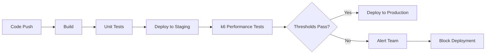
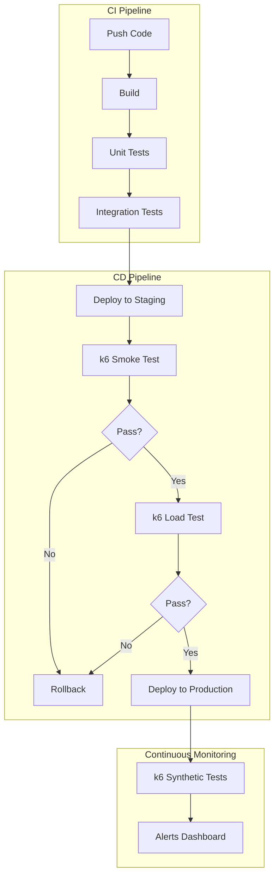

# How to Configure k6 for CI/CD

Author: [nawazdhandala](https://www.github.com/nawazdhandala)

Tags: k6, CI/CD, GitHub Actions, GitLab CI, Performance Testing, DevOps

Description: Learn how to integrate k6 load tests into your CI/CD pipeline with practical examples for GitHub Actions, GitLab CI, and Jenkins.

---

Running k6 tests in CI/CD pipelines catches performance regressions before they reach production. This guide covers practical configurations for major CI platforms, threshold-based quality gates, and patterns for managing test scripts across environments.

## Why Run Performance Tests in CI/CD

Performance testing in CI/CD provides several benefits:

- Catch regressions early when fixes are cheaper
- Establish performance baselines for every build
- Automate performance validation without manual intervention
- Block deployments that fail performance criteria



## Structuring k6 Tests for CI/CD

Organize your test scripts for maintainability and reuse across environments.

```
project/
├── k6/
│   ├── scripts/
│   │   ├── smoke.js          # Quick validation
│   │   ├── load.js           # Standard load test
│   │   ├── stress.js         # Breaking point test
│   │   └── soak.js           # Endurance test
│   ├── lib/
│   │   ├── helpers.js        # Shared utilities
│   │   └── endpoints.js      # API endpoint definitions
│   ├── data/
│   │   └── users.json        # Test data
│   └── config/
│       ├── thresholds.js     # Shared threshold definitions
│       └── environments.js   # Environment-specific configs
└── .github/
    └── workflows/
        └── performance.yml   # CI workflow
```

### Base Test Configuration

Create a reusable configuration module:

```javascript
// k6/config/thresholds.js
export const standardThresholds = {
  http_req_duration: ['p(95)<500', 'p(99)<1000'],
  http_req_failed: ['rate<0.01'],     // Less than 1% errors
  http_reqs: ['rate>100'],            // At least 100 req/s
};

export const strictThresholds = {
  http_req_duration: ['p(95)<200', 'p(99)<400'],
  http_req_failed: ['rate<0.001'],    // Less than 0.1% errors
};
```

```javascript
// k6/scripts/smoke.js
import http from 'k6/http';
import { check, sleep } from 'k6';
import { standardThresholds } from '../config/thresholds.js';

// Smoke test runs quickly to validate basic functionality
export const options = {
  vus: 5,
  duration: '1m',
  thresholds: standardThresholds,
};

const BASE_URL = __ENV.BASE_URL || 'http://localhost:3000';

export default function () {
  // Test critical endpoints
  const endpoints = [
    '/health',
    '/api/v1/status',
    '/api/v1/products',
  ];

  for (const endpoint of endpoints) {
    const response = http.get(`${BASE_URL}${endpoint}`);
    check(response, {
      [`${endpoint} returns 200`]: (r) => r.status === 200,
      [`${endpoint} response time OK`]: (r) => r.timings.duration < 500,
    });
  }

  sleep(1);
}
```

## GitHub Actions Configuration

### Basic Workflow

```yaml
# .github/workflows/performance.yml
name: Performance Tests

on:
  push:
    branches: [main, develop]
  pull_request:
    branches: [main]
  # Allow manual triggers with custom parameters
  workflow_dispatch:
    inputs:
      test_type:
        description: 'Test type to run'
        required: true
        default: 'smoke'
        type: choice
        options:
          - smoke
          - load
          - stress

jobs:
  smoke-test:
    runs-on: ubuntu-latest
    steps:
      - name: Checkout code
        uses: actions/checkout@v4

      - name: Install k6
        run: |
          sudo gpg -k
          sudo gpg --no-default-keyring --keyring /usr/share/keyrings/k6-archive-keyring.gpg --keyserver hkp://keyserver.ubuntu.com:80 --recv-keys C5AD17C747E3415A3642D57D77C6C491D6AC1D69
          echo "deb [signed-by=/usr/share/keyrings/k6-archive-keyring.gpg] https://dl.k6.io/deb stable main" | sudo tee /etc/apt/sources.list.d/k6.list
          sudo apt-get update
          sudo apt-get install k6

      - name: Run smoke test
        run: k6 run k6/scripts/smoke.js
        env:
          BASE_URL: ${{ secrets.STAGING_URL }}

      - name: Upload results
        if: always()
        uses: actions/upload-artifact@v4
        with:
          name: k6-results
          path: k6-results/

  load-test:
    runs-on: ubuntu-latest
    needs: smoke-test
    if: github.ref == 'refs/heads/main'
    steps:
      - name: Checkout code
        uses: actions/checkout@v4

      - name: Install k6
        run: |
          sudo gpg -k
          sudo gpg --no-default-keyring --keyring /usr/share/keyrings/k6-archive-keyring.gpg --keyserver hkp://keyserver.ubuntu.com:80 --recv-keys C5AD17C747E3415A3642D57D77C6C491D6AC1D69
          echo "deb [signed-by=/usr/share/keyrings/k6-archive-keyring.gpg] https://dl.k6.io/deb stable main" | sudo tee /etc/apt/sources.list.d/k6.list
          sudo apt-get update
          sudo apt-get install k6

      - name: Run load test
        run: k6 run k6/scripts/load.js --out json=k6-results/results.json
        env:
          BASE_URL: ${{ secrets.STAGING_URL }}
```

### Using the Official k6 Action

```yaml
name: k6 Load Test

on: [push]

jobs:
  k6-test:
    runs-on: ubuntu-latest
    steps:
      - name: Checkout
        uses: actions/checkout@v4

      - name: Run k6 test
        uses: grafana/k6-action@v0.3.1
        with:
          filename: k6/scripts/load.js
          flags: --out json=results.json
        env:
          BASE_URL: https://staging.example.com
```

### Matrix Testing Across Environments

```yaml
name: Multi-Environment Performance Tests

on:
  schedule:
    - cron: '0 6 * * *'  # Daily at 6 AM UTC

jobs:
  performance-matrix:
    runs-on: ubuntu-latest
    strategy:
      matrix:
        environment: [staging, production]
        test: [smoke, load]
      fail-fast: false

    steps:
      - uses: actions/checkout@v4

      - name: Run k6 test
        uses: grafana/k6-action@v0.3.1
        with:
          filename: k6/scripts/${{ matrix.test }}.js
        env:
          BASE_URL: ${{ matrix.environment == 'staging' && secrets.STAGING_URL || secrets.PRODUCTION_URL }}
          ENVIRONMENT: ${{ matrix.environment }}
```

## GitLab CI Configuration

```yaml
# .gitlab-ci.yml
stages:
  - build
  - test
  - performance
  - deploy

variables:
  K6_VERSION: "0.49.0"

# Cache k6 binary across jobs
.k6-setup: &k6-setup
  before_script:
    - |
      if [ ! -f /usr/local/bin/k6 ]; then
        wget -q https://github.com/grafana/k6/releases/download/v${K6_VERSION}/k6-v${K6_VERSION}-linux-amd64.tar.gz
        tar -xzf k6-v${K6_VERSION}-linux-amd64.tar.gz
        mv k6-v${K6_VERSION}-linux-amd64/k6 /usr/local/bin/
      fi

smoke-test:
  stage: performance
  <<: *k6-setup
  script:
    - k6 run --out json=smoke-results.json k6/scripts/smoke.js
  artifacts:
    paths:
      - smoke-results.json
    when: always
  variables:
    BASE_URL: $STAGING_URL
  rules:
    - if: $CI_PIPELINE_SOURCE == "merge_request_event"
    - if: $CI_COMMIT_BRANCH == "main"

load-test:
  stage: performance
  <<: *k6-setup
  script:
    - k6 run --out json=load-results.json k6/scripts/load.js
  artifacts:
    paths:
      - load-results.json
    reports:
      performance: load-results.json
    when: always
  variables:
    BASE_URL: $STAGING_URL
  rules:
    - if: $CI_COMMIT_BRANCH == "main"
  needs:
    - smoke-test

# Performance gate - blocks deploy if thresholds fail
performance-gate:
  stage: performance
  <<: *k6-setup
  script:
    - |
      k6 run k6/scripts/load.js
      if [ $? -ne 0 ]; then
        echo "Performance thresholds failed - blocking deployment"
        exit 1
      fi
  rules:
    - if: $CI_COMMIT_BRANCH == "main"
  needs:
    - smoke-test
```

## Jenkins Pipeline Configuration

```groovy
// Jenkinsfile
pipeline {
    agent any

    environment {
        K6_VERSION = '0.49.0'
        BASE_URL = credentials('staging-url')
    }

    stages {
        stage('Install k6') {
            steps {
                sh '''
                    if ! command -v k6 &> /dev/null; then
                        wget -q https://github.com/grafana/k6/releases/download/v${K6_VERSION}/k6-v${K6_VERSION}-linux-amd64.tar.gz
                        tar -xzf k6-v${K6_VERSION}-linux-amd64.tar.gz
                        sudo mv k6-v${K6_VERSION}-linux-amd64/k6 /usr/local/bin/
                    fi
                '''
            }
        }

        stage('Smoke Test') {
            steps {
                sh 'k6 run k6/scripts/smoke.js --out json=smoke-results.json'
            }
            post {
                always {
                    archiveArtifacts artifacts: 'smoke-results.json', fingerprint: true
                }
            }
        }

        stage('Load Test') {
            when {
                branch 'main'
            }
            steps {
                sh 'k6 run k6/scripts/load.js --out json=load-results.json'
            }
            post {
                always {
                    archiveArtifacts artifacts: 'load-results.json', fingerprint: true
                    // Parse and display results
                    script {
                        def results = readJSON file: 'load-results.json'
                        echo "Test completed with ${results.metrics.http_reqs.count} requests"
                    }
                }
            }
        }

        stage('Performance Gate') {
            when {
                branch 'main'
            }
            steps {
                script {
                    def exitCode = sh(
                        script: 'k6 run k6/scripts/load.js --quiet',
                        returnStatus: true
                    )
                    if (exitCode != 0) {
                        error('Performance thresholds failed - blocking deployment')
                    }
                }
            }
        }
    }

    post {
        failure {
            slackSend(
                color: 'danger',
                message: "Performance test failed: ${env.JOB_NAME} #${env.BUILD_NUMBER}"
            )
        }
    }
}
```

## CI/CD Pipeline Architecture

Here is how k6 fits into a complete deployment pipeline:



## Threshold-Based Quality Gates

Configure thresholds that fail the pipeline when performance degrades:

```javascript
// k6/scripts/load.js
import http from 'k6/http';
import { check } from 'k6';

export const options = {
  scenarios: {
    load_test: {
      executor: 'ramping-vus',
      startVUs: 0,
      stages: [
        { duration: '2m', target: 50 },
        { duration: '5m', target: 50 },
        { duration: '2m', target: 0 },
      ],
    },
  },
  thresholds: {
    // These thresholds will cause k6 to exit with code 99 if failed
    http_req_duration: [
      { threshold: 'p(95)<500', abortOnFail: true, delayAbortEval: '30s' },
      { threshold: 'p(99)<1000', abortOnFail: false },
    ],
    http_req_failed: [
      { threshold: 'rate<0.01', abortOnFail: true },
    ],
    checks: [
      { threshold: 'rate>0.99', abortOnFail: true },
    ],
  },
};

export default function () {
  const response = http.get(`${__ENV.BASE_URL}/api/products`);

  check(response, {
    'status is 200': (r) => r.status === 200,
    'response time under 500ms': (r) => r.timings.duration < 500,
    'body contains products': (r) => r.body.includes('products'),
  });
}
```

## Environment-Specific Configuration

Pass environment configuration through CI variables:

```javascript
// k6/scripts/configurable.js
import http from 'k6/http';
import { check, sleep } from 'k6';

// Read configuration from environment
const config = {
  baseUrl: __ENV.BASE_URL || 'http://localhost:3000',
  vus: parseInt(__ENV.VUS) || 10,
  duration: __ENV.DURATION || '5m',
  thresholdP95: parseInt(__ENV.THRESHOLD_P95) || 500,
};

export const options = {
  vus: config.vus,
  duration: config.duration,
  thresholds: {
    http_req_duration: [`p(95)<${config.thresholdP95}`],
  },
};

export default function () {
  const response = http.get(`${config.baseUrl}/api/health`);
  check(response, {
    'healthy': (r) => r.status === 200,
  });
  sleep(1);
}
```

```yaml
# GitHub Actions usage
- name: Run configurable test
  run: k6 run k6/scripts/configurable.js
  env:
    BASE_URL: https://staging.example.com
    VUS: 50
    DURATION: 10m
    THRESHOLD_P95: 300
```

## Handling Test Data and Secrets

Never commit secrets to your repository. Use CI/CD secret management:

```javascript
// k6/scripts/authenticated.js
import http from 'k6/http';
import { check } from 'k6';

export const options = {
  vus: 20,
  duration: '5m',
};

// API key from CI secret
const API_KEY = __ENV.API_KEY;

export default function () {
  const response = http.get(`${__ENV.BASE_URL}/api/protected`, {
    headers: {
      'Authorization': `Bearer ${API_KEY}`,
      'Content-Type': 'application/json',
    },
  });

  check(response, {
    'authenticated request succeeds': (r) => r.status === 200,
  });
}
```

```yaml
# GitHub Actions - use secrets
- name: Run authenticated test
  run: k6 run k6/scripts/authenticated.js
  env:
    BASE_URL: ${{ secrets.STAGING_URL }}
    API_KEY: ${{ secrets.TEST_API_KEY }}
```

## Caching and Optimization

Speed up CI runs by caching the k6 binary:

```yaml
# GitHub Actions with caching
jobs:
  performance:
    runs-on: ubuntu-latest
    steps:
      - uses: actions/checkout@v4

      - name: Cache k6 binary
        uses: actions/cache@v4
        with:
          path: ~/.k6
          key: k6-${{ runner.os }}-v0.49.0

      - name: Install k6
        run: |
          if [ ! -f ~/.k6/k6 ]; then
            mkdir -p ~/.k6
            wget -q https://github.com/grafana/k6/releases/download/v0.49.0/k6-v0.49.0-linux-amd64.tar.gz
            tar -xzf k6-v0.49.0-linux-amd64.tar.gz
            mv k6-v0.49.0-linux-amd64/k6 ~/.k6/
          fi
          echo "$HOME/.k6" >> $GITHUB_PATH
```

## Reporting Test Results

Generate JUnit-compatible reports for CI integration:

```bash
# Install xk6-junit extension or use built-in JSON output
k6 run script.js --out json=results.json

# Convert to JUnit format using jq or custom script
```

```yaml
# GitLab CI with test reports
load-test:
  script:
    - k6 run --out json=results.json k6/scripts/load.js
    - node scripts/convert-to-junit.js results.json junit.xml
  artifacts:
    reports:
      junit: junit.xml
```

---

Integrating k6 into your CI/CD pipeline establishes performance testing as a first-class citizen in your deployment process. Start with smoke tests on every pull request, graduate to load tests on main branch merges, and use threshold-based gates to prevent performance regressions from reaching production. The investment in automation pays dividends through faster feedback and fewer production incidents.
