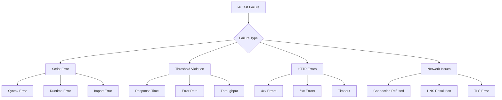
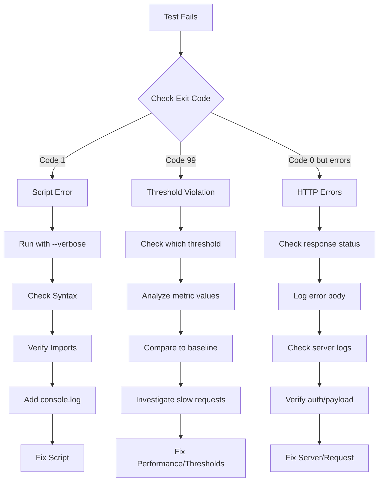

# How to Debug k6 Test Failures

Author: [nawazdhandala](https://www.github.com/nawazdhandala)

Tags: k6, Debugging, Troubleshooting, Performance Testing, DevOps

Description: Learn systematic approaches to diagnose and fix k6 test failures, from script errors to threshold violations and unexpected server behavior.

---

k6 tests fail for many reasons: script bugs, network issues, server errors, or genuine performance regressions. This guide provides systematic approaches to identify the root cause and fix the problem efficiently.

## Types of k6 Failures



## Debugging Script Errors

### Syntax Errors

k6 uses JavaScript ES6 syntax. Common mistakes include:

```javascript
// Bad: CommonJS require (not supported)
const http = require('k6/http');

// Good: ES6 import
import http from 'k6/http';

// Bad: Missing export
function defaultFunction() {
  http.get('https://api.example.com');
}

// Good: Named export
export default function () {
  http.get('https://api.example.com');
}

// Bad: Async without await in browser tests
export default function () {
  const page = browser.newPage();  // Missing await
}

// Good: Proper async/await
export default async function () {
  const page = await browser.newPage();
}
```

### Runtime Errors

Use `console.log` and `--verbose` flag to trace execution:

```javascript
// debug-script.js
import http from 'k6/http';
import { check } from 'k6';

export const options = {
  vus: 1,
  iterations: 1,
};

export default function () {
  console.log(`Starting iteration ${__ITER} for VU ${__VU}`);

  const payload = JSON.stringify({
    user: 'test',
    timestamp: Date.now(),
  });

  console.log(`Request payload: ${payload}`);

  const response = http.post('https://api.example.com/data', payload, {
    headers: { 'Content-Type': 'application/json' },
  });

  console.log(`Response status: ${response.status}`);
  console.log(`Response body: ${response.body.substring(0, 500)}`);

  // Debug check failures
  const checkResult = check(response, {
    'status is 200': (r) => {
      const result = r.status === 200;
      if (!result) {
        console.log(`Check failed: expected 200, got ${r.status}`);
      }
      return result;
    },
  });

  console.log(`Check passed: ${checkResult}`);
}
```

Run with verbose output:

```bash
k6 run --verbose debug-script.js
```

### Import Errors

Verify file paths and module availability:

```javascript
// Check if custom modules exist
// File structure:
// project/
// ├── scripts/
// │   └── test.js
// └── lib/
//     └── helpers.js

// In test.js - relative paths from script location
import { helper } from '../lib/helpers.js';  // Correct
import { helper } from './lib/helpers.js';    // Wrong path

// For remote modules, check URL accessibility
import { htmlReport } from 'https://raw.githubusercontent.com/benc-uk/k6-reporter/main/dist/bundle.js';
```

## Debugging Threshold Violations

When thresholds fail, the exit code is non-zero. Identify which metrics failed:

```javascript
// threshold-debug.js
import http from 'k6/http';

export const options = {
  vus: 50,
  duration: '5m',
  thresholds: {
    http_req_duration: ['p(95)<200'],
    http_req_failed: ['rate<0.01'],
    http_reqs: ['rate>100'],
  },
};

export default function () {
  http.get('https://api.example.com/products');
}
```

Output when thresholds fail:

```
     ✗ http_req_duration..............: avg=342ms  min=89ms  p(95)=567ms
       ✗ p(95)<200
     ✓ http_req_failed................: 0.45%  ✓ 45  ✗ 9955
     ✓ http_reqs......................: 10000  166.67/s

ERRO[0060] thresholds on metrics 'http_req_duration' have been crossed
```

### Investigate Slow Requests

```javascript
// slow-request-debug.js
import http from 'k6/http';
import { Trend } from 'k6/metrics';

const slowRequests = new Trend('slow_requests');

export const options = {
  vus: 50,
  duration: '5m',
  thresholds: {
    http_req_duration: ['p(95)<200'],
  },
};

export default function () {
  const response = http.get('https://api.example.com/products');

  // Log requests that exceed threshold
  if (response.timings.duration > 200) {
    slowRequests.add(response.timings.duration);
    console.log(`Slow request: ${response.timings.duration}ms`);
    console.log(`  URL: ${response.url}`);
    console.log(`  Status: ${response.status}`);
    console.log(`  Waiting: ${response.timings.waiting}ms`);
    console.log(`  Blocked: ${response.timings.blocked}ms`);
  }
}
```

## Debugging HTTP Errors

### Capturing Error Details

```javascript
// http-error-debug.js
import http from 'k6/http';
import { check, fail } from 'k6';

export const options = {
  vus: 10,
  duration: '2m',
  thresholds: {
    http_req_failed: ['rate<0.05'],
    checks: ['rate>0.95'],
  },
};

export default function () {
  const response = http.get('https://api.example.com/products');

  // Detailed error logging
  if (response.status >= 400) {
    console.error(`HTTP Error ${response.status}`);
    console.error(`URL: ${response.url}`);
    console.error(`Headers: ${JSON.stringify(response.headers)}`);
    console.error(`Body: ${response.body.substring(0, 1000)}`);

    // Extract error message from JSON response
    try {
      const errorBody = JSON.parse(response.body);
      console.error(`Error message: ${errorBody.message || errorBody.error}`);
    } catch (e) {
      console.error('Response is not JSON');
    }
  }

  const checkResult = check(response, {
    'status 200': (r) => r.status === 200,
    'has body': (r) => r.body.length > 0,
  });

  // Optionally fail the iteration on error
  if (!checkResult && __ENV.FAIL_ON_ERROR === 'true') {
    fail(`Request failed with status ${response.status}`);
  }
}
```

### Error Pattern Analysis

```javascript
// error-pattern-analysis.js
import http from 'k6/http';
import { Counter } from 'k6/metrics';

// Track different error types
const errors = {
  '400': new Counter('errors_400'),
  '401': new Counter('errors_401'),
  '403': new Counter('errors_403'),
  '404': new Counter('errors_404'),
  '429': new Counter('errors_429'),
  '500': new Counter('errors_500'),
  '502': new Counter('errors_502'),
  '503': new Counter('errors_503'),
  'timeout': new Counter('errors_timeout'),
  'network': new Counter('errors_network'),
};

export const options = {
  vus: 50,
  duration: '5m',
};

export default function () {
  const response = http.get('https://api.example.com/products', {
    timeout: '10s',
  });

  // Categorize errors
  if (response.status === 0) {
    // Status 0 indicates network-level failure
    if (response.error.includes('timeout')) {
      errors['timeout'].add(1);
    } else {
      errors['network'].add(1);
    }
    console.error(`Network error: ${response.error}`);
  } else if (response.status >= 400) {
    const errorKey = response.status.toString();
    if (errors[errorKey]) {
      errors[errorKey].add(1);
    }
  }
}
```

## Debugging Network Issues

### Connection Problems

```javascript
// network-debug.js
import http from 'k6/http';
import { check } from 'k6';

export const options = {
  vus: 5,
  duration: '1m',
  // Increase timeouts for debugging
  timeout: '60s',
};

export default function () {
  console.log(`Attempting connection from VU ${__VU}`);

  const params = {
    timeout: '30s',
    // Log TLS details
    tags: { name: 'debug_request' },
  };

  const startTime = Date.now();
  const response = http.get('https://api.example.com/health', params);
  const totalTime = Date.now() - startTime;

  console.log(`Request completed in ${totalTime}ms`);
  console.log(`Timings breakdown:`);
  console.log(`  Blocked: ${response.timings.blocked}ms`);
  console.log(`  Connecting: ${response.timings.connecting}ms`);
  console.log(`  TLS: ${response.timings.tls_handshaking}ms`);
  console.log(`  Sending: ${response.timings.sending}ms`);
  console.log(`  Waiting: ${response.timings.waiting}ms`);
  console.log(`  Receiving: ${response.timings.receiving}ms`);

  if (response.status === 0) {
    console.error(`Connection failed: ${response.error}`);
    console.error(`Error code: ${response.error_code}`);
  }
}
```

### DNS Resolution Issues

```bash
# Test DNS resolution before running k6
dig api.example.com
nslookup api.example.com

# Check if the host is reachable
curl -v https://api.example.com/health

# Run k6 with specific DNS resolver
K6_DNS="prefer_ipv4" k6 run script.js
```

### TLS/SSL Errors

```javascript
// tls-debug.js
import http from 'k6/http';

export const options = {
  vus: 1,
  iterations: 1,
  // Skip TLS verification for debugging (NOT for production)
  insecureSkipTLSVerify: true,
  // Or specify TLS version
  tlsVersion: {
    min: 'tls1.2',
    max: 'tls1.3',
  },
};

export default function () {
  const response = http.get('https://api.example.com/health');

  console.log(`TLS Version: ${response.tls_version}`);
  console.log(`TLS Cipher: ${response.tls_cipher_suite}`);

  if (response.status === 0) {
    console.error(`TLS Error: ${response.error}`);
  }
}
```

## Debugging Flow



## Using Debug Mode

k6 provides a built-in debug mode:

```bash
# Run single iteration for debugging
k6 run --iterations 1 --vus 1 script.js

# Enable HTTP debug output
k6 run --http-debug script.js

# Full HTTP debug with body
k6 run --http-debug=full script.js
```

### HTTP Debug Output Example

```bash
$ k6 run --http-debug=full script.js

Request:
POST /api/login HTTP/1.1
Host: api.example.com
Content-Type: application/json
Content-Length: 45

{"email":"test@example.com","password":"test"}

Response:
HTTP/1.1 401 Unauthorized
Content-Type: application/json
X-Request-Id: abc123

{"error":"Invalid credentials","code":"AUTH_FAILED"}
```

## Debugging in CI/CD

When tests fail in CI, add diagnostic output:

```yaml
# GitHub Actions example
- name: Run k6 test
  run: |
    k6 run \
      --out json=results.json \
      --console-output=console.log \
      script.js
  continue-on-error: true

- name: Upload debug artifacts
  if: failure()
  uses: actions/upload-artifact@v4
  with:
    name: k6-debug
    path: |
      results.json
      console.log
      screenshots/

- name: Analyze failure
  if: failure()
  run: |
    echo "=== Last 50 console lines ==="
    tail -50 console.log

    echo "=== Error summary ==="
    jq -r 'select(.type=="Point" and .metric=="http_req_failed" and .data.value==1)' results.json | head -20
```

## Common Fixes

### Fix 1: Timeout Issues

```javascript
// Increase timeout for slow endpoints
const response = http.get('https://api.example.com/slow-endpoint', {
  timeout: '60s',  // Default is 60s, adjust as needed
});
```

### Fix 2: Connection Pool

```javascript
// Reduce VUs if hitting connection limits
export const options = {
  vus: 50,  // Try reducing if seeing blocked time
  duration: '5m',
};
```

### Fix 3: Rate Limiting

```javascript
// Add delays to avoid rate limiting
import { sleep } from 'k6';

export default function () {
  http.get('https://api.example.com/products');
  sleep(0.5);  // 500ms between requests
}
```

### Fix 4: Authentication Expiry

```javascript
// Refresh tokens periodically
let token = null;
let tokenExpiry = 0;

function getToken() {
  if (!token || Date.now() > tokenExpiry) {
    const response = http.post('https://api.example.com/auth', JSON.stringify({
      client_id: __ENV.CLIENT_ID,
      client_secret: __ENV.CLIENT_SECRET,
    }));
    token = response.json('access_token');
    tokenExpiry = Date.now() + (response.json('expires_in') * 1000) - 60000;
  }
  return token;
}
```

### Fix 5: Handling Flaky Endpoints

```javascript
// Retry logic for transient failures
import http from 'k6/http';
import { sleep } from 'k6';

function httpGetWithRetry(url, maxRetries = 3) {
  let response;
  let attempt = 0;

  while (attempt < maxRetries) {
    response = http.get(url);

    if (response.status === 200) {
      return response;
    }

    if (response.status >= 500 || response.status === 429) {
      attempt++;
      console.log(`Retry ${attempt}/${maxRetries} for ${url}`);
      sleep(Math.pow(2, attempt));  // Exponential backoff
    } else {
      // Client error, don't retry
      return response;
    }
  }

  return response;
}
```

---

Effective k6 debugging requires systematic investigation. Start by identifying the failure type from the exit code and error messages. Use verbose mode and console logging to trace execution. For threshold violations, analyze which metrics failed and investigate the underlying requests. For HTTP errors, capture full response details and correlate with server logs. Building debugging capabilities into your test scripts from the start saves time when issues arise in CI/CD pipelines.
