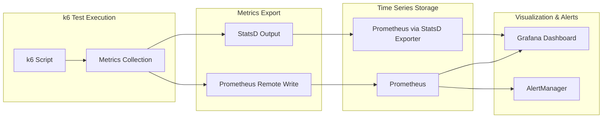
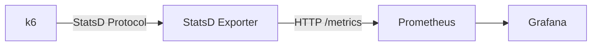
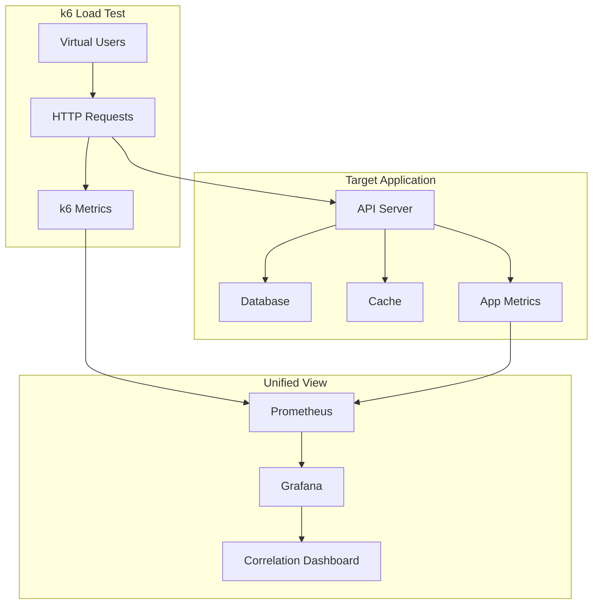

# How to Use k6 with Prometheus

Author: [nawazdhandala](https://www.github.com/nawazdhandala)

Tags: k6, Prometheus, Metrics, Monitoring, Grafana, Performance Testing

Description: Learn how to export k6 metrics to Prometheus for real-time monitoring, alerting, and correlation with application metrics.

---

Exporting k6 metrics to Prometheus enables you to visualize load test data alongside application metrics, set up alerts for performance degradation, and maintain historical records of test runs. This guide covers the setup process, custom metrics, and practical Grafana dashboards.

## Why Integrate k6 with Prometheus

Running k6 tests in isolation gives you point-in-time results. Integrating with Prometheus provides:

- Real-time visibility during test execution
- Correlation between load test metrics and application telemetry
- Historical comparison across test runs
- Alerting when performance degrades
- Unified dashboards for observability



## Method 1: Prometheus Remote Write

The most direct integration uses k6's experimental Prometheus remote write output.

### Enable the Extension

k6 includes experimental Prometheus remote write support. Enable it with the `K6_PROMETHEUS_RW_SERVER_URL` environment variable or command line flag.

```bash
# Set Prometheus remote write endpoint
K6_PROMETHEUS_RW_SERVER_URL=http://prometheus:9090/api/v1/write \
  k6 run --out experimental-prometheus-rw script.js
```

### Full Configuration Example

```javascript
// prometheus-test.js
import http from 'k6/http';
import { check, sleep } from 'k6';
import { Counter, Gauge, Rate, Trend } from 'k6/metrics';

// Custom metrics that will be exported to Prometheus
const orderCount = new Counter('orders_total');
const activeUsers = new Gauge('active_users');
const errorRate = new Rate('error_rate');
const checkoutDuration = new Trend('checkout_duration_ms');

export const options = {
  scenarios: {
    load_test: {
      executor: 'ramping-vus',
      startVUs: 0,
      stages: [
        { duration: '5m', target: 100 },
        { duration: '10m', target: 100 },
        { duration: '5m', target: 0 },
      ],
    },
  },
  thresholds: {
    http_req_duration: ['p(95)<500'],
    error_rate: ['rate<0.05'],
  },
};

export default function () {
  // Track active users
  activeUsers.add(1);

  const startTime = Date.now();

  // Simulate checkout flow
  const response = http.post('https://api.example.com/checkout', JSON.stringify({
    items: [{ id: 'prod-1', qty: 2 }],
  }), {
    headers: { 'Content-Type': 'application/json' },
    tags: { name: 'checkout' },  // Tag for Prometheus labels
  });

  const duration = Date.now() - startTime;
  checkoutDuration.add(duration);

  const success = check(response, {
    'checkout successful': (r) => r.status === 201,
  });

  if (success) {
    orderCount.add(1);
  } else {
    errorRate.add(1);
  }

  activeUsers.add(-1);
  sleep(Math.random() * 3);
}
```

Run with remote write:

```bash
k6 run \
  --out experimental-prometheus-rw \
  -e K6_PROMETHEUS_RW_SERVER_URL=http://prometheus:9090/api/v1/write \
  -e K6_PROMETHEUS_RW_TREND_AS_NATIVE_HISTOGRAM=true \
  prometheus-test.js
```

### Configuration Options

```bash
# Full configuration via environment variables
export K6_PROMETHEUS_RW_SERVER_URL=http://prometheus:9090/api/v1/write
export K6_PROMETHEUS_RW_TREND_AS_NATIVE_HISTOGRAM=true
export K6_PROMETHEUS_RW_PUSH_INTERVAL=5s
export K6_PROMETHEUS_RW_STALE_MARKERS=true

# Add custom labels to all metrics
export K6_PROMETHEUS_RW_EXTRA_LABELS="environment=staging,team=platform"

k6 run --out experimental-prometheus-rw script.js
```

## Method 2: StatsD to Prometheus

For environments without remote write support, use StatsD as an intermediary.

### Architecture



### Deploy StatsD Exporter

```yaml
# docker-compose.yml
version: '3.8'
services:
  statsd-exporter:
    image: prom/statsd-exporter:latest
    ports:
      - "9102:9102"   # Prometheus metrics endpoint
      - "9125:9125/udp"  # StatsD UDP receiver
    volumes:
      - ./statsd-mapping.yml:/etc/statsd-exporter/mapping.yml
    command:
      - '--statsd.mapping-config=/etc/statsd-exporter/mapping.yml'
      - '--statsd.listen-udp=:9125'

  prometheus:
    image: prom/prometheus:latest
    ports:
      - "9090:9090"
    volumes:
      - ./prometheus.yml:/etc/prometheus/prometheus.yml
```

### StatsD Mapping Configuration

```yaml
# statsd-mapping.yml
mappings:
  # Map k6 HTTP request duration
  - match: "k6.http_req_duration.*"
    name: "k6_http_req_duration"
    labels:
      quantile: "$1"

  # Map k6 HTTP request count
  - match: "k6.http_reqs"
    name: "k6_http_reqs_total"

  # Map k6 iterations
  - match: "k6.iterations"
    name: "k6_iterations_total"

  # Map k6 VUs
  - match: "k6.vus"
    name: "k6_vus"

  # Map custom metrics
  - match: "k6.*"
    name: "k6_$1"
    labels:
      job: "k6"
```

### Run k6 with StatsD Output

```bash
k6 run --out statsd=localhost:9125 script.js
```

### Prometheus Scrape Configuration

```yaml
# prometheus.yml
global:
  scrape_interval: 15s

scrape_configs:
  - job_name: 'k6'
    static_configs:
      - targets: ['statsd-exporter:9102']

  - job_name: 'application'
    static_configs:
      - targets: ['app:8080']
```

## Method 3: JSON Output with Custom Pipeline

For maximum flexibility, output JSON and process it separately.

```bash
# Output JSON to file
k6 run --out json=results.json script.js

# Stream JSON to processing pipeline
k6 run --out json=- script.js | ./process-metrics.sh
```

```python
# process_k6_metrics.py
import json
import sys
from prometheus_client import Counter, Gauge, Histogram, push_to_gateway

# Initialize Prometheus metrics
http_duration = Histogram(
    'k6_http_req_duration_seconds',
    'HTTP request duration',
    ['method', 'status', 'name'],
    buckets=[0.1, 0.25, 0.5, 1, 2.5, 5, 10]
)

http_requests = Counter(
    'k6_http_reqs_total',
    'Total HTTP requests',
    ['method', 'status', 'name']
)

# Process k6 JSON stream
for line in sys.stdin:
    try:
        data = json.loads(line)

        if data['type'] == 'Point' and data['metric'] == 'http_req_duration':
            labels = data.get('data', {}).get('tags', {})
            http_duration.labels(
                method=labels.get('method', 'GET'),
                status=labels.get('status', '200'),
                name=labels.get('name', 'default')
            ).observe(data['data']['value'] / 1000)  # Convert ms to seconds

    except json.JSONDecodeError:
        continue

# Push to Prometheus Pushgateway
push_to_gateway('localhost:9091', job='k6_load_test', registry=None)
```

## Custom Metrics for Prometheus

Define business-relevant metrics that map well to Prometheus types.

```javascript
// custom-metrics.js
import http from 'k6/http';
import { Counter, Gauge, Rate, Trend } from 'k6/metrics';

// Counter - monotonically increasing value
// Maps to Prometheus counter type
const totalRequests = new Counter('business_requests_total');
const totalRevenue = new Counter('business_revenue_total');

// Gauge - value that can go up and down
// Maps to Prometheus gauge type
const cartSize = new Gauge('cart_items_count');
const queueDepth = new Gauge('request_queue_depth');

// Rate - percentage of successful/failed events
// Maps to Prometheus gauge showing rate
const successRate = new Rate('request_success_rate');
const conversionRate = new Rate('checkout_conversion_rate');

// Trend - distribution of values (min, max, avg, percentiles)
// Maps to Prometheus histogram or summary
const paymentLatency = new Trend('payment_processing_ms');
const searchLatency = new Trend('search_response_ms');

export const options = {
  vus: 50,
  duration: '10m',
};

export default function () {
  totalRequests.add(1);

  // Simulate shopping flow
  const searchStart = Date.now();
  const searchRes = http.get('https://api.example.com/search?q=laptop');
  searchLatency.add(Date.now() - searchStart);

  successRate.add(searchRes.status === 200);

  if (searchRes.status === 200) {
    // Add to cart
    const items = Math.floor(Math.random() * 5) + 1;
    cartSize.add(items);

    // Attempt checkout
    const checkoutRes = http.post('https://api.example.com/checkout');

    if (checkoutRes.status === 201) {
      const paymentStart = Date.now();
      const paymentRes = http.post('https://api.example.com/payment');
      paymentLatency.add(Date.now() - paymentStart);

      if (paymentRes.status === 200) {
        const orderValue = Math.random() * 500 + 50;
        totalRevenue.add(orderValue);
        conversionRate.add(1);
      } else {
        conversionRate.add(0);
      }
    }
  }
}
```

## Grafana Dashboard Configuration

Create a comprehensive dashboard for k6 metrics.

### Dashboard JSON

```json
{
  "title": "k6 Load Test Results",
  "panels": [
    {
      "title": "Request Rate",
      "type": "timeseries",
      "targets": [
        {
          "expr": "rate(k6_http_reqs_total[1m])",
          "legendFormat": "Requests/sec"
        }
      ]
    },
    {
      "title": "Response Time Percentiles",
      "type": "timeseries",
      "targets": [
        {
          "expr": "histogram_quantile(0.50, rate(k6_http_req_duration_seconds_bucket[1m]))",
          "legendFormat": "p50"
        },
        {
          "expr": "histogram_quantile(0.95, rate(k6_http_req_duration_seconds_bucket[1m]))",
          "legendFormat": "p95"
        },
        {
          "expr": "histogram_quantile(0.99, rate(k6_http_req_duration_seconds_bucket[1m]))",
          "legendFormat": "p99"
        }
      ]
    },
    {
      "title": "Virtual Users",
      "type": "stat",
      "targets": [
        {
          "expr": "k6_vus",
          "legendFormat": "VUs"
        }
      ]
    },
    {
      "title": "Error Rate",
      "type": "gauge",
      "targets": [
        {
          "expr": "rate(k6_http_req_failed_total[5m])",
          "legendFormat": "Error Rate"
        }
      ]
    }
  ]
}
```

### PromQL Queries for Common Metrics

```promql
# Request rate per endpoint
rate(k6_http_reqs_total{name!=""}[1m])

# Average response time
rate(k6_http_req_duration_seconds_sum[1m]) / rate(k6_http_req_duration_seconds_count[1m])

# 95th percentile response time
histogram_quantile(0.95, sum(rate(k6_http_req_duration_seconds_bucket[1m])) by (le))

# Error rate percentage
100 * rate(k6_http_req_failed_total[1m]) / rate(k6_http_reqs_total[1m])

# Active virtual users
k6_vus

# Iterations per second
rate(k6_iterations_total[1m])

# Data received rate (bytes/sec)
rate(k6_data_received_total[1m])
```

## Alerting Rules

Configure Prometheus alerts for load test thresholds.

```yaml
# prometheus-alerts.yml
groups:
  - name: k6-load-test-alerts
    rules:
      - alert: K6HighErrorRate
        expr: rate(k6_http_req_failed_total[5m]) / rate(k6_http_reqs_total[5m]) > 0.05
        for: 2m
        labels:
          severity: critical
        annotations:
          summary: "k6 load test showing high error rate"
          description: "Error rate is {{ $value | humanizePercentage }} over the last 5 minutes"

      - alert: K6SlowResponseTime
        expr: histogram_quantile(0.95, rate(k6_http_req_duration_seconds_bucket[5m])) > 1
        for: 5m
        labels:
          severity: warning
        annotations:
          summary: "k6 load test showing slow response times"
          description: "95th percentile response time is {{ $value }}s"

      - alert: K6ThroughputDrop
        expr: rate(k6_http_reqs_total[5m]) < 100
        for: 5m
        labels:
          severity: warning
        annotations:
          summary: "k6 load test throughput dropped"
          description: "Request rate dropped to {{ $value }} req/s"
```

## Correlating with Application Metrics

The real power comes from viewing k6 metrics alongside application telemetry.



### Combined Dashboard Queries

```promql
# k6 request rate vs application CPU
# Panel 1: k6 requests/sec
rate(k6_http_reqs_total[1m])

# Panel 2: Application CPU usage during test
100 - (avg(rate(node_cpu_seconds_total{mode="idle"}[1m])) * 100)

# k6 response time vs database query time
# Panel 1: k6 p95 latency
histogram_quantile(0.95, rate(k6_http_req_duration_seconds_bucket[1m]))

# Panel 2: Database query p95 latency
histogram_quantile(0.95, rate(db_query_duration_seconds_bucket[1m]))
```

## Docker Compose Full Stack

Complete setup for local development:

```yaml
# docker-compose.yml
version: '3.8'

services:
  prometheus:
    image: prom/prometheus:v2.48.0
    ports:
      - "9090:9090"
    volumes:
      - ./prometheus.yml:/etc/prometheus/prometheus.yml
      - ./alerts.yml:/etc/prometheus/alerts.yml
      - prometheus-data:/prometheus
    command:
      - '--config.file=/etc/prometheus/prometheus.yml'
      - '--web.enable-remote-write-receiver'
      - '--storage.tsdb.retention.time=30d'

  grafana:
    image: grafana/grafana:10.2.0
    ports:
      - "3000:3000"
    environment:
      - GF_SECURITY_ADMIN_PASSWORD=admin
    volumes:
      - grafana-data:/var/lib/grafana
      - ./grafana/dashboards:/etc/grafana/provisioning/dashboards
      - ./grafana/datasources:/etc/grafana/provisioning/datasources

volumes:
  prometheus-data:
  grafana-data:
```

```yaml
# prometheus.yml
global:
  scrape_interval: 15s

remote_write:
  - url: "http://prometheus:9090/api/v1/write"

scrape_configs:
  - job_name: 'prometheus'
    static_configs:
      - targets: ['localhost:9090']
```

Run k6 against this stack:

```bash
docker-compose up -d

k6 run \
  --out experimental-prometheus-rw \
  -e K6_PROMETHEUS_RW_SERVER_URL=http://localhost:9090/api/v1/write \
  script.js
```

---

Integrating k6 with Prometheus transforms load testing from isolated experiments into a continuous observability practice. You gain the ability to correlate synthetic load with real application behavior, track performance trends over time, and alert on regressions before they impact users. Start with the remote write method for simplicity, then expand to custom metrics and sophisticated dashboards as your testing practice matures.
