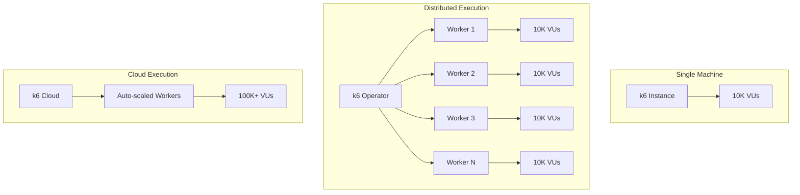
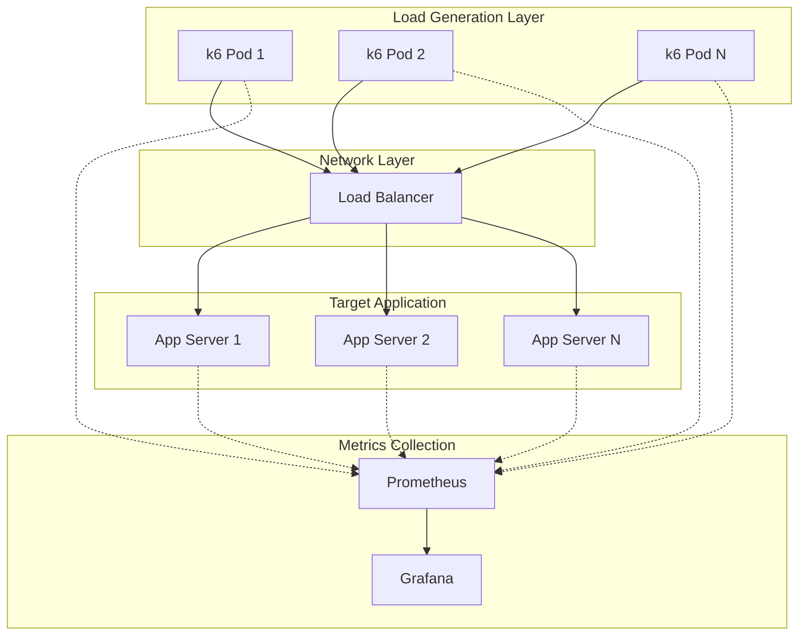

# How to Scale k6 Load Tests

Author: [nawazdhandala](https://www.github.com/nawazdhandala)

Tags: k6, Load Testing, Distributed Testing, Kubernetes, Performance Testing, Scalability

Description: Learn how to scale k6 tests from a single machine to distributed clusters for simulating massive user loads.

---

A single k6 instance can generate substantial load, but testing at scale requires distributed execution. This guide covers scaling strategies from optimizing single-machine performance to running distributed tests across Kubernetes clusters.

## Single Machine Optimization

Before distributing tests, maximize what one machine can do.

### Resource Requirements

k6 is lightweight but still needs resources:

| Virtual Users | RAM (approx) | CPU Cores |
|--------------|--------------|-----------|
| 1,000 | 1-2 GB | 2 |
| 5,000 | 4-8 GB | 4 |
| 10,000 | 8-16 GB | 8 |
| 50,000+ | 32+ GB | 16+ |

### Optimizing Script Performance

```javascript
// inefficient-script.js - AVOID
import http from 'k6/http';

export default function () {
  // Creating new objects every iteration wastes memory
  const headers = {
    'Content-Type': 'application/json',
    'Authorization': 'Bearer ' + __ENV.TOKEN,
  };

  // String concatenation in loops is slow
  let payload = '{';
  for (let i = 0; i < 10; i++) {
    payload += '"field' + i + '": "value",';
  }
  payload += '}';

  http.post('https://api.example.com/data', payload, { headers });
}
```

```javascript
// optimized-script.js - BETTER
import http from 'k6/http';

// Define constants outside the default function
const BASE_URL = __ENV.BASE_URL || 'https://api.example.com';
const TOKEN = __ENV.TOKEN;

// Pre-build headers object
const headers = {
  'Content-Type': 'application/json',
  'Authorization': `Bearer ${TOKEN}`,
};

// Pre-build payload if it doesn't change per request
const payload = JSON.stringify({
  field0: 'value',
  field1: 'value',
  field2: 'value',
});

export const options = {
  // Disable unused features
  discardResponseBodies: true,  // Don't store response bodies
  noConnectionReuse: false,     // Reuse connections (default)
  noVUConnectionReuse: false,   // Reuse connections across iterations
};

export default function () {
  http.post(`${BASE_URL}/data`, payload, { headers });
}
```

### Memory Management

```javascript
// memory-efficient.js
import http from 'k6/http';
import { SharedArray } from 'k6/data';

// SharedArray loads data once and shares across all VUs
// Instead of each VU loading its own copy
const users = new SharedArray('users', function () {
  return JSON.parse(open('./users.json'));
});

export const options = {
  vus: 1000,
  duration: '10m',
  // Limit batch size to control memory
  batch: 10,
  batchPerHost: 5,
};

export default function () {
  // Access shared data without copying
  const user = users[__VU % users.length];

  http.post('https://api.example.com/login', JSON.stringify({
    email: user.email,
    password: user.password,
  }));
}
```

## Scaling Architecture



## Distributed Execution with k6 Operator

The k6 Operator runs distributed tests on Kubernetes.

### Install k6 Operator

```bash
# Using Helm
helm repo add grafana https://grafana.github.io/helm-charts
helm repo update
helm install k6-operator grafana/k6-operator

# Or using kubectl
kubectl apply -f https://github.com/grafana/k6-operator/releases/latest/download/bundle.yaml
```

### Create Test Configuration

```yaml
# k6-test.yaml
apiVersion: k6.io/v1alpha1
kind: TestRun
metadata:
  name: load-test
spec:
  parallelism: 4  # Number of k6 pods
  script:
    configMap:
      name: k6-test-script
      file: script.js
  arguments: --out json=/results/output.json
  runner:
    image: grafana/k6:latest
    resources:
      requests:
        memory: "2Gi"
        cpu: "1000m"
      limits:
        memory: "4Gi"
        cpu: "2000m"
```

### Store Test Script in ConfigMap

```bash
# Create ConfigMap from local script
kubectl create configmap k6-test-script --from-file=script.js
```

```javascript
// script.js - distributed test script
import http from 'k6/http';
import { check, sleep } from 'k6';

export const options = {
  scenarios: {
    distributed_load: {
      executor: 'constant-arrival-rate',
      rate: 1000,            // 1000 req/s per pod
      timeUnit: '1s',
      duration: '10m',
      preAllocatedVUs: 100,
      maxVUs: 500,
    },
  },
  thresholds: {
    http_req_duration: ['p(95)<500'],
    http_req_failed: ['rate<0.01'],
  },
};

export default function () {
  const response = http.get('https://api.example.com/products');
  check(response, {
    'status 200': (r) => r.status === 200,
  });
}
```

### Run Distributed Test

```bash
# Apply the TestRun
kubectl apply -f k6-test.yaml

# Watch pods spin up
kubectl get pods -w

# Check test status
kubectl get testrun load-test -o yaml

# View logs from one worker
kubectl logs -f load-test-1-xxxxx
```

### Scaling Workers

```yaml
# high-scale-test.yaml
apiVersion: k6.io/v1alpha1
kind: TestRun
metadata:
  name: high-scale-test
spec:
  parallelism: 20  # 20 pods for massive scale
  script:
    configMap:
      name: k6-test-script
      file: script.js
  runner:
    image: grafana/k6:latest
    resources:
      requests:
        memory: "4Gi"
        cpu: "2000m"
      limits:
        memory: "8Gi"
        cpu: "4000m"
    # Node affinity for dedicated load gen nodes
    affinity:
      nodeAffinity:
        requiredDuringSchedulingIgnoredDuringExecution:
          nodeSelectorTerms:
          - matchExpressions:
            - key: workload-type
              operator: In
              values:
              - load-testing
```

## Manual Distributed Execution

Without Kubernetes, run k6 on multiple machines manually.

### Orchestration Script

```bash
#!/bin/bash
# distributed-run.sh

HOSTS=("worker1.example.com" "worker2.example.com" "worker3.example.com")
SCRIPT_PATH="./script.js"
DURATION="10m"
VUS_PER_HOST=3000

# Copy script to all hosts
for host in "${HOSTS[@]}"; do
  echo "Copying script to $host"
  scp $SCRIPT_PATH $host:/tmp/k6-script.js
done

# Start k6 on all hosts simultaneously
for host in "${HOSTS[@]}"; do
  echo "Starting k6 on $host"
  ssh $host "k6 run \
    --vus $VUS_PER_HOST \
    --duration $DURATION \
    --out json=/tmp/k6-results.json \
    /tmp/k6-script.js" &
done

# Wait for all to complete
wait

# Collect results
for host in "${HOSTS[@]}"; do
  echo "Collecting results from $host"
  scp $host:/tmp/k6-results.json ./results-$host.json
done

echo "Test complete. Aggregating results..."
```

### Aggregating Distributed Results

```python
# aggregate_results.py
import json
import glob
from collections import defaultdict

def aggregate_metrics(result_files):
    aggregated = defaultdict(list)

    for file_path in result_files:
        with open(file_path, 'r') as f:
            for line in f:
                try:
                    data = json.loads(line)
                    if data['type'] == 'Point':
                        metric = data['metric']
                        value = data['data']['value']
                        aggregated[metric].append(value)
                except json.JSONDecodeError:
                    continue

    # Calculate aggregated statistics
    results = {}
    for metric, values in aggregated.items():
        sorted_values = sorted(values)
        results[metric] = {
            'count': len(values),
            'sum': sum(values),
            'avg': sum(values) / len(values),
            'min': min(values),
            'max': max(values),
            'p50': sorted_values[int(len(sorted_values) * 0.5)],
            'p95': sorted_values[int(len(sorted_values) * 0.95)],
            'p99': sorted_values[int(len(sorted_values) * 0.99)],
        }

    return results

# Aggregate all result files
files = glob.glob('./results-*.json')
aggregated = aggregate_metrics(files)

print(f"Total requests: {aggregated['http_reqs']['count']}")
print(f"Average response time: {aggregated['http_req_duration']['avg']:.2f}ms")
print(f"p95 response time: {aggregated['http_req_duration']['p95']:.2f}ms")
```

## Cloud-Based Scaling

For simplest scaling, use k6 Cloud.

```javascript
// cloud-test.js
import http from 'k6/http';
import { check } from 'k6';

export const options = {
  // Cloud execution settings
  cloud: {
    projectID: 12345,
    name: 'High Scale Test',
    distribution: {
      'amazon:us:ashburn': { loadZone: 'amazon:us:ashburn', percent: 50 },
      'amazon:eu:frankfurt': { loadZone: 'amazon:eu:frankfurt', percent: 50 },
    },
  },
  scenarios: {
    massive_load: {
      executor: 'ramping-vus',
      startVUs: 0,
      stages: [
        { duration: '5m', target: 10000 },
        { duration: '20m', target: 10000 },
        { duration: '5m', target: 50000 },
        { duration: '10m', target: 50000 },
        { duration: '5m', target: 0 },
      ],
    },
  },
};

export default function () {
  const response = http.get('https://api.example.com/products');
  check(response, {
    'status 200': (r) => r.status === 200,
  });
}
```

Run on k6 Cloud:

```bash
# Login to k6 Cloud
k6 login cloud --token YOUR_API_TOKEN

# Run on cloud
k6 cloud cloud-test.js
```

## Load Generation Architecture



## Handling Test Data at Scale

Distribute unique test data across workers.

```javascript
// distributed-data.js
import http from 'k6/http';
import { SharedArray } from 'k6/data';
import papaparse from 'https://jslib.k6.io/papaparse/5.1.1/index.js';

// Each worker needs a subset of data
const WORKER_ID = parseInt(__ENV.WORKER_ID || '0');
const TOTAL_WORKERS = parseInt(__ENV.TOTAL_WORKERS || '1');

// Load full dataset
const allUsers = new SharedArray('users', function () {
  const csv = open('./users.csv');
  return papaparse.parse(csv, { header: true }).data;
});

// Calculate this worker's data range
const usersPerWorker = Math.ceil(allUsers.length / TOTAL_WORKERS);
const startIndex = WORKER_ID * usersPerWorker;
const endIndex = Math.min(startIndex + usersPerWorker, allUsers.length);

export const options = {
  vus: 100,
  duration: '10m',
};

export default function () {
  // Use only this worker's slice of users
  const userIndex = startIndex + (__VU % (endIndex - startIndex));
  const user = allUsers[userIndex];

  http.post('https://api.example.com/login', JSON.stringify({
    email: user.email,
    password: user.password,
  }));
}
```

Run with worker assignment:

```bash
# Worker 0 of 4
WORKER_ID=0 TOTAL_WORKERS=4 k6 run distributed-data.js

# Worker 1 of 4
WORKER_ID=1 TOTAL_WORKERS=4 k6 run distributed-data.js
```

## Scaling Thresholds

Adjust thresholds for distributed execution.

```javascript
// scaled-thresholds.js
import http from 'k6/http';

const PARALLELISM = parseInt(__ENV.PARALLELISM || '1');
const TARGET_RPS = 10000;  // Total target across all workers

export const options = {
  scenarios: {
    distributed: {
      executor: 'constant-arrival-rate',
      // Divide total rate by number of workers
      rate: Math.ceil(TARGET_RPS / PARALLELISM),
      timeUnit: '1s',
      duration: '10m',
      preAllocatedVUs: 100,
      maxVUs: 500,
    },
  },
  thresholds: {
    // These thresholds apply to each worker
    // Aggregate analysis happens post-test
    http_req_duration: ['p(95)<500'],
    http_req_failed: ['rate<0.01'],
  },
};

export default function () {
  http.get('https://api.example.com/products');
}
```

## Monitoring Distributed Tests

### Prometheus Remote Write from All Workers

```yaml
# k6-test-with-metrics.yaml
apiVersion: k6.io/v1alpha1
kind: TestRun
metadata:
  name: monitored-test
spec:
  parallelism: 10
  script:
    configMap:
      name: k6-test-script
      file: script.js
  arguments: --out experimental-prometheus-rw
  runner:
    image: grafana/k6:latest
    env:
    - name: K6_PROMETHEUS_RW_SERVER_URL
      value: "http://prometheus:9090/api/v1/write"
    - name: K6_PROMETHEUS_RW_TREND_AS_NATIVE_HISTOGRAM
      value: "true"
```

### Grafana Dashboard for Distributed Tests

```json
{
  "title": "k6 Distributed Load Test",
  "panels": [
    {
      "title": "Total Request Rate (all workers)",
      "targets": [
        {
          "expr": "sum(rate(k6_http_reqs_total[1m]))",
          "legendFormat": "Total req/s"
        }
      ]
    },
    {
      "title": "Request Rate by Worker",
      "targets": [
        {
          "expr": "rate(k6_http_reqs_total[1m])",
          "legendFormat": "{{instance}}"
        }
      ]
    },
    {
      "title": "p95 Latency (aggregated)",
      "targets": [
        {
          "expr": "histogram_quantile(0.95, sum(rate(k6_http_req_duration_seconds_bucket[1m])) by (le))",
          "legendFormat": "p95"
        }
      ]
    }
  ]
}
```

## Best Practices for Scale

1. **Start Small** - Verify script works with low VUs before scaling.

2. **Monitor Load Generators** - Ensure workers are not the bottleneck (CPU, memory, network).

3. **Use Connection Pooling** - Reuse connections to avoid socket exhaustion.

4. **Disable Unnecessary Features** - Turn off response body capture if not needed.

5. **Distribute Geographically** - Match user locations for realistic latency.

6. **Coordinate Start Times** - Use synchronized start for accurate ramp patterns.

7. **Plan Data Distribution** - Ensure unique data per worker to avoid collisions.

```javascript
// production-scale.js
import http from 'k6/http';
import { SharedArray } from 'k6/data';

export const options = {
  discardResponseBodies: true,
  noConnectionReuse: false,
  scenarios: {
    production_load: {
      executor: 'ramping-arrival-rate',
      startRate: 0,
      timeUnit: '1s',
      preAllocatedVUs: 1000,
      maxVUs: 5000,
      stages: [
        { duration: '5m', target: 1000 },
        { duration: '30m', target: 1000 },
        { duration: '5m', target: 0 },
      ],
    },
  },
  thresholds: {
    http_req_duration: ['p(95)<500', 'p(99)<1000'],
    http_req_failed: ['rate<0.01'],
  },
};

const users = new SharedArray('users', function () {
  return JSON.parse(open('./users.json'));
});

export default function () {
  const user = users[__VU % users.length];
  http.get(`https://api.example.com/users/${user.id}/profile`);
}
```

---

Scaling k6 tests requires understanding both single-machine optimization and distributed execution patterns. Start by maximizing what one instance can do through efficient scripts and proper resource allocation. When you need more, the k6 Operator on Kubernetes provides seamless horizontal scaling. For the highest scale with minimal operational overhead, k6 Cloud handles infrastructure automatically. Match your scaling approach to your team's capabilities and testing requirements.
