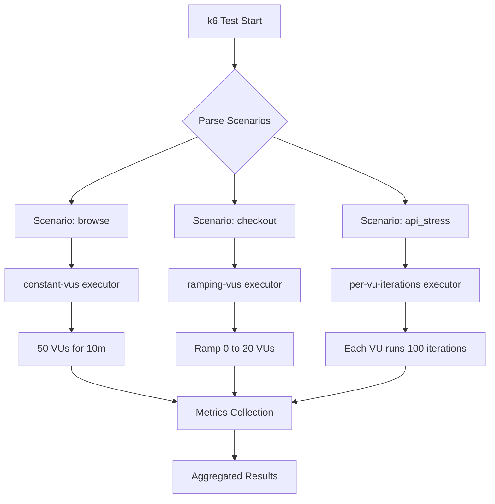
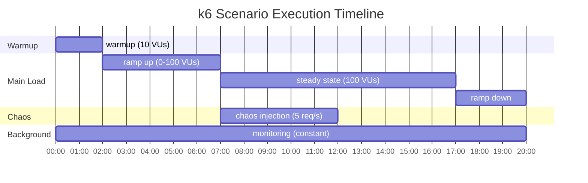

# How to Implement k6 Scenarios

Author: [nawazdhandala](https://www.github.com/nawazdhandala)

Tags: k6, Load Testing, Performance Testing, Scenarios, DevOps

Description: Learn how to use k6 scenarios to model realistic user traffic patterns with multiple virtual user behaviors running simultaneously.

---

k6 scenarios give you fine-grained control over how virtual users execute your load tests. Instead of running a single script uniformly, scenarios let you orchestrate multiple workloads with different configurations, ramp-up patterns, and execution strategies. This guide walks through practical implementations for real-world testing needs.

## Understanding Scenarios vs Simple Execution

Traditional k6 scripts use a single `options.vus` and `options.duration` configuration. Scenarios replace this with named execution blocks that can run independently or in coordination.

```javascript
// Old approach - single execution pattern
export const options = {
  vus: 100,
  duration: '5m',
};

// Scenario approach - multiple patterns running together
export const options = {
  scenarios: {
    browse: {
      executor: 'constant-vus',
      vus: 50,
      duration: '10m',
      exec: 'browseProducts',
    },
    checkout: {
      executor: 'ramping-vus',
      startVUs: 0,
      stages: [
        { duration: '2m', target: 20 },
        { duration: '5m', target: 20 },
        { duration: '2m', target: 0 },
      ],
      exec: 'performCheckout',
    },
  },
};
```

## Scenario Execution Flow

Here is how k6 manages multiple scenarios during test execution:



## Available Executors

k6 provides six executors, each suited for different testing patterns.

### Constant VUs

Maintains a fixed number of virtual users throughout the test. Use this for steady-state load testing.

```javascript
export const options = {
  scenarios: {
    steady_load: {
      executor: 'constant-vus',
      vus: 100,           // Number of virtual users
      duration: '30m',    // How long to run
      exec: 'mainFlow',   // Function to execute
      gracefulStop: '30s', // Time to wait for iterations to finish
    },
  },
};

export function mainFlow() {
  http.get('https://api.example.com/products');
  sleep(1);
}
```

### Ramping VUs

Gradually increases or decreases virtual users through defined stages. Perfect for finding breaking points.

```javascript
export const options = {
  scenarios: {
    stress_test: {
      executor: 'ramping-vus',
      startVUs: 0,
      stages: [
        { duration: '5m', target: 100 },   // Ramp up to 100 users
        { duration: '10m', target: 100 },  // Hold at 100 users
        { duration: '5m', target: 200 },   // Push to 200 users
        { duration: '10m', target: 200 },  // Hold at peak
        { duration: '5m', target: 0 },     // Ramp down
      ],
      exec: 'stressFlow',
    },
  },
};
```

### Constant Arrival Rate

Maintains a constant rate of iterations regardless of response times. This executor adds VUs as needed to hit the target rate.

```javascript
export const options = {
  scenarios: {
    constant_request_rate: {
      executor: 'constant-arrival-rate',
      rate: 1000,              // 1000 iterations per timeUnit
      timeUnit: '1s',          // Per second
      duration: '10m',
      preAllocatedVUs: 50,     // Start with 50 VUs
      maxVUs: 200,             // Scale up to 200 if needed
      exec: 'apiCall',
    },
  },
};

export function apiCall() {
  // Each iteration is one request
  http.post('https://api.example.com/events', JSON.stringify({
    event: 'page_view',
    timestamp: Date.now(),
  }));
}
```

### Ramping Arrival Rate

Varies the iteration rate over time through stages. Useful for simulating traffic spikes.

```javascript
export const options = {
  scenarios: {
    spike_test: {
      executor: 'ramping-arrival-rate',
      startRate: 50,           // Start at 50 iterations/second
      timeUnit: '1s',
      preAllocatedVUs: 50,
      maxVUs: 500,
      stages: [
        { duration: '2m', target: 50 },    // Warm up
        { duration: '1m', target: 500 },   // Spike to 500 req/s
        { duration: '2m', target: 500 },   // Hold spike
        { duration: '1m', target: 50 },    // Return to normal
        { duration: '4m', target: 50 },    // Observe recovery
      ],
      exec: 'handleSpike',
    },
  },
};
```

### Per-VU Iterations

Each virtual user runs a fixed number of iterations. The test ends when all VUs complete their iterations.

```javascript
export const options = {
  scenarios: {
    data_migration: {
      executor: 'per-vu-iterations',
      vus: 10,
      iterations: 100,     // Each VU runs exactly 100 iterations
      maxDuration: '1h',   // Safety timeout
      exec: 'migrateRecord',
    },
  },
};

export function migrateRecord() {
  // Process one record per iteration
  const record = sharedData.getNextRecord(__VU, __ITER);
  http.post('https://api.example.com/migrate', JSON.stringify(record));
}
```

### Shared Iterations

A fixed pool of iterations distributed across VUs. Faster VUs complete more iterations.

```javascript
export const options = {
  scenarios: {
    process_queue: {
      executor: 'shared-iterations',
      vus: 20,
      iterations: 1000,    // Total iterations shared across all VUs
      maxDuration: '30m',
      exec: 'processItem',
    },
  },
};
```

## Combining Multiple Scenarios

The real power of scenarios comes from running different user behaviors simultaneously.

```javascript
import http from 'k6/http';
import { sleep, check } from 'k6';

export const options = {
  scenarios: {
    // Anonymous browsing - high volume, simple requests
    anonymous_browsing: {
      executor: 'constant-vus',
      vus: 200,
      duration: '30m',
      exec: 'browseCatalog',
      tags: { user_type: 'anonymous' },
    },

    // Authenticated users - lower volume, complex flows
    logged_in_users: {
      executor: 'ramping-vus',
      startVUs: 0,
      stages: [
        { duration: '5m', target: 50 },
        { duration: '20m', target: 50 },
        { duration: '5m', target: 0 },
      ],
      exec: 'authenticatedFlow',
      tags: { user_type: 'authenticated' },
    },

    // Checkout flow - realistic conversion rate
    checkout_flow: {
      executor: 'constant-arrival-rate',
      rate: 10,           // 10 checkouts per second
      timeUnit: '1s',
      duration: '30m',
      preAllocatedVUs: 20,
      maxVUs: 100,
      exec: 'completeCheckout',
      tags: { user_type: 'buyer' },
    },
  },
  thresholds: {
    // Global thresholds
    http_req_duration: ['p(95)<500'],

    // Per-scenario thresholds using tags
    'http_req_duration{user_type:anonymous}': ['p(95)<200'],
    'http_req_duration{user_type:authenticated}': ['p(95)<400'],
    'http_req_duration{user_type:buyer}': ['p(95)<1000'],
  },
};

// Browse product catalog - fast, read-only requests
export function browseCatalog() {
  const pages = ['/products', '/categories', '/search?q=laptop'];
  const page = pages[Math.floor(Math.random() * pages.length)];

  const response = http.get(`https://shop.example.com${page}`);
  check(response, {
    'browse status 200': (r) => r.status === 200,
  });

  sleep(Math.random() * 3 + 1); // 1-4 second think time
}

// Full authenticated user session
export function authenticatedFlow() {
  // Login
  const loginRes = http.post('https://shop.example.com/api/login', JSON.stringify({
    email: `user${__VU}@test.com`,
    password: 'testpassword',
  }), { headers: { 'Content-Type': 'application/json' } });

  const token = loginRes.json('token');
  const authHeaders = {
    'Authorization': `Bearer ${token}`,
    'Content-Type': 'application/json',
  };

  // Browse while logged in
  for (let i = 0; i < 5; i++) {
    http.get('https://shop.example.com/api/products', { headers: authHeaders });
    sleep(2);
  }

  // View account
  http.get('https://shop.example.com/api/account', { headers: authHeaders });
  sleep(1);
}

// Complete purchase flow
export function completeCheckout() {
  const cartId = `cart-${__VU}-${__ITER}`;

  // Add items to cart
  http.post('https://shop.example.com/api/cart', JSON.stringify({
    cartId: cartId,
    productId: 'prod-123',
    quantity: 2,
  }));

  // Apply discount
  http.post(`https://shop.example.com/api/cart/${cartId}/discount`, JSON.stringify({
    code: 'SAVE10',
  }));

  // Submit order
  const orderRes = http.post('https://shop.example.com/api/checkout', JSON.stringify({
    cartId: cartId,
    payment: { method: 'card', token: 'test_token' },
    shipping: { method: 'standard' },
  }));

  check(orderRes, {
    'checkout successful': (r) => r.status === 201,
    'order id returned': (r) => r.json('orderId') !== undefined,
  });
}
```

## Scenario Timing and Coordination

Control when scenarios start relative to each other using `startTime`.

```javascript
export const options = {
  scenarios: {
    // Warm up the system first
    warmup: {
      executor: 'constant-vus',
      vus: 10,
      duration: '2m',
      exec: 'warmupRequests',
      startTime: '0s',    // Start immediately
    },

    // Main load begins after warmup
    main_load: {
      executor: 'ramping-vus',
      startVUs: 0,
      stages: [
        { duration: '5m', target: 100 },
        { duration: '10m', target: 100 },
      ],
      exec: 'mainLoad',
      startTime: '2m',    // Start after warmup completes
    },

    // Chaos injection during steady state
    chaos_injection: {
      executor: 'constant-arrival-rate',
      rate: 5,
      timeUnit: '1s',
      duration: '5m',
      preAllocatedVUs: 10,
      maxVUs: 20,
      exec: 'chaosRequests',
      startTime: '7m',    // Start during main load steady state
    },
  },
};
```

## Environment-Based Scenario Selection

Use environment variables to run different scenario combinations.

```javascript
const isSmoke = __ENV.TEST_TYPE === 'smoke';
const isStress = __ENV.TEST_TYPE === 'stress';

export const options = {
  scenarios: {
    smoke: {
      executor: 'constant-vus',
      vus: isSmoke ? 5 : 0,      // Only run in smoke mode
      duration: '1m',
      exec: 'smokeTest',
    },
    load: {
      executor: 'ramping-vus',
      startVUs: 0,
      stages: isStress
        ? [
            { duration: '10m', target: 500 },
            { duration: '30m', target: 500 },
            { duration: '10m', target: 0 },
          ]
        : [
            { duration: '5m', target: 100 },
            { duration: '10m', target: 100 },
            { duration: '5m', target: 0 },
          ],
      exec: 'loadTest',
    },
  },
};
```

Run with different configurations:

```bash
# Smoke test
k6 run -e TEST_TYPE=smoke script.js

# Stress test
k6 run -e TEST_TYPE=stress script.js
```

## Scenario Timeline Visualization

Here is how a multi-scenario test progresses over time:



## Best Practices for Scenario Design

1. **Name scenarios descriptively** - Use names that reflect user behavior, not technical details.

2. **Match real traffic patterns** - Analyze production logs to understand the ratio of different user flows.

3. **Use appropriate executors** - Arrival rate executors for API testing, VU-based for browser simulation.

4. **Set realistic think times** - Real users pause between actions. Use `sleep()` with randomization.

5. **Tag scenarios for filtering** - Add tags to enable per-scenario threshold configuration and result analysis.

```javascript
export const options = {
  scenarios: {
    api_users: {
      executor: 'constant-arrival-rate',
      rate: 100,
      timeUnit: '1s',
      duration: '10m',
      preAllocatedVUs: 50,
      maxVUs: 200,
      exec: 'apiFlow',
      tags: { scenario: 'api', priority: 'high' },
      env: { BASE_URL: 'https://api.example.com' },
    },
  },
};
```

---

k6 scenarios transform simple load scripts into sophisticated traffic simulations. By combining different executors, timing configurations, and user behaviors, you can model realistic production workloads and uncover performance issues that single-pattern tests miss. Start with two or three scenarios representing your main user flows, then expand as you learn more about your traffic patterns.
