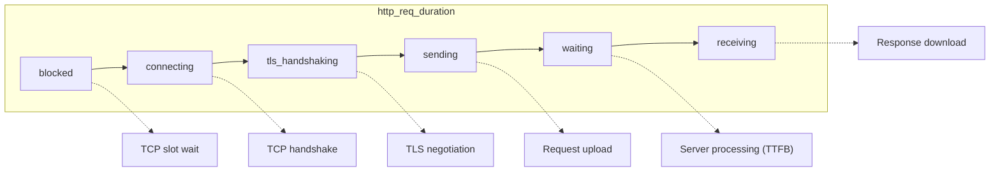
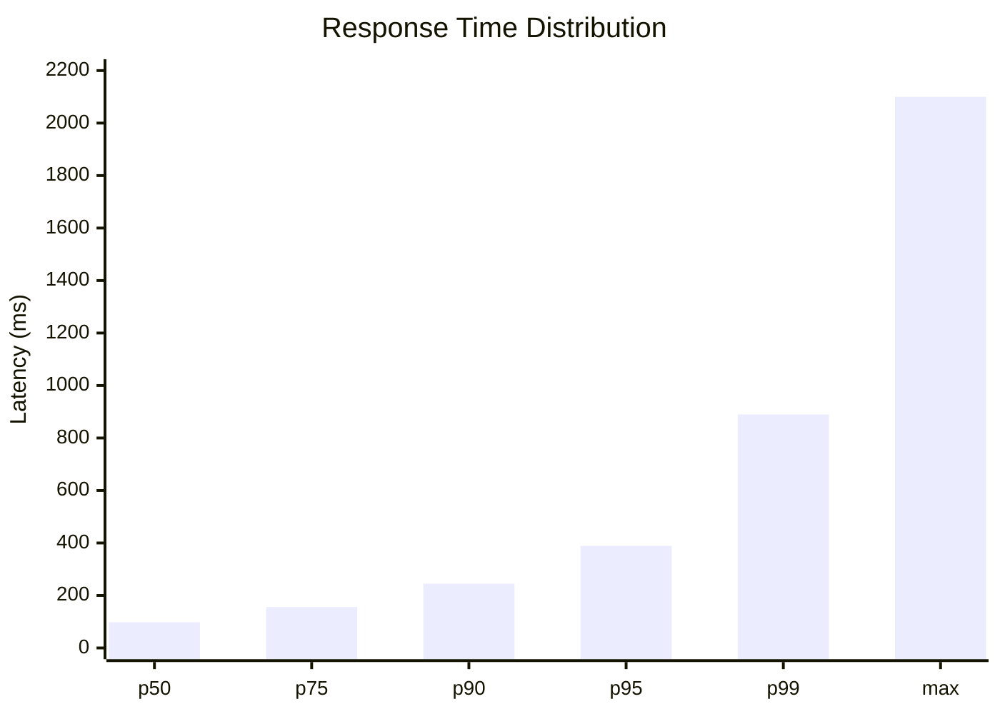
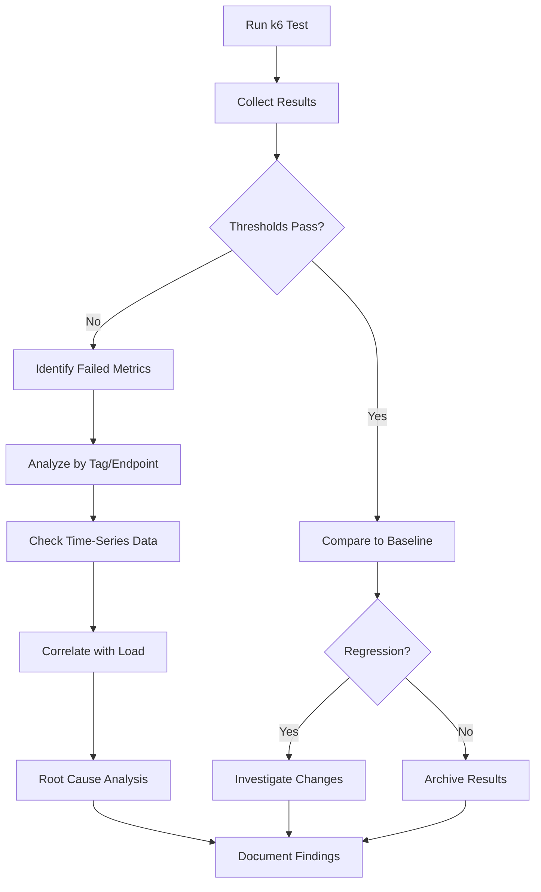

# How to Analyze k6 Test Results

Author: [nawazdhandala](https://www.github.com/nawazdhandala)

Tags: k6, Performance Testing, Analysis, Metrics, Reporting, DevOps

Description: Learn how to interpret k6 test output, identify performance bottlenecks, and create actionable reports from load test results.

---

Running a k6 test is straightforward. Understanding what the results mean requires knowing which metrics matter, how to spot problems, and what patterns indicate real issues versus noise. This guide walks through practical analysis techniques for k6 output.

## Understanding k6 Output Metrics

When a k6 test completes, you see a summary of collected metrics. Here is what each metric tells you.

### Standard HTTP Metrics

```
http_reqs......................: 15234   253.9/s
http_req_blocked...............: avg=2.1ms    min=1µs      med=3µs      max=502ms    p(90)=5µs      p(95)=8µs
http_req_connecting............: avg=1.8ms    min=0s       med=0s       max=498ms    p(90)=0s       p(95)=0s
http_req_duration..............: avg=127ms    min=45ms     med=98ms     max=2.1s     p(90)=245ms    p(95)=389ms
http_req_failed................: 0.52%   ✗ 79      ✓ 15155
http_req_receiving.............: avg=1.2ms    min=15µs     med=89µs     max=156ms    p(90)=2.1ms    p(95)=4.5ms
http_req_sending...............: avg=45µs     min=5µs      med=28µs     max=12ms     p(90)=78µs     p(95)=112µs
http_req_tls_handshaking.......: avg=0s       min=0s       med=0s       max=0s       p(90)=0s       p(95)=0s
http_req_waiting...............: avg=125ms    min=44ms     med=97ms     max=2.1s     p(90)=241ms    p(95)=384ms
```

| Metric | What It Measures | What to Look For |
|--------|------------------|------------------|
| `http_req_duration` | Total request time (send + wait + receive) | Primary latency indicator |
| `http_req_waiting` | Time waiting for server response (TTFB) | Server processing time |
| `http_req_blocked` | Time waiting for TCP connection | Connection pool issues |
| `http_req_connecting` | TCP connection establishment time | Network issues |
| `http_req_failed` | Percentage of failed requests | Error rate |

### Metric Flow Diagram



## Reading Percentiles Correctly

Averages hide problems. Percentiles reveal them.

```javascript
// Test script that generates varied response times
import http from 'k6/http';
import { sleep } from 'k6';

export const options = {
  vus: 50,
  duration: '5m',
  thresholds: {
    // Set thresholds on percentiles, not averages
    'http_req_duration': [
      'p(50)<100',   // Median under 100ms
      'p(90)<300',   // 90% of requests under 300ms
      'p(95)<500',   // 95% under 500ms
      'p(99)<1000',  // 99% under 1 second
    ],
  },
};

export default function () {
  http.get('https://api.example.com/products');
  sleep(1);
}
```

### Interpreting Percentile Spread

```
http_req_duration:
  avg=127ms
  med=98ms     # 50th percentile - half of requests faster than this
  p(90)=245ms  # 90% of requests faster than this
  p(95)=389ms  # 95% of requests faster than this
  max=2.1s     # Slowest single request
```

**What this tells you:**
- Median (98ms) is lower than average (127ms) - some slow requests are pulling up the average
- The gap between p(95) at 389ms and max at 2.1s indicates occasional very slow requests
- The 5x difference between median and p(95) suggests inconsistent performance



## Identifying Common Problems

### Problem 1: Connection Pool Exhaustion

**Symptoms:**
```
http_req_blocked: avg=245ms  min=1µs  med=2µs  max=1.2s  p(90)=890ms  p(95)=1.1s
```

High `blocked` time means requests are waiting for available connections.

**Solution:** Increase connection pool or reduce concurrent users.

### Problem 2: Slow Server Response

**Symptoms:**
```
http_req_waiting: avg=2.1s  min=45ms  med=1.8s  max=15s  p(95)=4.2s
```

High `waiting` time indicates slow backend processing.

**Solution:** Profile server-side code, check database queries, add caching.

### Problem 3: Network Bottleneck

**Symptoms:**
```
http_req_receiving: avg=890ms  min=15µs  med=456ms  max=3.2s  p(95)=1.8s
```

High `receiving` time with large responses indicates bandwidth limits.

**Solution:** Compress responses, paginate data, use CDN.

### Problem 4: Error Spikes Under Load

**Symptoms:**
```
http_req_failed: 15.2%  ✗ 2312  ✓ 12922
```

Error rate increases as load increases.

**Solution:** Check server logs, increase capacity, implement rate limiting.

## Analyzing JSON Output

Export results to JSON for detailed analysis.

```bash
k6 run --out json=results.json script.js
```

```python
# analyze_results.py
import json
import statistics
from collections import defaultdict

# Load k6 JSON output
metrics = defaultdict(list)

with open('results.json', 'r') as f:
    for line in f:
        data = json.loads(line)

        if data['type'] == 'Point':
            metric_name = data['metric']
            value = data['data']['value']
            metrics[metric_name].append(value)

# Calculate statistics for http_req_duration
durations = metrics['http_req_duration']

print(f"Total requests: {len(durations)}")
print(f"Average: {statistics.mean(durations):.2f}ms")
print(f"Median: {statistics.median(durations):.2f}ms")
print(f"Std Dev: {statistics.stdev(durations):.2f}ms")
print(f"Min: {min(durations):.2f}ms")
print(f"Max: {max(durations):.2f}ms")

# Calculate percentiles
sorted_durations = sorted(durations)
p95_index = int(len(sorted_durations) * 0.95)
p99_index = int(len(sorted_durations) * 0.99)

print(f"p95: {sorted_durations[p95_index]:.2f}ms")
print(f"p99: {sorted_durations[p99_index]:.2f}ms")
```

## Analyzing by Tags

Tag requests to analyze different endpoints or scenarios separately.

```javascript
// tagged-test.js
import http from 'k6/http';
import { check } from 'k6';

export const options = {
  vus: 50,
  duration: '5m',
  thresholds: {
    // Thresholds for specific tags
    'http_req_duration{endpoint:products}': ['p(95)<200'],
    'http_req_duration{endpoint:checkout}': ['p(95)<500'],
    'http_req_duration{endpoint:search}': ['p(95)<300'],
  },
};

export default function () {
  // Tag each request type
  const products = http.get('https://api.example.com/products', {
    tags: { endpoint: 'products', priority: 'high' },
  });

  const search = http.get('https://api.example.com/search?q=laptop', {
    tags: { endpoint: 'search', priority: 'medium' },
  });

  const checkout = http.post('https://api.example.com/checkout', JSON.stringify({
    items: [{ id: 1, qty: 2 }],
  }), {
    headers: { 'Content-Type': 'application/json' },
    tags: { endpoint: 'checkout', priority: 'critical' },
  });

  check(products, { 'products ok': (r) => r.status === 200 });
  check(search, { 'search ok': (r) => r.status === 200 });
  check(checkout, { 'checkout ok': (r) => r.status === 201 });
}
```

Output includes tagged metrics:

```
http_req_duration{endpoint:checkout}: avg=245ms  p(95)=456ms
http_req_duration{endpoint:products}: avg=89ms   p(95)=145ms
http_req_duration{endpoint:search}:   avg=156ms  p(95)=278ms
```

## Trend Analysis

Track metrics over time during the test to identify patterns.

```javascript
// trend-analysis.js
import http from 'k6/http';
import { Trend, Counter } from 'k6/metrics';

// Custom trend for tracking over time
const responseTime = new Trend('custom_response_time');
const requestCount = new Counter('custom_request_count');

export const options = {
  scenarios: {
    ramp_test: {
      executor: 'ramping-vus',
      startVUs: 0,
      stages: [
        { duration: '5m', target: 100 },
        { duration: '10m', target: 100 },
        { duration: '5m', target: 0 },
      ],
    },
  },
};

export default function () {
  const start = Date.now();
  const response = http.get('https://api.example.com/products');
  const duration = Date.now() - start;

  responseTime.add(duration);
  requestCount.add(1);

  // Log timestamp for trend analysis
  if (__ITER % 100 === 0) {
    console.log(`[${new Date().toISOString()}] VUs: ${__VU}, Response: ${duration}ms`);
  }
}
```

## Analysis Flow



## Comparing Test Runs

Establish baselines and track changes over time.

```javascript
// baseline-compare.js
import http from 'k6/http';
import { check } from 'k6';
import { Trend } from 'k6/metrics';

// Baseline values from previous run
const BASELINE = {
  p95: 250,  // ms
  p99: 500,  // ms
  errorRate: 0.01,  // 1%
};

const customDuration = new Trend('api_duration');

export const options = {
  vus: 100,
  duration: '10m',
  thresholds: {
    // Compare against baseline with tolerance
    'api_duration': [
      `p(95)<${BASELINE.p95 * 1.1}`,  // Allow 10% regression
      `p(99)<${BASELINE.p99 * 1.1}`,
    ],
    'http_req_failed': [`rate<${BASELINE.errorRate * 1.5}`],  // 50% tolerance
  },
};

export default function () {
  const response = http.get('https://api.example.com/products');
  customDuration.add(response.timings.duration);

  check(response, {
    'status 200': (r) => r.status === 200,
    'within baseline': (r) => r.timings.duration < BASELINE.p95,
  });
}
```

## Creating Reports

Generate human-readable reports from k6 output.

```bash
# Using k6 with handleSummary for custom reports
k6 run --out json=raw.json script.js
```

```javascript
// report-generator.js
import http from 'k6/http';
import { check } from 'k6';
import { htmlReport } from 'https://raw.githubusercontent.com/benc-uk/k6-reporter/main/dist/bundle.js';
import { textSummary } from 'https://jslib.k6.io/k6-summary/0.0.2/index.js';

export const options = {
  vus: 50,
  duration: '5m',
  thresholds: {
    http_req_duration: ['p(95)<500'],
    http_req_failed: ['rate<0.01'],
  },
};

export default function () {
  const response = http.get('https://api.example.com/products');
  check(response, {
    'status 200': (r) => r.status === 200,
  });
}

// Generate reports after test
export function handleSummary(data) {
  return {
    'report.html': htmlReport(data),
    'stdout': textSummary(data, { indent: ' ', enableColors: true }),
    'summary.json': JSON.stringify(data),
  };
}
```

## Key Analysis Questions

When reviewing test results, ask these questions:

1. **Did thresholds pass?** - If not, which metrics failed and by how much?

2. **How did percentiles compare to averages?** - Large gaps indicate inconsistent performance.

3. **Did error rate change under load?** - Errors appearing only at high load suggest capacity issues.

4. **Which endpoints were slowest?** - Use tags to identify bottlenecks.

5. **How did metrics change over time?** - Degradation during steady-state suggests resource leaks.

6. **How does this compare to baseline?** - New deployments should not regress performance.

## Automated Analysis Script

```bash
#!/bin/bash
# analyze-k6-results.sh

RESULTS_FILE=$1
BASELINE_P95=${2:-250}

# Extract metrics using jq
echo "=== k6 Results Analysis ==="
echo ""

# Total requests
TOTAL=$(jq -s '[.[] | select(.type=="Point" and .metric=="http_reqs")] | length' $RESULTS_FILE)
echo "Total Requests: $TOTAL"

# Failed requests
FAILED=$(jq -s '[.[] | select(.type=="Point" and .metric=="http_req_failed" and .data.value==1)] | length' $RESULTS_FILE)
ERROR_RATE=$(echo "scale=4; $FAILED / $TOTAL * 100" | bc)
echo "Failed Requests: $FAILED ($ERROR_RATE%)"

# Response time analysis
echo ""
echo "Response Time (http_req_duration):"
jq -s '
  [.[] | select(.type=="Point" and .metric=="http_req_duration") | .data.value] |
  sort |
  {
    min: .[0],
    max: .[-1],
    avg: (add / length),
    p50: .[length * 0.5 | floor],
    p95: .[length * 0.95 | floor],
    p99: .[length * 0.99 | floor]
  }
' $RESULTS_FILE

# Compare to baseline
P95=$(jq -s '[.[] | select(.type=="Point" and .metric=="http_req_duration") | .data.value] | sort | .[length * 0.95 | floor]' $RESULTS_FILE)
if (( $(echo "$P95 > $BASELINE_P95" | bc -l) )); then
  echo ""
  echo "WARNING: p95 ($P95 ms) exceeds baseline ($BASELINE_P95 ms)"
  REGRESSION=$(echo "scale=2; ($P95 - $BASELINE_P95) / $BASELINE_P95 * 100" | bc)
  echo "Regression: $REGRESSION%"
fi
```

---

Effective k6 analysis goes beyond checking if tests pass. Look at percentile distributions to understand consistency, tag metrics to pinpoint slow endpoints, compare against baselines to catch regressions, and correlate results with application telemetry for full context. Build analysis into your workflow so performance insights lead to measurable improvements.
