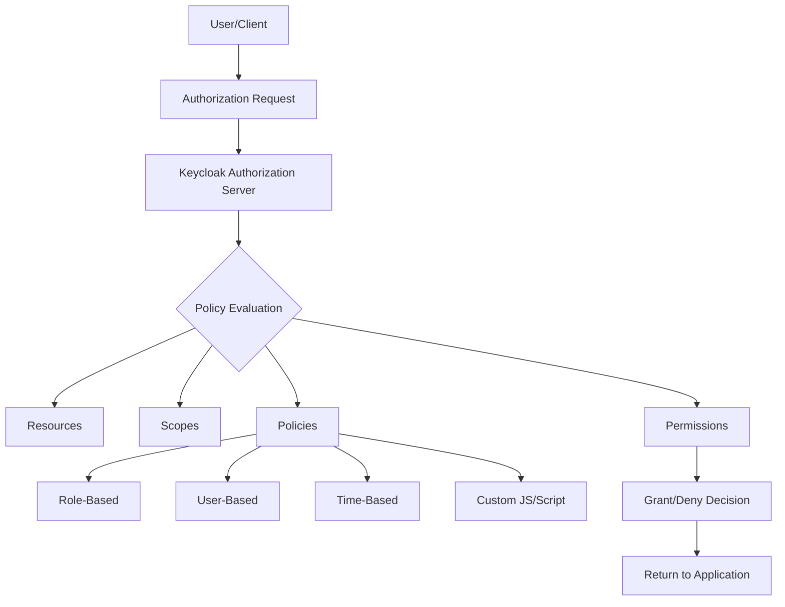
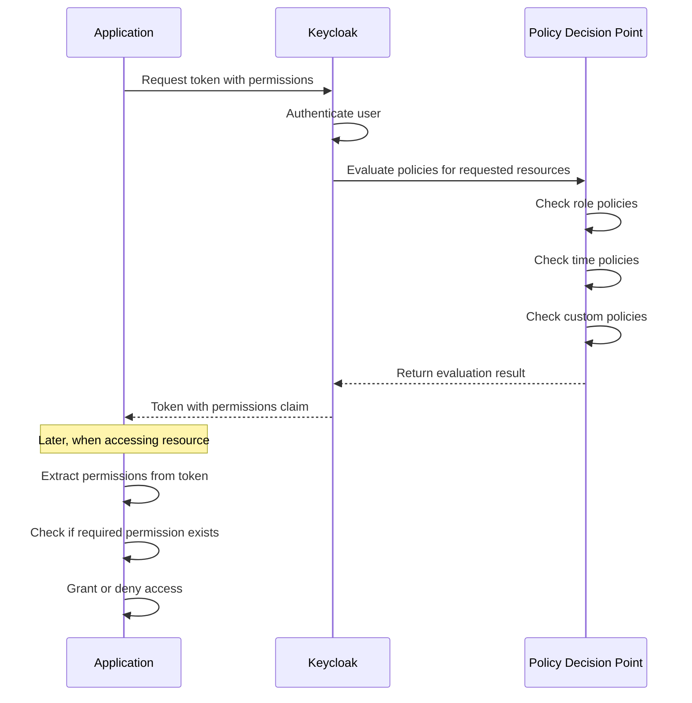

# How to Use Keycloak Authorization Services

Author: [nawazdhandala](https://www.github.com/nawazdhandala)

Tags: Keycloak, Authorization, Security, Identity Management

Description: A practical guide to implementing fine-grained authorization in your applications using Keycloak's built-in authorization services, policies, and permissions.

---

Keycloak is well known for handling authentication, but its authorization services are equally powerful and often underutilized. Instead of scattering access control logic throughout your codebase, you can centralize it in Keycloak and let your applications query a single source of truth for permissions.

This guide walks through configuring Keycloak's authorization services from scratch, covering resources, scopes, policies, and permissions with practical examples you can adapt to your own projects.

---

## Why centralize authorization in Keycloak

Embedding authorization logic in application code leads to several problems:

- **Scattered rules** across services that drift out of sync over time
- **Difficult auditing** when compliance asks who can access what
- **Slow iteration** because changing a permission requires redeployment
- **Duplication** when multiple services need the same access checks

Keycloak's authorization services solve these by providing a policy decision point (PDP) that applications query at runtime. You define resources, scopes, and policies in Keycloak, and your code simply asks: "Can user X perform action Y on resource Z?"

---

## Core concepts

Before configuring anything, understand these building blocks:



- **Resource**: Something you want to protect (an API endpoint, a document, a feature)
- **Scope**: An action on a resource (read, write, delete, approve)
- **Policy**: A rule that evaluates to permit or deny (role-based, user-based, time-based, custom scripts)
- **Permission**: Connects resources and scopes to policies

---

## Step 1: Enable authorization services on a client

First, create or configure a client in Keycloak that will use authorization:

1. Open the Keycloak admin console and navigate to your realm
2. Go to **Clients** and select (or create) your application client
3. In the client settings, enable **Authorization Enabled**
4. Save the client

Once enabled, you will see an **Authorization** tab appear on the client configuration page.

---

## Step 2: Define resources

Resources represent what you are protecting. For a document management system, you might have:

```json
{
  "name": "document",
  "displayName": "Document Resource",
  "type": "urn:app:resources:document",
  "uris": [
    "/api/documents/*"
  ],
  "scopes": [
    { "name": "read" },
    { "name": "write" },
    { "name": "delete" },
    { "name": "share" }
  ]
}
```

To create this in Keycloak:

1. Go to **Authorization** > **Resources**
2. Click **Create**
3. Enter the resource name, type, and URI patterns
4. Add the scopes this resource supports

---

## Step 3: Create policies

Policies define the conditions under which access is granted. Keycloak supports several policy types out of the box.

### Role-based policy

The most common policy type. Grant access based on realm or client roles:

```json
{
  "name": "manager-policy",
  "description": "Grants access to users with the manager role",
  "type": "role",
  "logic": "POSITIVE",
  "roles": [
    {
      "id": "manager",
      "required": true
    }
  ]
}
```

Navigate to **Authorization** > **Policies** > **Create** > **Role** to configure this in the UI.

### Time-based policy

Restrict access to specific hours or date ranges:

```json
{
  "name": "business-hours-policy",
  "description": "Only allow access during business hours",
  "type": "time",
  "logic": "POSITIVE",
  "notBefore": "2026-01-01 00:00:00",
  "notOnOrAfter": "2030-12-31 23:59:59",
  "hour": 9,
  "hourEnd": 17,
  "dayMonth": 1,
  "dayMonthEnd": 31
}
```

### JavaScript policy (custom logic)

For complex rules that cannot be expressed with built-in policy types:

```javascript
// Custom policy: user can only access their own documents
var context = $evaluation.getContext();
var identity = context.getIdentity();
var attributes = identity.getAttributes();
var userId = attributes.getValue('sub').asString(0);

// Get resource owner from the resource attributes
var resource = $evaluation.getPermission().getResource();
var ownerId = resource.getAttribute('owner')[0];

if (userId === ownerId) {
    $evaluation.grant();
}
```

---

## Step 4: Create permissions

Permissions tie everything together by connecting resources and scopes to policies:

```json
{
  "name": "document-read-permission",
  "description": "Permission to read documents",
  "type": "resource",
  "resources": ["document"],
  "scopes": ["read"],
  "policies": ["manager-policy", "business-hours-policy"],
  "decisionStrategy": "AFFIRMATIVE"
}
```

The **decisionStrategy** determines how multiple policies are evaluated:

- **UNANIMOUS**: All policies must grant access
- **AFFIRMATIVE**: At least one policy must grant access
- **CONSENSUS**: Majority of policies must grant access

---

## Step 5: Enforce authorization in your application

Once configured, your application needs to check permissions at runtime. There are two main approaches.

### Option A: Token introspection with permissions

Request a token with permissions included:

```bash
# Request token with authorization
curl -X POST \
  "https://keycloak.example.com/realms/myrealm/protocol/openid-connect/token" \
  -H "Content-Type: application/x-www-form-urlencoded" \
  -d "grant_type=urn:ietf:params:oauth:grant-type:uma-ticket" \
  -d "client_id=my-app" \
  -d "client_secret=my-secret" \
  -d "audience=my-app" \
  -d "permission=document#read"
```

The response includes whether access is granted and which permissions apply.

### Option B: Policy enforcement in application code

Use the Keycloak adapter to check permissions programmatically. Here is a Node.js example:

```javascript
// keycloak-authorization.js
const Keycloak = require('keycloak-connect');
const session = require('express-session');

const memoryStore = new session.MemoryStore();

// Initialize Keycloak with authorization configuration
const keycloak = new Keycloak({
  store: memoryStore
}, {
  realm: 'myrealm',
  'auth-server-url': 'https://keycloak.example.com',
  'ssl-required': 'external',
  resource: 'my-app',
  credentials: {
    secret: 'my-secret'
  },
  'policy-enforcer': {
    'enforcement-mode': 'ENFORCING'
  }
});

// Middleware to protect routes
app.get('/api/documents/:id',
  keycloak.protect('document:read'),
  async (req, res) => {
    // User has permission - fetch and return document
    const doc = await fetchDocument(req.params.id);
    res.json(doc);
  }
);
```

For Java applications with Spring Security:

```java
// SecurityConfig.java
@Configuration
@EnableWebSecurity
public class SecurityConfig {

    @Bean
    public SecurityFilterChain filterChain(HttpSecurity http) throws Exception {
        http
            .authorizeHttpRequests(auth -> auth
                .requestMatchers("/api/documents/**").hasAuthority("SCOPE_document:read")
                .anyRequest().authenticated()
            )
            .oauth2ResourceServer(oauth2 -> oauth2
                .jwt(jwt -> jwt
                    .jwtAuthenticationConverter(jwtAuthenticationConverter())
                )
            );
        return http.build();
    }

    // Convert Keycloak permissions to Spring Security authorities
    private JwtAuthenticationConverter jwtAuthenticationConverter() {
        JwtAuthenticationConverter converter = new JwtAuthenticationConverter();
        converter.setJwtGrantedAuthoritiesConverter(jwt -> {
            Map<String, Object> authorization = jwt.getClaimAsMap("authorization");
            List<Map<String, Object>> permissions =
                (List<Map<String, Object>>) authorization.get("permissions");

            return permissions.stream()
                .flatMap(p -> ((List<String>) p.get("scopes")).stream()
                    .map(scope -> new SimpleGrantedAuthority(
                        "SCOPE_" + p.get("rsname") + ":" + scope
                    ))
                )
                .collect(Collectors.toList());
        });
        return converter;
    }
}
```

---

## Authorization flow diagram

Here is how a complete authorization request flows through the system:



---

## Testing your authorization setup

Keycloak provides a built-in evaluation tool to test policies without writing code:

1. Go to **Authorization** > **Evaluate**
2. Select a user to impersonate
3. Add the resources and scopes to check
4. Click **Evaluate** to see the decision and which policies contributed

This is invaluable for debugging complex policy interactions before deploying to production.

You can also test via the API:

```bash
# Evaluate permissions for a specific user
curl -X POST \
  "https://keycloak.example.com/realms/myrealm/protocol/openid-connect/token" \
  -H "Content-Type: application/x-www-form-urlencoded" \
  -d "grant_type=urn:ietf:params:oauth:grant-type:uma-ticket" \
  -d "client_id=my-app" \
  -d "client_secret=my-secret" \
  -d "audience=my-app" \
  -d "response_mode=decision" \
  -d "permission=document#read"
```

The response tells you whether access is granted:

```json
{
  "result": true
}
```

---

## Best practices

**Start simple.** Begin with role-based policies and add complexity only when needed. JavaScript policies are powerful but harder to audit.

**Use meaningful resource types.** Instead of generic names like "api", use types like "urn:app:resources:document" that clearly identify what you are protecting.

**Test policy combinations.** When using multiple policies with different decision strategies, verify the interactions with the Evaluate tool.

**Version your policies.** Export your authorization configuration regularly and store it in version control alongside your application code.

**Monitor authorization decisions.** Enable Keycloak events to track permission evaluations and identify patterns in access denials.

---

Keycloak's authorization services provide a powerful, centralized way to manage fine-grained access control across your applications. By defining resources, scopes, policies, and permissions in one place, you gain consistency, auditability, and the flexibility to change access rules without redeploying code. Start with simple role-based policies, test thoroughly using the built-in evaluation tools, and gradually introduce more sophisticated rules as your requirements evolve.
