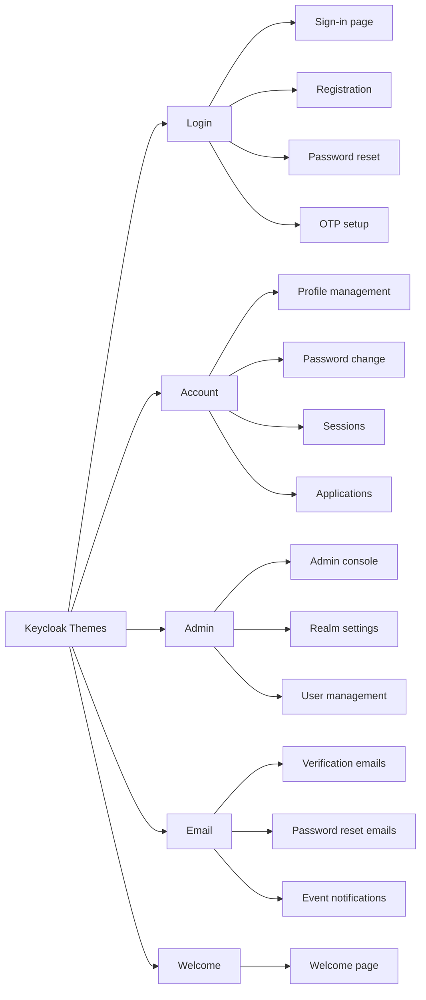
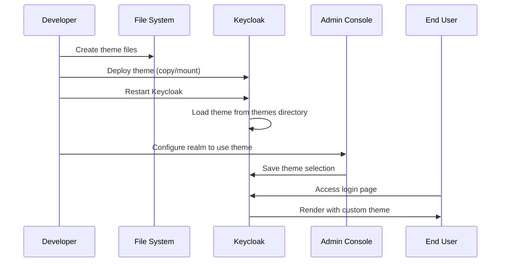

# How to Implement Keycloak Custom Themes

Author: [nawazdhandala](https://www.github.com/nawazdhandala)

Tags: Keycloak, Themes, Customization, Branding, Identity Management

Description: Learn how to create and deploy custom themes in Keycloak to match your brand identity across login pages, account management, and admin console interfaces.

---

Out of the box, Keycloak provides a functional but generic user interface. For production deployments, you almost certainly want login pages, registration forms, and account management screens that match your brand. Keycloak's theme system makes this possible without forking the codebase or maintaining complex patches.

This guide covers creating custom themes from scratch, understanding the theme structure, and deploying themes across different Keycloak setups.

---

## Theme types in Keycloak

Keycloak supports five distinct theme types, each controlling different parts of the user interface:



- **Login**: Authentication screens (sign-in, registration, forgot password, OTP)
- **Account**: User self-service portal for managing profile and sessions
- **Admin**: The administration console (use carefully - overriding can break functionality)
- **Email**: Email templates for verification, password reset, and notifications
- **Welcome**: The initial landing page when accessing Keycloak root URL

For most deployments, you will focus on Login, Account, and Email themes.

---

## Theme directory structure

Each theme lives in a directory under Keycloak's `themes` folder. Here is the structure for a complete custom theme:

```
themes/
  my-company-theme/
    login/
      theme.properties
      resources/
        css/
          login.css
        img/
          logo.png
          favicon.ico
        js/
          custom.js
      messages/
        messages_en.properties
        messages_es.properties
      template.ftl
      login.ftl
      register.ftl
      login-reset-password.ftl
    account/
      theme.properties
      resources/
        css/
          account.css
      messages/
        messages_en.properties
    email/
      theme.properties
      html/
        email-verification.ftl
        password-reset.ftl
      text/
        email-verification.ftl
        password-reset.ftl
      messages/
        messages_en.properties
```

---

## Step 1: Create a basic login theme

Start by creating a theme that extends the default Keycloak base theme. This approach lets you override only what you need while inheriting everything else.

### Create the directory structure

```bash
# Navigate to Keycloak themes directory
cd /opt/keycloak/themes

# Create your theme directory
mkdir -p my-company-theme/login/resources/css
mkdir -p my-company-theme/login/resources/img
mkdir -p my-company-theme/login/messages
```

### Configure theme.properties

Create `my-company-theme/login/theme.properties`:

```properties
# Inherit from the keycloak base theme
parent=keycloak

# Import styles from parent theme
styles=css/login.css css/tile.css

# Import custom styles after parent styles
styles=css/login.css css/tile.css css/custom.css

# Optionally import scripts
scripts=js/custom.js
```

### Add custom CSS

Create `my-company-theme/login/resources/css/custom.css`:

```css
/* custom.css - Brand customizations for login pages */

/* Override primary brand color */
:root {
    --pf-global--primary-color--100: #0066cc;
    --pf-global--primary-color--200: #004c99;
    --pf-global--link--Color: #0066cc;
    --pf-global--link--Color--hover: #004c99;
}

/* Custom login card styling */
#kc-login {
    background-color: #ffffff;
    border-radius: 8px;
    box-shadow: 0 4px 12px rgba(0, 0, 0, 0.15);
}

/* Logo container */
#kc-header-wrapper {
    padding: 40px 0;
}

/* Replace or style the logo */
.kc-logo-text {
    background-image: url('../img/logo.png');
    background-size: contain;
    background-repeat: no-repeat;
    background-position: center;
    height: 60px;
    width: 200px;
}

/* Style form inputs */
.pf-c-form-control {
    border-radius: 4px;
    border: 1px solid #ccc;
    padding: 12px;
}

.pf-c-form-control:focus {
    border-color: #0066cc;
    box-shadow: 0 0 0 2px rgba(0, 102, 204, 0.2);
}

/* Primary button styling */
.pf-c-button.pf-m-primary {
    background-color: #0066cc;
    border-radius: 4px;
    font-weight: 600;
    padding: 12px 24px;
}

.pf-c-button.pf-m-primary:hover {
    background-color: #004c99;
}

/* Footer links */
#kc-registration, #kc-info {
    text-align: center;
    margin-top: 20px;
}

/* Background customization */
.login-pf body {
    background: linear-gradient(135deg, #667eea 0%, #764ba2 100%);
}
```

---

## Step 2: Override FreeMarker templates

For deeper customizations, override the FreeMarker templates that generate the HTML. Templates use the `.ftl` extension.

### Customize the login page

Create `my-company-theme/login/login.ftl`:

```html
<#import "template.ftl" as layout>
<@layout.registrationLayout displayMessage=!messagesPerField.existsError('username','password') displayInfo=realm.password && realm.registrationAllowed && !registrationDisabled??; section>
    <#if section = "header">
        <div class="custom-header">
            
            <h1>${msg("loginTitle",(realm.displayName!''))}</h1>
        </div>
    <#elseif section = "form">
        <div id="kc-form">
            <div id="kc-form-wrapper">
                <#if realm.password>
                    <form id="kc-form-login" onsubmit="login.disabled = true; return true;" action="${url.loginAction}" method="post">

                        <div class="${properties.kcFormGroupClass!}">
                            <label for="username" class="${properties.kcLabelClass!}">
                                <#if !realm.loginWithEmailAllowed>
                                    ${msg("username")}
                                <#elseif !realm.registrationEmailAsUsername>
                                    ${msg("usernameOrEmail")}
                                <#else>
                                    ${msg("email")}
                                </#if>
                            </label>
                            <input tabindex="1"
                                   id="username"
                                   class="${properties.kcInputClass!}"
                                   name="username"
                                   value="${(login.username!'')}"
                                   type="text"
                                   autofocus
                                   autocomplete="username"
                                   aria-invalid="<#if messagesPerField.existsError('username','password')>true</#if>" />

                            <#if messagesPerField.existsError('username','password')>
                                <span id="input-error" class="${properties.kcInputErrorMessageClass!}" aria-live="polite">
                                    ${kcSanitize(messagesPerField.getFirstError('username','password'))?no_esc}
                                </span>
                            </#if>
                        </div>

                        <div class="${properties.kcFormGroupClass!}">
                            <label for="password" class="${properties.kcLabelClass!}">${msg("password")}</label>
                            <input tabindex="2"
                                   id="password"
                                   class="${properties.kcInputClass!}"
                                   name="password"
                                   type="password"
                                   autocomplete="current-password"
                                   aria-invalid="<#if messagesPerField.existsError('username','password')>true</#if>" />
                        </div>

                        <div class="${properties.kcFormGroupClass!} ${properties.kcFormSettingClass!}">
                            <div id="kc-form-options">
                                <#if realm.rememberMe && !usernameEditDisabled??>
                                    <div class="checkbox">
                                        <label>
                                            <#if login.rememberMe??>
                                                <input tabindex="3" id="rememberMe" name="rememberMe" type="checkbox" checked>
                                            <#else>
                                                <input tabindex="3" id="rememberMe" name="rememberMe" type="checkbox">
                                            </#if>
                                            ${msg("rememberMe")}
                                        </label>
                                    </div>
                                </#if>
                            </div>
                            <div class="${properties.kcFormOptionsWrapperClass!}">
                                <#if realm.resetPasswordAllowed>
                                    <span><a tabindex="5" href="${url.loginResetCredentialsUrl}">${msg("doForgotPassword")}</a></span>
                                </#if>
                            </div>
                        </div>

                        <div id="kc-form-buttons" class="${properties.kcFormGroupClass!}">
                            <input type="hidden" id="id-hidden-input" name="credentialId" <#if auth.selectedCredential?has_content>value="${auth.selectedCredential}"</#if>/>
                            <input tabindex="4" class="${properties.kcButtonClass!} ${properties.kcButtonPrimaryClass!} ${properties.kcButtonBlockClass!} ${properties.kcButtonLargeClass!}" name="login" id="kc-login" type="submit" value="${msg("doLogIn")}"/>
                        </div>
                    </form>
                </#if>
            </div>
        </div>
    <#elseif section = "info">
        <#if realm.password && realm.registrationAllowed && !registrationDisabled??>
            <div id="kc-registration-container">
                <div id="kc-registration">
                    <span>${msg("noAccount")} <a tabindex="6" href="${url.registrationUrl}">${msg("doRegister")}</a></span>
                </div>
            </div>
        </#if>
    <#elseif section = "socialProviders">
        <#if realm.password && social.providers??>
            <div id="kc-social-providers" class="${properties.kcFormSocialAccountSectionClass!}">
                <hr/>
                <h4>${msg("identity-provider-login-label")}</h4>
                <ul class="${properties.kcFormSocialAccountListClass!} <#if social.providers?size gt 3>${properties.kcFormSocialAccountListGridClass!}</#if>">
                    <#list social.providers as p>
                        <a id="social-${p.alias}" class="${properties.kcFormSocialAccountListButtonClass!} <#if social.providers?size gt 3>${properties.kcFormSocialAccountGridItem!}</#if>"
                                type="button" href="${p.loginUrl}">
                            <#if p.iconClasses?has_content>
                                <i class="${properties.kcCommonLogoIdP!} ${p.iconClasses!}" aria-hidden="true"></i>
                                <span class="${properties.kcFormSocialAccountNameClass!} kc-social-icon-text">${p.displayName!}</span>
                            <#else>
                                <span class="${properties.kcFormSocialAccountNameClass!}">${p.displayName!}</span>
                            </#if>
                        </a>
                    </#list>
                </ul>
            </div>
        </#if>
    </#if>
</@layout.registrationLayout>
```

---

## Step 3: Customize messages and translations

Override text strings by creating message properties files.

Create `my-company-theme/login/messages/messages_en.properties`:

```properties
# Override default messages with your brand voice
loginTitle=Sign in to {0}
loginTitleHtml=Welcome back!
doLogIn=Sign In
doRegister=Create Account
noAccount=New to our platform?
doForgotPassword=Forgot your password?
usernameOrEmail=Email address
password=Password
rememberMe=Keep me signed in

# Custom error messages
invalidUserMessage=We couldn''t find an account with that email address.
invalidPasswordMessage=The password you entered is incorrect. Please try again.
accountDisabledMessage=Your account has been suspended. Please contact support.

# Registration messages
registerTitle=Create your account
doSubmit=Continue
backToLogin=Already have an account? Sign in

# Email verification
emailVerifyTitle=Verify your email
emailVerifyInstruction=We''ve sent a verification link to {0}. Please check your inbox and click the link to continue.
```

For additional languages, create files like `messages_es.properties`, `messages_fr.properties`, etc.

---

## Step 4: Create email templates

Customize transactional emails to match your brand.

Create `my-company-theme/email/html/email-verification.ftl`:

```html
<#import "template.ftl" as layout>
<@layout.emailLayout>
<table width="100%" border="0" cellspacing="0" cellpadding="0">
    <tr>
        <td align="center" style="padding: 40px 0;">
            
        </td>
    </tr>
    <tr>
        <td style="padding: 20px 40px;">
            <h1 style="color: #333; font-size: 24px; margin-bottom: 20px;">Verify your email address</h1>
            <p style="color: #666; font-size: 16px; line-height: 1.6;">
                Hi ${user.firstName!'there'},
            </p>
            <p style="color: #666; font-size: 16px; line-height: 1.6;">
                Thanks for signing up! Please click the button below to verify your email address and complete your registration.
            </p>
            <table border="0" cellspacing="0" cellpadding="0" style="margin: 30px 0;">
                <tr>
                    <td align="center" bgcolor="#0066cc" style="border-radius: 4px;">
                        <a href="${link}" target="_blank" style="display: inline-block; padding: 14px 32px; font-size: 16px; color: #ffffff; text-decoration: none; font-weight: 600;">
                            Verify Email Address
                        </a>
                    </td>
                </tr>
            </table>
            <p style="color: #999; font-size: 14px;">
                This link will expire in ${linkExpirationFormatter(linkExpiration)}.
            </p>
            <p style="color: #999; font-size: 14px;">
                If you did not create an account, you can safely ignore this email.
            </p>
        </td>
    </tr>
</table>
</@layout.emailLayout>
```

Create the corresponding plain text version at `my-company-theme/email/text/email-verification.ftl`:

```text
Verify your email address

Hi ${user.firstName!'there'},

Thanks for signing up! Please click the link below to verify your email address:

${link}

This link will expire in ${linkExpirationFormatter(linkExpiration)}.

If you did not create an account, you can safely ignore this email.
```

---

## Step 5: Deploy your theme

### Option A: Direct deployment

Copy your theme to the Keycloak themes directory:

```bash
# Copy theme to Keycloak installation
cp -r my-company-theme /opt/keycloak/themes/

# Restart Keycloak to pick up the new theme
systemctl restart keycloak
```

### Option B: Docker deployment

Mount your theme as a volume in Docker:

```yaml
# docker-compose.yml
version: '3.8'
services:
  keycloak:
    image: quay.io/keycloak/keycloak:latest
    command: start-dev
    environment:
      - KEYCLOAK_ADMIN=admin
      - KEYCLOAK_ADMIN_PASSWORD=admin
    ports:
      - "8080:8080"
    volumes:
      - ./themes/my-company-theme:/opt/keycloak/themes/my-company-theme:ro
```

### Option C: Build into a custom image

Create a Dockerfile that includes your theme:

```dockerfile
FROM quay.io/keycloak/keycloak:latest

# Copy custom theme
COPY themes/my-company-theme /opt/keycloak/themes/my-company-theme

# Build optimized Keycloak
RUN /opt/keycloak/bin/kc.sh build
```

---

## Step 6: Activate the theme

After deploying, enable your theme in the Keycloak admin console:

1. Log into the admin console
2. Select your realm
3. Go to **Realm Settings** > **Themes**
4. Select your theme from the dropdown for each theme type (Login, Account, Email)
5. Save changes



---

## Development tips

**Enable theme caching in development.** Disable caching while developing to see changes immediately:

```bash
# Start Keycloak with theme caching disabled
./kc.sh start-dev --spi-theme-static-max-age=-1 --spi-theme-cache-themes=false --spi-theme-cache-templates=false
```

**Use browser developer tools.** Inspect elements to find the correct CSS selectors and understand the existing structure before overriding.

**Keep a reference copy.** Extract the default theme to reference the original templates:

```bash
# Extract base themes for reference
jar -xvf /opt/keycloak/lib/lib/main/org.keycloak.keycloak-themes-*.jar theme/
```

**Test across browsers.** Login pages are accessed by everyone, so verify your theme works on Chrome, Firefox, Safari, and Edge.

**Validate email templates.** Send test emails and check rendering in Gmail, Outlook, and Apple Mail. Email HTML is notoriously inconsistent across clients.

---

Custom themes transform Keycloak from a generic identity provider into a seamless extension of your brand. By extending the base theme and overriding only what you need, you maintain compatibility with Keycloak updates while achieving the look and feel your users expect. Start with CSS customizations, graduate to template overrides for structural changes, and always test thoroughly across browsers and email clients before going to production.
